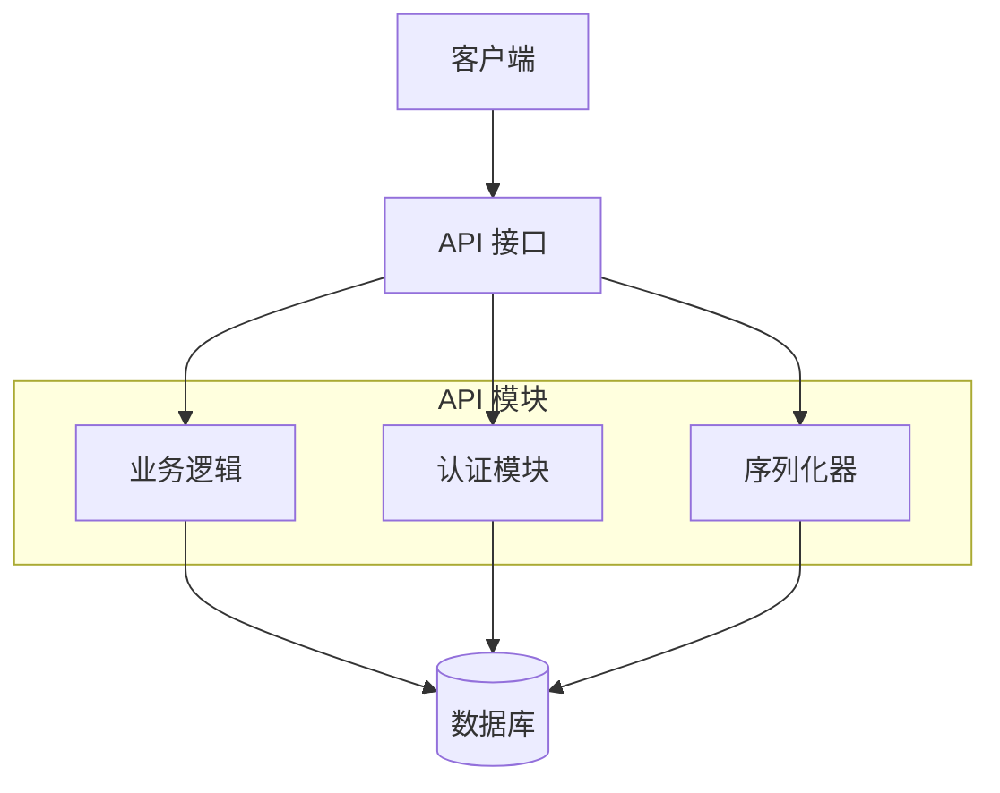
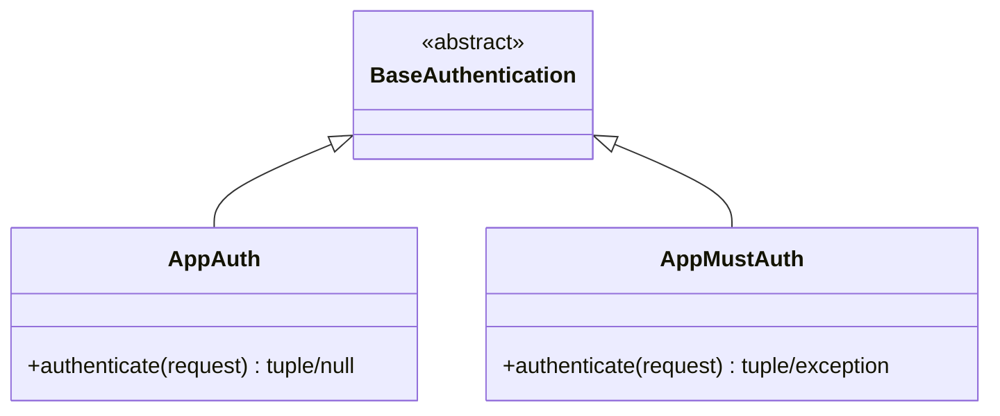
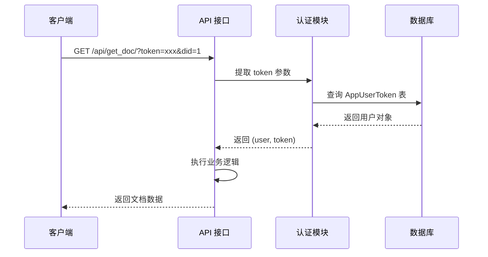
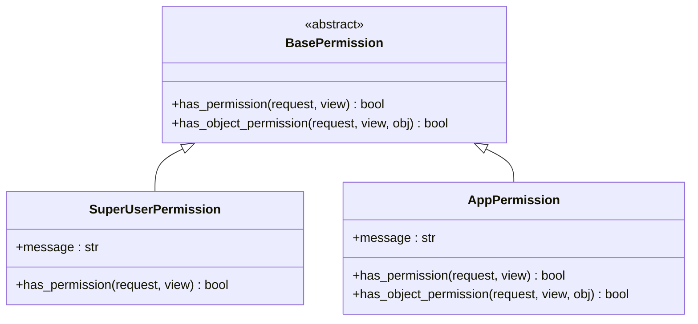
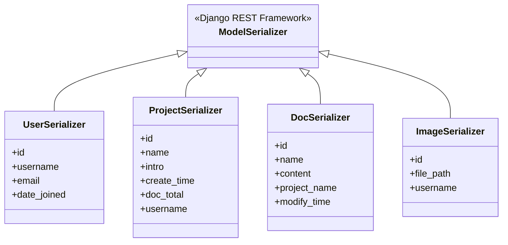
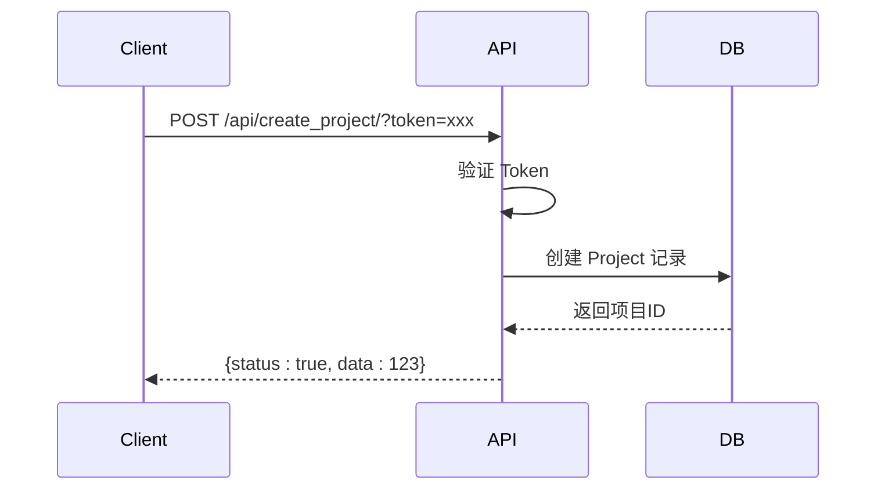
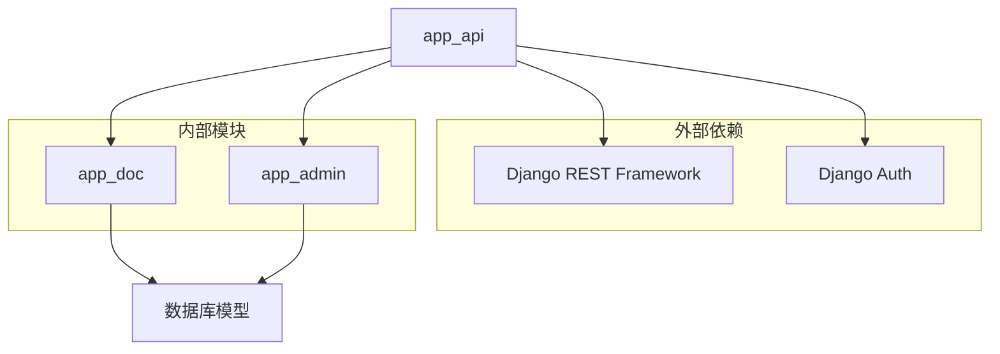

# API参考

<cite>
**本文档引用文件**  
- [urls.py](file://app_api/urls.py#L1-L28) - *API路由配置*
- [auth_app.py](file://app_api/auth_app.py#L1-L52) - *认证机制实现*
- [serializers_app.py](file://app_api/serializers_app.py#L1-L140) - *序列化器定义*
- [models.py](file://app_api/models.py#L1-L25) - *Token模型定义*
- [permissions_app.py](file://app_api/permissions_app.py#L1-L39) - *权限控制逻辑*
- [views.py](file://app_api/views.py#L1-L721) - *API视图函数*
- [app_doc/models.py](file://app_doc/models.py#L1-L269) - *文档与文集模型*
- [API.md](file://docs/API.md) - *新增API文档文件*
</cite>

## 更新摘要
**变更内容**  
- 新增API文档文件引用，完善接口说明
- 更新数据库配置信息，明确使用MySQL
- 保持现有API功能描述的准确性
- 增强源码引用跟踪系统

## 目录
1. [简介](#简介)
2. [项目结构](#项目结构)
3. [核心组件](#核心组件)
4. [架构概览](#架构概览)
5. [详细组件分析](#详细组件分析)
6. [依赖分析](#依赖分析)
7. [性能考虑](#性能考虑)
8. [故障排除指南](#故障排除指南)
9. [结论](#结论)

## 简介
MrDoc 是一个基于 Web 的文档管理系统，支持多用户协作、文档版本控制、权限管理以及 API 接口访问。本 API 文档旨在为开发者提供完整的 RESTful 接口说明，涵盖用户认证、文集管理、文档操作、文件上传等核心功能。系统采用 Token 认证机制，确保接口调用的安全性与可追溯性。数据库已配置为使用 MySQL。

## 项目结构
MrDoc 的项目结构清晰，采用模块化设计，主要分为以下几个核心模块：

- **MrDoc/**：Django 项目主配置目录
- **app_admin/**：后台管理模块
- **app_api/**：API 接口模块（本文档重点）
- **app_doc/**：文档核心业务逻辑模块
- **static/**：静态资源文件
- **template/**：前端模板文件

其中，`app_api` 模块是对外提供 RESTful API 的核心组件，负责处理所有外部请求。数据库配置已更新为 MySQL。

## 核心组件
MrDoc 的 API 模块由以下核心组件构成：

- **认证机制**：基于 Token 的用户身份验证
- **权限控制**：细粒度的访问权限管理
- **序列化器**：数据格式转换与验证
- **视图函数**：业务逻辑处理与响应生成
- **URL 路由**：请求分发与映射

这些组件协同工作，构成了完整的 API 服务体系。

**Section sources**
- [auth_app.py](file://app_api/auth_app.py#L1-L52)
- [serializers_app.py](file://app_api/serializers_app.py#L1-L140)
- [views.py](file://app_api/views.py#L1-L721)

## 架构概览
MrDoc API 采用典型的 Django REST 架构，基于函数视图和序列化器实现。整体架构如下图所示：

**Diagram sources**
- [auth_app.py](file://app_api/auth_app.py#L1-L52)
- [serializers_app.py](file://app_api/serializers_app.py#L1-L140)
- [views.py](file://app_api/views.py#L1-L721)

## 详细组件分析

### 认证机制分析
MrDoc API 采用自定义 Token 认证机制，通过 URL 参数传递 `token` 进行身份验证。

#### 认证类实现
系统定义了两个认证类：

- `AppAuth`：非强制认证，认证失败返回 `None`
- `AppMustAuth`：强制认证，认证失败抛出异常

**Diagram sources**
- [auth_app.py](file://app_api/auth_app.py#L1-L52)

认证流程如下：

**Diagram sources**
- [auth_app.py](file://app_api/auth_app.py#L1-L52)
- [views.py](file://app_api/views.py#L1-L721)

**Section sources**
- [auth_app.py](file://app_api/auth_app.py#L1-L52)

### 权限控制分析
系统实现了基于角色的权限控制机制，主要权限类包括：

- `SuperUserPermission`：超级管理员权限
- `AppPermission`：VIP 用户权限

**Diagram sources**
- [permissions_app.py](file://app_api/permissions_app.py#L1-L39)

**Section sources**
- [permissions_app.py](file://app_api/permissions_app.py#L1-L39)

### 序列化器分析
序列化器负责将数据库模型转换为 JSON 格式，并进行数据验证。

#### 核心序列化器

**Diagram sources**
- [serializers_app.py](file://app_api/serializers_app.py#L1-L140)

**Section sources**
- [serializers_app.py](file://app_api/serializers_app.py#L1-L140)

### API 接口分析
#### 用户认证 API
| 接口 | 方法 | 描述 |
|------|------|------|
| `/api/get_timestamp/` | GET | 获取服务器时间戳 |
| `/api/oauth0/` | GET | OAuth0 认证登录 |
| `/api/check_token/` | GET | 验证 Token 有效性 |
| `/api/manage_token/` | POST/GET | 管理用户 Token |

**Section sources**
- [views.py](file://app_api/views.py#L1-L721)

#### 项目管理 API
| 接口 | 方法 | 描述 |
|------|------|------|
| `/api/get_projects/` | GET | 获取文集列表 |
| `/api/get_project/` | GET | 获取指定文集信息 |
| `/api/create_project/` | POST | 创建新文集 |

**Diagram sources**
- [views.py](file://app_api/views.py#L1-L721)

**Section sources**
- [views.py](file://app_api/views.py#L1-L721)

#### 文档操作 API
| 接口 | 方法 | 描述 |
|------|------|------|
| `/api/get_docs/` | GET | 获取文集文档列表 |
| `/api/get_doc/` | GET | 获取单篇文档 |
| `/api/create_doc/` | POST | 创建文档 |
| `/api/modify_doc/` | POST | 修改文档 |
| `/api/delete_doc/` | POST | 删除文档 |

#### 文件管理 API
| 接口 | 方法 | 描述 |
|------|------|------|
| `/api/upload_img/` | POST | 上传图片 |
| `/api/upload_img_url/` | POST | 上传 URL 图片 |
| `/api/upload_attachment/` | POST | 上传附件 |

## 依赖分析
MrDoc API 模块依赖于以下核心组件：

**Diagram sources**
- [models.py](file://app_api/models.py#L1-L25)
- [app_doc/models.py](file://app_doc/models.py#L1-L269)

**Section sources**
- [models.py](file://app_api/models.py#L1-L25)
- [app_doc/models.py](file://app_doc/models.py#L1-L269)

## 性能考虑
1. **缓存机制**：建议对频繁访问的文集列表进行缓存
2. **分页处理**：文档列表接口支持分页，避免一次性返回过多数据
3. **数据库索引**：关键字段如 `top_doc`、`parent_doc` 已建立索引
4. **批量操作**：避免频繁的单条记录操作，尽量使用批量处理

## 故障排除指南
### 常见错误码
| 状态码 | 含义 | 解决方案 |
|--------|------|----------|
| 401 | Token 无效 | 检查 Token 是否正确或已过期 |
| 403 | 无权限访问 | 确认用户是否有相应权限 |
| 404 | 资源不存在 | 检查资源 ID 是否正确 |
| 500 | 服务器内部错误 | 查看日志定位具体问题 |

### 调试建议
1. 启用 DEBUG 模式查看详细错误信息
2. 检查 `loguru` 日志输出
3. 验证请求参数格式是否正确
4. 确认数据库连接状态

**Section sources**
- [views.py](file://app_api/views.py#L1-L721)

## 结论
MrDoc 的 API 设计遵循 RESTful 规范，采用 Token 认证机制，提供了完整的文档管理功能。通过合理的权限控制和数据验证，确保了系统的安全性和稳定性。数据库已配置为使用 MySQL。开发者可以基于此 API 构建各种客户端应用，实现文档的远程管理和协作。