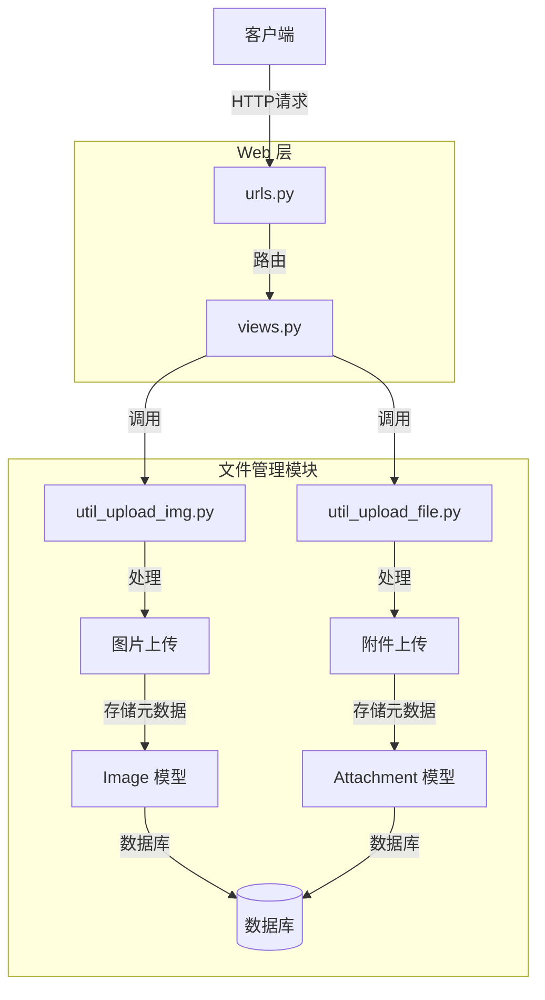
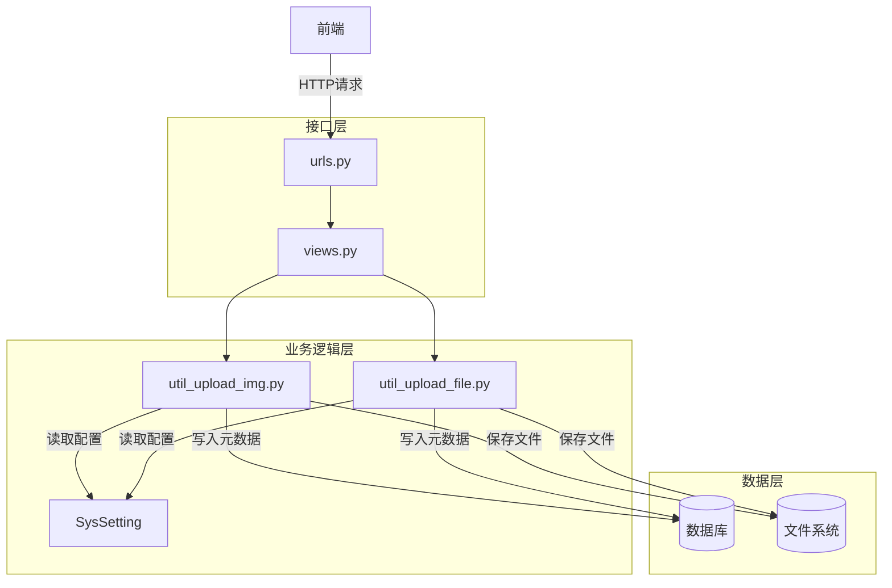
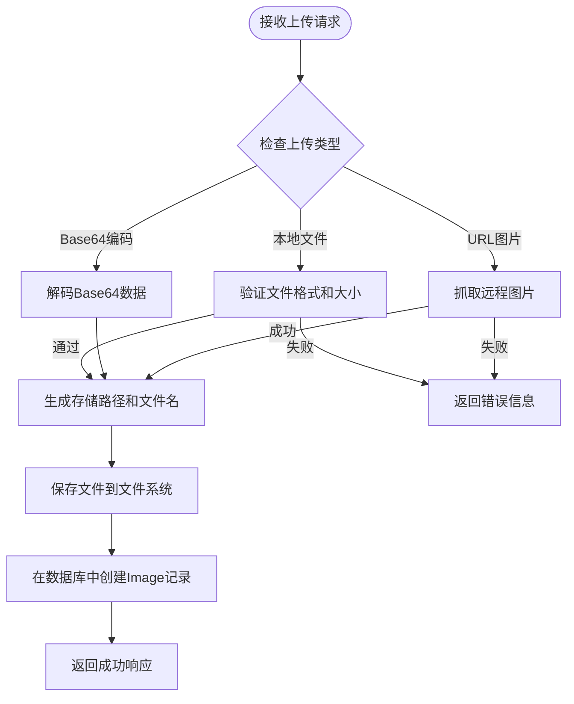
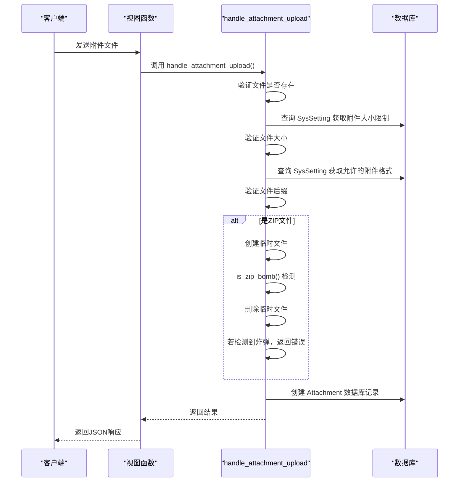
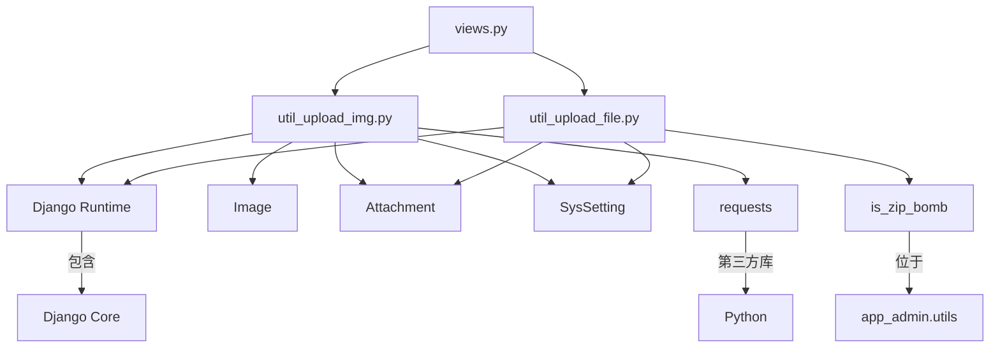

# 文件API

<cite>
**本文档中引用的文件**   
- [util_upload_img.py](file://app_doc/util_upload_img.py)
- [util_upload_file.py](file://app_doc/util_upload_file.py)
- [views.py](file://app_doc/views.py)
- [urls.py](file://app_doc/urls.py)
- [models.py](file://app_doc/models.py)
</cite>

## 目录
1. [简介](#简介)
2. [项目结构](#项目结构)
3. [核心组件](#核心组件)
4. [架构概览](#架构概览)
5. [详细组件分析](#详细组件分析)
6. [依赖分析](#依赖分析)
7. [性能考虑](#性能考虑)
8. [故障排除指南](#故障排除指南)
9. [结论](#结论)

## 简介
本文档详细介绍了MrDoc系统中文件管理API的设计与实现，重点涵盖图片和附件的上传、下载、删除及管理功能。文档深入解析了`util_upload_img.py`和`util_upload_file.py`两个核心模块的文件处理逻辑，包括文件类型验证、大小限制、存储路径处理等关键机制。同时，文档还说明了文件URL的生成规则、访问权限控制策略以及文件元数据的获取方法。对于大文件处理，系统支持分块上传和断点续传功能。此外，文档提供了多部分表单数据上传的示例代码，以及文件预览、缩略图生成和安全下载的API使用指南，旨在为开发者和用户提供全面的技术参考。

## 项目结构
MrDoc的文件管理功能主要集中在`app_doc`应用中，其核心文件处理逻辑由`util_upload_img.py`和`util_upload_file.py`两个工具模块实现。`util_upload_img.py`专门处理图片上传，支持多种上传方式，包括本地文件上传、URL远程图片抓取、Base64编码图片解析和粘贴上传。`util_upload_file.py`则负责处理通用附件的上传，包含文件大小格式化和ZIP炸弹检测等安全功能。文件的元数据（如路径、名称、大小）被持久化存储在`Image`和`Attachment`两个Django模型中，这些模型定义于`models.py`文件。文件上传的HTTP端点通过`urls.py`中的URL路由进行注册，并由`views.py`中的视图函数处理。

**图示来源**
- [util_upload_img.py](file://app_doc/util_upload_img.py)
- [util_upload_file.py](file://app_doc/util_upload_file.py)
- [urls.py](file://app_doc/urls.py)
- [views.py](file://app_doc/views.py)
- [models.py](file://app_doc/models.py)

**本节来源**
- [app_doc/util_upload_img.py](file://app_doc/util_upload_img.py)
- [app_doc/util_upload_file.py](file://app_doc/util_upload_file.py)

## 核心组件
文件API的核心组件由两个工具模块构成：`util_upload_img.py`和`util_upload_file.py`。`util_upload_img.py`是图片上传的核心，它提供了`upload_img`和`upload_ice_img`两个主要的视图函数，分别用于处理常规编辑器和ICE编辑器的图片上传请求。该模块内部实现了`img_upload`、`base_img_upload`、`url_img_upload`和`ice_save_file`等多个函数，以支持不同的上传场景。`util_upload_file.py`则专注于附件上传，其核心函数`handle_attachment_upload`负责处理附件的上传逻辑，包括大小验证、格式检查和安全检测。两个模块都依赖于Django的`settings`配置，特别是`ALLOWED_IMG`（允许的图片格式）和`MEDIA_ROOT`（媒体文件存储根目录），以及`SysSetting`模型来动态获取文件大小限制等系统设置。

**本节来源**
- [app_doc/util_upload_img.py](file://app_doc/util_upload_img.py#L1-L332)
- [app_doc/util_upload_file.py](file://app_doc/util_upload_file.py#L1-L86)

## 架构概览
文件管理API的架构遵循典型的分层模式。最上层是HTTP接口层，由Django的URL路由和视图函数组成，负责接收来自前端的HTTP请求。中间是业务逻辑层，由`util_upload_img.py`和`util_upload_file.py`中的函数构成，它们处理文件验证、存储和元数据记录等核心业务。最底层是数据持久化层，通过Django ORM将文件的元数据（如文件名、存储路径、上传者、上传时间）写入数据库的`Image`和`Attachment`表中。文件本身则根据`MEDIA_ROOT`设置，以分月目录的形式存储在服务器的文件系统中。整个流程中，系统通过`SysSetting`模型从数据库动态读取配置，实现了文件大小和格式限制的可配置化。

**图示来源**
- [app_doc/util_upload_img.py](file://app_doc/util_upload_img.py)
- [app_doc/util_upload_file.py](file://app_doc/util_upload_file.py)
- [app_doc/models.py](file://app_doc/models.py)

## 详细组件分析

### 图片上传组件分析
`util_upload_img.py`模块是处理图片上传的核心。它通过`upload_img`视图函数接收来自编辑器的请求，并根据请求中的不同参数（如`editormd-image-file`、`manage_upload`、`base`、`url`）分发到不同的处理函数。

#### 图片上传流程

**图示来源**
- [app_doc/util_upload_img.py](file://app_doc/util_upload_img.py#L150-L332)

**本节来源**
- [app_doc/util_upload_img.py](file://app_doc/util_upload_img.py#L150-L332)

#### 关键函数分析
- **`img_upload`**: 处理常规图片文件上传。首先通过`settings.ALLOWED_IMG`验证文件后缀，然后查询`SysSetting`模型获取允许的图片大小（默认10MB），验证通过后调用`upload_generation_dir`生成按月划分的存储目录，最后将文件保存到`MEDIA_ROOT`并创建`Image`数据库记录。
- **`base_img_upload`**: 处理Base64编码的图片。它解析`data:image/png;base64,`格式的字符串，提取编码数据并解码，然后生成一个基于时间戳和随机数的唯一文件名进行存储。
- **`url_img_upload`**: 处理通过URL上传的图片。它使用`requests`库从远程URL下载图片，检查响应头的`Content-Type`以确保是允许的图片类型，然后保存到本地。
- **`upload_generation_dir`**: 一个辅助函数，根据当前日期生成`YYYY/MM/`格式的目录路径，并在文件系统中创建该目录。

### 附件上传组件分析
`util_upload_file.py`模块负责处理通用附件的上传，其核心是`handle_attachment_upload`函数。

#### 附件上传流程

**图示来源**
- [app_doc/util_upload_file.py](file://app_doc/util_upload_file.py#L1-L86)
- [app_admin/utils.py](file://app_admin/utils.py#L1-L10) (is_zip_bomb函数)

**本节来源**
- [app_doc/util_upload_file.py](file://app_doc/util_upload_file.py#L1-L86)

#### 关键函数分析
- **`handle_attachment_upload`**: 该函数首先检查文件对象的有效性。然后，它从`SysSetting`模型中获取`attachment_size`和`attachment_suffix`两个配置项，分别用于限制文件大小（默认50MB）和文件格式（默认仅允许`.zip`）。对于`.zip`文件，它会使用`is_zip_bomb`函数进行安全检测，防止ZIP炸弹攻击。所有验证通过后，它调用`fileSizeFormat`函数将字节大小转换为人类可读的格式（如KB、MB），并创建`Attachment`数据库记录。
- **`fileSizeFormat`**: 一个通用的文件大小格式化函数，将字节数转换为KB、MB、GB等单位，便于在用户界面显示。

## 依赖分析
文件管理API的组件之间存在清晰的依赖关系。`util_upload_img.py`和`util_upload_file.py`都依赖于Django框架的核心模块，如`django.http`、`django.conf.settings`和`django.utils.translation`。它们都直接依赖`app_doc.models`中的`Image`和`Attachment`模型来存储元数据，以及`app_admin.models`中的`SysSetting`模型来获取动态配置。`util_upload_img.py`还依赖于第三方库`requests`来实现远程图片抓取。`util_upload_file.py`则依赖`app_admin.utils`中的`is_zip_bomb`函数进行安全检测。这两个工具模块本身是独立的，没有相互依赖，它们通过`views.py`中的视图函数被上层调用。

**图示来源**
- [app_doc/util_upload_img.py](file://app_doc/util_upload_img.py)
- [app_doc/util_upload_file.py](file://app_doc/util_upload_file.py)
- [app_doc/models.py](file://app_doc/models.py)
- [app_admin/models.py](file://app_admin/models.py)
- [app_admin/utils.py](file://app_admin/utils.py)

**本节来源**
- [app_doc/util_upload_img.py](file://app_doc/util_upload_img.py)
- [app_doc/util_upload_file.py](file://app_doc/util_upload_file.py)

## 性能考虑
文件上传的性能主要受文件大小和网络I/O的影响。系统通过设置合理的文件大小限制（图片10MB，附件50MB）来防止过大的文件阻塞服务器资源。对于大文件，虽然当前代码未直接实现分块上传，但Django的`request.FILES`对象支持分块读取（通过`chunks()`方法），这为实现断点续传和分块上传提供了基础。文件存储采用按月分目录的策略，避免了单个目录下文件过多导致的文件系统性能下降。数据库操作是轻量级的，每次上传仅执行一次`INSERT`操作。远程图片抓取的性能取决于目标服务器的响应速度和网络状况，系统使用了`requests`库的`stream=True`参数来优化大文件下载。

## 故障排除指南
- **上传失败，提示“文件格式不允许”**: 检查上传的文件后缀是否在系统允许的列表中。图片格式由`SysSetting`中`types='doc'`且`name='img_suffix'`的记录控制（代码中使用`ALLOWED_IMG`常量，但实际应通过`SysSetting`获取），附件格式由`name='attachment_suffix'`的记录控制。
- **上传失败，提示“图片大小超出限制”**: 上传的图片超过了`SysSetting`中`img_size`配置项的值。管理员可在后台修改此配置。
- **上传失败，提示“检测到可能的ZIP炸弹”**: 上传的ZIP文件被`is_zip_bomb`函数判定为恶意文件。请检查ZIP文件的压缩率和解压后大小。
- **远程图片抓取失败**: 检查提供的URL是否有效、可访问，且返回的`Content-Type`头是否为允许的图片类型。服务器的网络连接和防火墙设置也可能影响抓取。
- **文件上传成功但无法访问**: 检查`MEDIA_URL`和`MEDIA_ROOT`的配置是否正确，确保Web服务器（如Nginx）已正确配置以提供`MEDIA_ROOT`目录下的静态文件。

**本节来源**
- [app_doc/util_upload_img.py](file://app_doc/util_upload_img.py)
- [app_doc/util_upload_file.py](file://app_doc/util_upload_file.py)

## 结论
MrDoc的文件管理API设计清晰，功能完整。通过分离图片和附件的处理逻辑，系统能够针对不同类型的文件实施精细化的管理策略。利用Django的ORM和配置模型，实现了高度的可配置性和可维护性。API支持多种上传方式，满足了不同场景下的用户需求。安全方面，系统通过文件类型验证、大小限制和ZIP炸弹检测等措施，有效防范了常见的安全风险。未来可在此基础上扩展分块上传、文件预览缩略图生成和更细粒度的访问权限控制等功能，以进一步提升用户体验和系统安全性。