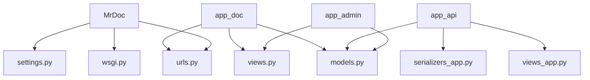
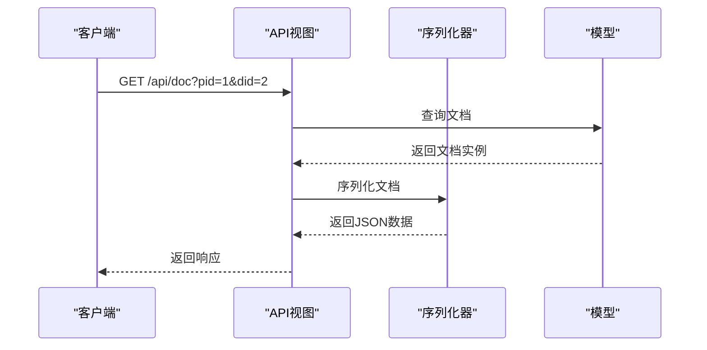
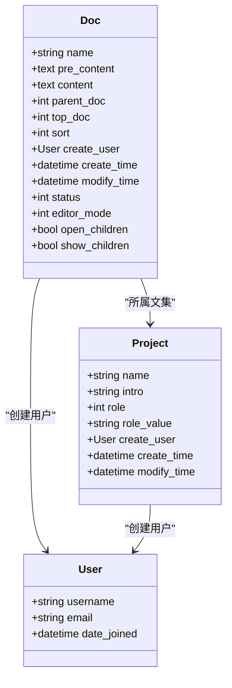
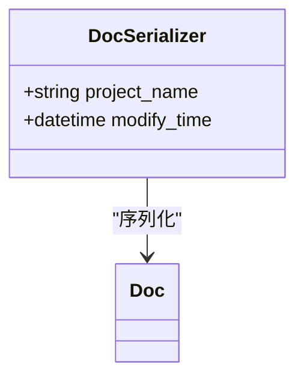
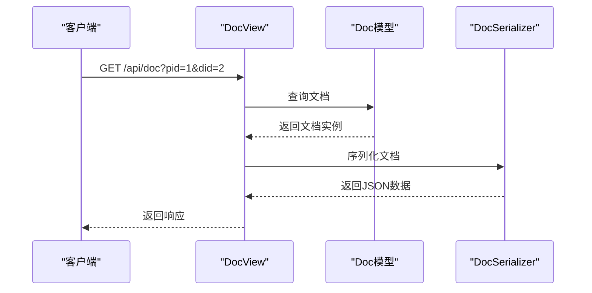
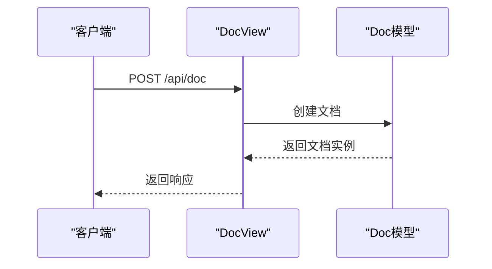
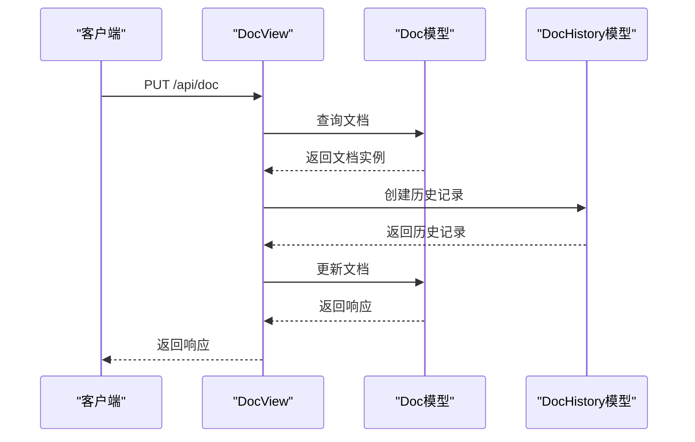
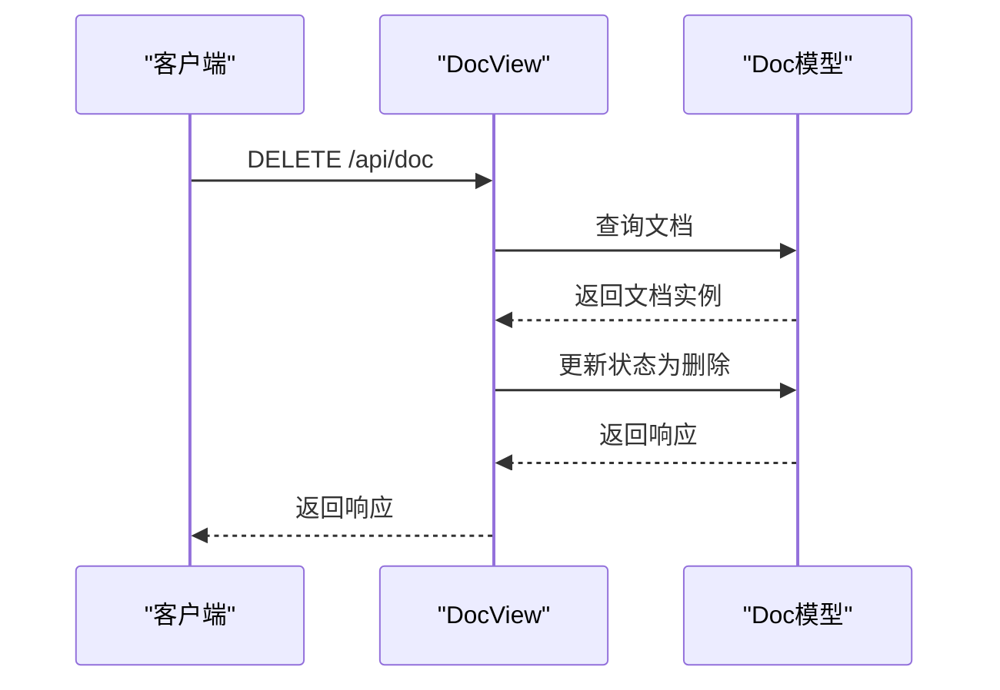
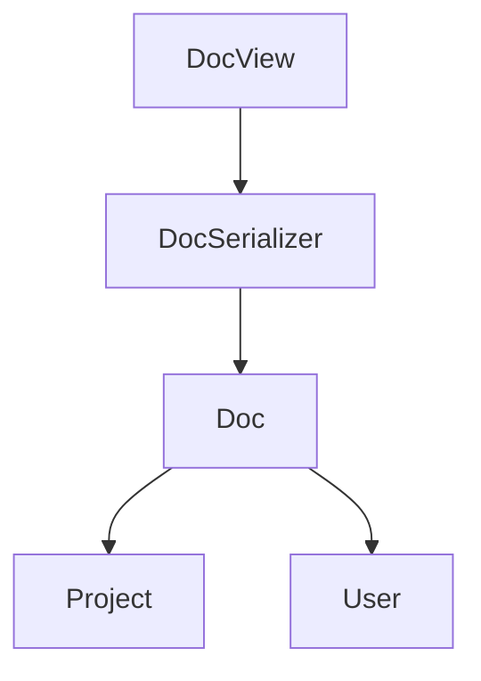

# 文档API

<cite>
**本文档中引用的文件**  
- [models.py](file://app_doc/models.py)
- [views.py](file://app_doc/views.py)
- [serializers_app.py](file://app_api/serializers_app.py)
- [views_app.py](file://app_api/views_app.py)
- [urls.py](file://app_doc/urls.py)
- [admin.py](file://app_admin/views.py)
</cite>

## 目录
1. [简介](#简介)
2. [项目结构](#项目结构)
3. [核心组件](#核心组件)
4. [架构概述](#架构概述)
5. [详细组件分析](#详细组件分析)
6. [依赖分析](#依赖分析)
7. [性能考虑](#性能考虑)
8. [故障排除指南](#故障排除指南)
9. [结论](#结论)

## 简介
本文档全面记录了文档操作API，涵盖文档的创建、读取、更新、删除和版本控制。详细解释了`DocSerializer`中Markdown内容处理、文档权限和元数据的序列化逻辑。描述了文档历史版本管理API，包括获取版本列表和恢复特定版本。提供了文档搜索、批量操作和文档分享功能的API使用示例。说明了文档编辑冲突的处理机制和实时协作的API支持。记录了大文档处理的最佳实践，包括分块上传和流式响应。包含性能优化建议，如合理使用缓存和减少不必要的API调用。

## 项目结构
项目结构清晰，主要分为以下几个模块：
- `MrDoc`：Django项目配置和入口
- `app_admin`：管理员相关功能
- `app_api`：API接口实现
- `app_doc`：文档核心功能
- `static`：静态资源
- `template`：模板文件

**图示来源**
- [models.py](file://app_doc/models.py)
- [views.py](file://app_doc/views.py)
- [urls.py](file://app_doc/urls.py)

**本节来源**
- [models.py](file://app_doc/models.py)
- [views.py](file://app_doc/views.py)
- [urls.py](file://app_doc/urls.py)

## 核心组件
文档API的核心组件包括文档模型、序列化器、视图和URL路由。文档模型定义了文档的基本属性和关系。序列化器负责将模型实例转换为JSON格式。视图处理HTTP请求并返回响应。URL路由将请求映射到相应的视图。

**本节来源**
- [models.py](file://app_doc/models.py)
- [serializers_app.py](file://app_api/serializers_app.py)
- [views_app.py](file://app_api/views_app.py)

## 架构概述
文档API采用Django REST framework实现，遵循RESTful设计原则。API通过HTTP方法（GET、POST、PUT、DELETE）对文档资源进行操作。认证通过`AppAuth`和`SessionAuthentication`实现。权限控制确保用户只能访问自己有权限的文档。

**图示来源**
- [views_app.py](file://app_api/views_app.py)
- [serializers_app.py](file://app_api/serializers_app.py)
- [models.py](file://app_doc/models.py)

## 详细组件分析

### 文档模型分析
文档模型`Doc`定义了文档的基本属性，包括标题、内容、上级文档、所属文集、排序、创建用户、创建时间、修改时间、状态和编辑器模式。

**图示来源**
- [models.py](file://app_doc/models.py)

**本节来源**
- [models.py](file://app_doc/models.py)

### 文档序列化器分析
`DocSerializer`继承自`ModelSerializer`，用于将`Doc`模型实例序列化为JSON格式。它包含所有字段，并添加了`project_name`和`modify_time`两个自定义字段。

**图示来源**
- [serializers_app.py](file://app_api/serializers_app.py)

**本节来源**
- [serializers_app.py](file://app_api/serializers_app.py)

### 文档视图分析
`DocView`是文档API的主要视图，处理文档的获取、创建、修改和删除操作。它使用`AppAuth`和`SessionAuthentication`进行认证。

#### 获取文档

**图示来源**
- [views_app.py](file://app_api/views_app.py)

#### 创建文档

**图示来源**
- [views_app.py](file://app_api/views_app.py)

#### 修改文档

**图示来源**
- [views_app.py](file://app_api/views_app.py)

#### 删除文档

**图示来源**
- [views_app.py](file://app_api/views_app.py)

**本节来源**
- [views_app.py](file://app_api/views_app.py)

## 依赖分析
文档API依赖于Django REST framework、Django模型和序列化器。`DocView`依赖于`Doc`模型和`DocSerializer`。`DocSerializer`依赖于`Doc`模型。`Doc`模型依赖于`Project`和`User`模型。

**图示来源**
- [views_app.py](file://app_api/views_app.py)
- [serializers_app.py](file://app_api/serializers_app.py)
- [models.py](file://app_doc/models.py)

**本节来源**
- [views_app.py](file://app_api/views_app.py)
- [serializers_app.py](file://app_api/serializers_app.py)
- [models.py](file://app_doc/models.py)

## 性能考虑
为了提高性能，建议：
1. 合理使用缓存，避免重复查询数据库。
2. 减少不必要的API调用，合并多个请求为一个。
3. 使用分页查询大量数据。
4. 优化数据库查询，避免N+1查询问题。

## 故障排除指南
常见问题及解决方案：
1. **权限错误**：检查用户是否有权限访问文档。
2. **参数错误**：检查请求参数是否正确。
3. **系统异常**：查看日志文件，定位问题。

**本节来源**
- [views_app.py](file://app_api/views_app.py)
- [views.py](file://app_doc/views.py)

## 结论
本文档详细记录了文档操作API的各个方面，包括模型、序列化器、视图和URL路由。通过本文档，开发者可以快速理解和使用文档API，实现文档的创建、读取、更新、删除和版本控制功能。