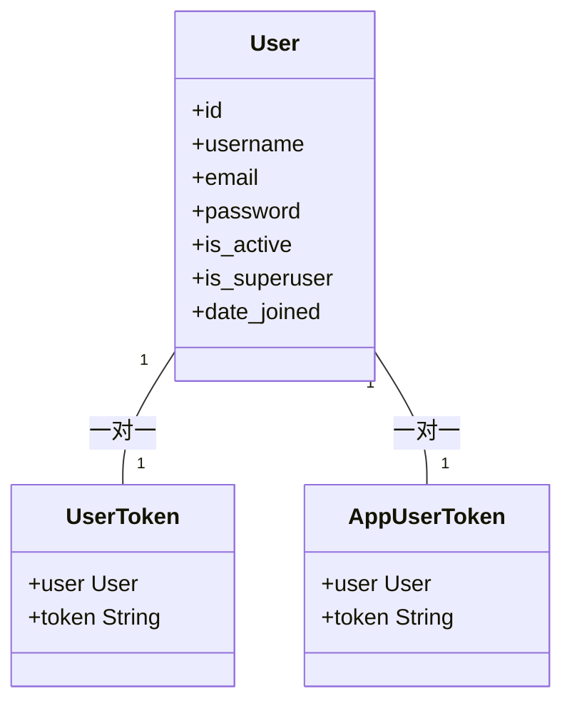
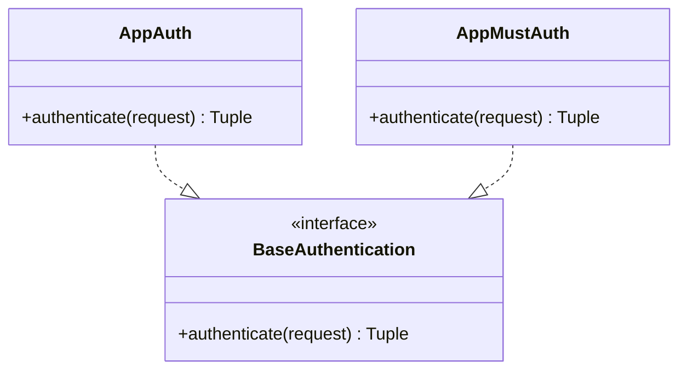
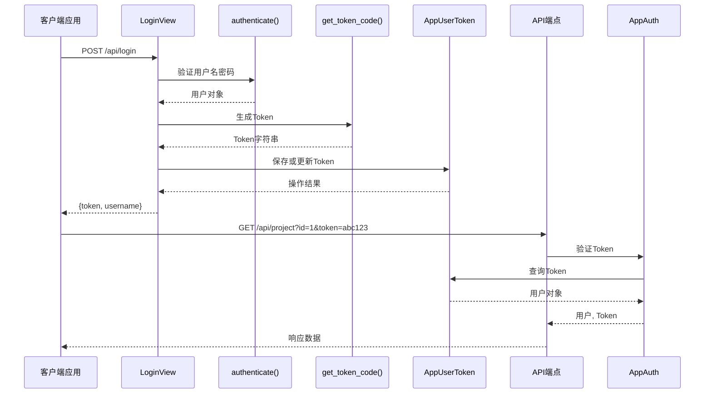
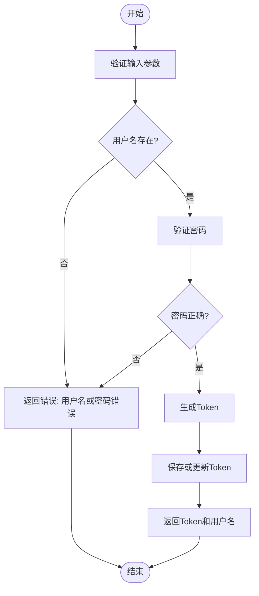

# 认证API

<cite>
**本文档中引用的文件**   
- [auth_app.py](file://app_api/auth_app.py)
- [serializers_app.py](file://app_api/serializers_app.py)
- [views_app.py](file://app_api/views_app.py)
- [models.py](file://app_api/models.py)
</cite>

## 目录
1. [简介](#简介)
2. [核心组件](#核心组件)
3. [认证机制实现](#认证机制实现)
4. [数据验证规则](#数据验证规则)
5. [API端点说明](#api端点说明)
6. [使用示例](#使用示例)
7. [安全考虑](#安全考虑)
8. [错误响应码](#错误响应码)
9. [客户端实现指南](#客户端实现指南)

## 简介
MrDoc系统的认证API提供基于Token的身份验证机制，支持用户登录、Token获取、Token刷新和权限验证等功能。本API专为桌面和移动应用设计，通过RESTful接口实现安全的用户认证和资源访问控制。

**Section sources**
- [views_app.py](file://app_api/views_app.py#L0-L53)
- [auth_app.py](file://app_api/auth_app.py#L0-L52)

## 核心组件

### 认证模型
系统包含两个Token模型：`UserToken`用于浏览器扩展，`AppUserToken`用于桌面和移动应用。两者都与Django用户模型建立一对一关系，并存储唯一的Token值。



**Diagram sources**
- [models.py](file://app_api/models.py#L0-L25)

### 认证类
系统实现两个自定义认证类：`AppAuth`和`AppMustAuth`，均继承自Django REST Framework的`BaseAuthentication`。



**Diagram sources**
- [auth_app.py](file://app_api/auth_app.py#L0-L52)

**Section sources**
- [auth_app.py](file://app_api/auth_app.py#L0-L52)
- [models.py](file://app_api/models.py#L0-L25)

## 认证机制实现

### Token生成与验证流程
系统采用基于用户名和时间戳的MD5哈希算法生成唯一Token。认证过程通过查询URL参数中的token值来验证用户身份。



**Diagram sources**
- [views_app.py](file://app_api/views_app.py#L52-L91)
- [auth_app.py](file://app_api/auth_app.py#L0-L52)

### 认证类实现细节
`AppAuth`和`AppMustAuth`类都实现了`authenticate`方法，但处理无效Token的方式不同：

- `AppAuth`: 返回`None`，允许其他认证方式继续尝试
- `AppMustAuth`: 抛出`AuthenticationFailed`异常，立即终止认证过程

```python
class AppAuth(BaseAuthentication):
    def authenticate(self, request):
        token = request.query_params.get('token')
        if token:
            user_obj = AppUserToken.objects.filter(token=token).first()
            if user_obj:
                return user_obj.user, token
            else:
                return None
        else:
            return None

class AppMustAuth(BaseAuthentication):
    def authenticate(self, request):
        token = request.query_params.get('token')
        if token:
            user_obj = AppUserToken.objects.filter(token=token).first()
            if user_obj:
                return user_obj.user, token
            else:
                raise AuthenticationFailed(_('无效的token'))
        else:
            raise AuthenticationFailed(_('请求的URL中必须携带token参数'))
```

**Section sources**
- [auth_app.py](file://app_api/auth_app.py#L0-L52)

## 数据验证规则

### LoginSerializer
虽然代码中未直接定义LoginSerializer，但从`LoginView`的实现可以看出数据验证规则：

- **用户名**: 必需，用于用户身份识别
- **密码**: 必需，用于身份验证
- 验证通过Django的`authenticate()`函数完成

### TokenSerializer
系统使用`AppUserToken`模型进行Token序列化，其验证规则包括：

- **Token值**: 最大长度250字符，必须唯一
- **用户关联**: 必须与有效的用户对象关联



**Diagram sources**
- [views_app.py](file://app_api/views_app.py#L87-L116)
- [auth_app.py](file://app_api/auth_app.py#L0-L52)

**Section sources**
- [views_app.py](file://app_api/views_app.py#L87-L116)

## API端点说明

### 登录端点
- **URL**: `/api/login`
- **方法**: POST
- **请求体**:
  ```json
  {
    "username": "用户名",
    "password": "密码"
  }
  ```
- **成功响应**:
  ```json
  {
    "code": 0,
    "token": "生成的Token",
    "username": "用户名"
  }
  ```

### Token验证
- **方式**: URL查询参数
- **参数**: `token=your_token_value`
- 所有受保护的API端点都需要此参数

### 受保护端点示例
```python
class ProjectView(APIView):
    authentication_classes = (AppAuth, SessionAuthentication)
    
    def get(self, request):
        # 只有通过认证的请求才能访问
        pass
```

**Section sources**
- [views_app.py](file://app_api/views_app.py#L52-L91)
- [auth_app.py](file://app_api/auth_app.py#L0-L52)

## 使用示例

### curl示例
```bash
# 用户登录获取Token
curl -X POST https://mrdoc.example.com/api/login \
  -H "Content-Type: application/json" \
  -d '{
    "username": "your_username",
    "password": "your_password"
  }'

# 使用Token访问受保护的API
curl "https://mrdoc.example.com/api/project?id=1&token=your_token_value"
```

### Python requests示例
```python
import requests

# 登录获取Token
login_url = "https://mrdoc.example.com/api/login"
login_data = {
    "username": "your_username",
    "password": "your_password"
}
response = requests.post(login_url, json=login_data)
token = response.json()["token"]

# 使用Token访问API
project_url = f"https://mrdoc.example.com/api/project?id=1&token={token}"
response = requests.get(project_url)
print(response.json())
```

**Section sources**
- [views_app.py](file://app_api/views_app.py#L52-L91)

## 安全考虑

### HTTPS要求
所有API调用必须通过HTTPS进行，以防止Token在传输过程中被窃取。

### Token存储最佳实践
- **客户端**: 将Token存储在安全的存储区域（如iOS的Keychain或Android的SharedPreferences）
- **避免**: 不要在URL中长期暴露Token，不要将Token存储在易受攻击的位置

### 防止暴力破解措施
- **无内置限制**: 当前实现未包含失败尝试计数或锁定机制
- **建议**: 在反向代理或应用防火墙层面实现IP限制和速率限制

### Token过期处理
- **当前实现**: Token永不过期，除非被显式更新或删除
- **建议**: 考虑实现Token过期机制以增强安全性

**Section sources**
- [auth_app.py](file://app_api/auth_app.py#L0-L52)
- [views_app.py](file://app_api/views_app.py#L52-L91)

## 错误响应码
系统使用统一的错误响应码格式：

| 错误码 | 含义 | 说明 |
|--------|------|------|
| 0 | 成功 | 操作成功完成 |
| 1 | 资源未找到 | 请求的资源不存在 |
| 2 | 无权访问 | 用户没有权限访问资源 |
| 3 | 需要访问码 | 需要提供访问码才能访问 |
| 4 | 系统异常 | 服务器内部错误 |
| 5 | 参数不正确 | 请求参数有误 |
| 6 | 需要登录 | 用户未认证，需要登录 |

**Section sources**
- [views_app.py](file://app_api/views_app.py#L0-L53)

## 客户端实现指南

### Token存储
```python
# 示例：安全存储Token
import keyring

def save_token(username, token):
    keyring.set_password("mrdoc", username, token)

def get_token(username):
    return keyring.get_password("mrdoc", username)
```

### 自动刷新策略
由于当前Token永不过期，无需自动刷新。但建议实现以下策略：

```python
class APIClient:
    def __init__(self, base_url):
        self.base_url = base_url
        self.token = None
    
    def login(self, username, password):
        url = f"{self.base_url}/api/login"
        response = requests.post(url, json={
            "username": username,
            "password": password
        })
        if response.json()["code"] == 0:
            self.token = response.json()["token"]
            self.save_token(username, self.token)
    
    def make_request(self, endpoint, params=None):
        if params is None:
            params = {}
        params["token"] = self.token
        response = requests.get(f"{self.base_url}{endpoint}", params=params)
        return response.json()
```

### 错误处理策略
```python
def handle_api_error(error_code):
    error_messages = {
        0: "操作成功",
        1: "资源未找到，请检查ID是否正确",
        2: "无权访问该资源",
        3: "需要访问码才能查看",
        4: "服务器错误，请稍后重试",
        5: "参数错误，请检查输入",
        6: "请先登录"
    }
    return error_messages.get(error_code, "未知错误")
```

**Section sources**
- [views_app.py](file://app_api/views_app.py#L0-L53)
- [auth_app.py](file://app_api/auth_app.py#L0-L52)