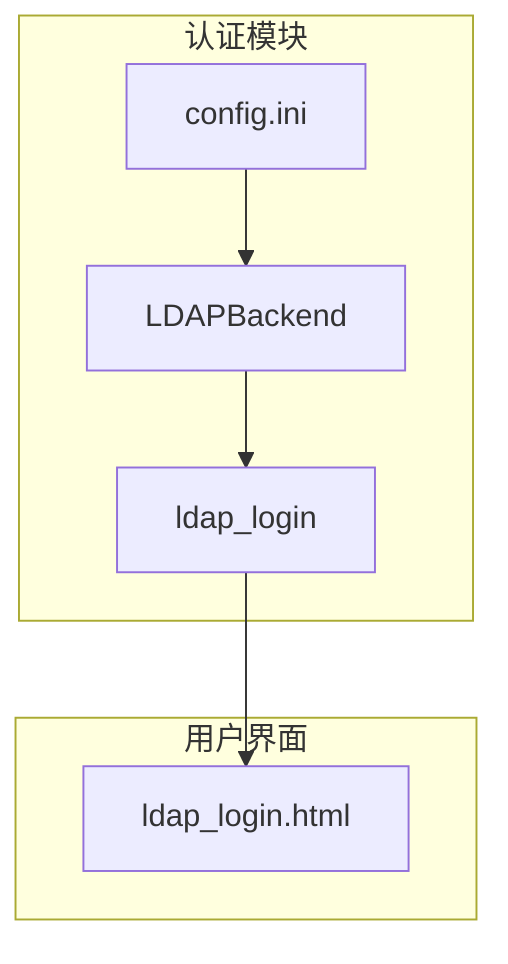
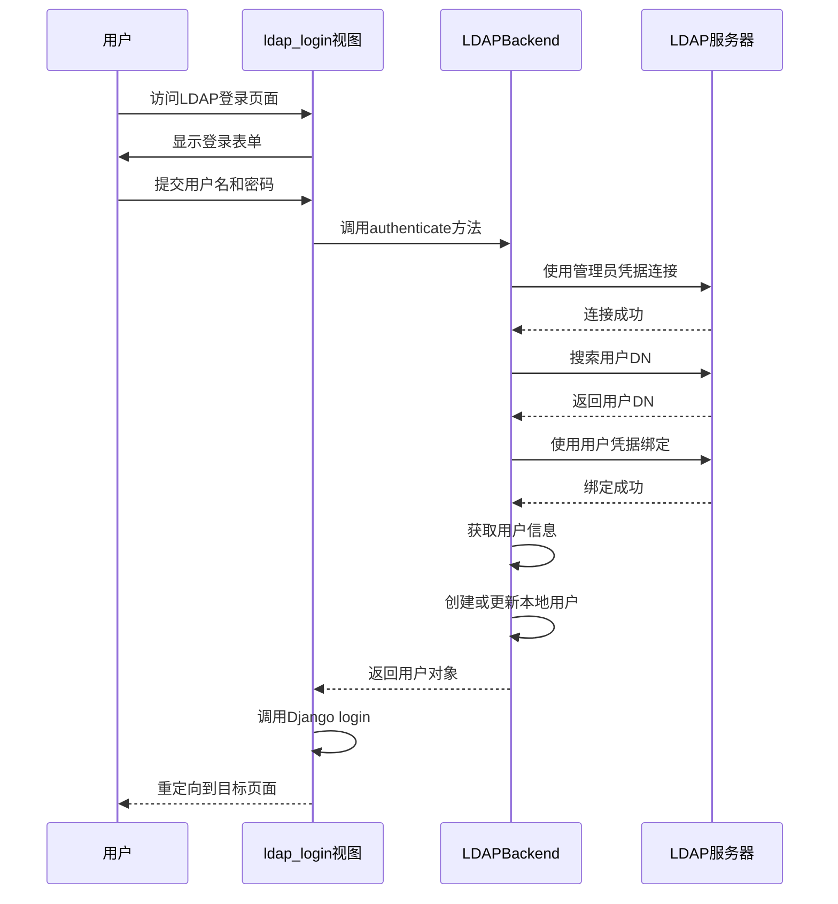
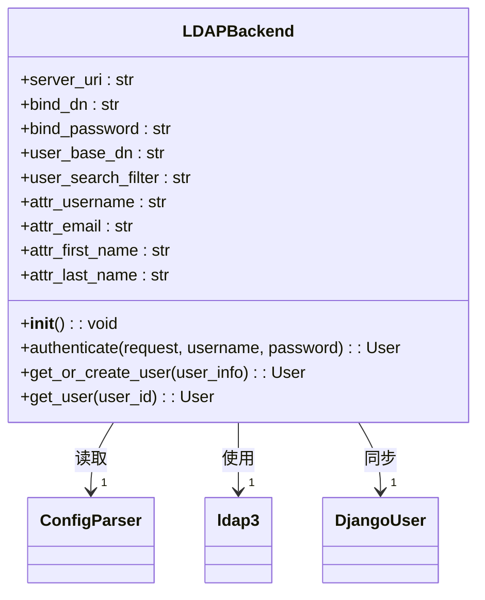
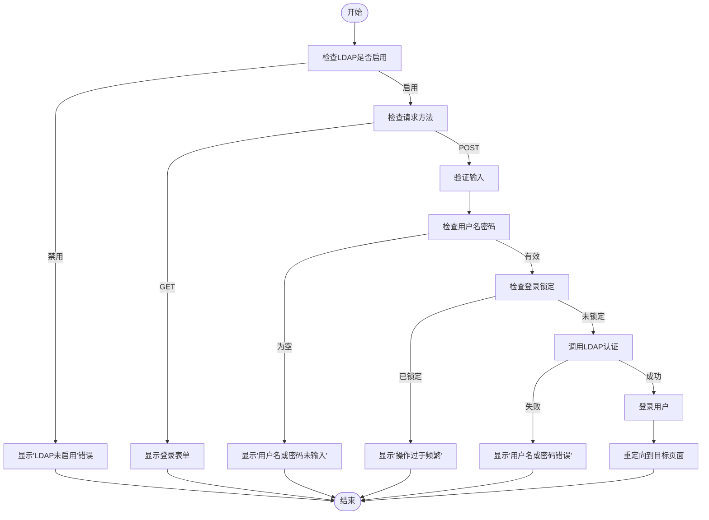
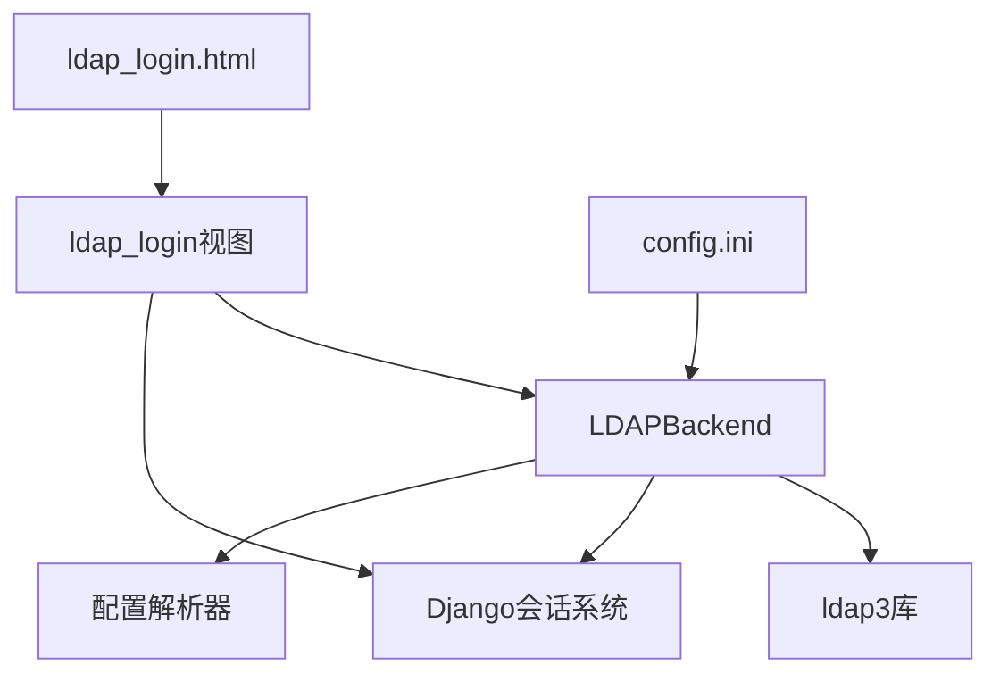

# LDAP认证集成指南

<cite>
**本文档引用的文件**
- [ldap_backend.py](file://app_admin/ldap_backend.py#L1-L170)
- [config.ini](file://config/config.ini#L1-L53)
- [ldap_login.html](file://template/ldap_login.html#L1-L117)
- [views.py](file://app_admin/views.py#L243-L331)
</cite>

## 目录
1. [简介](#简介)
2. [项目结构](#项目结构)
3. [核心组件](#核心组件)
4. [架构概述](#架构概述)
5. [详细组件分析](#详细组件分析)
6. [依赖分析](#依赖分析)
7. [性能考虑](#性能考虑)
8. [故障排除指南](#故障排除指南)
9. [结论](#结论)

## 简介
本指南详细介绍了觅思文档系统中LDAP认证的集成实现。该系统通过自定义Django认证后端，实现了与外部LDAP服务器的安全集成，允许用户使用企业目录凭据进行身份验证。文档涵盖了配置、实现细节、安全设置和故障排除，为系统管理员和技术人员提供了全面的参考。

## 项目结构
LDAP认证功能分布在多个模块中，主要涉及认证后端、视图处理和用户界面。系统采用分层架构，将配置、业务逻辑和用户界面分离，确保了代码的可维护性和可扩展性。

**图示来源**
- [ldap_backend.py](file://app_admin/ldap_backend.py#L1-L170)
- [views.py](file://app_admin/views.py#L243-L331)
- [config.ini](file://config/config.ini#L1-L53)
- [ldap_login.html](file://template/ldap_login.html#L1-L117)

## 核心组件
LDAP认证系统的核心组件包括认证后端、配置管理、用户界面和安全控制。这些组件协同工作，实现了安全、可靠的用户身份验证流程。

**组件来源**
- [ldap_backend.py](file://app_admin/ldap_backend.py#L1-L170)
- [config.ini](file://config/config.ini#L1-L53)

## 架构概述
系统采用标准的LDAP认证流程，通过管理员账户搜索用户，然后使用用户凭据进行绑定验证。认证成功后，系统会同步用户信息到本地数据库，实现单点登录体验。

**图示来源**
- [ldap_backend.py](file://app_admin/ldap_backend.py#L1-L170)
- [views.py](file://app_admin/views.py#L243-L331)

## 详细组件分析

### LDAP认证后端分析
LDAP认证后端实现了Django的自定义认证接口，负责与LDAP服务器的通信和用户信息同步。

**图示来源**
- [ldap_backend.py](file://app_admin/ldap_backend.py#L1-L170)

**组件来源**
- [ldap_backend.py](file://app_admin/ldap_backend.py#L1-L170)

### LDAP登录视图分析
LDAP登录视图处理用户请求，协调认证流程，并提供用户友好的错误反馈。

**图示来源**
- [views.py](file://app_admin/views.py#L243-L331)

**组件来源**
- [views.py](file://app_admin/views.py#L243-L331)

## 依赖分析
LDAP认证系统依赖于多个外部库和内部模块，形成了清晰的依赖关系。

**图示来源**
- [ldap_backend.py](file://app_admin/ldap_backend.py#L1-L170)
- [views.py](file://app_admin/views.py#L243-L331)
- [config.ini](file://config/config.ini#L1-L53)

## 性能考虑
系统在设计时考虑了性能优化，包括连接复用、缓存机制和防暴力破解措施。登录尝试次数限制（5次后锁定10分钟）有效防止了暴力破解攻击，同时确保了合法用户的正常使用。

## 故障排除指南
### 常见问题及解决方案

**问题：LDAP认证未启用**
- **原因**：config.ini中enable_ldap设置为false
- **解决方案**：修改config.ini，设置enable_ldap = true

**问题：用户名或密码错误**
- **原因**：用户凭据不正确或LDAP服务器连接问题
- **解决方案**：检查LDAP服务器配置，验证用户凭据

**问题：操作过于频繁**
- **原因**：登录尝试超过5次
- **解决方案**：等待10分钟后重试

**问题：用户被禁用**
- **原因**：Django用户状态为非活跃
- **解决方案**：在管理后台启用用户账户

**组件来源**
- [ldap_backend.py](file://app_admin/ldap_backend.py#L1-L170)
- [views.py](file://app_admin/views.py#L243-L331)

## 结论
LDAP认证集成提供了一种安全、可靠的企业级身份验证解决方案。通过清晰的架构设计和完善的错误处理，系统能够有效集成到现有企业目录服务中，为用户提供无缝的登录体验。建议定期审查LDAP配置和安全设置，确保系统的持续安全运行。