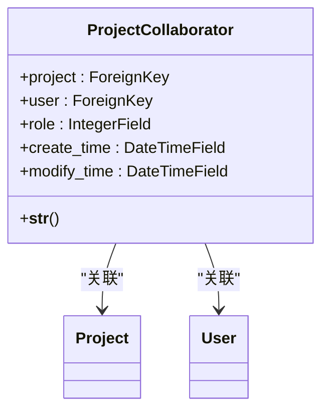
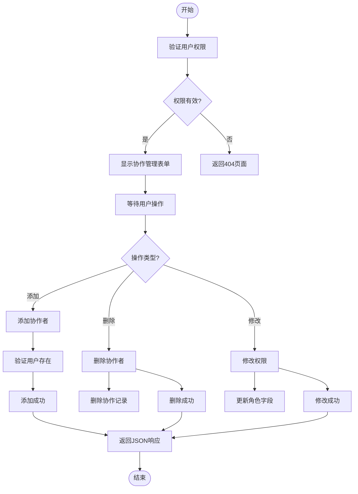
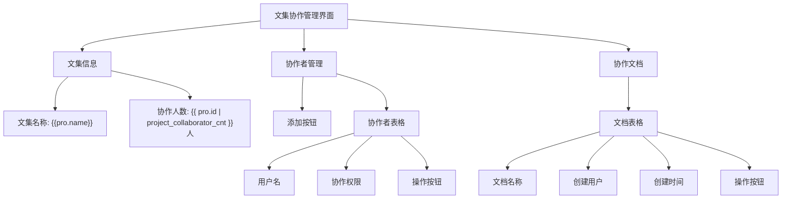
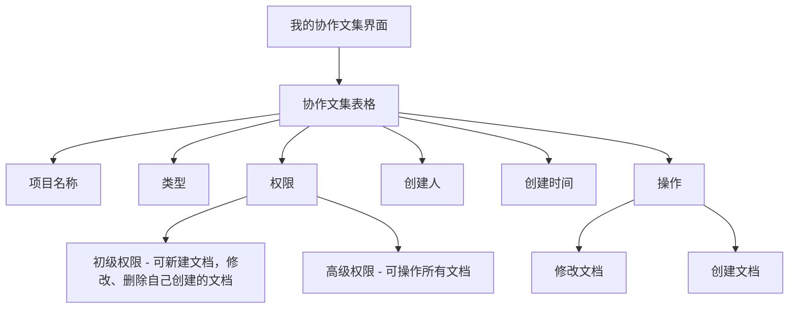

# 协作功能

<cite>
**本文档中引用的文件**   
- [models.py](file://app_doc/models.py#L36-L49)
- [views.py](file://app_doc/views.py#L828-L912)
- [manage_project_collaborator.html](file://template/app_doc/manage/manage_project_collaborator.html)
- [manage_project_self_colla.html](file://template/app_doc/manage/manage_project_self_colla.html)
</cite>

## 目录
1. [项目协作功能概述](#项目协作功能概述)
2. [ProjectCollaborator 模型详解](#projectcollaborator-模型详解)
3. [权限级别管理](#权限级别管理)
4. [协作邀请与接受机制](#协作邀请与接受机制)
5. [个人协作项目管理界面](#个人协作项目管理界面)
6. [视图函数代码示例](#视图函数代码示例)
7. [常见问题与解决方案](#常见问题与解决方案)

## 项目协作功能概述

本系统提供完整的项目协作功能，允许用户邀请其他用户共同参与文集（项目）的编辑和管理。协作功能包括权限分配、成员管理、文档访问控制等核心特性。用户可以创建文集并邀请其他用户作为协作者，根据需要分配不同的权限级别。系统通过 `ProjectCollaborator` 模型来管理协作关系，并提供相应的管理界面和API接口。

**文档来源**
- [models.py](file://app_doc/models.py)
- [views.py](file://app_doc/views.py)

## ProjectCollaborator 模型详解

`ProjectCollaborator` 模型是协作功能的核心数据结构，定义了文集与用户之间的协作关系。



**图示来源**
- [models.py](file://app_doc/models.py#L36-L49)

### 模型字段说明

- **project**: 外键字段，关联到 `Project` 模型，表示被协作的文集
- **user**: 外键字段，关联到 Django 内置的 `User` 模型，表示协作者用户
- **role**: 整数字段，表示协作权限级别，有以下两个可选值：
  - `0`: 初级权限 - 可新建文档，修改、删除自己创建的文档
  - `1`: 高级权限 - 可操作所有文档
- **create_time**: 创建时间字段，自动记录协作关系的创建时间
- **modify_time**: 修改时间字段，自动记录协作关系的最后修改时间

该模型通过 `__str__` 方法返回项目对象，便于在管理界面中显示。

**文档来源**
- [models.py](file://app_doc/models.py#L36-L49)

## 权限级别管理

系统提供了两种协作权限级别，满足不同场景下的协作需求。

### 权限级别说明

| 权限级别 | 数值 | 功能描述 |
|---------|------|---------|
| 初级权限 | 0 | 可新建文档，可修改和删除自己创建的文档 |
| 高级权限 | 1 | 可新建文档，可删除自己创建的文档，可修改所有文档 |

### 权限管理实现

权限管理通过 `manage_project_collaborator` 视图函数实现，支持添加、删除和修改协作者权限。



**图示来源**
- [views.py](file://app_doc/views.py#L828-L912)

## 协作邀请与接受机制

系统的协作邀请机制通过管理界面实现，不涉及传统的邀请-接受流程，而是由文集创建者直接添加协作者。

### 协作邀请流程

1. 文集创建者进入文集协作管理页面
2. 从用户列表中选择要邀请的用户
3. 选择相应的权限级别
4. 系统直接创建协作关系，无需被邀请方确认

这种设计简化了协作流程，适用于信任环境下的团队协作。

### 前端交互实现

前端使用 Layui 框架实现协作管理界面，通过 AJAX 请求与后端交互。

```javascript
// 添加文集协作者
addProjectColla = function(pid){
    layer.open({
        type:1,
        title:'添加文集协作者',
        area:['400px','400px'],
        id:'addProColla',
        content:$('#add-pro-colla-layer'),
        btn:['确定','取消'],
        btnAlign:'c',
        success : function(index, layero) {
            form.render('radio');
        },
        yes:function (index,layero) {
            layer.load(1);
            data = {
                'types':0,
                'username':$("#user-select").val(),
                'role': $('input[name="add-role"]:checked').val()
            }
            $.post("",data,function(r){
                layer.closeAll('loading');
                if(r.status){
                    window.location.reload();
                }else{
                    layer.msg(r.data)
                }
            })
        },
    })
};
```

**文档来源**
- [manage_project_collaborator.html](file://template/app_doc/manage/manage_project_collaborator.html)

## 个人协作项目管理界面

系统提供了两个主要的协作管理界面：文集协作管理界面和我的协作文集界面。

### 文集协作管理界面

该界面允许文集创建者管理协作者，功能包括：

- 查看当前文集的协作者列表
- 添加新的协作者
- 删除现有协作者
- 修改协作者权限
- 查看协作者创建的文档



**图示来源**
- [manage_project_collaborator.html](file://template/app_doc/manage/manage_project_collaborator.html)

### 我的协作文集界面

该界面显示当前用户参与的所有协作项目，方便用户快速访问。



**图示来源**
- [manage_project_self_colla.html](file://template/app_doc/manage/manage_project_self_colla.html)

## 视图函数代码示例

以下是协作功能的核心视图函数实现：

```python
# 文集协作管理
@login_required()
@require_http_methods(['GET',"POST"])
@logger.catch()
def manage_project_collaborator(request,pro_id):
    if request.user.is_superuser:
        project = Project.objects.filter(id=pro_id)
    else:
        project = Project.objects.filter(id=pro_id, create_user=request.user)
    if project.exists() is False:
        return render(request, '404.html')

    if request.method == 'GET':
        user_list = User.objects.filter(~Q(username=request.user.username))
        pro = project[0]
        collaborator = ProjectCollaborator.objects.filter(project=pro)
        colla_user_list = [i.user for i in collaborator]
        colla_docs = Doc.objects.filter(top_doc=pro.id,create_user__in=colla_user_list)
        return render(request, 'app_doc/manage/manage_project_collaborator.html', locals())
    else:
        types = request.POST.get('types', '')
        # 添加文集协作者
        if int(types) == 0:
            username = request.POST.get('username', '')
            role = request.POST.get('role', 0)
            try:
                user = User.objects.get(username=username)
                # 禁止重复添加
                if ProjectCollaborator.objects.filter(project=project[0], user=user).exists():
                    return JsonResponse({'status':False,'data':_('已添加，请勿重复添加！')})
                ProjectCollaborator.objects.create(
                    project=project[0],
                    user=user,
                    role=role
                )
                return JsonResponse({'status':True,'data':_('添加成功')})
            except ObjectDoesNotExist:
                return JsonResponse({'status':False,'data':_('用户不存在')})
        # 删除文集协作者
        elif int(types) == 1:
            username = request.POST.get('username','')
            try:
                user = User.objects.get(username=username)
                pro_colla = ProjectCollaborator.objects.get(project=project[0],user=user)
                pro_colla.delete()
                return JsonResponse({'status':True,'data':_('删除成功')})
            except:
                logger.exception(_("删除协作者出错"))
                return JsonResponse({'status':False,'data':_('删除出错')})
        # 修改协作权限
        elif int(types) == 2:
            username = request.POST.get('username', '')
            role = request.POST.get('role','')
            try:
                user = User.objects.get(username=username)
                pro_colla = ProjectCollaborator.objects.filter(project=project[0], user=user)
                pro_colla.update(role=role)
                return JsonResponse({'status':True,'data':_('修改成功')})
            except:
                logger.exception(_("修改协作权限出错"))
                return JsonResponse({'status':False,'data':_('修改失败')})
        else:
            return JsonResponse({'status':False,'data':_('无效的类型')})
```

**文档来源**
- [views.py](file://app_doc/views.py#L828-L912)

## 常见问题与解决方案

### 协作邀请失败

**问题描述**：添加协作者时系统提示失败

**可能原因及解决方案**：
1. **用户不存在**：确保输入的用户名正确
2. **重复添加**：系统禁止重复添加同一用户作为协作者
3. **权限不足**：只有文集创建者或超级用户才能添加协作者

### 权限分配错误

**问题描述**：协作者权限与预期不符

**可能原因及解决方案**：
1. **权限值错误**：确保传递的权限值为 0 或 1
2. **缓存问题**：刷新页面查看最新权限状态
3. **前端显示错误**：检查模板中的权限显示逻辑

### 协作者无法访问文集

**问题描述**：已添加的协作者无法访问文集

**可能原因及解决方案**：
1. **文集权限设置**：检查文集本身的访问权限设置
2. **用户状态**：确保协作者账户处于激活状态
3. **浏览器缓存**：清除浏览器缓存后重新登录

### 性能问题

**问题描述**：协作管理界面加载缓慢

**优化建议**：
1. 对协作者和文档查询添加适当的索引
2. 实现分页功能，避免一次性加载过多数据
3. 使用缓存机制存储频繁访问的数据