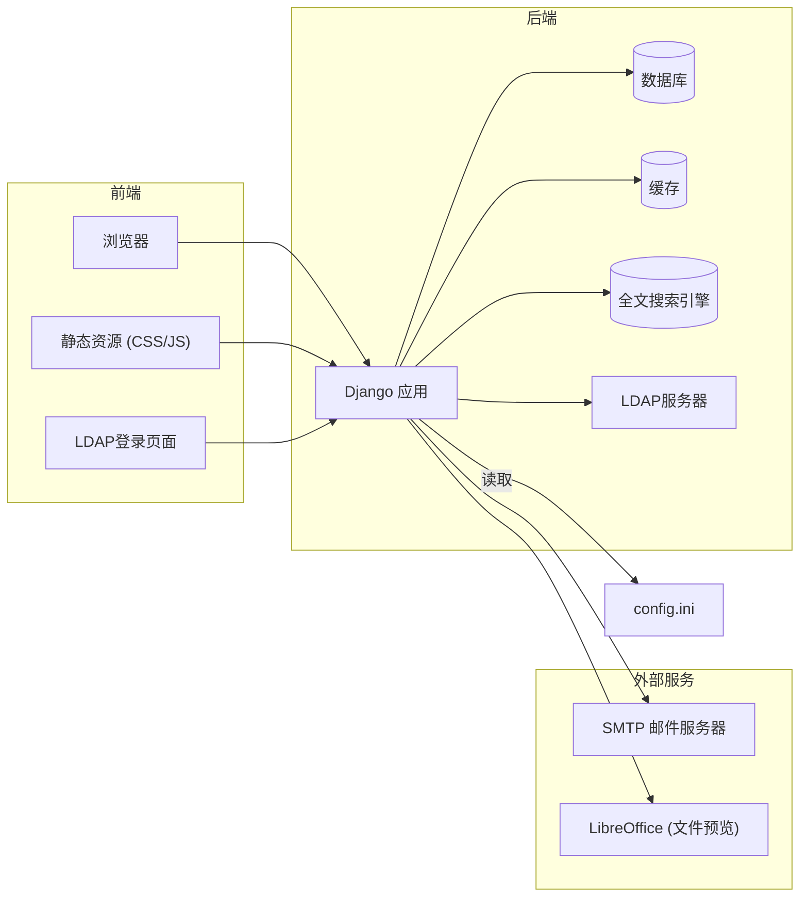
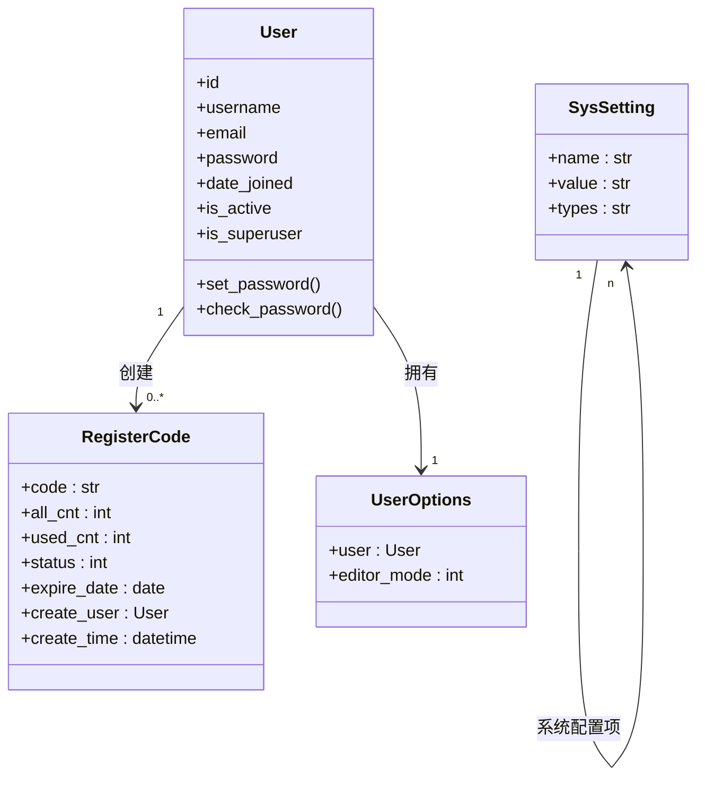
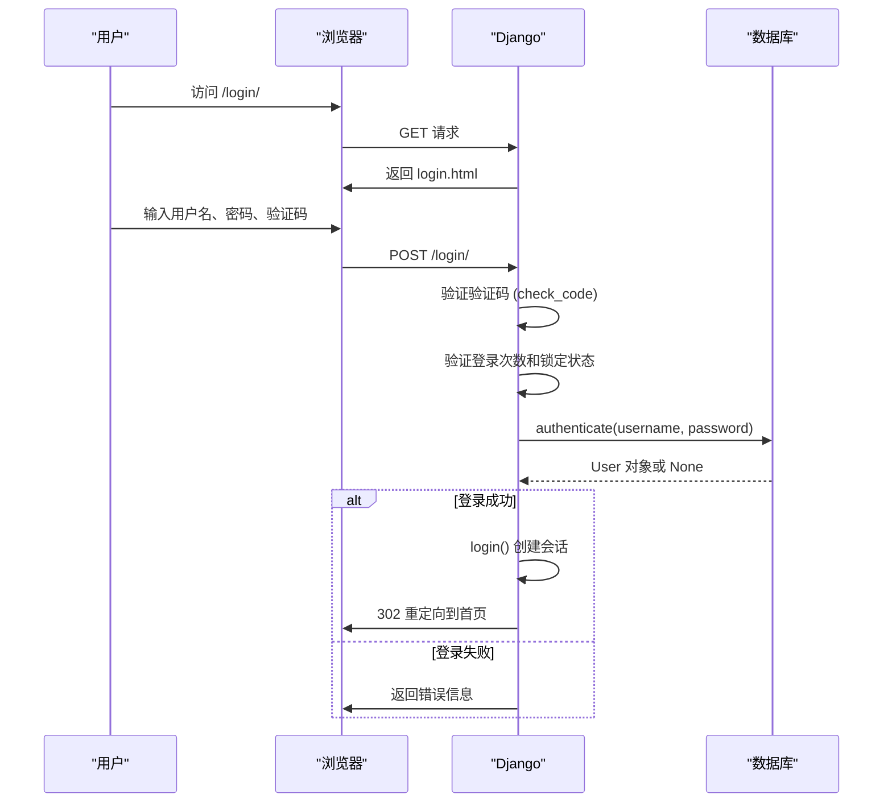
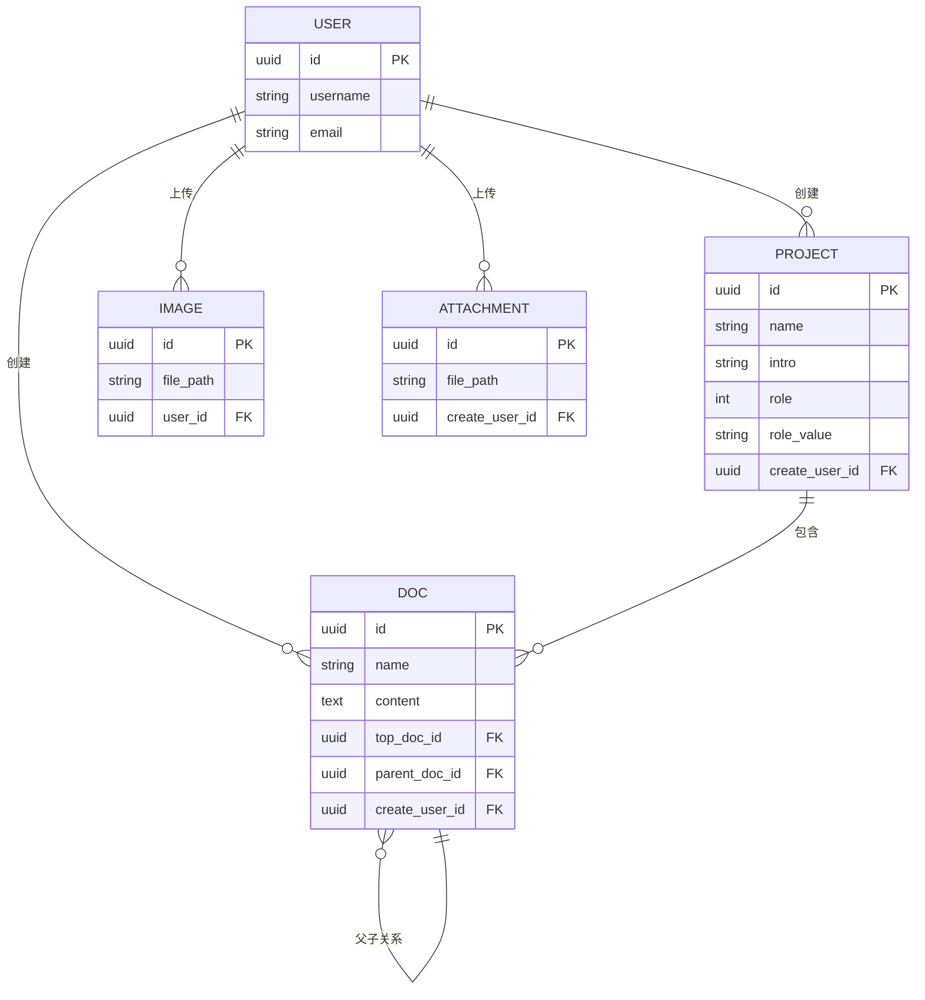
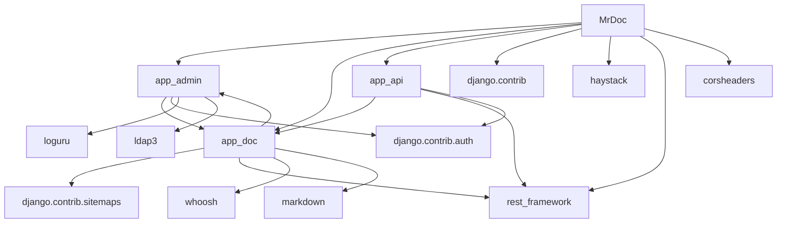
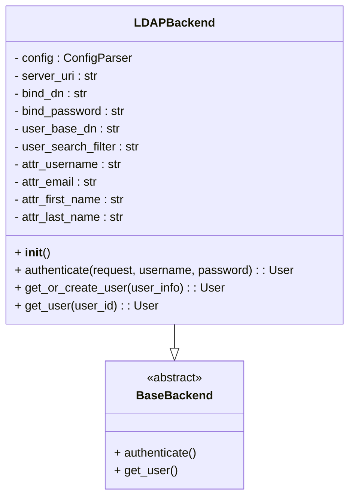
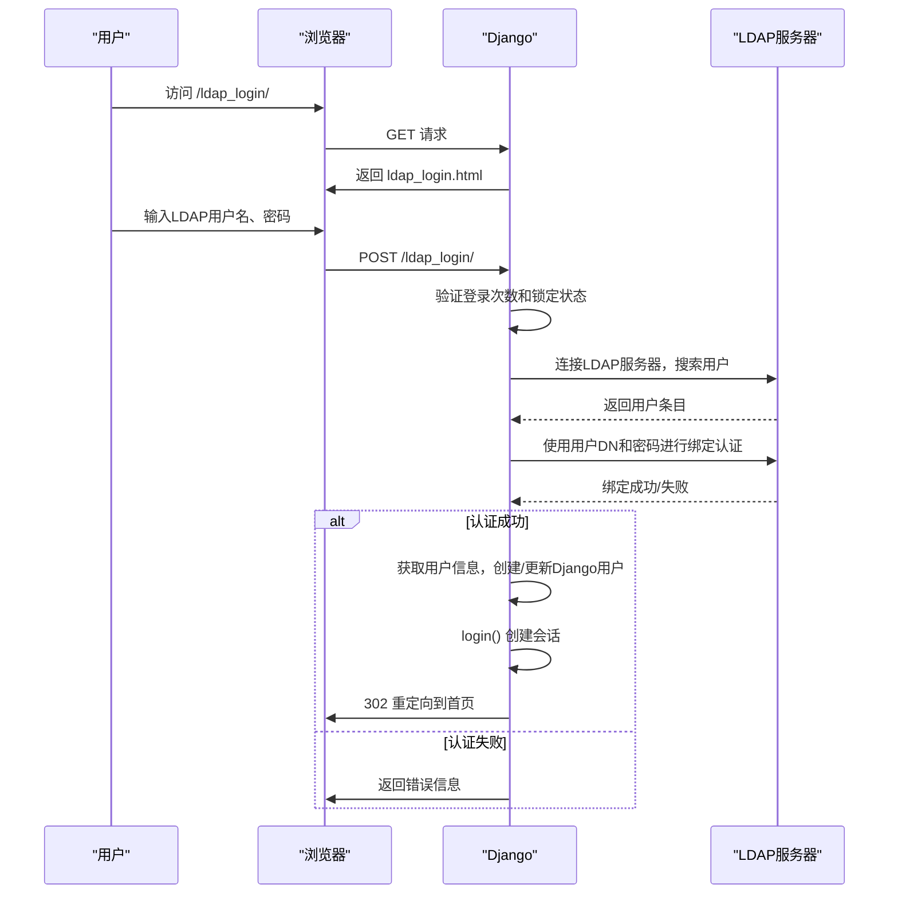

# 开发者指南

<cite>
**本文档中引用的文件**  
- [settings.py](file://MrDoc/settings.py) - *已更新数据库配置支持MySQL*
- [config.ini](file://config/config.ini) - *新增MySQL数据库配置及LDAP认证配置，已启用LDAP认证*
- [models.py](file://app_admin/models.py)
- [views.py](file://app_admin/views.py) - *新增LDAP登录视图*
- [admin.py](file://app_admin/admin.py)
- [utils.py](file://app_admin/utils.py)
- [check_code.py](file://app_admin/check_code.py)
- [context_processors.py](file://app_admin/context_processors.py)
- [decorators.py](file://app_admin/decorators.py)
- [ldap_backend.py](file://app_admin/ldap_backend.py) - *新增LDAP认证后端实现*
- [require_login_middleware.py](file://app_admin/middleware/require_login_middleware.py) - *更新中间件排除LDAP登录路径*
- [models.py](file://app_doc/models.py)
- [views.py](file://app_doc/views.py)
- [templatetags/doc_filter.py](file://app_doc/templatetags/doc_filter.py)
- [templatetags/project_filter.py](file://app_doc/templatetags/project_filter.py)
- [Dockerfile](file://Dockerfile)
- [docker-compose.yml](file://docker-compose.yml)
- [requirements.txt](file://requirements.txt)
- [ldap_login.html](file://template/ldap_login.html) - *新增LDAP登录模板*
</cite>

## 更新摘要
**已更新内容**  
- 更新了“项目结构”和“架构概览”部分，增加LDAP认证模块说明
- 更新了“LDAP认证”章节，反映LDAP配置已启用并修改了服务器地址和绑定密码
- 更新了“核心组件”部分，补充`app_admin`模块的LDAP相关组件
- 修正了“中间件”配置，增加对LDAP登录路径的排除规则
- 更新“依赖分析”部分，反映新增的`ldap3`依赖

**新增内容**  
- 新增“LDAP认证”章节，涵盖配置、认证流程和安全机制
- 增加LDAP认证序列图和类图
- 添加`ldap_backend.py`和`ldap_login.html`文件说明

**已更新来源**  
- [config.ini](file://config/config.ini) - *更新LDAP配置，启用LDAP认证，修改server_uri和bind_password*

## 目录
1. [简介](#简介)
2. [项目结构](#项目结构)
3. [核心组件](#核心组件)
4. [架构概览](#架构概览)
5. [数据库配置](#数据库配置)
6. [详细组件分析](#详细组件分析)
7. [依赖分析](#依赖分析)
8. [性能考量](#性能考量)
9. [故障排除指南](#故障排除指南)
10. [LDAP认证](#ldap认证)
11. [结论](#结论)

## 简介

`MrDoc` 是一个基于 `Python` 和 `Django` 框架开发的开源在线文档系统，旨在为个人和中小型团队提供私有化部署的知识管理、云笔记和文档协作解决方案。系统支持 Markdown 和富文本编辑，具备文档版本控制、全文搜索、权限管理、API 接口、多语言支持等核心功能。本开发者指南旨在深入解析 MrDoc 的内部架构、技术栈、组件交互与扩展开发方式，为二次开发和系统集成提供全面指导。

## 项目结构

MrDoc 采用典型的 Django 项目结构，按功能模块划分应用（App），实现了清晰的职责分离。项目根目录包含核心配置、静态资源、模板和主要应用模块。

```mermaid
graph TB
subgraph "根目录"
MrDoc["MrDoc (Django 核心配置)"]
app_admin["app_admin (后台管理)"]
app_doc["app_doc (文档核心)"]
app_api["app_api (API 接口)"]
config["config (配置文件)"]
static["static (静态资源)"]
template["template (模板文件)"]
manage_py["manage.py"]
end
MrDoc --> settings_py["settings.py"]
MrDoc --> urls_py["urls.py"]
MrDoc --> wsgi_py["wsgi.py"]
app_admin --> models_py["models.py"]
app_admin --> views_py["views.py"]
app_admin --> admin_py["admin.py"]
app_admin --> utils_py["utils.py"]
app_admin --> ldap_backend_py["ldap_backend.py"]
app_admin --> middleware["middleware/"]
app_doc --> models_py["models.py"]
app_doc --> views_py["views.py"]
app_doc --> templatetags["templatetags/"]
app_doc --> search["search/"]
config --> config_ini["config.ini"]
template --> ldap_login_html["ldap_login.html"]
```



**图示来源**
- [settings.py](file://MrDoc/settings.py)
- [urls.py](file://MrDoc/urls.py)
- [models.py](file://app_admin/models.py)
- [models.py](file://app_doc/models.py)
- [config.ini](file://config/config.ini)
- [ldap_backend.py](file://app_admin/ldap_backend.py)
- [ldap_login.html](file://template/ldap_login.html)

## 核心组件

MrDoc 的核心功能由三个主要 Django 应用构成：`app_admin`、`app_doc` 和 `app_api`，它们分别负责后台管理、文档核心逻辑和 API 接口。

- **app_admin**：提供系统级的后台管理界面，包括用户管理、文集管理、注册邀请码配置、站点设置等。它定义了 `SysSetting`、`RegisterCode` 等模型，并通过 `views.py` 中的视图函数处理管理请求。**新增LDAP认证功能**，通过 `ldap_backend.py` 实现自定义认证后端，`ldap_login` 视图处理LDAP登录请求。
- **app_doc**：系统的核心业务逻辑所在，管理文档（Doc）、文集（Project）、图片（Image）、附件（Attachment）等实体。它实现了文档的创建、编辑、版本历史、全文搜索（通过 Haystack 和 Whoosh）、分享、收藏等功能。
- **app_api**：提供 RESTful API 接口，支持外部应用通过 Token 进行身份验证，实现文档的自动化创建和管理。`serializers_app.py` 定义了数据序列化规则，`views_app.py` 处理 API 请求。

此外，`MrDoc/settings.py` 是全局配置中心，它读取 `config/config.ini` 文件中的数据库、缓存、邮件等配置，实现了配置与代码的分离。**新增对LDAP配置的支持**，通过 `config.ini` 的 `[ldap]` 节进行LDAP相关参数配置。

**本节来源**
- [settings.py](file://MrDoc/settings.py)
- [models.py](file://app_admin/models.py)
- [models.py](file://app_doc/models.py)
- [views.py](file://app_admin/views.py)
- [views.py](file://app_doc/views.py)
- [ldap_backend.py](file://app_admin/ldap_backend.py)
- [config.ini](file://config/config.ini)

## 架构概览

MrDoc 遵循 Django 的 MTV（Model-Template-View）设计模式，结合了前后端分离的现代 Web 架构思想。前端使用 LayUI、PearAdminLayui 等框架构建管理界面，后端通过 Django 视图处理业务逻辑。



**图示来源**
- [settings.py](file://MrDoc/settings.py)
- [urls.py](file://MrDoc/urls.py)
- [models.py](file://app_doc/models.py)
- [config.ini](file://config/config.ini)
- [ldap_backend.py](file://app_admin/ldap_backend.py)

## 数据库配置

MrDoc 支持多种数据库后端，包括 SQLite、MySQL、PostgreSQL 和 Oracle。数据库配置通过 `config/config.ini` 文件进行外部化管理，增强了部署的灵活性。

### 配置文件说明
`config.ini` 文件中的 `[database]` 部分定义了数据库连接参数：

```ini
[database]
# engine，指定数据库类型，接受sqlite、mysql、oracle、postgresql
engine = mysql
# name表示数据库的名称
name = mrdoc
# user表示数据库用户名
user = admin
# password表示数据库用户密码
password = lzl660928
# host表示数据库主机地址
host = 192.168.0.21
# port表示数据库端口
port = 3306
```

### Django 配置映射
在 `MrDoc/settings.py` 中，系统根据 `config.ini` 的 `engine` 值动态选择数据库后端：

```python
DATABASE_MAP = {
    'sqlite':'django.db.backends.sqlite3',
    'mysql':'django.db.backends.mysql',
    'postgresql':'django.db.backends.postgresql_psycopg2',
    'oracle':'django.db.backends.oracle',
}

db_engine = CONFIG.get('database','engine',fallback='sqlite')
if db_engine == 'sqlite':
    DATABASES = {
        'default': {
            'ENGINE': DATABASE_MAP[db_engine],
            'NAME': os.path.join(CONFIG_DIR, 'db.sqlite3'),
            'OPTIONS':{
                'timeout':20,
            }
        }
    }
else:
    DATABASES = {
        'default': {
            'ENGINE': DATABASE_MAP[CONFIG['database']['engine']],
            'NAME': CONFIG['database']['name'],
            'USER': CONFIG['database']['user'],
            'PASSWORD': CONFIG['database']['password'],
            'HOST': CONFIG['database']['host'],
            'PORT': CONFIG['database']['port'],
        }
    }
```

**本节来源**
- [config.ini](file://config/config.ini)
- [settings.py](file://MrDoc/settings.py#L140-L182)

## 详细组件分析

### 后台管理模块分析

`app_admin` 模块是系统管理员的操作中心，其核心是用户和文集的管理。

#### 用户管理类图


**图示来源**
- [models.py](file://app_admin/models.py)

#### 用户登录序列图


**图示来源**
- [views.py](file://app_admin/views.py#L172-L250)
- [check_code.py](file://app_admin/check_code.py)

### 文档核心模块分析

`app_doc` 模块是 MrDoc 的心脏，处理所有与文档相关的数据和逻辑。

#### 文档模型关系图


**图示来源**
- [models.py](file://app_doc/models.py)

### 自定义模板标签分析

MrDoc 使用 Django 的 `templatetags` 机制来增强模板功能，主要在 `app_doc/templatetags/` 目录下实现。

#### doc_filter.py 功能分析
该文件定义了用于文档模板的过滤器，例如：
- `get_doc_content`：根据文档 ID 获取文档内容。
- `get_doc_children`：获取某个文档的子文档列表，用于构建文档树。

```python
# 示例：project_filter.py 中可能的函数
@register.filter
def get_pro_colla_user_list(project):
    """获取文集的协作者用户列表"""
    colla_users = ProjectCollaborator.objects.filter(project=project)
    return [colla.user for colla in colla_users]
```

这些自定义标签在模板中通过 `` 加载，然后使用 `{{ project|get_pro_colla_user_list }}` 进行调用，极大地提高了模板的灵活性和复用性。

**本节来源**
- [templatetags/doc_filter.py](file://app_doc/templatetags/doc_filter.py)
- [templatetags/project_filter.py](file://app_doc/templatetags/project_filter.py)
- [settings.py](file://MrDoc/settings.py#L105-L108)

## 依赖分析

MrDoc 的依赖关系清晰，主要分为内部依赖和外部依赖。



**图示来源**
- [settings.py](file://MrDoc/settings.py#L35-L50)
- [requirements.txt](file://requirements.txt)
- [ldap_backend.py](file://app_admin/ldap_backend.py)

## 性能考量

MrDoc 在性能方面做了多项优化：
1. **缓存机制**：通过 `CACHES` 配置支持多种后端（如 Redis、Memcached），可缓存频繁访问的数据，减轻数据库压力。
2. **全文搜索**：集成 Haystack 和 Whoosh，将文档内容索引化，实现高效的全文检索，避免了对数据库的模糊查询。
3. **分页处理**：在后台管理列表（如用户列表、文集列表）中使用 `PageNumberPagination`，防止一次性加载过多数据。
4. **静态资源**：将 CSS、JS、图片等静态资源集中管理，可通过 Nginx 等反向代理直接提供服务，提升加载速度。
5. **异步任务**：虽然当前代码未显示使用 Celery，但邮件发送等耗时操作可以设计为异步任务，避免阻塞主线程。

## 故障排除指南

### 常见问题
- **无法登录**：检查 `settings.py` 中的 `DEBUG` 模式和 `ALLOWED_HOSTS` 配置；确认数据库中用户状态 `is_active` 为 True；检查验证码是否正确。
- **注册码无效**：确认 `RegisterCode` 模型中的 `code`、`used_cnt`、`all_cnt` 和 `expire_date` 字段值是否正确。
- **API 访问被拒**：确保请求头中包含正确的 `Token`；检查 `AppMustAuth` 认证类的逻辑。
- **静态资源 404**：在 `DEBUG=False` 时，确保已运行 `python manage.py collectstatic` 并正确配置了 `STATIC_ROOT`。

### 调试方法
1. 查看 `log/` 目录下的日志文件，`loguru` 记录了详细的异常信息。
2. 在 `settings.py` 中将 `DEBUG=True`，Django 会显示详细的错误页面。
3. 使用 Django Debug Toolbar（在 `DEBUG=True` 时自动启用）分析 SQL 查询和请求耗时。

**本节来源**
- [settings.py](file://MrDoc/settings.py)
- [views.py](file://app_admin/views.py)
- [log/](file://log/)

## LDAP认证

MrDoc 新增了对LDAP（轻量级目录访问协议）认证的支持，允许系统与企业现有的LDAP服务器集成，实现统一身份认证。

### LDAP配置
LDAP相关配置在 `config/config.ini` 文件的 `[ldap]` 节中定义，**已根据最新提交启用并修改了服务器地址和绑定密码**：

```ini
[ldap]
# 是否启用LDAP认证，true表示启用，false表示禁用
enable_ldap = true
# LDAP服务器地址
server_uri = ldap://127.0.0.1:389
# 绑定DN，用于连接LDAP服务器进行搜索
bind_dn = cn=admin,dc=example,dc=com
# 绑定密码
bind_password = adminpassword
# 用户搜索基础DN
user_base_dn = ou=users,dc=example,dc=com
# 用户搜索过滤器，{username}会被替换为实际的用户名
user_search_filter = (uid={username})
# 用户属性映射
user_attr_username = uid
user_attr_email = mail
user_attr_first_name = givenName
user_attr_last_name = sn
```

**本节来源**
- [config.ini](file://config/config.ini#L30-L52) - *已启用LDAP认证，server_uri修改为127.0.0.1，bind_password修改为adminpassword*

### LDAP认证后端
`app_admin/ldap_backend.py` 实现了 `LDAPBackend` 类，继承自 `django.contrib.auth.backends.BaseBackend`，提供自定义认证逻辑。

#### LDAPBackend类图


**图示来源**
- [ldap_backend.py](file://app_admin/ldap_backend.py)

#### LDAP认证流程


**图示来源**
- [views.py](file://app_admin/views.py#L243-L331)
- [ldap_backend.py](file://app_admin/ldap_backend.py#L38-L112)

### LDAP登录视图
`app_admin/views.py` 中的 `ldap_login` 视图函数处理LDAP登录请求，实现了以下功能：
1. 读取并检查LDAP配置是否启用
2. 处理GET请求，返回LDAP登录页面
3. 处理POST请求，验证登录次数限制
4. 调用 `LDAPBackend` 进行认证
5. 认证成功后使用Django的 `login` 函数创建会话

**本节来源**
- [views.py](file://app_admin/views.py#L243-L331)

### LDAP登录模板
`template/ldap_login.html` 是LDAP登录的专用模板，提供了独立的登录界面，包含用户名、密码输入框和"返回普通登录"的链接。

**本节来源**
- [ldap_login.html](file://template/ldap_login.html)

### 安全机制
1. **登录频率限制**：与普通登录类似，LDAP登录也实现了登录次数限制，防止暴力破解。
2. **会话管理**：认证成功后，使用Django的标准会话管理机制。
3. **用户同步**：首次认证成功的LDAP用户会自动在Django中创建对应用户，后续登录会同步用户信息。

**本节来源**
- [ldap_backend.py](file://app_admin/ldap_backend.py)
- [views.py](file://app_admin/views.py#L243-L331)
- [require_login_middleware.py](file://app_admin/middleware/require_login_middleware.py#L10-L15)
- [config.ini](file://config/config.ini#L30-L52)
- [ldap_login.html](file://template/ldap_login.html)

## 结论

MrDoc 是一个结构清晰、功能完备的 Django 文档系统。其采用模块化设计，核心的 MTV 模式易于理解和维护。系统通过 `config.ini` 实现了配置的外部化，增强了部署的灵活性。强大的自定义模板标签和 RESTful API 为功能扩展提供了坚实的基础。**新增的LDAP认证功能**使得系统能够无缝集成企业现有的身份认证体系，提升了系统的适用性和安全性。开发者可以基于此框架，通过添加新的应用、修改现有视图或扩展模板标签来满足特定的业务需求。遵循本文档的架构和设计模式，可以高效地进行二次开发和系统集成。