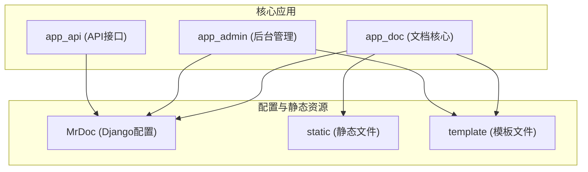
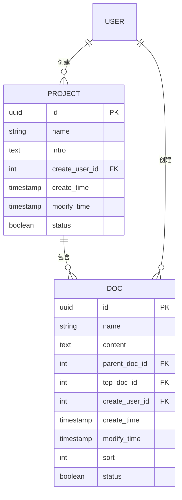
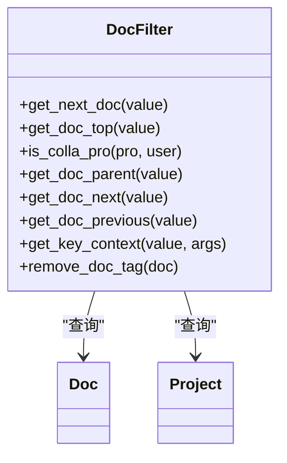
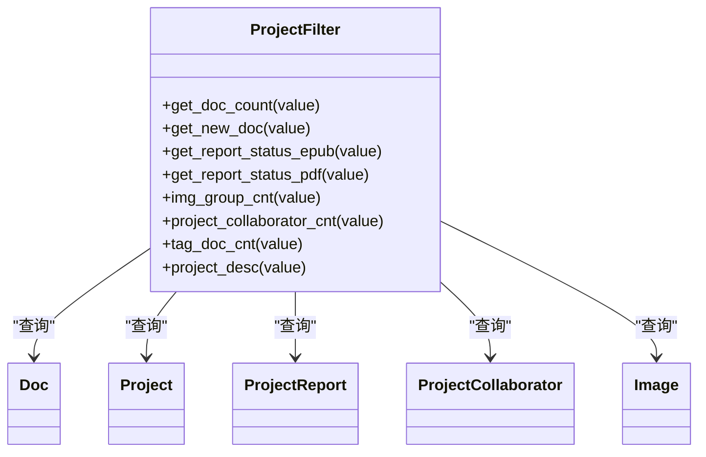
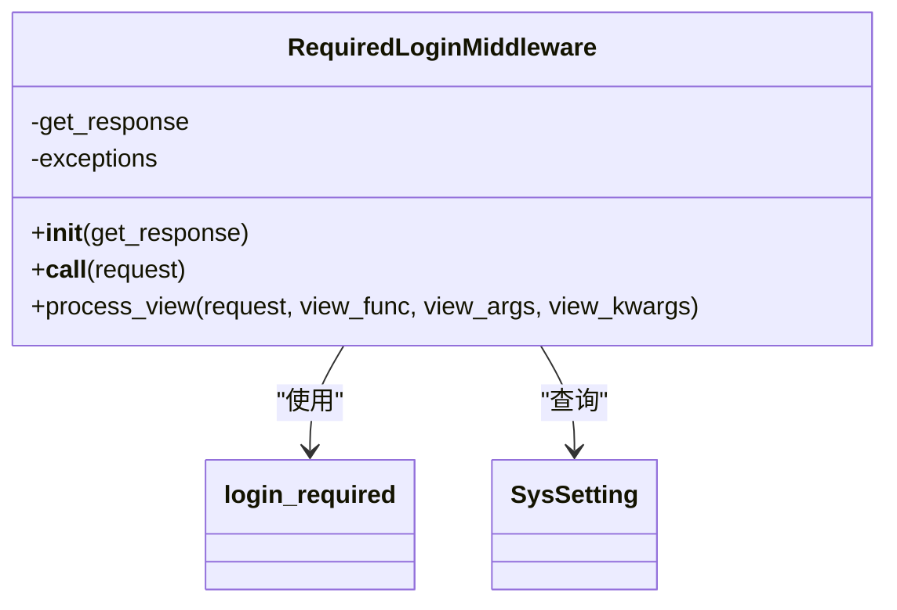
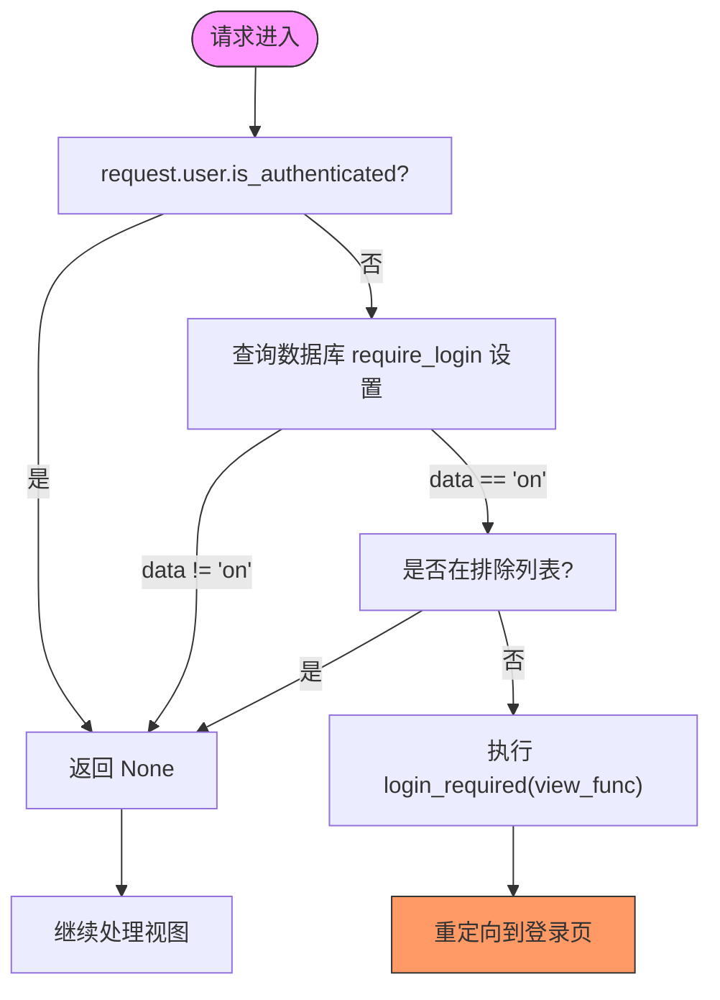
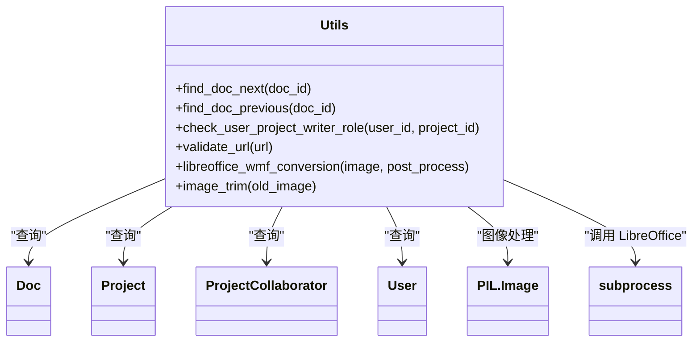
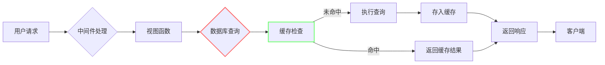

# 扩展开发

<cite>
**本文档中引用的文件**  
- [doc_filter.py](file://app_doc/templatetags/doc_filter.py)
- [project_filter.py](file://app_doc/templatetags/project_filter.py)
- [require_login_middleware.py](file://app_admin/middleware/require_login_middleware.py)
- [utils.py](file://app_doc/utils.py)
- [settings.py](file://MrDoc/settings.py)
</cite>

## 目录
1. [引言](#引言)  
2. [项目结构分析](#项目结构分析)  
3. [核心组件分析](#核心组件分析)  
4. [自定义模板标签扩展](#自定义模板标签扩展)  
5. [中间件扩展机制](#中间件扩展机制)  
6. [工具函数设计与扩展](#工具函数设计与扩展)  
7. [第三方服务集成示例](#第三方服务集成示例)  
8. [安全与性能考量](#安全与性能考量)  
9. [结论](#结论)

## 引言

MrDoc 是一个基于 Django 框架的文档管理系统，支持文档协作、版本管理、富文本编辑等功能。本文档旨在为开发者提供一份详尽的扩展开发指南，重点介绍如何通过自定义模板标签、中间件和工具函数来增强 MrDoc 的功能。我们将深入分析 `templatetags/` 目录下的 `doc_filter.py` 和 `project_filter.py` 的实现机制，解析 `require_login_middleware.py` 中间件的工作原理，并探讨 `utils.py` 中工具函数的设计模式。同时，本文还将提供集成第三方服务（如云存储、邮件服务）的具体代码示例，并讨论扩展过程中的安全性和性能影响。

## 项目结构分析

MrDoc 的项目结构遵循典型的 Django 应用组织方式，主要模块包括 `app_admin`、`app_api` 和 `app_doc`，分别负责后台管理、API 接口和文档核心功能。



**图示来源**  
- [项目结构](file://#L1-L200)

**本节来源**  
- [项目结构](file://#L1-L200)

## 核心组件分析

MrDoc 的核心功能围绕文档（Doc）和文集（Project）展开，通过 Django 模型进行数据建模，并利用模板系统和中间件实现业务逻辑控制。

### 文档与文集模型关系



**图示来源**  
- [models.py](file://app_doc/models.py#L1-L100)

**本节来源**  
- [models.py](file://app_doc/models.py#L1-L100)

## 自定义模板标签扩展

Django 模板系统允许开发者通过自定义模板标签来扩展模板功能。MrDoc 在 `app_doc/templatetags/` 目录下实现了多个实用的过滤器，用于在前端动态生成内容。

### doc_filter.py 实现机制

`doc_filter.py` 提供了与文档相关的模板过滤器，主要功能包括获取子文档、上下篇文档、关键词上下文等。

#### 主要过滤器功能说明

| 过滤器名称 | 功能描述 |
|----------|--------|
| `get_next_doc` | 获取指定文档的直接子文档列表 |
| `get_doc_top` | 获取文档所属的文集对象 |
| `is_colla_pro` | 判断用户是否为文集创建者，返回“【协作】”标识 |
| `get_doc_parent` | 获取文档的上级文档对象 |
| `get_doc_next` | 获取当前文档的下一篇文档 ID |
| `get_doc_previous` | 获取当前文档的上一篇文档 ID |
| `get_key_context` | 搜索内容中的关键词并返回上下文片段 |
| `remove_doc_tag` | 去除文档内容中的 HTML 标签并截取前 300 字符 |



**图示来源**  
- [doc_filter.py](file://app_doc/templatetags/doc_filter.py#L1-L183)

**本节来源**  
- [doc_filter.py](file://app_doc/templatetags/doc_filter.py#L1-L183)

### project_filter.py 实现机制

`project_filter.py` 提供了与文集相关的模板过滤器，用于展示文集统计信息和状态。

#### 主要过滤器功能说明

| 过滤器名称 | 功能描述 |
|----------|--------|
| `get_doc_count` | 获取文集下的文档总数 |
| `get_new_doc` | 获取文集中最近修改的 3 篇文档 |
| `report_status_epub` | 获取文集的 EPUB 导出权限状态 |
| `report_status_pdf` | 获取文集的 PDF 导出权限状态 |
| `img_group_cnt` | 获取图片分组中的图片数量 |
| `project_collaborator_cnt` | 获取文集的协作用户数量 |
| `tag_doc_cnt` | 获取标签关联的文档数量（函数名错误，应为 `get_tag_doc_cnt`） |
| `project_desc` | 获取文集简介的纯文本摘要 |



**图示来源**  
- [project_filter.py](file://app_doc/templatetags/project_filter.py#L1-L68)

**本节来源**  
- [project_filter.py](file://app_doc/templatetags/project_filter.py#L1-L68)

### 创建新的模板过滤器

要创建新的模板过滤器，请遵循以下步骤：

1. 在 `app_doc/templatetags/` 目录下创建新的 Python 文件（如 `custom_filters.py`）。
2. 导入必要的模块并注册模板库：

```python
from django import template
from app_doc.models import Doc, Project

register = template.Library()
```

3. 使用 `@register.filter` 装饰器定义过滤器函数：

```python
@register.filter(name='get_doc_breadcrumb')
def get_doc_breadcrumb(doc_id):
    """
    获取文档的面包屑路径
    """
    try:
        doc = Doc.objects.get(id=doc_id)
        path = []
        while doc:
            path.insert(0, {'id': doc.id, 'name': doc.name})
            if doc.parent_doc == 0:
                break
            doc = Doc.objects.get(id=doc.parent_doc)
        return path
    except Doc.DoesNotExist:
        return []
```

4. 在 `settings.py` 的 `TEMPLATES.OPTIONS.libraries` 中注册新标签库：

```python
'libraries': {
    'doc_filter': 'app_doc.templatetags.doc_filter',
    'project_filter': 'app_doc.templatetags.project_filter',
    'custom_filters': 'app_doc.templatetags.custom_filters',  # 新增
}
```

5. 在模板中使用：

```django


    <a href="/doc/{{ item.id }}/">{{ item.name }}</a>

```

## 中间件扩展机制

中间件是 Django 处理请求和响应的钩子框架，MrDoc 使用自定义中间件来实现全局功能控制。

### require_login_middleware.py 工作原理

`require_login_middleware.py` 实现了一个强制登录中间件，用于控制是否所有页面都需要用户登录才能访问。

#### 类结构与流程



#### 执行流程图



**图示来源**  
- [require_login_middleware.py](file://app_admin/middleware/require_login_middleware.py#L1-L60)

**本节来源**  
- [require_login_middleware.py](file://app_admin/middleware/require_login_middleware.py#L1-L60)

### 创建自定义中间件

要创建自定义中间件以实现特定业务逻辑，请遵循以下模式：

```python
class CustomBusinessMiddleware:
    def __init__(self, get_response):
        self.get_response = get_response
        # 初始化配置
        self.allowed_ips = ['127.0.0.1', '192.168.1.1']

    def __call__(self, request):
        # 在视图执行前处理请求
        client_ip = self.get_client_ip(request)
        if client_ip not in self.allowed_ips:
            return JsonResponse({'error': 'IP not allowed'}, status=403)
            
        response = self.get_response(request)
        
        # 在响应返回前处理响应
        response['X-Custom-Header'] = 'CustomValue'
        return response

    def process_view(self, request, view_func, view_args, view_kwargs):
        # 在视图函数调用前执行
        pass

    def get_client_ip(self, request):
        x_forwarded_for = request.META.get('HTTP_X_FORWARDED_FOR')
        if x_forwarded_for:
            ip = x_forwarded_for.split(',')[0]
        else:
            ip = request.META.get('REMOTE_ADDR')
        return ip
```

然后在 `settings.py` 的 `MIDDLEWARE` 列表中注册：

```python
MIDDLEWARE = [
    # ... 其他中间件
    'app_admin.middleware.require_login_middleware.RequiredLoginMiddleware',
    'myapp.middleware.CustomBusinessMiddleware',  # 新增
]
```

## 工具函数设计与扩展

`utils.py` 文件包含了 MrDoc 的核心工具函数，采用模块化设计，便于复用和维护。

### 工具函数设计模式



**图示来源**  
- [utils.py](file://app_doc/utils.py#L1-L248)

**本节来源**  
- [utils.py](file://app_doc/utils.py#L1-L248)

### 工具函数功能说明

| 函数名称 | 功能描述 |
|--------|--------|
| `find_doc_next` | 查找文档的下一篇文档（支持递归查找） |
| `find_doc_previous` | 查找文档的上一篇文档（支持递归查找） |
| `check_user_project_writer_role` | 验证用户是否具有文集的协作权限 |
| `validate_url` | 验证 URL 有效性并排除本地地址 |
| `libreoffice_wmf_conversion` | 使用 LibreOffice 将 WMF/EMF 图片转换为 PNG |
| `image_trim` | 裁剪图片空白边缘 |

### 添加新的实用功能

要添加新的工具函数，请在 `utils.py` 中定义函数并确保其具有清晰的职责：

```python
import hashlib
from django.core.cache import cache

def generate_doc_cache_key(doc_id, user_id):
    """
    生成文档缓存键
    """
    key_string = f"doc_{doc_id}_user_{user_id}"
    return hashlib.md5(key_string.encode()).hexdigest()

def get_cached_doc_content(doc_id, user_id, timeout=300):
    """
    从缓存获取文档内容
    """
    cache_key = generate_doc_cache_key(doc_id, user_id)
    content = cache.get(cache_key)
    if content is None:
        try:
            doc = Doc.objects.get(id=doc_id)
            content = doc.content
            cache.set(cache_key, content, timeout)
        except Doc.DoesNotExist:
            content = None
    return content

def invalidate_doc_cache(doc_id):
    """
    失效文档缓存（需遍历所有用户缓存键）
    """
    # 实际应用中可使用缓存组或命名空间
    pass
```

## 第三方服务集成示例

### 集成云存储服务（阿里云 OSS）

```python
from aliyunsdkcore.client import AcsClient
from aliyunsdkoss.request.v20190517 import PutObjectRequest
import base64

class AliyunOSSStorage:
    def __init__(self, access_key_id, access_key_secret, endpoint, bucket):
        self.client = AcsClient(access_key_id, access_key_secret, 'cn-hangzhou')
        self.endpoint = endpoint
        self.bucket = bucket

    def upload_image(self, image_file, object_name):
        request = PutObjectRequest.PutObjectRequest()
        request.set_BucketName(self.bucket)
        request.set_ObjectName(object_name)
        
        # 读取文件内容
        image_data = image_file.read()
        request.set_Content(base64.b64encode(image_data))
        
        response = self.client.do_action_with_exception(request)
        return f"https://{self.bucket}.{self.endpoint}/{object_name}"

# 在视图中使用
def upload_to_oss(request):
    if request.method == 'POST' and request.FILES.get('image'):
        image_file = request.FILES['image']
        oss = AliyunOSSStorage(
            access_key_id='your-access-key',
            access_key_secret='your-secret',
            endpoint='oss-cn-hangzhou.aliyuncs.com',
            bucket='mrdoc-images'
        )
        url = oss.upload_image(image_file, f"uploads/{image_file.name}")
        return JsonResponse({'url': url})
    return JsonResponse({'error': 'Invalid request'}, status=400)
```

### 集成邮件服务（SMTP）

```python
from django.core.mail import send_mail
from django.conf import settings

def send_collaboration_invite(project, email, inviter):
    subject = f'{inviter.username} 邀请您协作编辑文集：{project.name}'
    message = f'''
    您好！

    {inviter.username} 邀请您参与文集 "{project.name}" 的协作编辑。

    请点击以下链接加入协作：
    {settings.SITE_URL}/project/{project.id}/

    此邮件由 MrDoc 系统自动发送，请勿直接回复。
    '''
    
    recipient_list = [email]
    send_mail(
        subject=subject,
        message=message,
        from_email=settings.DEFAULT_FROM_EMAIL,
        recipient_list=recipient_list,
        fail_silently=False,
    )
```

## 安全与性能考量

### 安全考虑

1. **输入验证**：所有用户输入必须进行验证，防止 XSS 和 SQL 注入。
2. **权限控制**：使用 `@login_required` 和自定义装饰器确保功能访问权限。
3. **CSRF 保护**：确保表单提交包含 CSRF token。
4. **敏感信息**：API 密钥等敏感信息应存储在环境变量中，而非代码内。
5. **文件上传**：限制上传文件类型和大小，防止恶意文件上传。

### 性能影响

1. **数据库查询**：避免在循环中进行数据库查询，使用 `select_related` 和 `prefetch_related` 优化。
2. **缓存机制**：对频繁访问但不常变更的数据使用缓存（如 Redis）。
3. **异步任务**：耗时操作（如文档导出、邮件发送）应使用 Celery 等异步任务队列。
4. **静态资源**：使用 CDN 加速静态资源加载。
5. **中间件开销**：避免在中间件中执行耗时操作，影响所有请求性能。



**图示来源**  
- [utils.py](file://app_doc/utils.py#L1-L248)
- [require_login_middleware.py](file://app_admin/middleware/require_login_middleware.py#L1-L60)

**本节来源**  
- [utils.py](file://app_doc/utils.py#L1-L248)
- [require_login_middleware.py](file://app_admin/middleware/require_login_middleware.py#L1-L60)

## 结论

本文档详细介绍了 MrDoc 的扩展开发机制，涵盖了自定义模板标签、中间件和工具函数的实现原理与扩展方法。通过分析 `doc_filter.py`、`project_filter.py` 和 `require_login_middleware.py` 的源码，我们掌握了如何在不修改核心代码的前提下增强系统功能。同时，本文提供了第三方服务集成的实用示例，并强调了扩展开发中的安全性和性能考量。开发者应遵循模块化、高内聚低耦合的设计原则，充分利用 Django 提供的扩展机制，安全高效地实现业务需求。