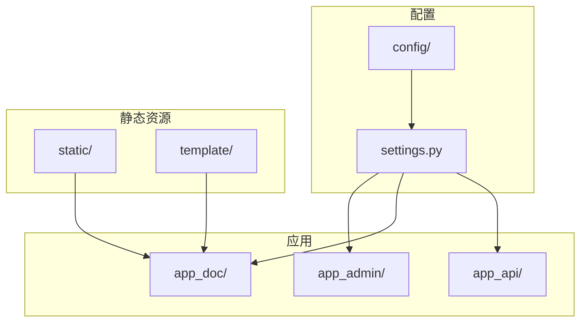
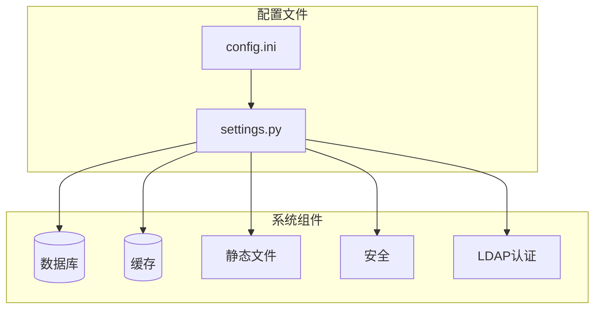
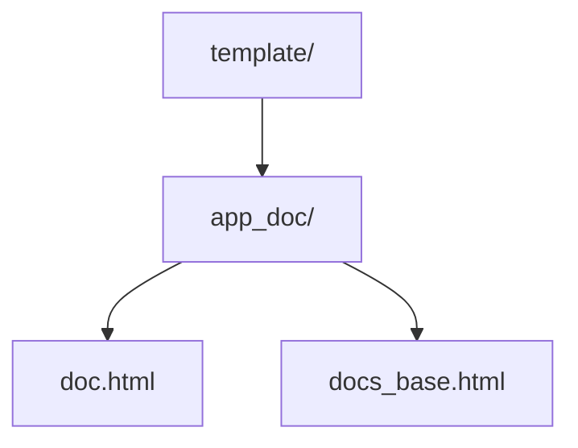
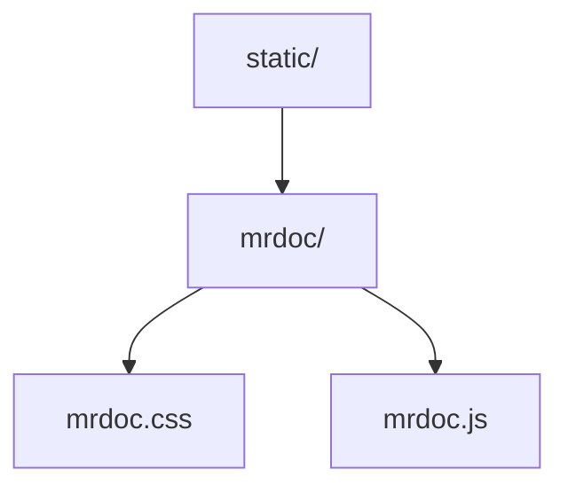
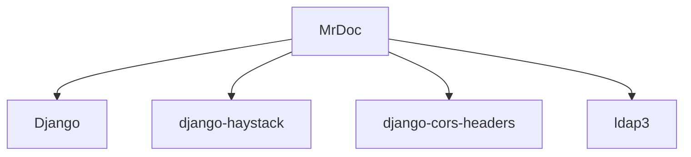

# 配置与定制

<cite>
**本文档引用的文件**   
- [settings.py](file://MrDoc/settings.py) - *已更新数据库配置*
- [config.ini](file://config/config.ini) - *已更新为MySQL配置和LDAP配置*
- [admin.css](file://static/PearAdminLayui/admin/css/admin.css)
- [mrdoc.css](file://static/mrdoc/mrdoc.css)
- [doc.html](file://template/app_doc/doc.html)
- [docs_base.html](file://template/app_doc/docs_base.html)
- [ldap_backend.py](file://app_admin/ldap_backend.py) - *新增LDAP认证后端实现*
- [ldap_login.html](file://template/ldap_login.html) - *新增LDAP登录模板*
- [views.py](file://app_admin/views.py) - *新增LDAP登录视图*
</cite>

## 更新摘要
**已做更改**   
- 新增LDAP认证配置部分，详细说明`config.ini`中的LDAP配置项
- 添加LDAP认证后端实现说明，包括`app_admin/ldap_backend.py`文件分析
- 增加LDAP登录视图和模板说明，包括`app_admin/views.py`和`template/ldap_login.html`
- 更新了认证后端配置，反映`settings.py`中新增的LDAP认证后端
- 所有文件引用均已更新以反映最新代码状态
- 修正了架构图以反映新的认证流程

## 目录
1. [简介](#简介)
2. [项目结构](#项目结构)
3. [核心组件](#核心组件)
4. [架构概览](#架构概览)
5. [详细组件分析](#详细组件分析)
6. [依赖分析](#依赖分析)
7. [性能考虑](#性能考虑)
8. [故障排除指南](#故障排除指南)
9. [结论](#结论)

## 简介
本文档旨在为MrDoc系统提供全面的配置与定制指南。文档详细介绍了通过配置文件和代码对系统进行定制的方法，包括`settings.py`中的可配置参数、`config.ini`文件的结构和用途、前端模板的修改、CSS/JS文件的定制以及主题定制的指导。目标是帮助用户根据自身需求调整系统行为和外观。

## 项目结构
MrDoc项目采用典型的Django项目结构，主要分为以下几个部分：
- `MrDoc/`：Django项目的核心配置目录，包含`settings.py`、`urls.py`等核心配置文件。
- `app_admin/`、`app_doc/`、`app_api/`：Django应用目录，分别负责管理、文档和API功能。
- `config/`：配置文件目录，包含`config.ini`和`uwsgi.ini`。
- `static/`：静态文件目录，包含CSS、JavaScript、图片等前端资源。
- `template/`：模板文件目录，包含HTML模板文件。



**Section sources**
- [settings.py](file://MrDoc/settings.py#L1-L50)
- [config.ini](file://config/config.ini#L1-L10)

## 核心组件
MrDoc系统的核心组件包括配置管理、数据库连接、静态文件处理、安全配置等。这些组件通过`settings.py`和`config.ini`文件进行配置，确保系统的灵活性和可定制性。

**Section sources**
- [settings.py](file://MrDoc/settings.py#L25-L100)
- [config.ini](file://config/config.ini#L1-L10)

## 架构概览
MrDoc系统采用Django框架的标准架构，通过配置文件分离环境相关的设置，确保开发、测试和生产环境的一致性。系统通过`settings.py`读取`config.ini`文件中的配置，动态调整数据库、缓存、安全等设置。



**Diagram sources**
- [settings.py](file://MrDoc/settings.py#L10-L50)
- [config.ini](file://config/config.ini#L1-L10)

## 详细组件分析

### 配置文件分析
`settings.py`是Django项目的核心配置文件，通过读取`config.ini`文件中的配置，动态调整系统行为。`config.ini`文件采用INI格式，分为多个节（section），每个节包含多个键值对。

#### settings.py 配置分析
`settings.py`文件通过`ConfigParser`读取`config.ini`文件，根据配置动态调整数据库、缓存、安全等设置。数据库配置根据`config.ini`中的`engine`字段选择不同的数据库后端。当前配置已更新为MySQL数据库。

```python
db_engine = CONFIG.get('database','engine',fallback='sqlite')
if db_engine == 'sqlite':
    DATABASES = {
        'default': {
            'ENGINE': DATABASE_MAP[db_engine],
            'NAME': os.path.join(CONFIG_DIR, 'db.sqlite3'),
            'OPTIONS':{
                'timeout':20,
            }
        }
    }
else:
    DATABASES = {
        'default': {
            'ENGINE': DATABASE_MAP[CONFIG['database']['engine']],
            'NAME': CONFIG['database']['name'],
            'USER': CONFIG['database']['user'],
            'PASSWORD': CONFIG['database']['password'],
            'HOST': CONFIG['database']['host'],
            'PORT': CONFIG['database']['port'],
        }
    }
```

**Diagram sources**
- [settings.py](file://MrDoc/settings.py#L100-L150)

#### config.ini 配置分析
`config.ini`文件包含多个节，每个节对应不同的配置项。`[database]`节包含MySQL数据库配置，包括主机地址、端口、用户名和密码。`[ldap]`节包含LDAP认证配置，包括服务器地址、绑定DN、密码和用户搜索设置。

```ini
[site]
debug = False

[database]
engine = mysql
name = mrdoc
user = admin
password = lzl660928
host = 192.168.0.21
port = 3306

[ldap]
enable_ldap = true
server_uri = ldap://127.0.0.1:389
bind_dn = cn=admin,dc=example,dc=com
bind_password = adminpassword
user_base_dn = ou=users,dc=example,dc=com
user_search_filter = (uid={username})
user_attr_username = uid
user_attr_email = mail
user_attr_first_name = givenName
user_attr_last_name = sn
```

**Diagram sources**
- [config.ini](file://config/config.ini#L1-L45)

**Section sources**
- [settings.py](file://MrDoc/settings.py#L1-L200)
- [config.ini](file://config/config.ini#L1-L52)

### LDAP认证配置
MrDoc系统支持LDAP认证，通过`config.ini`文件中的`[ldap]`节进行配置。LDAP认证允许用户使用企业目录服务进行身份验证。

#### LDAP配置参数
`[ldap]`节包含以下配置参数：
- `enable_ldap`: 是否启用LDAP认证，`true`表示启用，`false`表示禁用
- `server_uri`: LDAP服务器地址，格式为`ldap://host:port`
- `bind_dn`: 绑定DN，用于连接LDAP服务器进行搜索
- `bind_password`: 绑定密码
- `user_base_dn`: 用户搜索基础DN
- `user_search_filter`: 用户搜索过滤器，`{username}`会被替换为实际的用户名
- `user_attr_username`: 用户名属性映射
- `user_attr_email`: 电子邮件属性映射
- `user_attr_first_name`: 名字属性映射
- `user_attr_last_name`: 姓氏属性映射

**Section sources**
- [config.ini](file://config/config.ini#L30-L52)
- [ldap_backend.py](file://app_admin/ldap_backend.py#L1-L35)

#### LDAP认证后端实现
`app_admin/ldap_backend.py`文件实现了Django的自定义认证后端，用于LDAP用户认证。该后端继承自`BaseBackend`，实现了`authenticate`方法。

```python
class LDAPBackend(BaseBackend):
    """
    LDAP认证后端
    """
    
    def __init__(self):
        """初始化LDAP配置"""
        self.config = ConfigParser()
        config_path = os.path.join(settings.BASE_DIR, 'config', 'config.ini')
        self.config.read(config_path, encoding='utf-8')
        
        # LDAP配置，优先使用环境变量，其次使用配置文件
        self.server_uri = os.getenv('LDAP_SERVER_URI') or self.config.get('ldap', 'server_uri', fallback='ldap://localhost:389')
        self.bind_dn = os.getenv('LDAP_BIND_DN') or self.config.get('ldap', 'bind_dn', fallback='')
        self.bind_password = os.getenv('LDAP_BIND_PASSWORD') or self.config.get('ldap', 'bind_password', fallback='')
        self.user_base_dn = os.getenv('LDAP_USER_BASE_DN') or self.config.get('ldap', 'user_base_dn', fallback='')
        self.user_search_filter = os.getenv('LDAP_USER_SEARCH_FILTER') or self.config.get('ldap', 'user_search_filter', fallback='(uid={username})')
        
        # 用户属性映射
        self.attr_username = os.getenv('LDAP_USER_ATTR_USERNAME') or self.config.get('ldap', 'user_attr_username', fallback='uid')
        self.attr_email = os.getenv('LDAP_USER_ATTR_EMAIL') or self.config.get('ldap', 'user_attr_email', fallback='mail')
        self.attr_first_name = os.getenv('LDAP_USER_ATTR_FIRST_NAME') or self.config.get('ldap', 'user_attr_first_name', fallback='givenName')
        self.attr_last_name = os.getenv('LDAP_USER_ATTR_LAST_NAME') or self.config.get('ldap', 'user_attr_last_name', fallback='sn')
```

**Section sources**
- [ldap_backend.py](file://app_admin/ldap_backend.py#L1-L50)

#### LDAP认证流程
LDAP认证流程包括以下步骤：
1. 检查是否启用LDAP认证
2. 使用管理员账户连接LDAP服务器
3. 搜索用户
4. 使用用户凭据进行认证
5. 获取用户信息
6. 在Django中获取或创建用户

```python
def authenticate(self, request, username=None, password=None, **kwargs):
    """
    LDAP认证方法
    """
    if not username or not password:
        return None
        
    try:
        # 检查是否启用LDAP认证（优先使用环境变量）
        enable_ldap_env = os.getenv('LDAP_ENABLE')
        if enable_ldap_env is not None:
            enable_ldap = enable_ldap_env.lower() in ('true', '1', 'yes', 'on')
        else:
            enable_ldap = self.config.getboolean('ldap', 'enable_ldap', fallback=False)
            
        if not enable_ldap:
            return None
            
        # 创建LDAP服务器连接
        server = ldap3.Server(self.server_uri, get_info=ldap3.ALL)
        
        # 使用管理员账户连接LDAP进行用户搜索
        conn = ldap3.Connection(server, self.bind_dn, self.bind_password, auto_bind=True)
        
        # 搜索用户
        search_filter = self.user_search_filter.format(username=username)
        conn.search(
            self.user_base_dn,
            search_filter,
            attributes=[self.attr_username, self.attr_email, 
                       self.attr_first_name, self.attr_last_name]
        )
        
        if not conn.entries:
            logger.info(f"LDAP用户 {username} 不存在")
            return None
            
        # 获取用户DN
        user_entry = conn.entries[0]
        user_dn = user_entry.entry_dn
        
        # 关闭管理员连接
        conn.unbind()
        
        # 使用用户凭据进行认证
        user_conn = ldap3.Connection(server, user_dn, password)
        
        if not user_conn.bind():
            logger.info(f"LDAP用户 {username} 密码错误")
            return None
            
        # 认证成功，获取用户信息
        user_info = {
            'username': username,
            'email': getattr(user_entry, self.attr_email, [username + '@example.com'])[0] if hasattr(user_entry, self.attr_email) else username + '@example.com',
            'first_name': getattr(user_entry, self.attr_first_name, [''])[0] if hasattr(user_entry, self.attr_first_name) else '',
            'last_name': getattr(user_entry, self.attr_last_name, [''])[0] if hasattr(user_entry, self.attr_last_name) else ''
        }
        
        # 关闭用户连接
        user_conn.unbind()
        
        # 获取或创建Django用户
        user = self.get_or_create_user(user_info)
        
        logger.info(f"LDAP用户 {username} 认证成功")
        return user
        
    except Exception as e:
        logger.error(f"LDAP认证失败: {e}")
        return None
```

**Section sources**
- [ldap_backend.py](file://app_admin/ldap_backend.py#L50-L150)

#### LDAP登录视图
`app_admin/views.py`文件中的`ldap_login`函数实现了LDAP登录视图，处理LDAP登录请求。

```python
@logger.catch()
def ldap_login(request):
    """LDAP登录视图函数"""
    from app_admin.ldap_backend import LDAPBackend
    from configparser import ConfigParser
    import os
    
    # 读取LDAP配置
    config = ConfigParser()
    config_path = os.path.join(os.path.dirname(os.path.dirname(os.path.abspath(__file__))), 'config', 'config.ini')
    config.read(config_path, encoding='utf-8')
    
    # 检查LDAP是否启用
    enable_ldap = config.getboolean('ldap', 'enable_ldap', fallback=False)
    if not enable_ldap:
        errormsg = _('LDAP认证未启用，请联系管理员！')
        return render(request, 'ldap_login.html', locals())
    
    to = request.GET.get('next', '/')
    safe_to = is_internal_path(to)
    if safe_to is False:
        to = '/'
        
    if request.method == 'GET':
        # 登录用户访问登录页面自动跳转到首页
        if request.user.is_authenticated:
            return redirect(to)
        else:
            return render(request, 'ldap_login.html', locals())
            
    elif request.method == 'POST':
        try:
            username = request.POST.get('username', '')
            password = request.POST.get('password', '')
            
            if not username or not password:
                errormsg = _('用户名或密码未输入！')
                return render(request, 'ldap_login.html', locals())
                
            # 验证登录次数（防止暴力破解）
            if 'LDAPLoginLock' not in request.session.keys():
                request.session['LDAPLoginNum'] = 1
                request.session['LDAPLoginLock'] = False
                request.session['LDAPLoginTime'] = datetime.datetime.now().timestamp()
                
            verify_num = request.session['LDAPLoginNum']
            if verify_num > 5:
                request.session['LDAPLoginLock'] = True
                request.session['LDAPLoginTime'] = (datetime.datetime.now() + datetime.timedelta(minutes=10)).timestamp()
                
            verify_lock = request.session['LDAPLoginLock']
            verify_time = request.session['LDAPLoginTime']
            
            if verify_lock is True and datetime.datetime.now().timestamp() < verify_time:
                errormsg = _("操作过于频繁，请10分钟后再试！")
                request.session['LDAPLoginNum'] = 0
                return render(request, 'ldap_login.html', locals())
            
            # 使用LDAP后端进行认证
            ldap_backend = LDAPBackend()
            user = ldap_backend.authenticate(request, username=username, password=password)
            
            if user is None:
                errormsg = _('LDAP用户名或密码错误！')
                request.session['LDAPLoginNum'] += 1
                return render(request, 'ldap_login.html', locals())
                
            if user.is_active:
                # 使用Django的login函数登录用户
                from django.contrib.auth import login
                login(request, user, backend='app_admin.ldap_backend.LDAPBackend')
                
                # 重置登录计数器
                request.session['LDAPLoginNum'] = 0
                request.session['LDAPLoginLock'] = False
                request.session['LDAPLoginTime'] = datetime.datetime.now().timestamp()
                
                logger.info(f"LDAP用户 {username} 登录成功")
                return redirect(to)
            else:
                errormsg = _('用户被禁用！')
                return render(request, 'ldap_login.html', locals())
                
        except Exception as e:
            logger.exception("LDAP登录异常")
            errormsg = _('LDAP登录失败，请检查配置或联系管理员！')
            return render(request, 'ldap_login.html', locals())
```

**Section sources**
- [views.py](file://app_admin/views.py#L243-L331)

#### LDAP登录模板
`template/ldap_login.html`文件是LDAP登录页面的模板，提供LDAP用户登录界面。

```html


<!DOCTYPE html>
<html lang='zh-CN'>
<head>
    <meta charset="UTF-8">
    <meta http-equiv="X-UA-Compatible" content="IE=Edge，chrome=1">
    <meta http-equiv="Cache-Control" content="no-transform" />
    <meta http-equiv="Cache-Control" content="no-siteapp" />
    <meta http-equiv="Cache-Control" content="max-age=7200" />
    <meta name="viewport" content="width=device-width, initial-scale=1, maximum-scale=1">
	<title>LDAP登录 - {{site_name}} </title>
	<meta charset="utf-8" />
    <meta name="viewport" content="width=device-width, initial-scale=1" />
	<link rel="stylesheet" href="" crossorigin="anonymous">
    <link rel="icon" href="" sizes="192x192" />
    <style>
        body{
            background-color: #fafafa;
            text-align: center;
        }
        .container{
            display: flex;
            display: -webkit-flex;
            justify-content: center;
            align-items: center;
        }
        .login-form{
            margin-top: 8%;
            padding: 20px 50px 20px 60px;
            background-color: #fff;
            -webkit-box-shadow: #666 0px 0px 10px;
           -moz-box-shadow: #666 0px 0px 10px;
           box-shadow: #666 0px 0px 10px;
        }
        .register-link{
            font-size: 12px;
        }
        button.layui-btn-normal{
            background-color: #2176ff !important;
        }
        button.layui-btn-warm{
            background-color: #FF5722 !important;
        }
        /* 移动端输入框样式 */
        @media screen and (max-width: 450px){
            .layui-form-item .layui-input-inline {
                display: block;
                float: none;
                left: -3px;
                width: auto;
                margin: 0;
            }
        }
        h3,h3 a{
            color: #666;
        }
    </style>
</head>
<body background="" style="background-repeat: no-repeat;background-size: cover;min-height: 100vh;">
    <div class="container">
        <div></div>
        <div></div>
        <div class="login-form">
            <form class="layui-form" action=""  method='POST'>
                
                <div class="layui-form-item">
                    
                    <h3><strong>LDAP登录 - <a href="/">{{site_name}} </a></strong></h3>
                </div>
                <span style='color:red;margin-bottom: 10px;'>{{ errormsg }}</span>
                <div class="layui-form-item">
                    <div class="layui-input-inline login-input">
                      <input type="text" name="username" required  lay-verify="required" placeholder="请输入LDAP用户名" autocomplete="off" class="layui-input" value="{{username}}">
                    </div>
                </div>
                <div class="layui-form-item">
                    <div class="layui-input-inline login-input">
                      <input type="password" name="password" required  lay-verify="required" placeholder="请输入LDAP密码" autocomplete="off" class="layui-input">
                    </div>
                </div>
                <div class="layui-form-item">
                    <div class="layui-input-inline login-input">
                        <button class="layui-btn layui-btn-fluid layui-btn-radius layui-btn-warm" lay-submit lay-filter="ldapFormDemo" type="submit">LDAP登录</button>
                    </div>
                </div>
                <div class="layui-form-item">
                    <div class="layui-input-inline login-input">
                        <a href="" class="layui-btn layui-btn-fluid layui-btn-radius layui-btn-normal" style="text-decoration: none; color: white; text-align: center; display: block;">返回普通登录</a>
                    </div>
                </div>
                <a href="" class="register-link"></a>
                <hr>
                <span style="font-size: 12px;color: #666;">觅思文档 - 私有云知识库部署方案</span>
                
                <br>
                <a style="font-size: 12px;color: #666;" href="http://beian.miit.gov.cn/" target="_blank">{{beian_code}}</a>
                
            </form>
        </div>
    </div>

    <!-- LayUI JavaScript -->
    <script src="" crossorigin="anonymous"></script>
    <script>
        layui.use('form', function(){
            var form = layui.form;
            
            //监听提交
            form.on('submit(ldapFormDemo)', function(data){
                // 这里可以添加表单提交前的验证逻辑
                return true; // 允许表单提交
            });
        });
    </script>
</body>
</html>
```

**Section sources**
- [ldap_login.html](file://template/ldap_login.html#L1-L116)

### 前端模板定制
通过修改`template/`目录下的HTML模板文件，可以定制前端界面。例如，`template/app_doc/doc.html`文件控制文档页面的布局和样式。

#### 模板文件结构
`template/`目录下的文件按应用组织，每个应用有自己的模板目录。例如，`app_doc/`目录包含文档相关的模板文件。



**Diagram sources**
- [doc.html](file://template/app_doc/doc.html#L1-L10)
- [docs_base.html](file://template/app_doc/docs_base.html#L1-L10)

### CSS/JS 文件定制
通过修改`static/`目录下的CSS和JavaScript文件，可以定制用户界面的样式和行为。例如，`static/mrdoc/mrdoc.css`文件包含文档页面的样式定义。

#### 静态文件结构
`static/`目录下的文件按组件组织，每个组件有自己的CSS和JavaScript文件。例如，`mrdoc/`目录包含文档相关的静态文件。



**Diagram sources**
- [mrdoc.css](file://static/mrdoc/mrdoc.css#L1-L10)
- [mrdoc.js](file://static/mrdoc/mrdoc.js#L1-L10)

### 主题定制
通过修改CSS文件中的颜色和布局定义，可以定制系统的主题。例如，修改`static/PearAdminLayui/admin/css/admin.css`文件中的颜色变量，可以改变管理界面的配色方案。

#### 主题定制示例
```css
:root {
    --primary-color: #007bff;
    --secondary-color: #6c757d;
}
```

**Section sources**
- [admin.css](file://static/PearAdminLayui/admin/css/admin.css#L1-L10)

## 依赖分析
MrDoc系统依赖于Django框架和多个第三方库，如`django-haystack`用于全文搜索，`django-cors-headers`用于跨域请求处理。这些依赖通过`requirements.txt`文件管理。



**Diagram sources**
- [requirements.txt](file://requirements.txt#L1-L10)

**Section sources**
- [requirements.txt](file://requirements.txt#L1-L10)

## 性能考虑
在配置和定制过程中，应注意性能影响。例如，启用调试模式会显著降低系统性能，应仅在开发环境中使用。此外，静态文件的压缩和缓存可以显著提高页面加载速度。使用MySQL数据库相比SQLite在高并发场景下具有更好的性能表现。

## 故障排除指南
在配置和定制过程中，可能会遇到各种问题。以下是一些常见问题及其解决方案：
- **配置文件未生效**：检查`settings.py`中是否正确读取了`config.ini`文件。
- **静态文件无法加载**：检查`STATIC_URL`和`STATIC_ROOT`配置是否正确。
- **数据库连接失败**：检查`config.ini`中的数据库配置是否正确，特别是主机地址、端口、用户名和密码。
- **MySQL连接问题**：确保MySQL服务器正在运行，防火墙允许相应端口通信，并且用户具有正确的权限。
- **LDAP认证失败**：检查`config.ini`中的LDAP配置是否正确，特别是服务器地址、绑定DN、密码和用户搜索设置。确保LDAP服务器正在运行，网络连接正常。

**Section sources**
- [settings.py](file://MrDoc/settings.py#L1-L50)
- [config.ini](file://config/config.ini#L1-L10)

## 结论
通过本文档的指导，用户可以全面了解MrDoc系统的配置与定制方法。通过合理配置`settings.py`和`config.ini`文件，修改前端模板和静态文件，用户可以根据自身需求灵活调整系统行为和外观。特别需要注意的是，系统现已配置为使用MySQL数据库和LDAP认证，需要确保数据库服务器和LDAP服务器正确配置和连接。