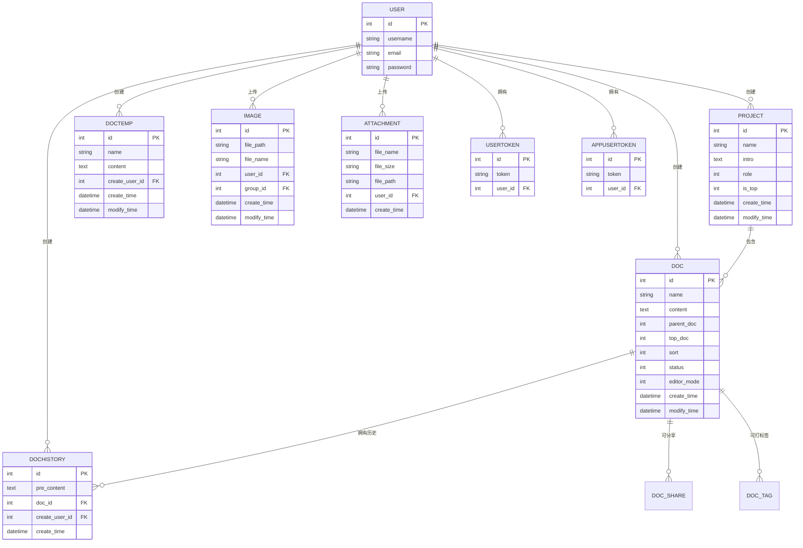

# 项目架构

<cite>
**本文档引用的文件**   
- [MrDoc/settings.py](file://MrDoc/settings.py)
- [MrDoc/urls.py](file://MrDoc/urls.py)
- [app_admin/models.py](file://app_admin/models.py)
- [app_doc/models.py](file://app_doc/models.py)
- [app_api/models.py](file://app_api/models.py)
- [app_admin/urls.py](file://app_admin/urls.py)
- [app_doc/urls.py](file://app_doc/urls.py)
- [app_api/urls.py](file://app_api/urls.py)
</cite>

## 目录
1. [简介](#简介)
2. [项目结构](#项目结构)
3. [Django MTV 架构设计](#django-mtv-架构设计)
4. [应用职责划分](#应用职责划分)
5. [URL 路由系统](#url-路由系统)
6. [核心配置分析](#核心配置分析)
7. [系统上下文与数据流](#系统上下文与数据流)
8. [架构决策与权衡](#架构决策与权衡)
9. [可扩展性与模块化](#可扩展性与模块化)

## 简介
`MrDoc` 是一个基于 `Python` 和 `Django` 框架构建的在线文档系统，旨在为个人和中小型团队提供私有化部署的云笔记、知识管理和文档协作解决方案。本架构文档深入分析其 Django MTV（Model-Template-View）架构设计，详细阐述项目的整体结构、模块划分、路由机制、配置策略以及系统运行流程。

## 项目结构
`MrDoc` 项目采用典型的 Django 项目布局，以模块化方式组织代码，清晰地分离了不同功能域。项目根目录包含主配置、应用模块、静态资源、模板文件等。

**图示来源**
- [项目结构](file://README-zh.md)

## Django MTV 架构设计
`MrDoc` 严格遵循 Django 的 MTV（Model-Template-View）设计模式，将数据、逻辑和展示层清晰分离。

### Model（模型）
模型层定义了系统的数据结构和业务逻辑。`MrDoc` 的核心数据模型分布在三个主要应用中：

**图示来源**
- [app_admin/models.py](file://app_admin/models.py)
- [app_doc/models.py](file://app_doc/models.py)
- [app_api/models.py](file://app_api/models.py)

### View（视图）
视图层处理用户请求，调用模型获取数据，并将数据传递给模板进行渲染。`MrDoc` 的视图函数分布在 `app_admin`、`app_doc` 和 `app_api` 三个应用中，分别处理后台管理、文档浏览和 API 请求。

### Template（模板）
模板层负责最终的 HTML 页面渲染。`MrDoc` 使用 Django 模板引擎，模板文件位于 `template/` 目录下，按应用组织（`app_admin/`, `app_doc/`, `app_api/`）。模板通过 `` 和 `` 实现复用和继承。

**本节来源**
- [app_admin/models.py](file://app_admin/models.py#L1-L66)
- [app_doc/models.py](file://app_doc/models.py#L1-L269)
- [app_api/models.py](file://app_api/models.py#L1-L25)

## 应用职责划分
`MrDoc` 项目通过三个核心应用实现了清晰的职责分离：

### app_admin（后台管理应用）
负责系统的全局配置和用户管理。
- **核心职责**：用户管理、站点配置、注册邀请码管理、图片/附件管理、系统设置。
- **关键文件**：
  - `models.py`: 定义 `SysSetting`, `UserOptions`, `EmaiVerificationCode`, `RegisterCode` 模型。
  - `views.py`: 实现用户登录、注册、密码修改、管理员后台页面等视图。
  - `urls.py`: 定义 `/admin/` 下的所有管理页面和 API 接口路由。

### app_doc（文档核心应用）
负责文档系统的核心业务逻辑，是项目最主要的功能模块。
- **核心职责**：文集（项目）管理、文档（文章）的创建/编辑/删除/历史版本、文档分享、全文搜索、标签管理、个人中心。
- **关键文件**：
  - `models.py`: 定义 `Project`, `Doc`, `DocHistory`, `Image`, `Attachment`, `DocTag` 等核心数据模型。
  - `views.py`: 实现文集和文档的增删改查、文档对比、文件导出等所有核心业务视图。
  - `urls.py`: 定义了所有文档相关的 URL 路由，如 `/project-<int:pro_id>/doc-<int:doc_id>/`。

### app_api（API 接口应用）
为外部应用（如浏览器扩展、桌面客户端）提供 RESTful API 接口。
- **核心职责**：Token 认证、文集和文档的 API 操作（获取、创建、修改、删除）、图片上传。
- **关键文件**：
  - `models.py`: 定义 `UserToken` 和 `AppUserToken` 模型，用于 API 身份验证。
  - `views.py`: 实现 API 逻辑，通常返回 JSON 数据。
  - `urls.py`: 定义 `/api/` 和 `/api_app/` 开头的 API 路由。

**本节来源**
- [app_admin/models.py](file://app_admin/models.py)
- [app_doc/models.py](file://app_doc/models.py)
- [app_api/models.py](file://app_api/models.py)
- [app_admin/urls.py](file://app_admin/urls.py)
- [app_doc/urls.py](file://app_doc/urls.py)
- [app_api/urls.py](file://app_api/urls.py)

## URL 路由系统
`MrDoc` 的 URL 路由系统采用分层设计，主路由文件 `MrDoc/urls.py` 负责将请求分发到各个应用的子路由。

### 主路由 (MrDoc/urls.py)
主路由文件使用 `include()` 方法将不同前缀的 URL 指向对应应用的 `urls.py` 文件，实现了模块化的路由设计。
- `path('', include('app_doc.urls'))`: 将根路径 `/` 的请求交给 `app_doc` 应用处理，这是文档系统的入口。
- `path('admin/', include('app_admin.urls'))`: 将 `/admin/` 前缀的请求交给 `app_admin` 应用处理。
- `path('api/', include('app_api.urls'))`: 将 `/api/` 前缀的请求交给 `app_api` 应用处理。
- `path('api_app/', include('app_api.urls_app'))`: 将 `/api_app/` 前缀的请求交给 `app_api` 应用的另一套路由处理。

### 子路由 (app_xxx/urls.py)
每个应用的 `urls.py` 文件定义了该应用内部更细粒度的路由规则。
- `app_doc/urls.py`: 定义了如 `project-<int:pro_id>/doc-<int:doc_id>/` 这样的复杂路由，用于定位具体的文集和文档。
- `app_admin/urls.py`: 定义了后台管理页面的路由，如 `/admin/user_manage/`。
- `app_api/urls.py`: 定义了 API 接口的路由，如 `/api/get_doc/`。

这种分层路由机制极大地提高了代码的可维护性和可扩展性，新增一个功能模块只需创建新的应用并将其路由 `include` 到主路由中即可。

**图示来源**
- [MrDoc/urls.py](file://MrDoc/urls.py#L1-L64)
- [app_doc/urls.py](file://app_doc/urls.py#L1-L75)
- [app_admin/urls.py](file://app_admin/urls.py#L1-L45)
- [app_api/urls.py](file://app_api/urls.py#L1-L28)

**本节来源**
- [MrDoc/urls.py](file://MrDoc/urls.py#L1-L64)

## 核心配置分析
`MrDoc` 的行为由 `settings.py` 文件和 `config/config.ini` 配置文件共同控制。

### settings.py 关键配置
- **`INSTALLED_APPS`**: 注册了所有启用的应用，包括 Django 内置应用和 `app_admin`, `app_doc`, `app_api` 三个核心应用。
- **`MIDDLEWARE`**: 定义了请求处理的中间件链。`app_admin.middleware.require_login_middleware.RequiredLoginMiddleware` 是一个自定义中间件，用于实现全站强制登录功能。
- **`DATABASES`**: 数据库配置。项目通过 `config.ini` 文件动态读取数据库类型（SQLite, MySQL, PostgreSQL 等）和连接信息。
- **`CACHES`**: 缓存配置。支持多种后端（如 Redis, Memcached），用于提升系统性能。
- **`TEMPLATES`**: 模板配置。指定了模板目录 `template/`，并注册了自定义的模板标签 `doc_filter` 和 `project_filter`。
- **`HAYSTACK_CONNECTIONS`**: 全文搜索配置。使用 `Whoosh` 引擎，并指定了索引文件的存储路径。
- **`STATIC_URL` 和 `MEDIA_URL`**: 分别定义了静态文件（CSS, JS, 图片）和用户上传的媒体文件的 URL 前缀。

### config.ini 配置文件
`config.ini` 是一个外部配置文件，允许在不修改代码的情况下调整系统行为。`settings.py` 通过 `ConfigParser` 读取此文件。
- **`[site]`**: 包含 `debug` 开关，控制是否开启调试模式。
- **`[database]`**: 包含数据库的 `engine`, `name`, `user`, `password`, `host`, `port` 等连接信息。
- **`[cache]`**: 包含缓存后端的 `backend` 和 `location`。
- **`[locale]`**: 包含语言 `language` 和时区 `timezone` 设置。
- **`[cors_origin]`**: 包含跨域请求的白名单 `allow`。

这种将敏感信息和可变配置分离到外部文件的做法，符合安全最佳实践，也便于在不同环境（开发、测试、生产）间切换配置。

**本节来源**
- [MrDoc/settings.py](file://MrDoc/settings.py#L1-L339)

## 系统上下文与数据流
下图展示了用户请求在 `MrDoc` 系统中的完整数据流路径。

**图示来源**
- [MrDoc/urls.py](file://MrDoc/urls.py#L1-L64)
- [app_doc/urls.py](file://app_doc/urls.py#L1-L75)
- [app_doc/views.py](file://app_doc/views.py)
- [app_doc/models.py](file://app_doc/models.py)
- [template/app_doc/doc.html](file://template/app_doc/doc.html)

## 架构决策与权衡
`MrDoc` 采用了单体（Monolithic）架构而非微服务架构，这是一个经过深思熟虑的决策。

### 选择单体架构的原因
1.  **开发与维护成本低**：对于一个功能相对集中（文档管理）的系统，单体架构的代码库更易于开发、测试和部署。所有代码都在一个项目中，调试和问题追踪更加直接。
2.  **性能开销小**：服务间通信（如 HTTP 调用）在单体架构中是进程内调用，速度远快于微服务间的网络通信，减少了延迟。
3.  **数据一致性**：所有模块共享同一个数据库，事务管理简单，数据一致性更容易保证。
4.  **目标用户明确**：`MrDoc` 定位为个人和小型团队的私有化部署方案，对系统的高可用、弹性伸缩要求不高，单体架构完全能满足需求。

### 权衡
- **可扩展性**：当系统规模变得极其庞大时，单体架构可能会成为瓶颈。但 `MrDoc` 通过清晰的模块化设计（app_admin, app_doc, app_api）为未来的拆分预留了可能性。
- **技术栈统一**：整个系统必须使用相同的技术栈，灵活性不如微服务。

总体而言，对于 `MrDoc` 的应用场景，单体架构是更务实和高效的选择。

## 可扩展性与模块化
尽管是单体架构，`MrDoc` 通过良好的模块化设计确保了良好的可扩展性。

### 模块化设计
项目通过 Django 的 `app` 概念实现了功能模块的物理分离。每个 `app` 都是独立的，拥有自己的 `models.py`, `views.py`, `urls.py` 和 `templates/`。

### 添加新功能模块
添加一个新功能（例如“任务管理”）的步骤非常清晰：
1.  使用 `python manage.py startapp app_task` 创建新的应用。
2.  在 `app_task/models.py` 中定义 `Task`, `TaskList` 等数据模型。
3.  在 `app_task/views.py` 中编写处理任务逻辑的视图函数。
4.  在 `app_task/urls.py` 中定义该应用的路由规则。
5.  将新应用添加到 `settings.py` 的 `INSTALLED_APPS` 列表中。
6.  在主路由 `MrDoc/urls.py` 中使用 `include()` 将 `/task/` 前缀的请求指向 `app_task.urls`。
7.  创建相应的模板文件。

这种模式化的开发流程使得 `MrDoc` 能够方便地集成新功能，同时保持代码的整洁和可维护性。