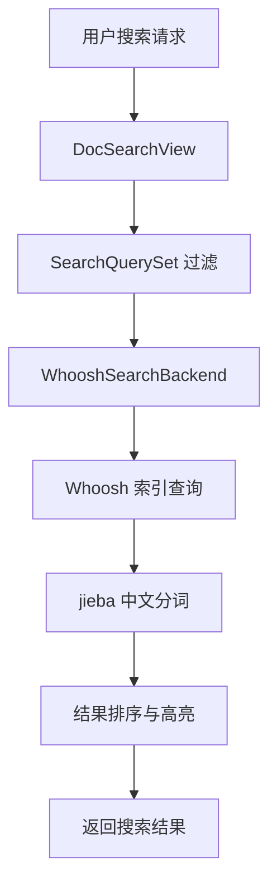
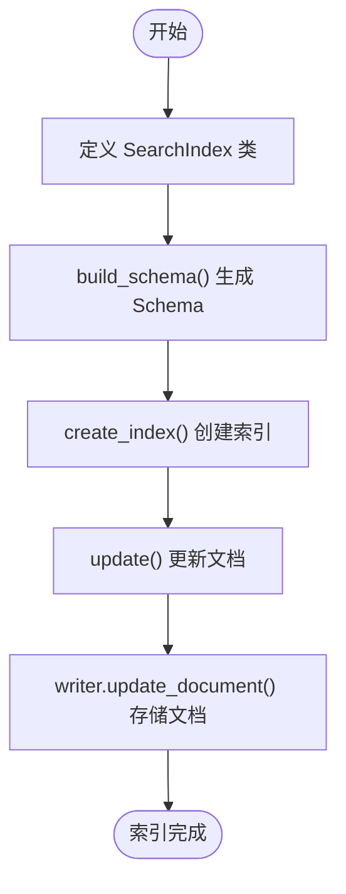
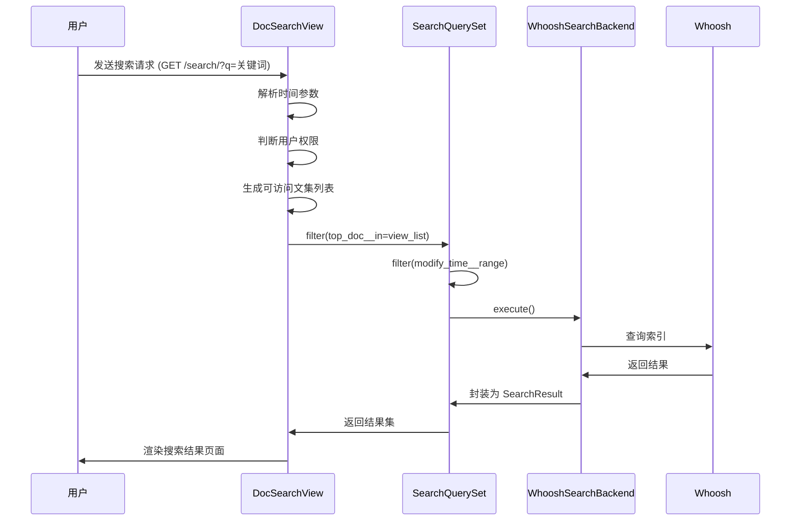

# 搜索功能

<cite>
**本文档引用文件**   
- [chinese_analyzer.py](file://app_doc/search/chinese_analyzer.py)
- [highlight.py](file://app_doc/search/highlight.py)
- [whoosh_cn_backend.py](file://app_doc/search/whoosh_cn_backend.py)
- [search_indexes.py](file://app_doc/search/search_indexes.py)
- [views_search.py](file://app_doc/views_search.py)
</cite>

## 目录
1. [搜索功能](#搜索功能)
2. [全文搜索架构概述](#全文搜索架构概述)
3. [中文分词实现](#中文分词实现)
4. [搜索索引管理](#搜索索引管理)
5. [搜索结果高亮与排序](#搜索结果高亮与排序)
6. [搜索视图逻辑分析](#搜索视图逻辑分析)
7. [常见问题与解决方案](#常见问题与解决方案)

## 全文搜索架构概述

本系统采用 **Haystack** 作为 Django 的全文搜索框架，底层搜索引擎为 **Whoosh**。Whoosh 是一个纯 Python 实现的全文搜索引擎，支持中文分词、高亮显示、模糊搜索等功能。

系统通过自定义 `whoosh_cn_backend.py` 实现对中文搜索的深度支持，结合 `jieba` 分词库，确保中文内容的准确索引与检索。



**图示来源**
- [views_search.py](file://app_doc/views_search.py#L25-L108)
- [whoosh_cn_backend.py](file://app_doc/search/whoosh_cn_backend.py#L150-L200)

**本节来源**
- [whoosh_cn_backend.py](file://app_doc/search/whoosh_cn_backend.py#L1-L50)
- [views_search.py](file://app_doc/views_search.py#L1-L10)

## 中文分词实现

### 分词器配置：ChineseTokenizer

系统通过 `chinese_analyzer.py` 文件中的 `ChineseTokenizer` 类实现中文分词。该类继承自 Whoosh 的 `Tokenizer`，并集成 `jieba` 分词库。

```python
class ChineseTokenizer(Tokenizer):
    def __call__(self, value, positions=False, chars=False, ...):
        assert isinstance(value, text_type), "%s is not unicode" % repr(value)
        t = Token(positions, chars, ...)
        seglist = jieba.cut(value, cut_all=True)  # 使用 jieba 全模式分词
        for w in seglist:
            t.text = w
            t.boost = 1.0
            if positions:
                t.pos = start_pos + value.find(w)
            if chars:
                t.startchar = start_char + value.find(w)
                t.endchar = start_char + value.find(w) + len(w)
            yield t
```

**关键点说明：**
- 使用 `jieba.cut(value, cut_all=True)` 进行全模式分词，确保尽可能多地切分中文词汇。
- 保留 token 的位置（`pos`）和字符偏移（`startchar`, `endchar`），用于后续高亮显示。
- 支持大小写转换、停用词过滤和词干提取（Stemming）。

### 分词分析器：ChineseAnalyzer

`ChineseAnalyzer` 是一个组合分析器，集成了分词、小写转换、停用词过滤和词干提取功能。

```python
def ChineseAnalyzer(expression=default_pattern, stoplist=None, minsize=2, ...):
    ret = ChineseTokenizer(expression=expression)
    chain = ret | LowercaseFilter()
    if stoplist is not None:
        chain = chain | StopFilter(stoplist=stoplist, minsize=minsize, maxsize=maxsize)
    return chain | StemFilter(stemfn=stem, ignore=ignore, cachesize=cachesize)
```

**参数说明：**
- `stoplist`: 停用词列表，默认使用 `STOP_WORDS`。
- `minsize`: 最小词长，小于该长度的词将被过滤。
- `cachesize`: 词干缓存大小，提升性能。

**本节来源**
- [chinese_analyzer.py](file://app_doc/search/chinese_analyzer.py#L100-L154)

## 搜索索引管理

### 索引字段定义

在 `search_indexes.py` 中定义了文档的搜索索引结构：

```python
class DocIndex(indexes.SearchIndex, indexes.Indexable):
    text = indexes.CharField(document=True, use_template=True)
    top_doc = indexes.IntegerField(model_attr='top_doc')
    modify_time = indexes.DateTimeField(model_attr='modify_time')

    def get_model(self):
        return Doc

    def index_queryset(self, using=None):
        return self.get_model().objects.filter(status=1)
```

**字段说明：**
- `text`: 主文本字段，`document=True` 表示这是主要搜索字段，`use_template=True` 表示内容来自模板。
- `top_doc`: 关联的文集 ID，用于权限过滤。
- `modify_time`: 文档修改时间，用于时间范围筛选。

### 索引构建流程

1. **Schema 构建**：`build_schema()` 方法根据 `SearchIndex` 定义的字段生成 Whoosh 的 `Schema`。
2. **字段类型映射**：
   - `CharField` → `TEXT`（使用 `StemmingAnalyzer` 分析）
   - `IntegerField` → `NUMERIC`
   - `DateTimeField` → `DATETIME`
   - `BooleanField` → `BOOLEAN`
3. **索引存储**：使用 `FileStorage` 将索引文件存储在磁盘上，路径由 `settings.py` 中的 `PATH` 配置。



**本节来源**
- [search_indexes.py](file://app_doc/search/search_indexes.py#L1-L20)
- [whoosh_cn_backend.py](file://app_doc/search/whoosh_cn_backend.py#L200-L300)

## 搜索结果高亮与排序

### 高亮显示实现

系统通过 `highlight.py` 中的 `MyHighLighter` 类实现自定义高亮功能。

```python
class MyHighLighter(Highlighter):
    def __init__(self, query, **kwargs):
        self.query = query
        sa = StemmingAnalyzer()
        self.query_words = set(
            [token.text.lower() for token in sa(query) if token.text.replace(" ",'') != '']
        )

    def highlight(self, text_block):
        self.text_block = strip_tags(text_block)
        highlight_locations = self.find_highlightable_words()
        start_offset, end_offset = self.find_window(highlight_locations)
        return self.render_html(highlight_locations, start_offset, end_offset)
```

**核心逻辑：**
1. 使用 `StemmingAnalyzer` 对查询词进行分词。
2. 在文本中查找所有匹配的关键词位置。
3. 使用 `find_window()` 找到关键词最密集的文本窗口（默认 200 字符）。
4. 使用 `render_html()` 将关键词包裹在 `<em class="highlight">` 标签中。

### 排序功能

在 `views_search.py` 中，可通过 URL 参数控制排序：

```python
def __call__(self, request):
    date_type = request.GET.get('d_type', 'recent')
    date_range = request.GET.get('d_range', 'all')
    # ... 时间范围处理
    sqs = SearchQuerySet().filter(
        top_doc__in=view_list
    ).filter(
        modify_time__gte=start_date,
        modify_time__lte=end_date
    )
```

**排序方式：**
- `d_type=recent`：按修改时间倒序（最新优先）
- `d_type=day`：按指定时间范围筛选

**本节来源**
- [highlight.py](file://app_doc/search/highlight.py#L1-L171)
- [views_search.py](file://app_doc/views_search.py#L30-L60)

## 搜索视图逻辑分析

### 视图类：DocSearchView

`DocSearchView` 继承自 `SearchView`，处理用户搜索请求。

```python
class DocSearchView(SearchView):
    results_per_page = 10

    def __call__(self, request):
        self.request = request
        # 1. 处理时间范围
        date_type = request.GET.get('d_type', 'recent')
        date_range = request.GET.get('d_range', 'all')
        # ... 时间处理逻辑

        # 2. 权限判断
        if request.user.is_authenticated:
            # 获取用户可访问的文集列表
            colla_list = [i.project.id for i in ProjectCollaborator.objects.filter(user=request.user)]
            open_list = [i.id for i in Project.objects.filter(Q(role=0) | Q(create_user=request.user))]
            view_list = list(set(open_list).union(set(colla_list)))
        else:
            view_list = [i.id for i in Project.objects.filter(role=0)]

        # 3. 构建搜索查询集
        if len(view_list) > 0:
            sqs = SearchQuerySet().filter(
                top_doc__in=view_list
            ).filter(
                modify_time__gte=start_date,
                modify_time__lte=end_date
            )
        else:
            sqs = SearchQuerySet().filter(top_doc__in=None)

        # 4. 执行搜索
        self.form = self.build_form(form_kwargs={'searchqueryset': sqs})
        self.query = self.get_query()
        self.results = self.get_results()
        return self.create_response()
```

**处理流程：**
1. 解析时间范围参数
2. 判断用户登录状态，获取可访问的文集 ID 列表
3. 构建 `SearchQuerySet`，过滤权限和时间范围
4. 执行搜索并返回响应



**图示来源**
- [views_search.py](file://app_doc/views_search.py#L25-L108)

**本节来源**
- [views_search.py](file://app_doc/views_search.py#L1-L108)

## 常见问题与解决方案

### 问题1：中文搜索无结果

**原因：**
- `jieba` 未正确安装或未加载词典
- 分词器未正确配置

**解决方案：**
1. 确保 `jieba` 已安装：
   ```bash
   pip install jieba
   ```
2. 检查 `chinese_analyzer.py` 中是否正确导入 `jieba`。
3. 重建搜索索引：
   ```bash
   python manage.py rebuild_index
   ```

### 问题2：搜索结果不准确

**原因：**
- 停用词过滤过于严格
- 分词模式选择不当

**解决方案：**
- 修改 `ChineseAnalyzer` 的 `minsize` 参数，避免过滤过短关键词。
- 调整 `jieba.cut()` 模式，尝试 `cut_all=False`（精确模式）。

### 问题3：高亮显示错乱

**原因：**
- HTML 标签未正确剥离
- 字符偏移计算错误

**解决方案：**
- 在 `highlight.py` 中确保 `strip_tags()` 正确执行。
- 检查 `find_window()` 中的偏移计算逻辑。

### 问题4：索引更新延迟

**原因：**
- 异步写入导致延迟
- 索引未及时提交

**解决方案：**
- 检查 `AsyncWriter` 是否正常提交。
- 手动优化索引：
  ```bash
  python manage.py update_index --age=1
  ```

**本节来源**
- [chinese_analyzer.py](file://app_doc/search/chinese_analyzer.py)
- [highlight.py](file://app_doc/search/highlight.py)
- [whoosh_cn_backend.py](file://app_doc/search/whoosh_cn_backend.py)
- [views_search.py](file://app_doc/views_search.py)