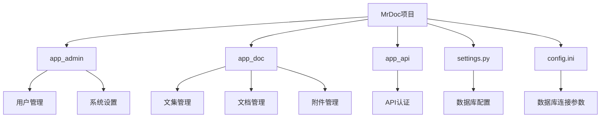

# 数据库迁移指南

<cite>
**本文档引用的文件**  
- [settings.py](file://MrDoc/settings.py) - *更新了DEFAULT_AUTO_FIELD配置*
- [config.ini](file://config/config.ini)
- [models.py](file://app_doc/models.py)
- [models.py](file://app_admin/models.py)
- [models.py](file://app_api/models.py)
- [0001_initial.py](file://app_doc/migrations/0001_initial.py)
- [0041_alter_attachment_id_alter_doc_id_alter_dochistory_id_and_more.py](file://app_doc/migrations/0041_alter_attachment_id_alter_doc_id_alter_dochistory_id_and_more.py) - *新增迁移文件，修改了ID字段类型*
</cite>

## 更新摘要
**变更内容**  
- 更新了数据库迁移指南，反映了Django 4.2升级后的新配置要求
- 新增了关于`DEFAULT_AUTO_FIELD`设置的说明
- 更新了模型ID字段迁移的相关内容
- 增加了对大型迁移项目的新建议
- 更新了相关文件引用，包含了新的迁移文件

### 目录
1. [引言](#引言)
2. [项目结构分析](#项目结构分析)
3. [数据库配置分析](#数据库配置分析)
4. [迁移步骤详解](#迁移步骤详解)
5. [配置文件调整](#配置文件调整)
6. [数据迁移方案](#数据迁移方案)
7. [潜在问题与解决方案](#潜在问题与解决方案)
8. [回滚程序](#回滚程序)
9. [验证与测试](#验证与测试)
10. [最佳实践建议](#最佳实践建议)

## 引言

本指南详细说明了如何将 MrDoc 项目从 SQLite 数据库迁移到 MySQL 数据库。该迁移过程涉及配置文件修改、数据库连接调整、数据迁移、模型兼容性检查以及回滚策略。本文档旨在为开发人员和系统管理员提供完整的迁移流程，确保数据完整性和系统稳定性。

## 项目结构分析

MrDoc 是一个基于 Django 框架的文档管理系统，采用模块化设计，主要包含以下核心应用：

- **app_admin**: 系统管理模块，负责用户权限、系统设置和注册管理
- **app_doc**: 文档核心模块，管理文集、文档、标签、附件等核心数据
- **app_api**: API 接口模块，提供用户 Token 认证和外部接口支持
- **MrDoc/settings.py**: 项目主配置文件，包含数据库、缓存、国际化等全局设置
- **config/config.ini**: 外部配置文件，存储数据库连接信息等敏感配置



**图示来源**
- [settings.py](file://MrDoc/settings.py)
- [config.ini](file://config/config.ini)

## 数据库配置分析

通过分析 `settings.py` 和 `config.ini` 文件，可以确定当前数据库配置机制：

在 `settings.py` 中，数据库配置通过动态映射实现：

```python
DATABASE_MAP = {
    'sqlite':'django.db.backends.sqlite3',
    'mysql':'django.db.backends.mysql',
    'postgresql':'django.db.backends.postgresql_psycopg2',
    'oracle':'django.db.backends.oracle',
}

db_engine = CONFIG.get('database','engine',fallback='sqlite')
if db_engine == 'sqlite':
    DATABASES = {
        'default': {
            'ENGINE': DATABASE_MAP[db_engine],
            'NAME': os.path.join(CONFIG_DIR, 'db.sqlite3'),
            'OPTIONS':{
                'timeout':20,
            }
        }
    }
else:
    DATABASES = {
        'default': {
            'ENGINE': DATABASE_MAP[CONFIG['database']['engine']],
            'NAME': CONFIG['database']['name'],
            'USER': CONFIG['database']['user'],
            'PASSWORD': CONFIG['database']['password'],
            'HOST': CONFIG['database']['host'],
            'PORT': CONFIG['database']['port'],
        }
    }
```

`config.ini` 文件中当前配置为 MySQL：

```ini
[database]
engine = mysql
name = mrdoc
user = admin
password = lzl660928
host = 192.168.0.21
port = 3306
```

**本节来源**
- [settings.py](file://MrDoc/settings.py#L100-L130)
- [config.ini](file://config/config.ini#L6-L12)

## 迁移步骤详解

### 1. 环境准备

在执行迁移前，确保以下条件已满足：

- 目标 MySQL 服务器已安装并运行
- 已创建目标数据库（本例中为 `mrdoc`）
- MySQL 用户具有足够的权限（CREATE, ALTER, INSERT, UPDATE, DELETE）
- Django MySQL 驱动已安装：`pip install mysqlclient`

### 2. 备份现有数据

在迁移前必须备份 SQLite 数据：

```bash
# 备份数据库文件
cp config/db.sqlite3 config/db.sqlite3.backup.$(date +%Y%m%d)

# 导出数据为 JSON 格式（可选）
python manage.py dumpdata --format=json --indent=2 > backup_data.json
```

### 3. 验证 MySQL 连接

创建测试脚本验证 MySQL 连接：

```python
# test_mysql.py
import pymysql
pymysql.install_as_MySQLdb()

from django.conf import settings
import django
django.setup()

from django.db import connection

try:
    with connection.cursor() as cursor:
        cursor.execute("SELECT 1")
        result = cursor.fetchone()
        print("MySQL 连接成功:", result)
except Exception as e:
    print("MySQL 连接失败:", e)
```

### 4. 执行迁移

```bash
# 1. 修改配置后，创建新的迁移文件
python manage.py makemigrations

# 2. 应用迁移到 MySQL
python manage.py migrate

# 3. 验证表结构
python manage.py showmigrations
```

**本节来源**
- [settings.py](file://MrDoc/settings.py#L100-L130)

## 配置文件调整

### config.ini 配置

确保 `config.ini` 文件中的数据库配置正确：

```ini
[database]
# engine，指定数据库类型，接受sqlite、mysql、oracle、postgresql
engine = mysql
# name表示数据库的名称
name = mrdoc
# user表示数据库用户名
user = admin
# password表示数据库用户密码
password = lzl660928
# host表示数据库主机地址
host = 192.168.0.21
# port表示数据库端口
port = 3306
```

### settings.py 配置注意事项

虽然 `settings.py` 中的数据库配置是动态的，但需要注意以下几点：

1. **MySQL 字符集配置**：建议在 `DATABASES` 配置中添加字符集设置：

```python
'OPTIONS': {
    'init_command': "SET sql_mode='STRICT_TRANS_TABLES'",
    'charset': 'utf8mb4',
}
```

2. **连接池配置**：对于生产环境，建议添加连接池配置：

```python
'CONN_MAX_AGE': 60,
'OPTIONS': {
    'connect_timeout': 20,
    'read_timeout': 20,
    'write_timeout': 20,
}
```

3. **Django 4.2 兼容性配置**：由于项目已升级到 Django 4.2，需要设置 `DEFAULT_AUTO_FIELD`：

```python
DEFAULT_AUTO_FIELD = 'django.db.models.BigAutoField'
```

此设置确保所有新创建的模型使用 `BigAutoField` 作为默认的主键字段类型，这在大型数据集和分布式系统中尤为重要。

**本节来源**
- [settings.py](file://MrDoc/settings.py#L110-L130)
- [config.ini](file://config/config.ini#L6-L12)

## 数据迁移方案

### 方案一：使用 Django dumpdata 和 loaddata

```bash
# 从 SQLite 导出数据
python manage.py dumpdata --exclude=contenttypes --exclude=auth.permission > data.json

# 导入到 MySQL
python manage.py loaddata data.json
```

### 方案二：直接数据库迁移

使用第三方工具如 `sqlite3` 命令行工具导出 SQL：

```bash
# 导出 SQLite 数据为 SQL 脚本
sqlite3 config/db.sqlite3 .dump > sqlite_dump.sql

# 清理 SQL 脚本中的 SQLite 特有语法
sed -i 's/`/"/g' sqlite_dump.sql  # 替换反引号
sed -i 's/AUTOINCREMENT/AUTO_INCREMENT/g' sqlite_dump.sql  # 修正自增关键字

# 导入到 MySQL
mysql -h 192.168.0.21 -u admin -p mrdoc < sqlite_dump.sql
```

### 方案三：编写自定义迁移脚本

```python
# data_migration.py
import os
os.environ.setdefault('DJANGO_SETTINGS_MODULE', 'MrDoc.settings')

import django
django.setup()

import sqlite3
from app_doc.models import Project, Doc
from app_admin.models import SysSetting
from django.contrib.auth.models import User

def migrate_data():
    # 连接 SQLite 数据库
    sqlite_conn = sqlite3.connect('config/db.sqlite3')
    cursor = sqlite_conn.cursor()
    
    # 迁移用户数据
    cursor.execute("SELECT id,username,email FROM auth_user")
    for row in cursor.fetchall():
        User.objects.update_or_create(
            id=row[0],
            defaults={
                'username': row[1],
                'email': row[2]
            }
        )
    
    # 迁移文集数据
    cursor.execute("SELECT * FROM app_doc_project")
    for row in cursor.fetchall():
        Project.objects.update_or_create(
            id=row[0],
            defaults={
                'name': row[1],
                'intro': row[3],
                'role': row[4],
                'create_user_id': row[7]
            }
        )
    
    sqlite_conn.close()
    print("数据迁移完成")

if __name__ == '__main__':
    migrate_data()
```

### 模型ID字段迁移注意事项

根据最新的迁移文件 `0041_alter_attachment_id_alter_doc_id_alter_dochistory_id_and_more.py`，所有模型的ID字段已从默认的 `AutoField` 修改为 `BigAutoField`：

```python
migrations.AlterField(
    model_name='attachment',
    name='id',
    field=models.BigAutoField(auto_created=True, primary_key=True, serialize=False, verbose_name='ID'),
)
```

这意味着在迁移过程中，需要确保：

1. MySQL 数据库支持 `BIGINT` 类型作为主键
2. 所有外键引用都能正确处理 64 位整数
3. 应用代码中没有对主键大小的硬编码假设

**本节来源**
- [models.py](file://app_doc/models.py)
- [models.py](file://app_admin/models.py)
- [0041_alter_attachment_id_alter_doc_id_alter_dochistory_id_and_more.py](file://app_doc/migrations/0041_alter_attachment_id_alter_doc_id_alter_dochistory_id_and_more.py)

## 潜在问题与解决方案

### 1. 字段类型不兼容

**问题**：SQLite 的 `INTEGER PRIMARY KEY` 与 MySQL 的 `AUTO_INCREMENT` 行为差异

**解决方案**：在迁移前确保 Django 模型中正确设置 `AutoField`：

```python
# 在 models.py 中确保
class Project(models.Model):
    id = models.AutoField(primary_key=True)  # 显式声明
    # 其他字段...
```

### 2. 字符集问题

**问题**：中文字符乱码

**解决方案**：统一使用 utf8mb4 字符集：

```python
# 在 settings.py 的 DATABASES 配置中添加
'OPTIONS': {
    'charset': 'utf8mb4',
},
'CHARSET': 'utf8mb4',
'COLLATION': 'utf8mb4_unicode_ci',
```

### 3. 外键约束问题

**问题**：MySQL 严格模式下的外键约束错误

**解决方案**：临时调整 SQL 模式：

```python
'OPTIONS': {
    'init_command': "SET sql_mode='STRICT_TRANS_TABLES,NO_ZERO_DATE,NO_ZERO_IN_DATE'",
}
```

### 4. 数据库连接超时

**问题**：长时间迁移过程中连接断开

**解决方案**：增加连接超时设置：

```python
'CONN_MAX_AGE': 300,
'OPTIONS': {
    'connect_timeout': 30,
    'read_timeout': 30,
    'write_timeout': 30,
}
```

### 5. Django 4.2 兼容性问题

**问题**：Django 4.2 默认使用 `BigAutoField` 作为默认主键字段

**解决方案**：在 `settings.py` 中明确设置：

```python
DEFAULT_AUTO_FIELD = 'django.db.models.BigAutoField'
```

同时确保所有现有迁移文件与新设置兼容，如 `0041_alter_attachment_id_alter_doc_id_alter_dochistory_id_and_more.py` 所示。

**本节来源**
- [settings.py](file://MrDoc/settings.py#L120-L130)
- [models.py](file://app_doc/models.py)
- [0041_alter_attachment_id_alter_doc_id_alter_dochistory_id_and_more.py](file://app_doc/migrations/0041_alter_attachment_id_alter_doc_id_alter_dochistory_id_and_more.py)

## 回滚程序

当迁移出现问题时，应能快速回滚到 SQLite 状态：

### 1. 回滚步骤

```bash
# 1. 停止应用服务
# 2. 恢复 config.ini 配置
sed -i 's/engine = mysql/engine = sqlite/g' config/config.ini

# 3. 删除 MySQL 中的表（可选）
# mysql -h host -u user -p -e "DROP DATABASE mrdoc; CREATE DATABASE mrdoc;"

# 4. 恢复 SQLite 数据库文件
cp config/db.sqlite3.backup.* config/db.sqlite3

# 5. 重启应用服务
```

### 2. 回滚验证

```bash
# 验证数据库配置
python manage.py dbshell  # 应该进入 SQLite 命令行

# 验证数据完整性
python manage.py shell
>>> from app_doc.models import Project
>>> print(Project.objects.count())  # 应该显示正确的数量
```

### 3. 自动化回滚脚本

```bash
#!/bin/bash
# rollback.sh
echo "开始回滚数据库迁移..."

# 恢复配置文件
cp config/config.ini.backup config/config.ini

# 恢复数据库文件
LATEST_BACKUP=$(ls config/db.sqlite3.backup.* | sort -r | head -1)
if [ -f "$LATEST_BACKUP" ]; then
    cp "$LATEST_BACKUP" config/db.sqlite3
    echo "数据库文件已恢复: $LATEST_BACKUP"
else
    echo "错误: 未找到备份文件"
    exit 1
fi

echo "数据库迁移回滚完成"
```

**本节来源**
- [config.ini](file://config/config.ini)
- [settings.py](file://MrDoc/settings.py)

## 验证与测试

### 1. 功能验证清单

| 测试项 | 验证方法 | 预期结果 |
|--------|----------|----------|
| 用户登录 | 使用现有账户登录 | 登录成功 |
| 文集访问 | 打开文集页面 | 显示所有文集 |
| 文档编辑 | 编辑并保存文档 | 保存成功，内容正确 |
| 附件上传 | 上传文件附件 | 上传成功，可下载 |
| 搜索功能 | 使用站内搜索 | 返回正确结果 |

### 2. 性能测试

```python
# performance_test.py
import time
from app_doc.models import Project, Doc

def test_query_performance():
    start_time = time.time()
    projects = Project.objects.all()
    project_count = projects.count()
    print(f"查询 {project_count} 个文集耗时: {time.time() - start_time:.2f}秒")
    
    start_time = time.time()
    for project in projects[:10]:  # 测试前10个
        docs = Doc.objects.filter(top_doc=project.id)
        print(f"文集 {project.name} 有 {docs.count()} 个文档")
    print(f"查询文档耗时: {time.time() - start_time:.2f}秒")

if __name__ == '__main__':
    test_query_performance()
```

### 3. 数据一致性检查

```python
# data_consistency.py
def check_data_consistency():
    """检查数据迁移后的一致性"""
    from django.db import connection
    
    # 检查表数量
    tables = connection.introspection.table_names()
    print(f"数据库中有 {len(tables)} 个表")
    
    # 检查关键模型数据量
    from app_doc.models import Project, Doc
    from app_admin.models import SysSetting
    
    print(f"文集数量: {Project.objects.count()}")
    print(f"文档数量: {Doc.objects.count()}")
    print(f"系统设置数量: {SysSetting.objects.count()}")

if __name__ == '__main__':
    check_data_consistency()
```

**本节来源**
- [models.py](file://app_doc/models.py)
- [models.py](file://app_admin/models.py)

## 最佳实践建议

### 1. 迁移前准备

- **充分备份**：在迁移前创建多个备份副本
- **测试环境验证**：先在测试环境完成迁移流程
- **停机窗口**：选择业务低峰期进行迁移
- **通知用户**：提前告知用户系统维护时间

### 2. 迁移过程监控

- **日志记录**：详细记录迁移过程中的每一步操作
- **进度跟踪**：对于大数据量，实现进度显示
- **错误处理**：捕获并记录所有异常，支持断点续传

### 3. 迁移后优化

```python
# 优化数据库配置
DATABASES = {
    'default': {
        'ENGINE': 'django.db.backends.mysql',
        'NAME': 'mrdoc',
        'USER': 'admin',
        'PASSWORD': 'lzl660928',
        'HOST': '192.168.0.21',
        'PORT': '3306',
        'OPTIONS': {
            'charset': 'utf8mb4',
            'init_command': "SET sql_mode='STRICT_TRANS_TABLES'",
            'connect_timeout': 30,
            'read_timeout': 30,
            'write_timeout': 30,
        },
        'CONN_MAX_AGE': 300,
        'AUTOCOMMIT': True,
    }
}
```

### 4. 长期维护

- **定期备份**：建立 MySQL 数据库的定期备份机制
- **监控告警**：设置数据库连接数、慢查询等监控
- **性能优化**：根据实际使用情况优化索引和查询
- **版本兼容性**：关注 Django 版本升级带来的配置变化，如 `DEFAULT_AUTO_FIELD` 的设置

**本节来源**
- [settings.py](file://MrDoc/settings.py)
- [config.ini](file://config/config.ini)