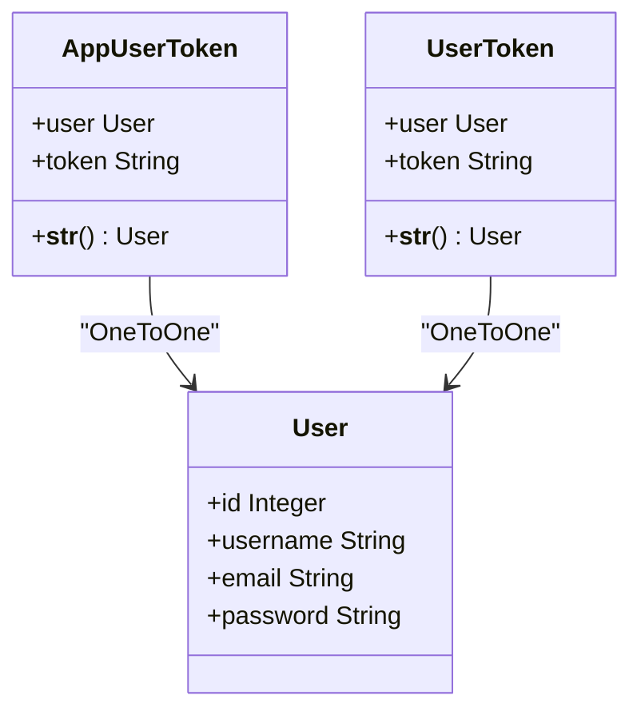
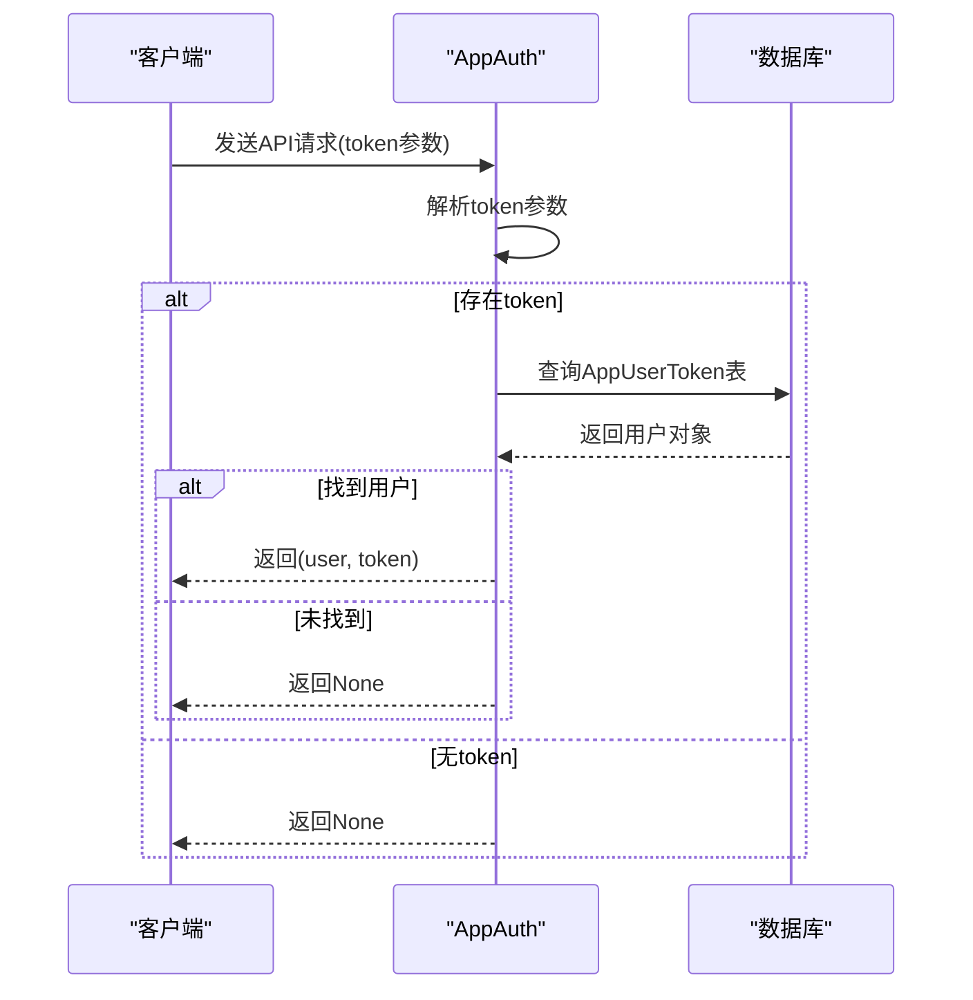
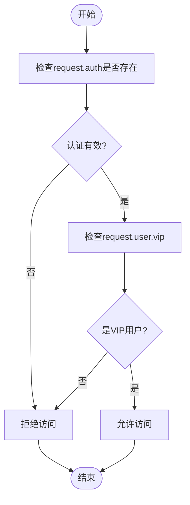
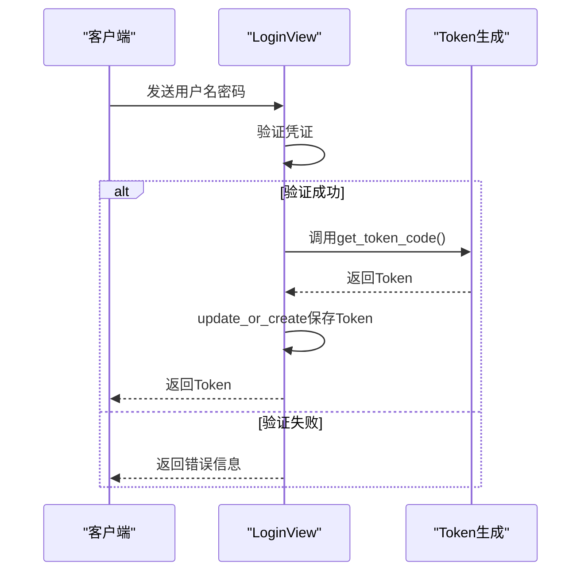
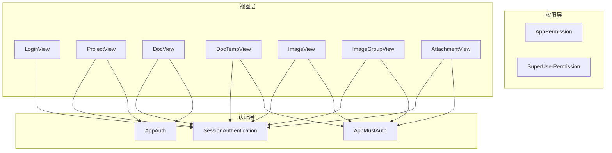
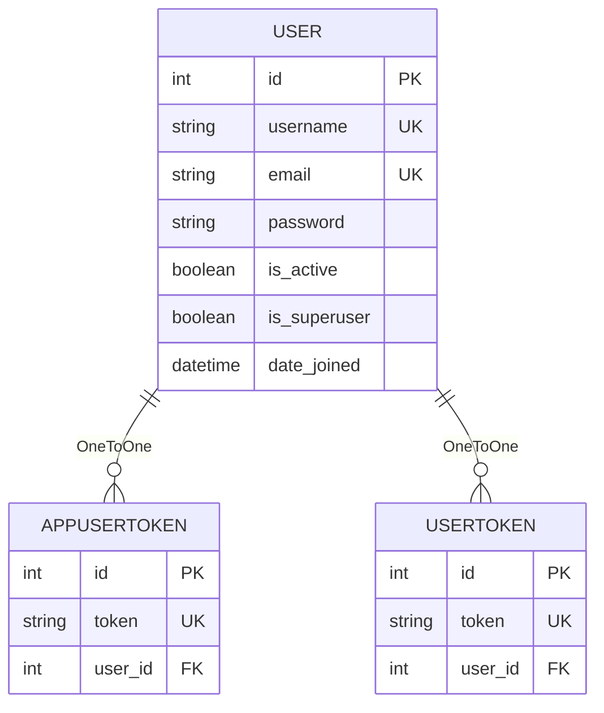

# API模型

<cite>
**本文档引用文件**   
- [models.py](file://app_api/models.py#L1-L25)
- [auth_app.py](file://app_api/auth_app.py#L1-L52)
- [permissions_app.py](file://app_api/permissions_app.py#L1-L39)
- [views_app.py](file://app_api/views_app.py#L1-L799)
- [urls_app.py](file://app_api/urls_app.py#L1-L16)
</cite>

## 目录
1. [API模型概述](#api模型概述)
2. [核心数据模型](#核心数据模型)
3. [API认证机制](#api认证机制)
4. [权限控制策略](#权限控制策略)
5. [Token生命周期管理](#token生命周期管理)
6. [API访问控制](#api访问控制)
7. [数据库模式图](#数据库模式图)

## API模型概述

MrDoc系统提供了一套完整的API接口，用于支持桌面应用、移动应用等第三方客户端的集成。该API系统基于Django REST Framework构建，采用Token认证机制，确保接口访问的安全性。API模型主要包含两类Token：用户级Token（UserToken）和应用级Token（AppUserToken），分别用于浏览器扩展和各类APP应用的认证。

**Section sources**
- [models.py](file://app_api/models.py#L1-L25)
- [auth_app.py](file://app_api/auth_app.py#L1-L52)

## 核心数据模型

### AppUserToken模型

AppUserToken模型用于桌面、移动等各类APP应用的认证。每个用户对应一个唯一的Token，通过该Token进行API接口的身份验证。

**: 字段定义**
- **user**: 外键字段，关联Django内置的User模型，表示该Token所属的用户，采用级联删除策略（on_delete=models.CASCADE）。
- **token**: 字符串字段，存储Token值，最大长度250个字符，要求唯一（unique=True），用于API请求的身份验证。

**: 元数据**
- **verbose_name**: 显示名称为"App用户Token"
- **verbose_name_plural**: 复数形式名称，与verbose_name相同

**: 字符串表示**
- **__str__方法**: 返回与该Token关联的用户对象，便于在管理后台中识别。

### UserToken模型

UserToken模型专为浏览器扩展设计，其结构与AppUserToken类似，但用途不同。

**: 字段定义**
- **user**: 外键字段，关联User模型，表示Token所属用户。
- **token**: 存储Token值的字符串字段，最大长度250，唯一性约束。

**: 元数据**
- **verbose_name**: 显示名称为"用户Token"
- **verbose_name_plural**: 复数形式名称，与verbose_name相同

**: 字符串表示**
- **__str__方法**: 返回关联的用户对象。

**Diagram sources **
- [models.py](file://app_api/models.py#L1-L25)

**Section sources**
- [models.py](file://app_api/models.py#L1-L25)

## API认证机制

### 认证类实现

MrDoc系统实现了两种自定义认证类：AppAuth和AppMustAuth，均继承自Django REST Framework的BaseAuthentication。

#### AppAuth认证类

AppAuth类提供基础的Token认证功能，当认证失败时返回None，允许视图进行其他处理。

**: authenticate方法流程**
1. 从请求参数中获取token值
2. 如果存在token参数，则在AppUserToken表中查询
3. 如果找到匹配的Token，返回(user, token)元组
4. 如果未找到或无token参数，返回None

#### AppMustAuth认证类

AppMustAuth类提供强制认证功能，当认证失败时直接抛出AuthenticationFailed异常。

**: authenticate方法流程**
1. 从请求参数中获取token值
2. 如果存在token参数且在AppUserToken表中找到匹配记录，返回(user, token)元组
3. 如果不存在token参数或Token无效，抛出相应的AuthenticationFailed异常，提示"请求的URL中必须携带token参数"或"无效的token"

**Diagram sources **
- [auth_app.py](file://app_api/auth_app.py#L1-L52)

**Section sources**
- [auth_app.py](file://app_api/auth_app.py#L1-L52)

## 权限控制策略

### AppPermission权限类

AppPermission类实现了基于VIP状态的访问控制，确保只有VIP用户才能访问特定API资源。

**: has_permission方法**
- 检查request.auth是否存在（认证是否通过）
- 检查request.user.vip属性是否为True
- 只有同时满足认证通过且为VIP用户时才返回True

**: has_object_permission方法**
- 对于安全的HTTP方法（GET、HEAD、OPTIONS），直接允许访问
- 对于其他方法，检查请求对象的owner属性是否等于当前用户

### SuperUserPermission权限类

SuperUserPermission类限制只有超级管理员才能访问特定API资源。

**: has_permission方法**
- 检查request.user是否存在且为超级用户（is_superuser=True）
- 只有超级管理员才能通过此权限检查

**Diagram sources **
- [permissions_app.py](file://app_api/permissions_app.py#L1-L39)

**Section sources**
- [permissions_app.py](file://app_api/permissions_app.py#L1-L39)

## Token生命周期管理

### Token生成

系统通过get_token_code函数生成唯一的Token值。

**: 生成算法**
1. 获取当前时间戳
2. 使用MD5哈希算法，以用户名和时间戳作为输入
3. 返回十六进制格式的哈希值作为Token

这种方法确保了同一用户每次生成的Token都不同，提高了安全性。

### Token创建与更新

LoginView的post方法处理用户登录请求，实现Token的创建和更新。

**: 处理流程**
1. 验证用户名和密码
2. 如果验证成功，调用get_token_code生成新Token
3. 使用update_or_create方法保存或更新用户的Token记录
4. 将生成的Token返回给客户端

这种方法确保了Token的及时更新，即使用户已经存在Token记录也会被刷新。

### Token失效

系统目前没有实现Token的过期机制，Token的有效性依赖于用户的账户状态。当用户账户被禁用（is_active=False）时，即使拥有有效Token也无法通过认证。

**Diagram sources **
- [views_app.py](file://app_api/views_app.py#L1-L799)

**Section sources**
- [views_app.py](file://app_api/views_app.py#L1-L799)

## API访问控制

### 认证类配置

API视图通过authentication_classes属性配置认证机制：

- **LoginView**: 仅使用SessionAuthentication
- **ProjectView, DocView**: 使用AppAuth和SessionAuthentication
- **DocTempView, ImageView, ImageGroupView, AttachmentView**: 使用AppMustAuth和SessionAuthentication

这种分层设计允许某些接口（如登录）无需Token即可访问，而敏感操作则需要强制认证。

### 权限类配置

通过permission_classes属性配置访问权限，结合认证机制实现多层次的安全控制。

### URL路由

API路由定义在urls_app.py文件中，映射了主要的API端点：

- `/login/`: 登录接口
- `/projects/`: 文集相关操作
- `/docs/`: 文档相关操作
- `/doctemps/`: 文档模板操作
- `/images/`: 图片管理
- `/imggroups/`: 图片分组管理
- `/attachments/`: 附件管理

**Diagram sources **
- [urls_app.py](file://app_api/urls_app.py#L1-L16)
- [views_app.py](file://app_api/views_app.py#L1-L799)

**Section sources**
- [urls_app.py](file://app_api/urls_app.py#L1-L16)
- [views_app.py](file://app_api/views_app.py#L1-L799)

## 数据库模式图

**Diagram sources **
- [models.py](file://app_api/models.py#L1-L25)