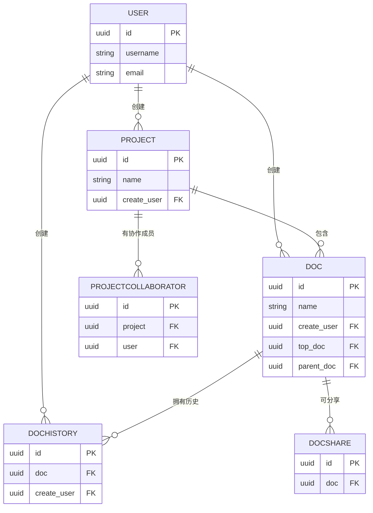
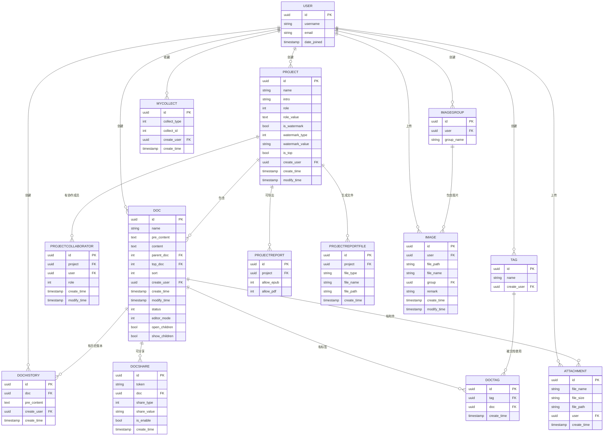

# 数据模型

<cite>
**本文档引用文件**   
- [app_doc/models.py](file://app_doc/models.py#L1-L270)
- [app_doc/search_indexes.py](file://app_doc/search_indexes.py#L1-L20)
- [app_admin/models.py](file://app_admin/models.py#L1-L67)
- [app_api/models.py](file://app_api/models.py#L1-L26)
</cite>

## 目录
1. [数据模型](#数据模型)
2. [核心实体关系](#核心实体关系)
3. [字段定义与数据类型](#字段定义与数据类型)
4. [主键与外键约束](#主键与外键约束)
5. [索引与性能优化](#索引与性能优化)
6. [数据验证与业务逻辑](#数据验证与业务逻辑)
7. [数据库模式图](#数据库模式图)
8. [数据访问模式与缓存策略](#数据访问模式与缓存策略)
9. [数据生命周期与归档规则](#数据生命周期与归档规则)
10. [数据迁移与版本管理](#数据迁移与版本管理)
11. [数据安全与访问控制](#数据安全与访问控制)

## 核心实体关系

MrDoc系统的核心数据模型围绕“文集”和“文档”构建，形成一个层次化的知识管理体系。系统通过多个模型实现文档的创建、协作、版本控制、分享和导出功能。

主要实体包括：
- **文集（Project）**：文档的容器，相当于一个项目或书籍
- **文档（Doc）**：具体内容单元，可嵌套形成树状结构
- **文档历史（DocHistory）**：记录文档的编辑历史
- **用户（User）**：Django内置用户模型，作为所有内容的创建者
- **文集协作（ProjectCollaborator）**：管理用户对文集的协作权限
- **文档分享（DocShare）**：实现文档的公开或私密分享

这些实体通过外键关系紧密关联，形成完整的数据网络。

**Section sources**
- [app_doc/models.py](file://app_doc/models.py#L1-L270)

## 字段定义与数据类型

### 文集模型（Project）
: **name**: 文集名称，字符串类型，最大长度50字符  
: **icon**: 文集图标，字符串类型，可为空  
: **intro**: 文集介绍，文本类型  
: **role**: 文集权限，整数类型，取值0-3（0=公开，1=私密，2=指定用户可见，3=访问码可见）  
: **role_value**: 权限值，文本类型，用于存储具体权限配置  
: **is_watermark**: 是否启用水印，布尔类型  
: **watermark_type**: 水印类型，整数类型（1=文字水印，2=图片水印）  
: **watermark_value**: 水印内容，字符串类型  
: **is_top**: 是否置顶，布尔类型，默认False  
: **create_user**: 创建用户，外键关联User模型  
: **create_time**: 创建时间，自动添加  
: **modify_time**: 修改时间，自动更新  

### 文档模型（Doc）
: **name**: 文档标题，字符串类型，最大长度255字符  
: **pre_content**: 编辑内容，文本类型，可为空  
: **content**: 文档内容，文本类型，可为空  
: **parent_doc**: 上级文档ID，整数类型，默认0  
: **top_doc**: 所属项目ID，整数类型，默认0  
: **sort**: 排序值，整数类型，默认9999  
: **create_user**: 创建用户，外键关联User模型  
: **create_time**: 创建时间，自动添加  
: **modify_time**: 修改时间，自动更新  
: **status**: 文档状态，整数类型（0=草稿，1=发布，2=删除）  
: **editor_mode**: 编辑器模式，整数类型（1=Editormd，2=Vditor，3=iceEditor）  
: **open_children**: 是否展开下级目录，布尔类型，默认False  
: **show_children**: 是否显示下级文档，布尔类型，默认False  

### 文档历史模型（DocHistory）
: **doc**: 关联文档，外键关联Doc模型  
: **pre_content**: 历史编辑内容，文本类型，可为空  
: **create_user**: 创建用户，外键关联User模型，可为空  
: **create_time**: 创建时间，自动更新  

### 文集协作模型（ProjectCollaborator）
: **project**: 关联文集，外键关联Project模型  
: **user**: 协作用户，外键关联User模型  
: **role**: 协作模式，整数类型（0=可新建和修改自己的文档，1=可新建和修改所有文档）  
: **create_time**: 添加时间，自动更新  
: **modify_time**: 修改时间，自动添加  

### 文档分享模型（DocShare）
: **token**: 分享Token，字符串类型，可为空  
: **doc**: 关联文档，外键关联Doc模型  
: **share_type**: 分享类型，整数类型（0=公开分享，1=私密分享）  
: **share_value**: 分享码，字符串类型，可为空  
: **is_enable**: 启用状态，布尔类型，默认True  
: **create_time**: 创建时间，自动添加  

**Section sources**
- [app_doc/models.py](file://app_doc/models.py#L1-L270)

## 主键与外键约束

MrDoc系统的主键和外键约束设计确保了数据的完整性和一致性。

### 主键
所有模型均使用Django默认的自增主键（id字段），除了：
- **ProjectReport**模型使用OneToOneField(Project)作为主键
- **UserToken**和**AppUserToken**模型使用token字段的唯一性约束

### 外键关系


**Diagram sources**
- [app_doc/models.py](file://app_doc/models.py#L1-L270)

## 索引与性能优化

系统通过合理的索引设计优化查询性能。

### 显式索引
在Doc模型中定义了复合索引：
```python
indexes = [
    models.Index(fields=['top_doc','parent_doc','status']),
    models.Index(fields=['sort']),
]
```
这些索引优化了以下查询：
- 按文集、父文档和状态查找文档
- 按排序字段查找文档

### 隐式索引
Django自动为以下字段创建索引：
- 外键字段（如create_user、top_doc等）
- 唯一字段（如token、code等）
- 主键字段

### 搜索索引
系统使用Haystack框架实现全文搜索，DocIndex类定义了搜索索引：
```python
class DocIndex(indexes.SearchIndex,indexes.Indexable):
    text = indexes.CharField(document=True, use_template=True)
    top_doc = indexes.IntegerField(model_attr='top_doc')
    modify_time = indexes.DateTimeField(model_attr='modify_time')
```
该索引包含文档内容、所属文集和修改时间，支持高效的全文检索。

**Section sources**
- [app_doc/models.py](file://app_doc/models.py#L1-L270)
- [app_doc/search_indexes.py](file://app_doc/search_indexes.py#L1-L20)

## 数据验证与业务逻辑

系统通过模型字段约束和业务逻辑实现数据验证。

### 字段级验证
- **必填字段**：通过blank=False和null=False确保数据完整性
- **长度限制**：使用max_length参数限制字符串长度
- **选择约束**：使用choices参数限制字段取值范围
- **唯一性**：使用unique=True确保字段值唯一

### 业务逻辑
1. **文集权限控制**：
   - 公开文集：所有用户可查看
   - 私密文集：仅创建者和协作成员可查看
   - 指定用户可见：仅指定用户可查看
   - 访问码可见：需输入正确访问码

2. **文档状态管理**：
   - 草稿状态：仅创建者和协作成员可查看
   - 发布状态：根据文集权限控制可见性
   - 删除状态：软删除，保留在数据库中

3. **协作权限**：
   - 模式0：可新建文档，可修改、删除自己新建的文档
   - 模式1：可新建文档，可删除自己创建的文档，可修改所有文档

4. **分享机制**：
   - 公开分享：无需验证，直接访问
   - 私密分享：需输入正确分享码

**Section sources**
- [app_doc/models.py](file://app_doc/models.py#L1-L270)

## 数据库模式图



**Diagram sources**
- [app_doc/models.py](file://app_doc/models.py#L1-L270)

## 数据访问模式与缓存策略

### 数据访问模式
1. **文集视图**：按文集ID获取所有文档，按树状结构组织
2. **文档视图**：按文档ID获取单个文档内容
3. **搜索视图**：通过全文索引查找文档
4. **用户视图**：获取用户创建的所有文集和文档

### 缓存策略
虽然代码中未显式实现缓存，但可通过以下方式优化：
- **页面缓存**：对公开文集的静态页面进行缓存
- **数据缓存**：缓存频繁访问的文集目录结构
- **查询缓存**：缓存复杂的数据库查询结果
- **CDN缓存**：对静态资源（图片、附件）使用CDN

**Section sources**
- [app_doc/models.py](file://app_doc/models.py#L1-L270)
- [app_doc/search_indexes.py](file://app_doc/search_indexes.py#L1-L20)

## 数据生命周期与归档规则

### 数据生命周期
1. **创建阶段**：
   - 用户创建文集和文档
   - 系统记录创建时间和创建者

2. **编辑阶段**：
   - 文档修改时创建历史版本
   - 系统记录修改时间

3. **分享阶段**：
   - 文档可被公开或私密分享
   - 分享记录包含有效期和访问统计

4. **归档阶段**：
   - 系统未实现自动归档
   - 可通过管理界面手动导出为EPUB/PDF

### 数据保留策略
- **文档历史**：永久保留，无自动清理机制
- **删除文档**：软删除，保留在数据库中
- **过期分享**：未实现自动清理
- **附件和图片**：永久保留，除非手动删除

**Section sources**
- [app_doc/models.py](file://app_doc/models.py#L1-L270)

## 数据迁移与版本管理

### 数据迁移
系统使用Django迁移系统管理数据库模式变更：
- 迁移文件位于各应用的migrations目录
- 每次模型变更生成新的迁移文件
- 支持向前和向后迁移

### 版本管理特点
1. **文档版本**：
   - 通过DocHistory模型实现
   - 每次保存自动创建历史版本
   - 记录编辑内容和创建者

2. **迁移版本**：
   - 基于文件名的数字序号（如0001_initial.py）
   - 按时间顺序执行
   - 支持依赖关系管理

3. **建议改进**：
   - 添加版本描述字段
   - 实现版本比较功能
   - 支持版本恢复到指定时间点

**Section sources**
- [app_doc/models.py](file://app_doc/models.py#L1-L270)
- [app_doc/migrations/](file://app_doc/migrations/)

## 数据安全与访问控制

### 访问控制机制
1. **基于角色的访问控制（RBAC）**：
   - 文集所有者：完全控制
   - 协作成员：根据协作模式限制权限
   - 普通用户：根据文集权限访问

2. **字段级权限**：
   - 敏感字段（如密码）不存储在模型中
   - 用户只能修改自己的设置

3. **分享安全**：
   - 私密分享需验证分享码
   - 分享可随时禁用

### 安全建议
1. **数据加密**：
   - 敏感数据应加密存储
   - 传输过程使用HTTPS

2. **权限细化**：
   - 实现更细粒度的权限控制
   - 支持部门或团队级别的权限

3. **审计日志**：
   - 记录关键操作日志
   - 支持操作追溯

4. **数据脱敏**：
   - 导出时可选择脱敏选项
   - 支持水印保护

**Section sources**
- [app_doc/models.py](file://app_doc/models.py#L1-L270)
- [app_admin/models.py](file://app_admin/models.py#L1-L67)