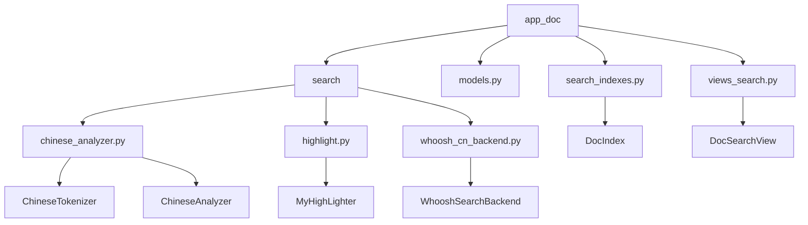
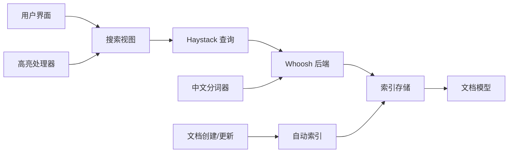
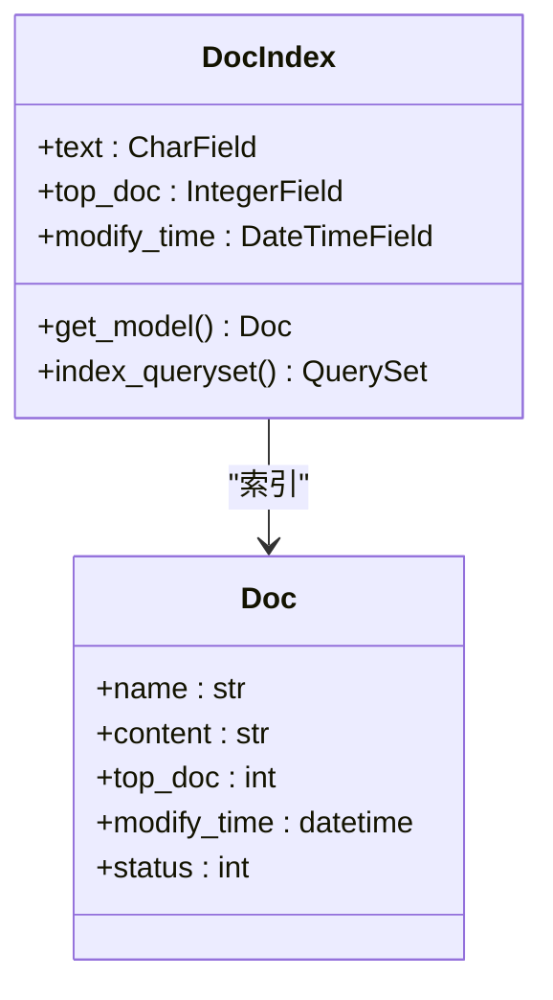
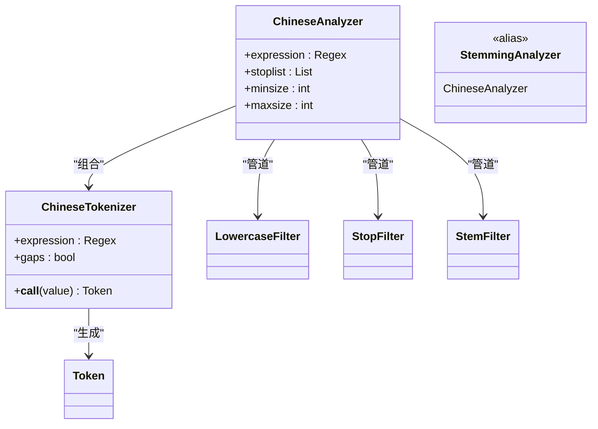
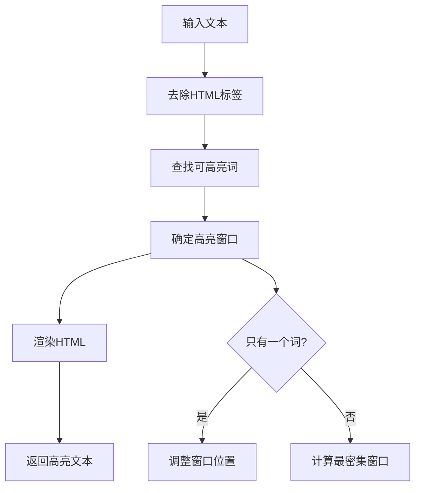
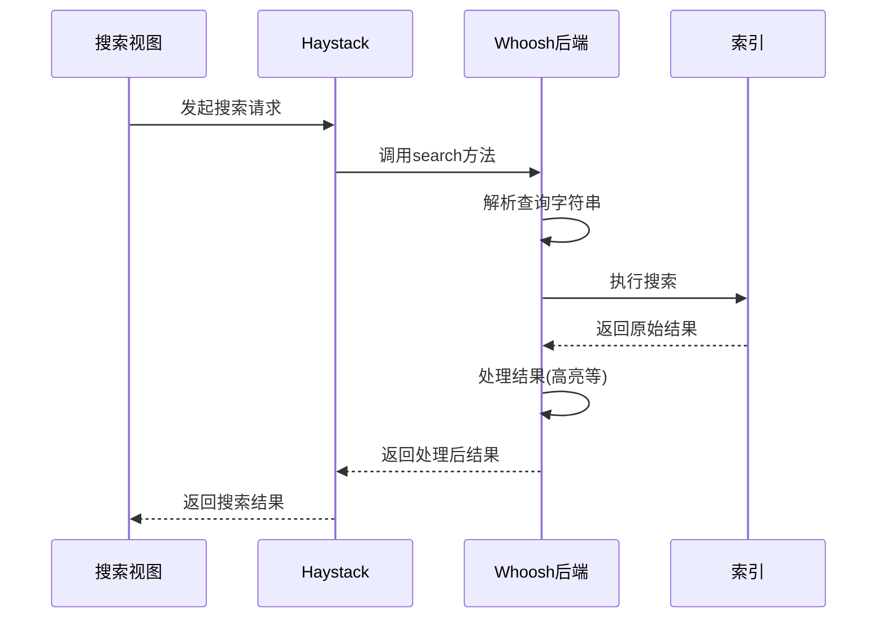
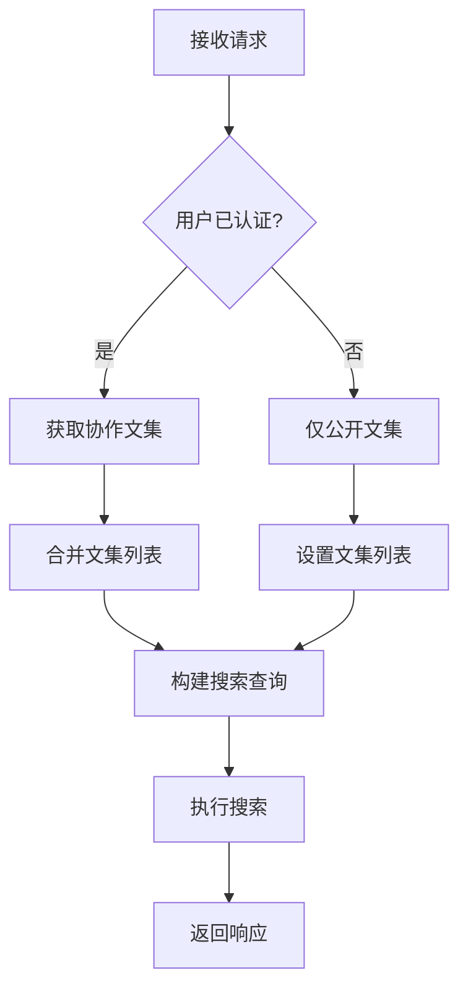
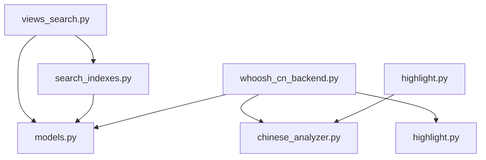

# 文档搜索模型

<cite>
**本文档引用的文件**  
- [search_indexes.py](file://app_doc/search_indexes.py)
- [chinese_analyzer.py](file://app_doc/search/chinese_analyzer.py)
- [highlight.py](file://app_doc/search/highlight.py)
- [whoosh_cn_backend.py](file://app_doc/search/whoosh_cn_backend.py)
- [views_search.py](file://app_doc/views_search.py)
- [models.py](file://app_doc/models.py)
</cite>

## 目录
1. [简介](#简介)
2. [项目结构](#项目结构)
3. [核心组件](#核心组件)
4. [架构概述](#架构概述)
5. [详细组件分析](#详细组件分析)
6. [依赖分析](#依赖分析)
7. [性能考虑](#性能考虑)
8. [故障排除指南](#故障排除指南)
9. [结论](#结论)

## 简介
本文档详细介绍了 MrDoc 文档系统中基于 Whoosh 引擎的全文搜索功能。重点分析了文档索引的构建、中文分词器的实现、高亮显示机制、搜索权限控制以及查询处理流程。系统使用 Haystack 框架作为 Django 的搜索抽象层，并通过自定义后端支持中文全文检索。

## 项目结构
文档搜索功能主要分布在 `app_doc` 应用下的 `search` 目录中，相关配置和视图分散在多个模块中。



**图示来源**  
- [app_doc/search](file://app_doc/search)
- [app_doc/models.py](file://app_doc/models.py)
- [app_doc/views_search.py](file://app_doc/views_search.py)

**本节来源**  
- [app_doc](file://app_doc)

## 核心组件
文档搜索系统由索引定义、中文分词、高亮处理、后端集成和视图控制五大核心组件构成。

**本节来源**  
- [search_indexes.py](file://app_doc/search_indexes.py#L1-L20)
- [chinese_analyzer.py](file://app_doc/search/chinese_analyzer.py#L1-L155)
- [highlight.py](file://app_doc/search/highlight.py#L1-L172)

## 架构概述
系统采用分层架构，从数据模型到用户界面形成完整的搜索闭环。



**图示来源**  
- [views_search.py](file://app_doc/views_search.py#L1-L109)
- [whoosh_cn_backend.py](file://app_doc/search/whoosh_cn_backend.py#L1-L800)
- [search_indexes.py](file://app_doc/search_indexes.py#L1-L20)

## 详细组件分析

### 索引配置分析
`DocIndex` 类定义了文档在 Whoosh 索引中的结构和行为。

```python
class DocIndex(indexes.SearchIndex, indexes.Indexable):
    text = indexes.CharField(document=True, use_template=True)
    top_doc = indexes.IntegerField(model_attr='top_doc')
    modify_time = indexes.DateTimeField(model_attr='modify_time')
```

- **text**: 主文本字段，使用模板生成内容，作为文档字段
- **top_doc**: 整数字段，映射到文档的 `top_doc` 属性
- **modify_time**: 日期时间字段，映射到文档的 `modify_time` 属性

索引仅包含状态为 1（已发布）的文档。



**图示来源**  
- [search_indexes.py](file://app_doc/search_indexes.py#L1-L20)
- [models.py](file://app_doc/models.py#L1-L270)

**本节来源**  
- [search_indexes.py](file://app_doc/search_indexes.py#L1-L20)

### 中文分词器分析
`ChineseAnalyzer` 使用结巴分词（jieba）实现中文文本的分词处理。



分词流程：
1. 接收 Unicode 文本输入
2. 使用 jieba.cut 进行全模式分词
3. 生成 Token 流
4. 经过小写过滤、停用词过滤和词干提取

**图示来源**  
- [chinese_analyzer.py](file://app_doc/search/chinese_analyzer.py#L1-L155)

**本节来源**  
- [chinese_analyzer.py](file://app_doc/search/chinese_analyzer.py#L1-L155)

### 高亮显示分析
`MyHighLighter` 类负责在搜索结果中高亮显示匹配的关键词。



关键特性：
- 使用自定义中文分词器分析查询词
- 支持自定义 HTML 标签和 CSS 类
- 智能窗口选择，优先显示包含最多关键词的段落
- 处理边界情况，如单个关键词的定位

**图示来源**  
- [highlight.py](file://app_doc/search/highlight.py#L1-L172)

**本节来源**  
- [highlight.py](file://app_doc/search/highlight.py#L1-L172)

### 搜索后端分析
`WhooshSearchBackend` 是 Haystack 与 Whoosh 引擎之间的桥梁。



后端特性：
- 使用自定义 `StemmingAnalyzer` 进行中文分词
- 支持异步写入优化性能
- 实现完整的 CRUD 操作
- 包含错误处理和日志记录

**图示来源**  
- [whoosh_cn_backend.py](file://app_doc/search/whoosh_cn_backend.py#L1-L800)

**本节来源**  
- [whoosh_cn_backend.py](file://app_doc/search/whoosh_cn_backend.py#L1-L800)

### 搜索视图分析
`DocSearchView` 处理用户搜索请求并返回结果。

```python
def __call__(self, request):
    # 处理时间范围筛选
    # 处理用户权限
    # 构建可访问的文集列表
    # 执行搜索查询
    return self.create_response()
```

权限控制逻辑：
- 认证用户：可访问公开文集和协作文集
- 未认证用户：仅可访问公开文集
- 使用 `top_doc__in` 过滤确保用户只能搜索有权限的文档



**图示来源**  
- [views_search.py](file://app_doc/views_search.py#L1-L109)

**本节来源**  
- [views_search.py](file://app_doc/views_search.py#L1-L109)

## 依赖分析
系统各组件之间的依赖关系清晰，形成了良好的分层结构。



主要依赖链：
- 视图 → 索引定义 → 文档模型
- 后端 → 中文分词器
- 后端 → 高亮处理器
- 高亮处理器 → 中文分词器

**图示来源**  
- [views_search.py](file://app_doc/views_search.py#L1-L109)
- [search_indexes.py](file://app_doc/search_indexes.py#L1-L20)
- [whoosh_cn_backend.py](file://app_doc/search/whoosh_cn_backend.py#L1-L800)

**本节来源**  
- [app_doc](file://app_doc)

## 性能考虑
系统在设计时考虑了多个性能优化点：

1. **索引更新**：使用 `AsyncWriter` 实现异步写入，避免阻塞
2. **缓存机制**：分词器支持缓存，提高重复分词效率
3. **查询优化**：通过 `top_doc__in` 预过滤减少搜索范围
4. **内存管理**：支持文件存储和内存存储两种模式
5. **分页处理**：合理计算分页参数，避免越界错误

## 故障排除指南
常见问题及解决方案：

- **中文搜索无效**：检查 `whoosh_cn_backend.py` 中是否正确导入 `ChineseAnalyzer`
- **高亮显示异常**：验证 `MyHighLighter` 中的分词器配置
- **权限问题**：确认 `DocSearchView` 中的文集过滤逻辑
- **索引未更新**：检查文档保存时是否触发了索引更新信号
- **性能低下**：考虑增加索引优化频率或调整分词器缓存大小

**本节来源**  
- [whoosh_cn_backend.py](file://app_doc/search/whoosh_cn_backend.py#L1-L800)
- [views_search.py](file://app_doc/views_search.py#L1-L109)

## 结论
MrDoc 的文档搜索系统通过集成 Whoosh 引擎和 Haystack 框架，实现了功能完整的全文搜索功能。系统特别针对中文搜索需求，通过自定义分词器和高亮处理器，提供了良好的中文支持。权限控制机制确保了搜索结果的安全性，而合理的架构设计保证了系统的可维护性和扩展性。