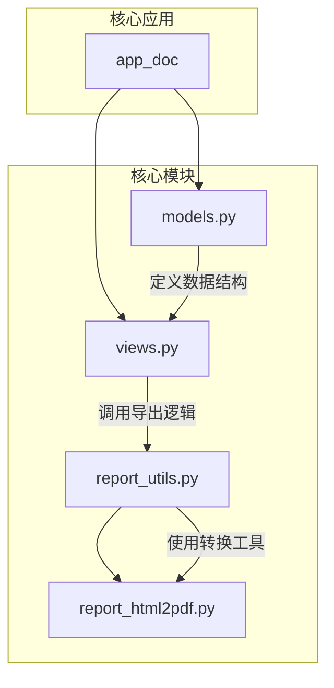
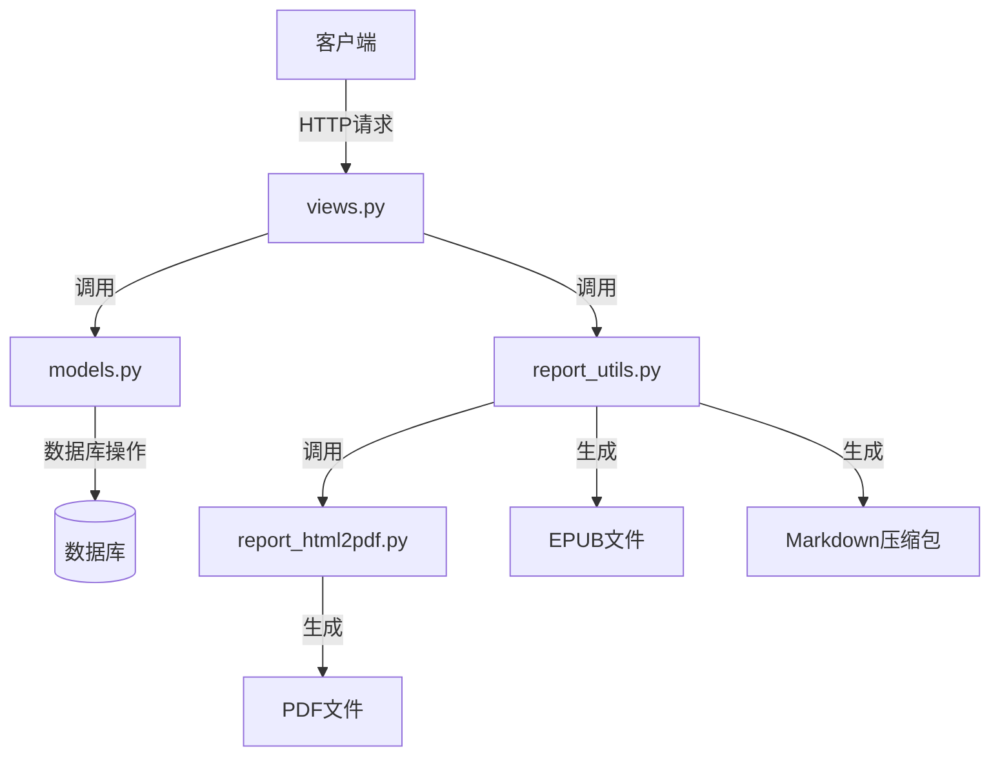
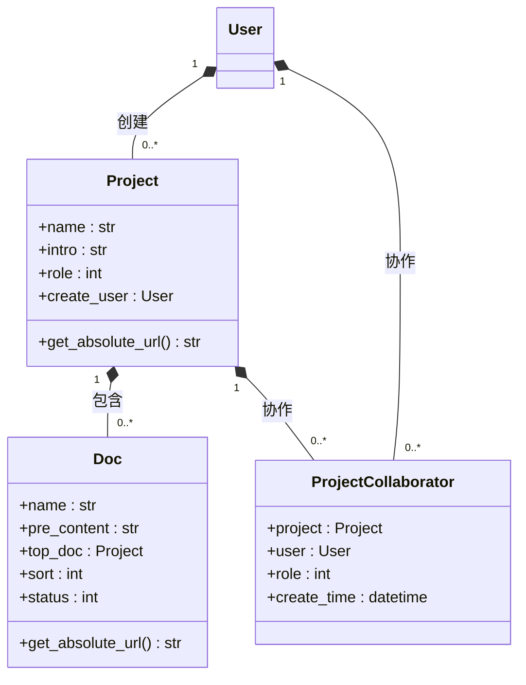
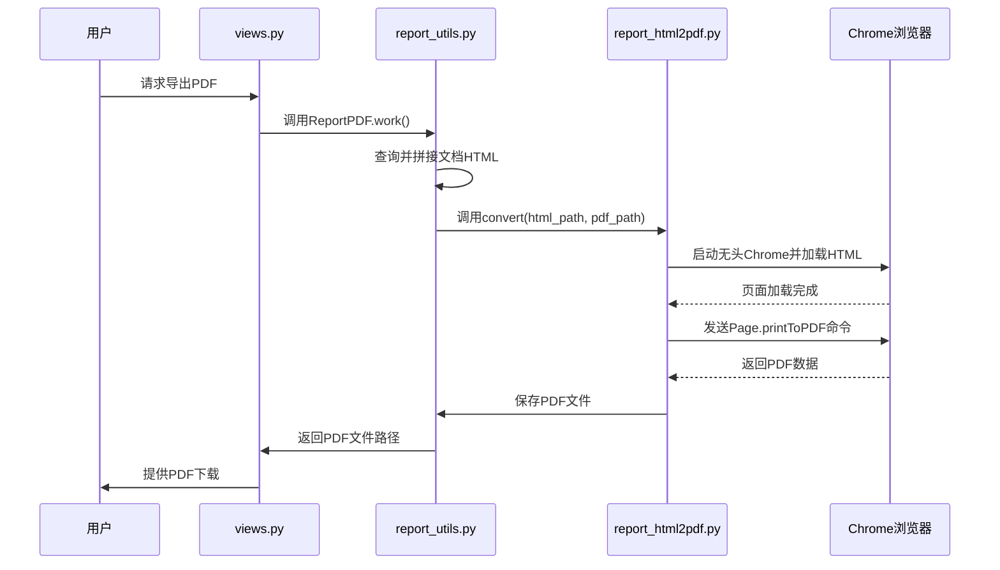
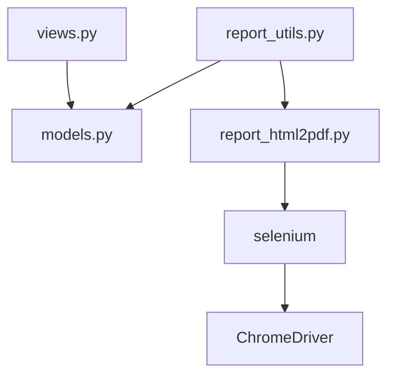

# 文档核心模型

<cite>
**本文档中引用的文件**   
- [models.py](file://app_doc/models.py)
- [views.py](file://app_doc/views.py)
- [report_utils.py](file://app_doc/report_utils.py)
- [report_html2pdf.py](file://app_doc/report_html2pdf.py)
</cite>

## 目录
1. [引言](#引言)
2. [项目结构](#项目结构)
3. [核心组件](#核心组件)
4. [架构概述](#架构概述)
5. [详细组件分析](#详细组件分析)
6. [依赖分析](#依赖分析)
7. [性能考虑](#性能考虑)
8. [故障排除指南](#故障排除指南)
9. [结论](#结论)

## 引言
本文档旨在全面介绍MrDoc文档系统的核心数据模型，重点分析Doc（文档）和Project（文集）两个核心模型。文档将详细解释模型字段定义、业务逻辑、外键关系以及相关功能实现，包括文档排序、状态管理、协作机制、标签系统和报告导出功能。目标是为开发者和系统维护人员提供一份清晰、详尽的技术参考。

## 项目结构
根据提供的项目结构，`app_doc` 是处理文档核心功能的主要应用模块。该模块包含模型定义、视图逻辑、报告生成工具和静态资源。核心模型定义位于 `app_doc/models.py` 文件中，而业务逻辑和API处理则分布在 `views.py` 和 `report_utils.py` `
- `models.py`: 定义了所有数据库模型，包括文档、文集、用户协作、标签、历史记录等。
- `views.py`: 处理所有与文档和文集相关的HTTP请求，如创建、修改、删除、列表展示和权限验证。
- `report_utils.py`: 实现了将文集导出为多种格式（如EPUB、PDF、Markdown压缩包）的核心逻辑。
- `report_html2pdf.py`: 提供了使用Selenium和ChromeDriver将HTML内容转换为PDF文件的底层工具。

**图示来源**
- [models.py](file://app_doc/models.py)
- [views.py](file://app_doc/views.py)
- [report_utils.py](file://app_doc/report_utils.py)
- [report_html2pdf.py](file://app_doc/report_html2pdf.py)

## 核心组件
文档系统的核心由`Doc`（文档）和`Project`（文集）两个模型构成。`Project`作为文档的容器，代表一个项目或知识库。`Doc`模型则代表文集内的具体文档，它们通过`top_doc`外键关联，形成一对多的关系。此外，`ProjectCollaborator`模型实现了文集的协作功能，允许用户邀请他人共同编辑。`DocTag`模型为文档提供了标签分类能力。`ProjectReport`和`ProjectReportFile`模型共同支撑了文集的导出和报告生成功能。

**组件来源**
- [models.py](file://app_doc/models.py#L1-L270)

## 架构概述
系统采用典型的Django MVC架构。`models.py` 定义了数据层，`views.py` 处理业务逻辑和控制层，而模板文件（位于`template/app_doc/`）负责视图层。报告生成功能是一个独立的子系统，`report_utils.py` 负责构建导出内容（如HTML、Markdown），而`report_html2pdf.py` 则作为一个工具模块，利用无头浏览器将HTML转换为PDF。整个流程体现了分层设计和单一职责原则。

**图示来源**
- [models.py](file://app_doc/models.py)
- [views.py](file://app_doc/views.py)
- [report_utils.py](file://app_doc/report_utils.py)
- [report_html2pdf.py](file://app_doc/report_html2pdf.py)

## 详细组件分析

### 文档模型 (Doc) 分析
`Doc`模型是系统中存储内容的核心。它不仅包含文档的标题和内容，还管理着文档的元数据和状态。

#### 字段定义与业务含义
以下表格详细描述了`Doc`模型的关键字段：

| 字段名 | 数据类型 | 默认值 | 业务含义 |
| :--- | :--- | :--- | :--- |
| `name` | CharField | - | 文档的标题，用于在目录和列表中显示。 |
| `pre_content` | TextField | null | 存储文档的原始编辑内容，通常是Markdown源码。 |
| `content` | TextField | null | 存储文档的渲染后内容，通常是HTML格式，用于富文本编辑器。 |
| `parent_doc` | IntegerField | 0 | 指向上级文档的ID，用于构建文档的树形层级结构。值为0表示一级文档。 |
| `top_doc` | IntegerField | 0 | 外键，指向所属的`Project`（文集）ID，标识文档归属。 |
| `sort` | IntegerField | 9999 | 排序字段，用于在同一层级的文档中进行排序，值越小越靠前。 |
| `create_user` | ForeignKey | - | 外键，指向`User`模型，记录文档的创建者。 |
| `create_time` | DateTimeField | auto_now_add=True | 记录文档的创建时间。 |
| `modify_time` | DateTimeField | auto_now=True | 记录文档的最后修改时间。 |
| `status` | IntegerField | 1 | 文档状态：0表示草稿（未发布），1表示已发布。 |
| `editor_mode` | IntegerField | 1 | 编辑器模式：1表示Editormd，2表示Vditor，3表示iceEditor。 |
| `open_children` | BooleanField | False | 布尔值，表示在目录中是否默认展开该文档的下级目录。 |
| `show_children` | BooleanField | False | 布尔值，表示是否在文档页面显示下级文档列表。 |

#### 文档排序机制
文档的排序通过`sort`字段实现。在`manage_project_doc_sort`视图中，系统提供了一个拖拽排序的界面。当用户调整文档顺序后，后端会接收一个包含文档ID和新顺序的JSON数据。系统会遍历这个数据，为每个文档分配一个基于其位置的`sort`值（代码中使用`n += 10`来确保有足够的间隔进行后续调整），并更新数据库。这种基于整数的排序方式简单高效，避免了复杂的树形排序算法。

#### 状态管理
`status`字段用于管理文档的发布状态。目前系统主要使用两个状态：0（草稿）和1（发布）。在查询文档时，系统通常会过滤掉`status=0`的文档，只显示已发布的文档。这为用户提供了一个安全的编辑环境，允许他们在文档正式发布前进行多次修改。

**组件来源**
- [models.py](file://app_doc/models.py#L70-L100)
- [views.py](file://app_doc/views.py#L300-L355)

### 文集模型 (Project) 分析
`Project`模型是文档的容器，代表一个独立的知识库或项目。

#### 字段定义与用途
| 字段名 | 数据类型 | 默认值 | 用途 |
| :--- | :--- | :--- | :--- |
| `name` | CharField | - | 文集的名称，是其主要标识。 |
| `icon` | CharField | null | 存储文集图标的标识符，用于在列表中进行视觉区分。 |
| `intro` | TextField | - | 文集的介绍或描述，提供更详细的信息。 |
| `role` | IntegerField | 0 | 文集权限：0公开，1私密，2指定用户可见，3访问码可见。 |
| `role_value` | TextField | null | 根据`role`的不同，存储权限值，如用户名列表或访问码。 |
| `is_watermark` | BooleanField | False | 是否为文集启用水印。 |
| `watermark_type` | IntegerField | 1 | 水印类型：1文字水印，2图片水印。 |
| `watermark_value` | CharField | '' | 水印的具体内容（文字或图片路径）。 |
| `is_top` | BooleanField | False | 是否在列表中置顶显示。 |
| `create_user` | ForeignKey | - | 外键，指向`User`模型，记录文集的创建者。 |

#### 项目协作功能
项目协作通过`ProjectCollaborator`模型实现。该模型包含`project`（外键指向文集）、`user`（外键指向用户）和`role`（协作模式）三个核心字段。`role`字段定义了协作者的权限：
- `0`: 可新建文档，可修改、删除自己新建的文档。
- `1`: 可新建文档，可删除自己创建的文档，可修改所有文档。

在`project_index`等视图中，系统会检查当前用户是否为文集创建者或协作者，并根据其`role`值来决定其操作权限。例如，在文档排序功能中，只有创建者或`role=1`的高级协作者才能进行操作。

**图示来源**
- [models.py](file://app_doc/models.py#L1-L70)

**组件来源**
- [models.py](file://app_doc/models.py#L1-L70)
- [views.py](file://app_doc/views.py#L100-L200)

### 项目报告功能分析
项目报告功能允许用户将整个文集导出为EPUB、PDF或Markdown压缩包。

#### 报告生成与PDF导出
报告生成功能主要由`report_utils.py`中的`ReportEPUB`和`ReportPDF`类实现。
- `ReportEPUB`: 该类通过生成符合EPUB标准的HTML、CSS和XML文件（如`content.opf`, `toc.ncx`），然后将这些文件打包成一个`.epub`文件。它会递归遍历文集中的所有文档，生成对应的HTML文件，并构建目录结构。
- `ReportPDF`: 该类首先拼接所有文档的HTML内容，形成一个完整的HTML字符串。然后，它调用`report_html2pdf.py`中的`convert`函数，将这个HTML文件转换为PDF。

`report_html2pdf.py`是PDF转换的核心。它使用Selenium WebDriver启动一个无头Chrome浏览器，加载指定的HTML文件，然后通过Chrome DevTools Protocol的`Page.printToPDF`命令将页面内容渲染为PDF。这种方式可以完美保留HTML的样式和布局。

**图示来源**
- [report_utils.py](file://app_doc/report_utils.py#L200-L500)
- [report_html2pdf.py](file://app_doc/report_html2pdf.py#L1-L98)

**组件来源**
- [report_utils.py](file://app_doc/report_utils.py)
- [report_html2pdf.py](file://app_doc/report_html2pdf.py)

### 文档标签功能分析
文档标签功能通过`Tag`和`DocTag`两个模型实现，采用典型的多对多关系设计。
- `Tag`模型：存储标签的名称和创建者。
- `DocTag`模型：作为关联表，存储`tag`和`doc`的外键，以及创建时间。

这种设计允许一个文档拥有多个标签，同时一个标签也可以被多个文档使用。在`manage_doc_tag.html`等管理界面中，用户可以为文档添加或移除标签。`DocTag`模型的`create_time`字段记录了标签与文档关联的时间，可用于后续的统计分析。

**组件来源**
- [models.py](file://app_doc/models.py#L180-L200)

## 依赖分析
系统内部依赖关系清晰。`views.py` 依赖 `models.py` 进行业务数据的存取。`report_utils.py` 依赖 `models.py` 获取文档和文集数据，并依赖 `report_html2pdf.py` 完成最终的PDF转换。`report_html2pdf.py` 依赖外部库`selenium`和`webdriver_manager`来操作Chrome浏览器。这种分层依赖确保了代码的模块化和可维护性。

**图示来源**
- [models.py](file://app_doc/models.py)
- [views.py](file://app_doc/views.py)
- [report_utils.py](file://app_doc/report_utils.py)
- [report_html2pdf.py](file://app_doc/report_html2pdf.py)

## 性能考虑
- **数据库查询**: 在`get_pro_toc`函数中，为了生成文集目录，系统会进行多次数据库查询。对于大型文集，这可能成为性能瓶颈。可以考虑引入缓存机制（如Redis）来存储生成的目录结构。
- **文件导出**: 导出大型文集为PDF或EPUB是一个资源密集型操作，因为它需要生成大量HTML文件并进行转换。建议在后台任务队列（如Celery）中执行这些操作，以避免阻塞主线程。
- **静态文件处理**: `operat_md_media`函数在处理Markdown中的图片时，会进行文件复制。对于包含大量图片的文集，这会消耗大量I/O资源。

## 故障排除指南
- **PDF导出失败**: 检查`settings.py`中是否正确配置了`CHROMIUM_DRIVER_PATH`，或者系统是否能自动通过`webdriver_manager`下载ChromeDriver。确保服务器有权限运行Chrome。
- **权限问题**: 如果用户无法访问文集，请检查`Project`模型的`role`和`role_value`字段是否正确设置，并确认`ProjectCollaborator`表中是否有正确的用户记录。
- **文档排序不生效**: 检查`manage_project_doc_sort`视图的POST请求数据格式是否正确，确保`sort_data`参数是一个有效的JSON数组。

**组件来源**
- [report_html2pdf.py](file://app_doc/report_html2pdf.py#L50-L70)
- [views.py](file://app_doc/views.py#L150-L200)

## 结论
MrDoc的文档核心模型设计合理，通过`Doc`和`Project`模型构建了清晰的文档-文集关系，并通过`ProjectCollaborator`、`DocTag`等辅助模型扩展了协作和分类功能。报告生成功能利用现代Web技术（无头浏览器）实现了高质量的PDF和EPUB导出。整体架构遵循了良好的软件设计原则，具有较高的可扩展性和可维护性。未来可考虑引入缓存和异步任务来进一步提升系统性能。