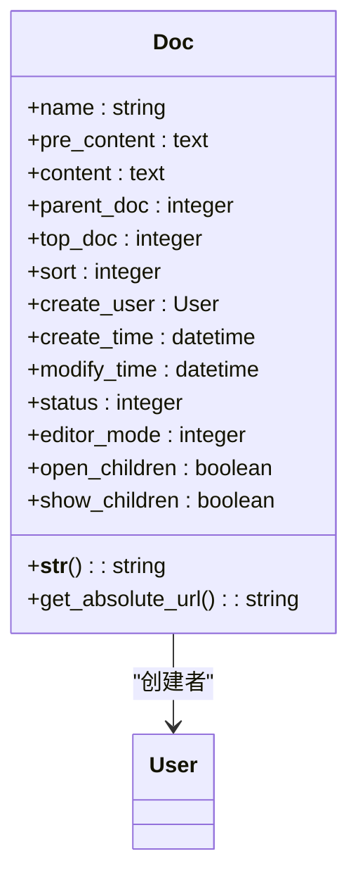
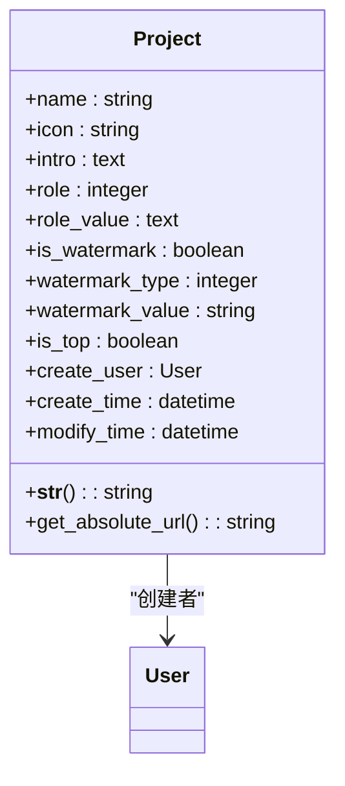
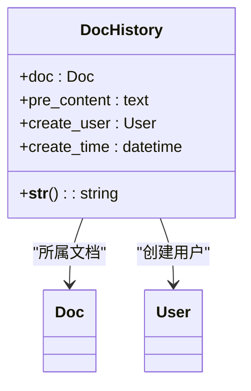
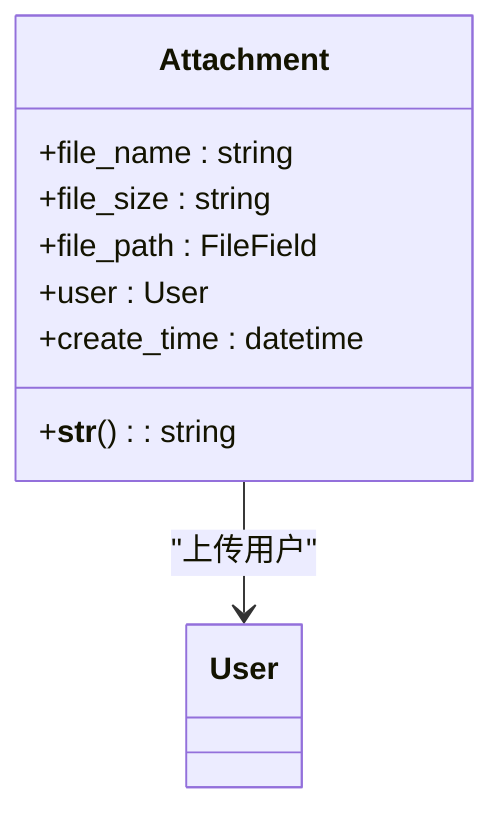
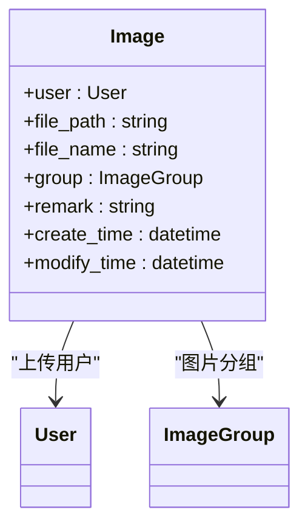
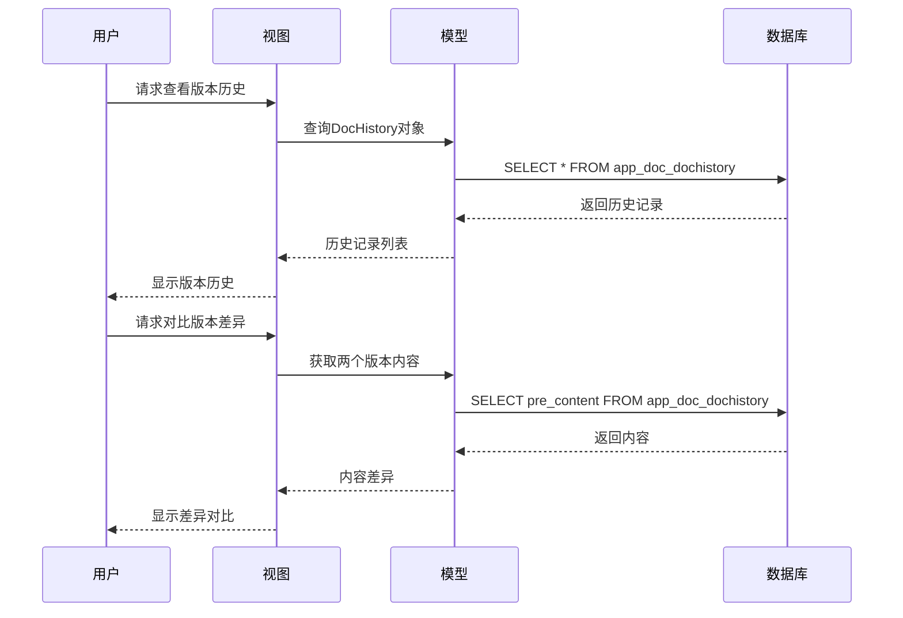
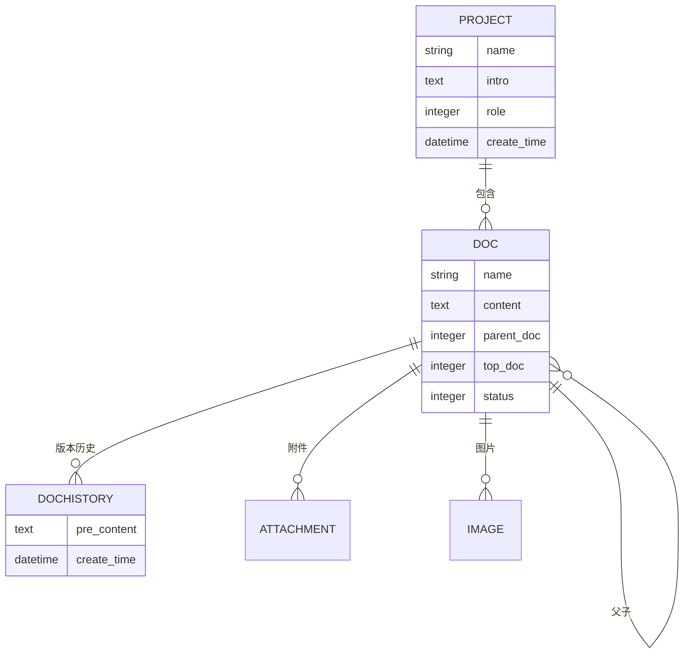
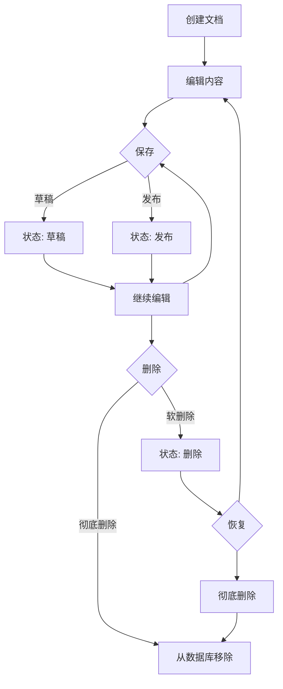
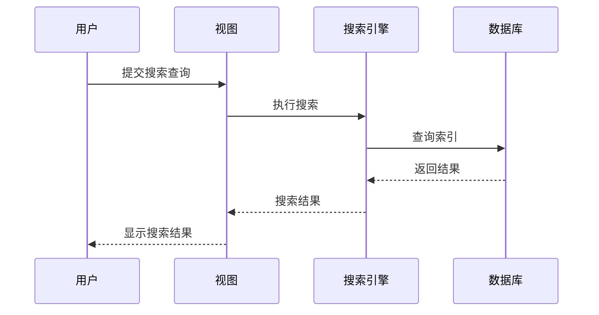
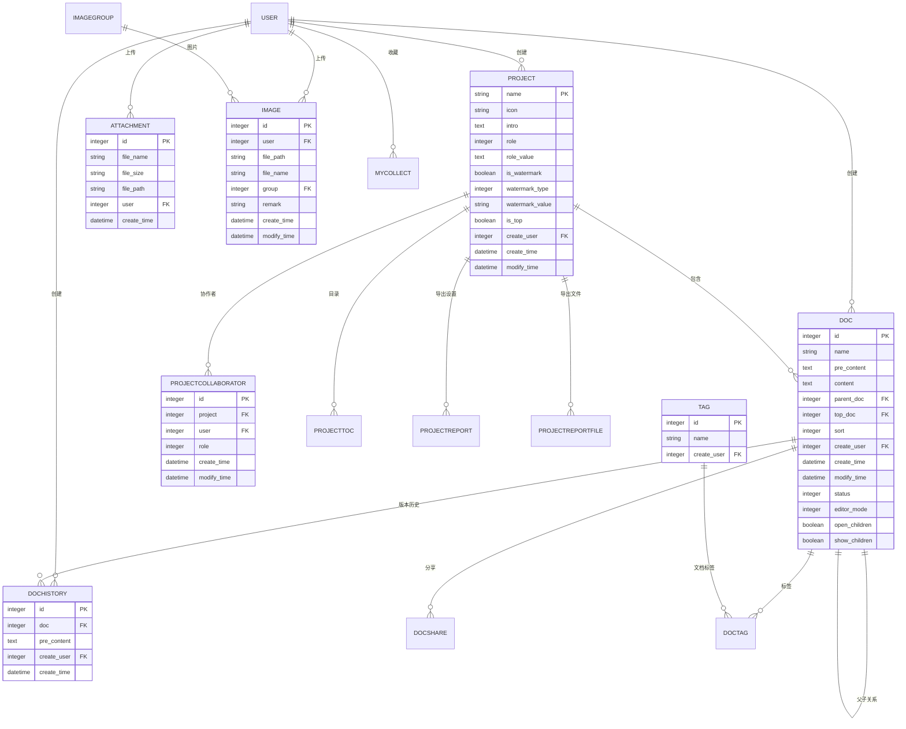

# 文档模型

<cite>
**本文档中引用的文件**   
- [models.py](file://app_doc/models.py)
- [search_indexes.py](file://app_doc/search_indexes.py)
- [views.py](file://app_doc/views.py)
- [manage_doc_history.html](file://template/app_doc/manage/manage_doc_history.html)
- [diff_doc.html](file://template/app_doc/diff_doc.html)
</cite>

## 目录
1. [文档模型概述](#文档模型概述)
2. [核心数据模型](#核心数据模型)
3. [文档版本控制机制](#文档版本控制机制)
4. [文档与项目关系](#文档与项目关系)
5. [权限控制实现](#权限控制实现)
6. [数据库约束与索引](#数据库约束与索引)
7. [关键字段说明](#关键字段说明)
8. [文档生命周期管理](#文档生命周期管理)
9. [搜索功能集成](#搜索功能集成)
10. [数据库模式图](#数据库模式图)

## 文档模型概述

MrDoc系统中的文档模型是整个知识管理系统的核心组成部分，负责管理文档内容、版本历史、权限控制和元数据信息。该模型设计遵循关系型数据库规范，通过Django ORM实现数据持久化，支持文档的创建、编辑、删除、版本控制和搜索等核心功能。

文档模型不仅管理单个文档的内容和状态，还通过与项目、用户、附件等模型的关联，构建了一个完整的知识管理生态系统。系统支持多级文档结构，允许文档之间建立父子关系，形成树状的知识组织结构。

**Section sources**
- [models.py](file://app_doc/models.py#L0-L270)

## 核心数据模型

### 文档模型 (Doc)

文档模型是MrDoc系统中最核心的数据结构，用于存储文档的基本信息和内容。



**Diagram sources**
- [models.py](file://app_doc/models.py#L100-L145)

#### 字段定义

:字段名称: : 类型 : :描述:
:---: | :---: | :---:
:name: : CharField : :文档标题，最大长度255字符:
:pre_content: : TextField : :编辑内容，存储文档的原始编辑状态:
:content: : TextField : :文档内容，存储最终渲染的内容:
:parent_doc: : IntegerField : :上级文档ID，0表示顶级文档:
:top_doc: : IntegerField : :所属项目ID:
:sort: : IntegerField : :排序值，用于确定文档在列表中的顺序:
:create_user: : ForeignKey : :创建用户，关联Django用户模型:
:create_time: : DateTimeField : :创建时间，自动设置为创建时的时间:
:modify_time: : DateTimeField : :修改时间，每次保存时自动更新:
:status: : IntegerField : :文档状态，0=草稿，1=发布，2=删除:
:editor_mode: : IntegerField : :编辑器模式，1=Editormd，2=Vditor，3=iceEditor:
:open_children: : BooleanField : :是否展开下级目录:
:show_children: : BooleanField : :是否显示下级文档:

**Section sources**
- [models.py](file://app_doc/models.py#L100-L145)

### 文集模型 (Project)

文集模型用于组织和管理一组相关的文档，相当于文档的容器或项目。



**Diagram sources**
- [models.py](file://app_doc/models.py#L10-L50)

#### 字段定义

:字段名称: : 类型 : :描述:
:---: | :---: | :---:
:name: : CharField : :文集名称，最大长度50字符:
:icon: : CharField : :文集图标，可为空:
:intro: : TextField : :文集介绍:
:role: : IntegerField : :文集权限，0=公开，1=私密，2=指定用户可见，3=访问码可见:
:role_value: : TextField : :文集权限值，存储权限相关的具体值:
:is_watermark: : BooleanField : :水印状态，是否启用水印:
:watermark_type: : IntegerField : :水印类型，1=文字水印，2=图片水印:
:watermark_value: : CharField : :水印内容:
:is_top: : BooleanField : :是否置顶:
:create_user: : ForeignKey : :创建用户:
:create_time: : DateTimeField : :创建时间:
:modify_time: : DateTimeField : :修改时间:

**Section sources**
- [models.py](file://app_doc/models.py#L10-L50)

### 文档历史模型 (DocHistory)

文档历史模型用于记录文档的版本变更历史，支持版本回滚和差异对比。



**Diagram sources**
- [models.py](file://app_doc/models.py#L147-L158)

#### 字段定义

:字段名称: : 类型 : :描述:
:---: | :---: | :---:
:doc: : ForeignKey : :关联的文档:
:pre_content: : TextField : :文档历史编辑内容:
:create_user: : ForeignKey : :创建用户，可为空（用户删除时）:
:create_time: : DateTimeField : :创建时间，自动更新:

**Section sources**
- [models.py](file://app_doc/models.py#L147-L158)

### 附件模型 (Attachment)

附件模型用于管理文档相关的文件附件。



**Diagram sources**
- [models.py](file://app_doc/models.py#L233-L245)

#### 字段定义

:字段名称: : 类型 : :描述:
:---: | :---: | :---:
:file_name: : CharField : :附件名称:
:file_size: : CharField : :附件大小:
:file_path: : FileField : :附件文件路径，上传到attachment/%Y/%m/目录:
:user: : ForeignKey : :上传用户:
:create_time: : DateTimeField : :创建时间:

**Section sources**
- [models.py](file://app_doc/models.py#L233-L245)

### 图片模型 (Image)

图片模型用于管理文档中使用的图片资源。



**Diagram sources**
- [models.py](file://app_doc/models.py#L221-L231)

#### 字段定义

:字段名称: : 类型 : :描述:
:---: | :---: | :---:
:user: : ForeignKey : :上传用户:
:file_path: : CharField : :图片路径:
:file_name: : CharField : :图片名称:
:group: : ForeignKey : :图片分组，可为空:
:remark: : CharField : :图片备注:
:create_time: : DateTimeField : :创建时间:
:modify_time: : DateTimeField : :修改时间:

**Section sources**
- [models.py](file://app_doc/models.py#L221-L231)

## 文档版本控制机制

### 版本记录实现

文档版本控制通过DocHistory模型实现，每次文档保存时都会创建一个历史记录。

```python
# 伪代码示例：文档保存时创建历史记录
def save_document(doc, content, user):
    # 保存当前内容到历史记录
    DocHistory.objects.create(
        doc=doc,
        pre_content=doc.pre_content,
        create_user=user
    )
    # 更新文档内容
    doc.content = content
    doc.pre_content = content
    doc.modify_time = timezone.now()
    doc.save()
```

### 版本管理功能

系统提供了完整的版本管理功能，包括：

- **版本查看**：用户可以查看文档的所有历史版本
- **版本对比**：支持查看两个版本之间的差异
- **版本恢复**：可以将文档恢复到任意历史版本
- **版本删除**：可以删除不需要的历史版本



**Diagram sources**
- [views.py](file://app_doc/views.py#L1636-L1667)
- [models.py](file://app_doc/models.py#L147-L158)

### 版本对比界面

系统使用diff_match_patch.js等工具实现版本差异对比，通过颜色标记显示内容变化。

```html
<!-- 版本历史列表界面 -->
<div class="history-list">
    <table class="layui-table">
        <thead>
            <tr>
                <th>创建时间</th>
                <th>用户</th>
                <th>对比</th>
                <th>操作</th>
            </tr>
        </thead>
        <tbody>
            
            <tr>
                <td>{{ history.create_time }}</td>
                <td>{{ history.create_user }}</td>
                <td>
                    <a href="" target="_blank">查看版本差异</a>
                </td>
                <td>
                    <a href="javascript:void(0);" onclick="insertHistory('{{history.doc.id}}','{{history.id}}');">恢复此版本</a>
                </td>
            </tr>
            
        </tbody>
    </table>
</div>
```

**Section sources**
- [manage_doc_history.html](file://template/app_doc/manage/manage_doc_history.html#L16-L50)
- [diff_doc.html](file://template/app_doc/diff_doc.html)

## 文档与项目关系

### 父子关系结构

文档与项目之间建立了明确的父子关系，通过外键关联实现。



**Diagram sources**
- [models.py](file://app_doc/models.py)

### 关系字段说明

:字段: : 描述:
:---: | :---:
:top_doc: : 文档模型中的字段，存储所属项目的ID，建立文档与项目的关联:
:parent_doc: : 文档模型中的字段，存储上级文档的ID，建立文档间的父子关系:
:project: : ProjectCollaborator模型中的字段，关联文集模型:

### 关系查询示例

```python
# 查询某个项目下的所有文档
project_docs = Doc.objects.filter(top_doc=project_id)

# 查询某个文档的所有子文档
child_docs = Doc.objects.filter(parent_doc=doc_id)

# 查询某个文档的上级文档
parent_doc = Doc.objects.get(id=doc.parent_doc) if doc.parent_doc > 0 else None

# 查询文档所属的项目
project = Project.objects.get(id=doc.top_doc)
```

**Section sources**
- [models.py](file://app_doc/models.py#L100-L145)

## 权限控制实现

### 文集权限控制

文集模型通过role字段实现多级权限控制。

:权限级别: : 数值: : 描述:
:---: | :---: | :---:
:公开: : 0 : :任何人都可以访问:
:私密: : 1 : :只有创建者可以访问:
:指定用户可见: : 2 : :只有指定的用户可以访问:
:访问码可见: : 3 : :需要输入访问码才能访问:

```python
# 权限检查示例
def check_project_permission(user, project):
    if project.role == 0:  # 公开
        return True
    elif project.role == 1:  # 私密
        return user == project.create_user
    elif project.role == 2:  # 指定用户可见
        return ProjectCollaborator.objects.filter(project=project, user=user).exists()
    elif project.role == 3:  # 访问码可见
        return check_access_code(user, project)
    return False
```

### 文档权限控制

文档权限继承自所属文集的权限设置，同时考虑协作者权限。

```python
# 文档访问权限检查
def check_doc_permission(request, doc_id):
    doc = Doc.objects.get(id=doc_id)
    project = Project.objects.get(id=doc.top_doc)
    pro_colla = ProjectCollaborator.objects.filter(project=project, user=request.user)
    
    # 检查权限：文档创建者、协作者或超级用户
    if (request.user == doc.create_user) or \
       (pro_colla.exists() and pro_colla[0].role == 1) or \
       request.user.is_superuser:
        return True
    return False
```

**Section sources**
- [models.py](file://app_doc/models.py#L10-L50)
- [views.py](file://app_doc/views.py#L1636-L1667)

## 数据库约束与索引

### 外键约束

系统通过Django ORM的外键约束确保数据完整性：

- Doc.create_user → User.id (CASCADE删除)
- DocHistory.doc → Doc.id (CASCADE删除)
- DocHistory.create_user → User.id (SET_NULL)
- Image.user → User.id (CASCADE删除)
- Attachment.user → User.id (CASCADE删除)

### 数据库索引

Doc模型定义了复合索引以优化查询性能：

```python
class Meta:
    indexes = [
        models.Index(fields=['top_doc','parent_doc','status']),
        models.Index(fields=['sort']),
    ]
```

这些索引针对常见的查询模式进行优化：

- 按项目、父文档和状态查询文档
- 按排序值查询文档

### 数据验证规则

系统实现了多层数据验证：

1. **字段级验证**：通过Django字段类型和参数（如max_length、null、blank）实现
2. **模型级验证**：通过模型的clean()方法实现业务逻辑验证
3. **视图级验证**：在视图中进行权限和业务规则验证

**Section sources**
- [models.py](file://app_doc/models.py#L135-L145)

## 关键字段说明

### pre_content 字段

:pre_content: 字段用于存储文档的编辑内容，是文档版本控制的核心。

- **用途**：存储文档的原始编辑状态，用于版本历史记录
- **特点**：在文档保存时复制到历史记录中，然后更新为新内容
- **优势**：支持精确的版本回滚和差异对比

### editor_mode 字段

:editor_mode: 字段定义了文档使用的编辑器类型。

- **值说明**：
  - 1: Editormd编辑器
  - 2: Vditor编辑器  
  - 3: iceEditor编辑器
- **用途**：根据不同的编辑器模式加载相应的编辑界面和功能
- **扩展性**：支持未来添加新的编辑器类型

### show_children 字段

:show_children: 字段控制是否显示下级文档。

- **功能**：在文档列表中决定是否展开显示子文档
- **用户体验**：允许用户根据需要展开或折叠文档树
- **性能考虑**：避免一次性加载过多文档内容

### open_children 字段

:open_children: 字段控制是否展开下级目录。

- **与show_children的区别**：open_children是展开状态，show_children是显示设置
- **交互逻辑**：用户点击展开/折叠按钮时更新此字段
- **持久化**：用户的展开状态被保存，下次访问时保持

**Section sources**
- [models.py](file://app_doc/models.py#L100-L145)

## 文档生命周期管理

### 完整生命周期流程



### 状态转换规则

:当前状态: : :操作: : :目标状态: : :条件:
:---: | :---: | :---: | :---:
:新建: : :保存: : :草稿/发布: : :用户选择:
:草稿: : :发布: : :发布: : :内容完整:
:发布: : :编辑: : :发布: : :内容更新:
:发布: : :删除: : :删除: : :用户确认:
:删除: : :恢复: : :草稿: : :在回收站中:
:删除: : :彻底删除: : :无: : :超过保留期:

### 管理操作实现

```python
# 文档删除操作
def delete_document(doc_id, user):
    doc = Doc.objects.get(id=doc_id, create_user=user)
    doc.status = 2  # 设置为删除状态
    doc.save()
    return True

# 文档恢复操作  
def restore_document(doc_id, user):
    doc = Doc.objects.get(id=doc_id, create_user=user)
    doc.status = 0  # 恢复为草稿状态
    doc.save()
    return True

# 彻底删除操作
def permanent_delete_document(doc_id, user):
    doc = Doc.objects.get(id=doc_id, create_user=user)
    if doc.status == 2:  # 只有删除状态的文档才能彻底删除
        doc.delete()
        return True
    return False
```

**Section sources**
- [models.py](file://app_doc/models.py#L100-L145)

## 搜索功能集成

### Whoosh搜索引擎配置

系统使用Haystack框架集成Whoosh搜索引擎，实现全文搜索功能。

```python
# search_indexes.py
class DocIndex(indexes.SearchIndex, indexes.Indexable):
    text = indexes.CharField(document=True, use_template=True)
    top_doc = indexes.IntegerField(model_attr='top_doc')
    modify_time = indexes.DateTimeField(model_attr='modify_time')

    def get_model(self):
        return Doc

    def index_queryset(self, using=None):
        return self.get_model().objects.filter(status=1)
```

### 搜索索引字段

:字段: : 类型: : 来源: : :用途:
:---: | :---: | :---: | :---:
:text: : CharField : :模板: : :全文搜索主字段:
:top_doc: : IntegerField : :模型属性: : :按项目过滤:
:modify_time: : DateTimeField : :模型属性: : :按时间排序:

### 搜索模板

搜索使用模板来构建索引内容，通常位于templates/search/indexes/app_doc/doc_text.txt：

```
{{ object.name }}
{{ object.content }}
```

### 搜索查询流程



**Section sources**
- [search_indexes.py](file://app_doc/search_indexes.py#L0-L20)
- [models.py](file://app_doc/models.py#L100-L145)

## 数据库模式图



**Diagram sources**
- [models.py](file://app_doc/models.py#L0-L270)