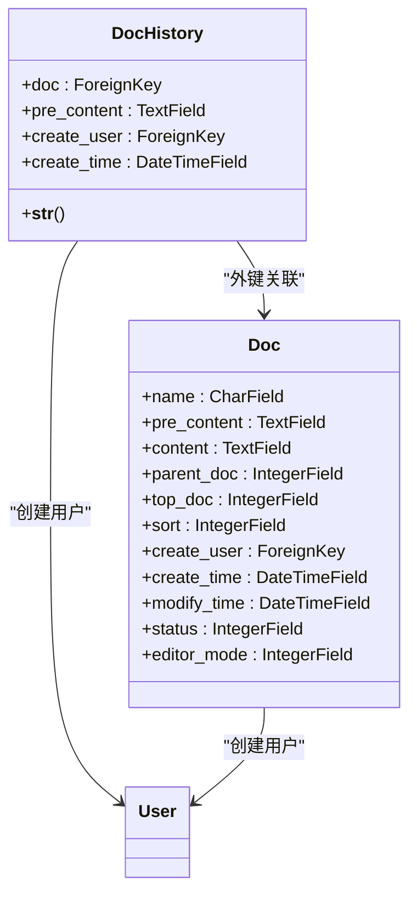
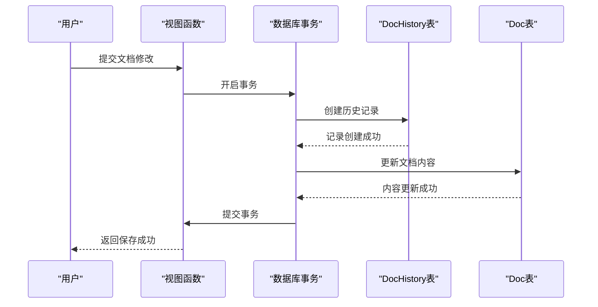
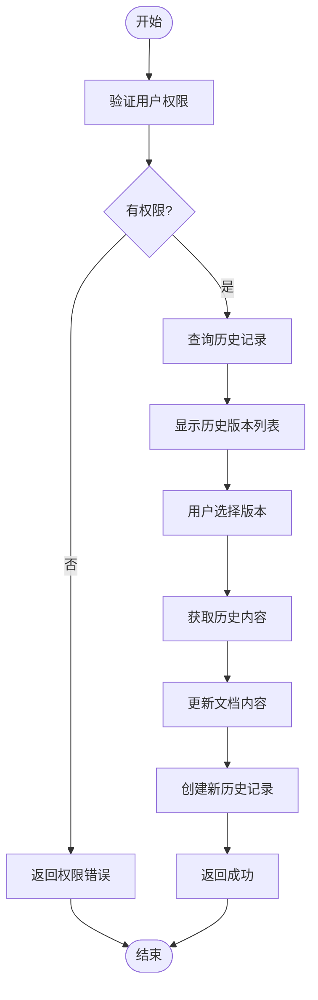
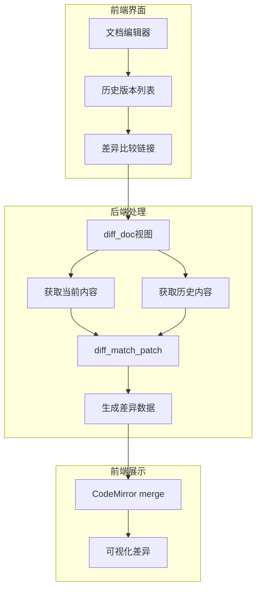

# 文档版本历史

<cite>
**本文档引用的文件**   
- [models.py](file://app_doc/models.py#L105-L116)
- [views.py](file://app_doc/views.py#L1329-L1353)
- [views.py](file://app_doc/views.py#L1687-L1714)
- [tpl_editor_div_doc.html](file://template/app_doc/editor/tpl_editor_div_doc.html#L53-L79)
- [manage_doc_history.html](file://template/app_doc/manage/manage_doc_history.html#L0-L121)
- [merge.js](file://static/docdiff/merge.js#L0-L799)
</cite>

## 目录
1. [文档历史模型](#文档历史模型)
2. [字段数据类型与业务含义](#字段数据类型与业务含义)
3. [历史记录创建机制](#历史记录创建机制)
4. [外键关联与版本回滚](#外键关联与版本回滚)
5. [代码示例](#代码示例)
6. [文档差异比较功能](#文档差异比较功能)

## 文档历史模型

文档历史模型（DocHistory）是系统中用于记录文档变更历史的核心组件。该模型通过保存文档每次编辑前的内容快照，实现了完整的版本控制功能。模型设计遵循数据库规范化原则，与文档模型（Doc）建立外键关联，确保了数据的完整性和一致性。



**图示来源**
- [models.py](file://app_doc/models.py#L105-L116)

## 字段数据类型与业务含义

文档历史模型包含以下关键字段，每个字段都有明确的数据类型和业务含义：

**:doc**
- **数据类型**: `ForeignKey(Doc)`
- **业务含义**: 指向原始文档的外键，建立与文档模型的一对多关系。每个文档可以有多个历史记录，但每个历史记录只能属于一个文档。

**:pre_content**
- **数据类型**: `TextField`
- **业务含义**: 存储文档编辑前的内容快照。该字段允许为空（null=True）和空白（blank=True），以适应文档创建时的初始状态。

**:create_user**
- **数据类型**: `ForeignKey(User)`
- **业务含义**: 记录创建该历史版本的用户。当用户被删除时，该字段设置为NULL（on_delete=models.SET_NULL），以保留历史记录的完整性。

**:create_time**
- **数据类型**: `DateTimeField`
- **业务含义**: 记录历史版本的创建时间。使用`auto_now=True`参数，确保每次保存时自动更新为当前时间戳。

**字段来源**
- [models.py](file://app_doc/models.py#L105-L116)

## 历史记录创建机制

文档历史记录的创建时机和触发条件严格遵循文档编辑流程。当用户保存文档修改时，系统会自动创建历史快照，确保所有变更都有据可查。



**图示来源**
- [views.py](file://app_doc/views.py#L1329-L1353)

### 创建流程

1. **权限验证**: 系统首先验证用户是否有权限修改文档，包括文档创建者、文集创建者或高级协作者。
2. **事务开启**: 使用Django的`transaction.atomic()`装饰器开启数据库事务，确保操作的原子性。
3. **历史记录创建**: 将当前文档的`pre_content`字段值保存到`DocHistory`模型中，同时记录`doc`外键和`create_user`。
4. **文档更新**: 在同一事务中更新文档的`name`、`pre_content`等字段。
5. **事务提交**: 如果所有操作成功，提交事务；如果任何步骤失败，回滚整个事务。

该机制确保了即使在高并发环境下，历史记录与文档内容的一致性也能得到保证。

## 外键关联与版本回滚

文档历史记录通过外键与原始文档建立关联，这种设计支持高效的版本回滚功能。系统通过`doc`字段将历史记录与特定文档关联，使得查询和恢复操作都能快速定位到目标文档。

### 版本回滚实现

版本回滚功能允许用户将文档恢复到任意历史版本。实现过程如下：

1. **历史记录查询**: 根据文档ID查询所有相关的历史记录，按创建时间倒序排列。
2. **版本选择**: 用户通过前端界面选择要恢复的历史版本。
3. **内容恢复**: 将选中历史记录的`pre_content`字段值复制回原始文档的对应字段。
4. **新历史记录创建**: 恢复操作本身也会创建新的历史记录，形成完整的操作链。



**图示来源**
- [views.py](file://app_doc/views.py#L1687-L1714)

## 代码示例

以下是文档历史记录查询和恢复操作的实际代码示例：

### 历史记录查询

```python
# 管理文档历史版本
@login_required()
@require_http_methods(['GET',"POST"])
def manage_doc_history(request,doc_id):
    if request.method == 'GET':
        try:
            doc = Doc.objects.get(id=doc_id,create_user=request.user)
            history_list = DocHistory.objects.filter(
                create_user=request.user,
                doc=doc_id
            ).order_by('-create_time')
            # 分页处理
            paginator = Paginator(history_list, 15)
            page = request.GET.get('page', 1)
            historys = paginator.page(page)
            return render(request, 'app_doc/manage/manage_doc_history.html', locals())
        except Exception as e:
            logger.exception(_("管理文档历史版本页面访问出错"))
            return render(request, '404.html')
```

### 历史记录删除

```python
elif request.method == 'POST':
    try:
        history_id = request.POST.get('history_id','')
        DocHistory.objects.filter(
            id=history_id,
            doc=doc_id,
            create_user=request.user
        ).delete()
        return JsonResponse({'status':True,'data':_('删除成功')})
    except:
        logger.exception(_("操作文档历史版本出错"))
        return JsonResponse({'status':False,'data':_('出现异常')})
```

**代码来源**
- [views.py](file://app_doc/views.py#L1687-L1714)

## 文档差异比较功能

文档差异比较功能（docdiff）与版本历史系统深度集成，为用户提供直观的内容对比体验。该功能基于CodeMirror和diff_match_patch库实现，能够可视化地展示不同版本之间的差异。

### 集成机制

1. **前端集成**: 在文档编辑界面的"历史版本"弹窗中，每个历史记录都包含"查看版本差异"链接。
2. **URL路由**: 点击链接后，跳转到`/diff_doc/<doc_id>/<history_id>`路由，触发差异比较视图。
3. **内容获取**: 系统获取当前文档内容和指定历史版本内容。
4. **差异计算**: 使用diff_match_patch库计算两个版本之间的差异。
5. **可视化展示**: 通过CodeMirror的merge插件，以颜色标记的方式展示新增、删除和修改的内容。



**图示来源**
- [merge.js](file://static/docdiff/merge.js#L0-L799)
- [tpl_editor_div_doc.html](file://template/app_doc/editor/tpl_editor_div_doc.html#L53-L79)

### 差异比较界面

用户界面设计简洁直观，包含以下元素：
- **时间戳**: 显示历史版本的创建时间
- **用户信息**: 显示创建该版本的用户
- **对比按钮**: 跳转到差异比较页面
- **恢复按钮**: 将文档恢复到该历史版本

该功能不仅帮助用户理解文档的演变过程，还为协作编辑提供了重要的参考信息，确保团队成员能够清晰地了解每次变更的具体内容。