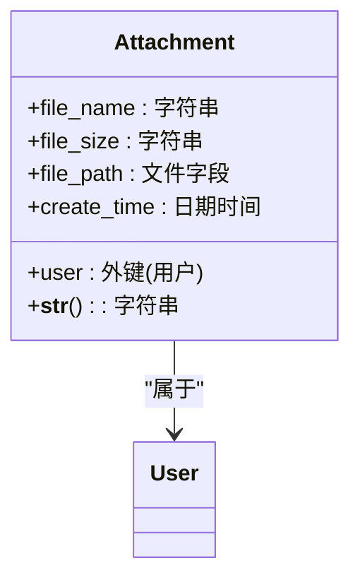
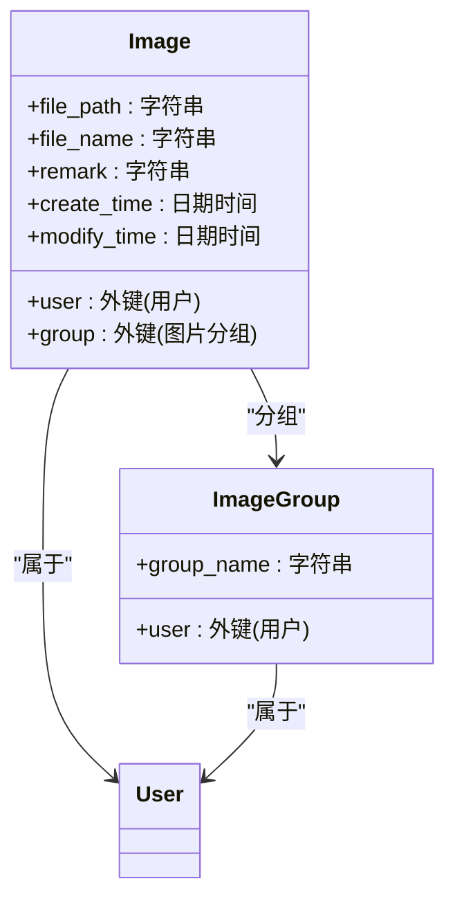
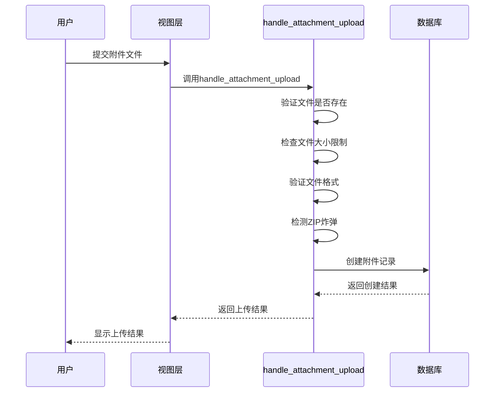
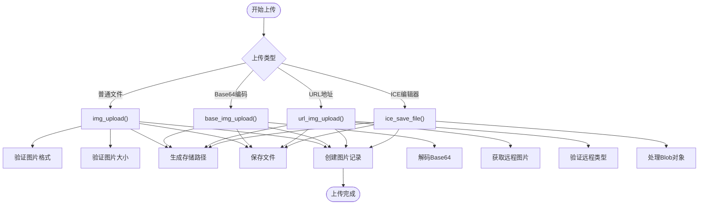
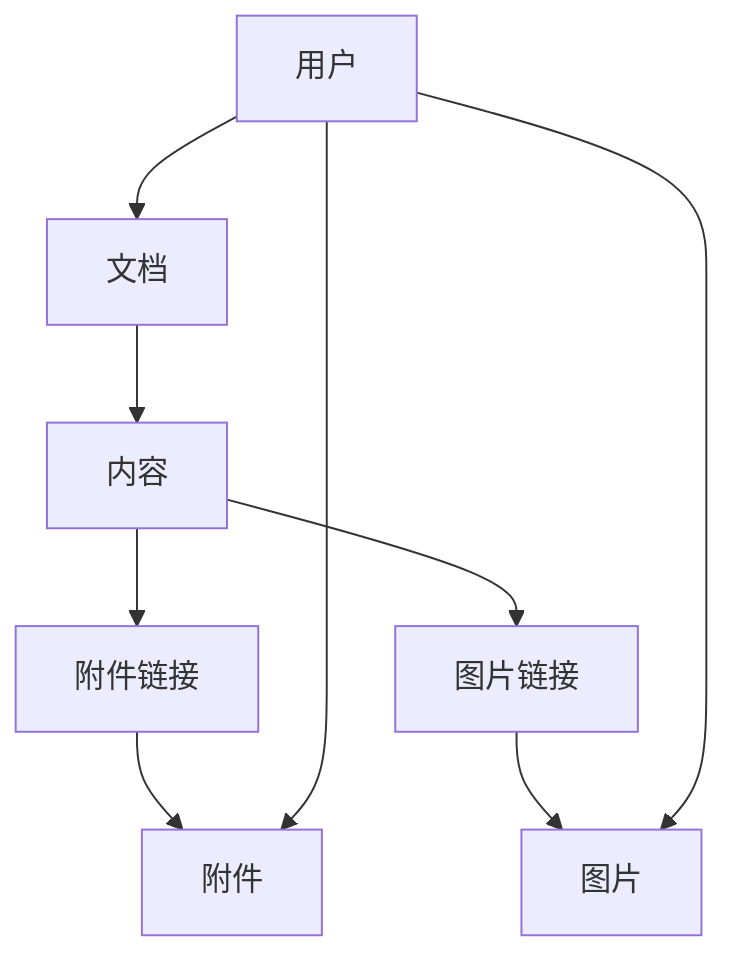
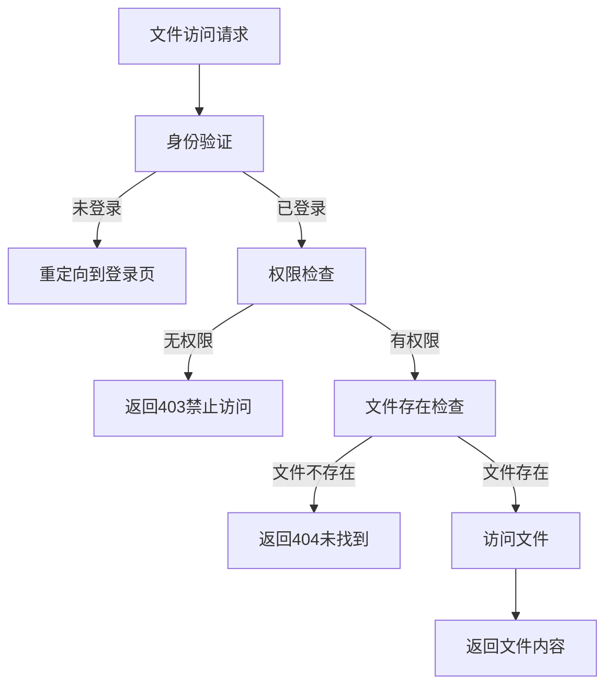

# 文档附件与图片

<cite>
**本文档中引用的文件**   
- [models.py](file://app_doc/models.py#L1-L270)
- [util_upload_file.py](file://app_doc/util_upload_file.py#L1-L86)
- [util_upload_img.py](file://app_doc/util_upload_img.py#L1-L332)
- [views.py](file://app_doc/views.py#L1-L799)
- [SysSetting.py](file://app_admin/models.py#L1-L67)
</cite>

## 目录
1. [文档附件与图片](#文档附件与图片)
2. [附件模型分析](#附件模型分析)
3. [图片模型分析](#图片模型分析)
4. [文件上传处理流程](#文件上传处理流程)
5. [附件与图片的关联关系](#附件与图片的关联关系)
6. [文件权限控制机制](#文件权限控制机制)

## 附件模型分析

附件模型（Attachment）是系统中用于管理用户上传文件的核心数据结构。该模型定义了文件的基本属性和元数据，支持用户在文档中引用和管理各种类型的附件。

**图源**
- [models.py](file://app_doc/models.py#L248-L262)

### 附件模型字段定义

- **file_name**: 字符串类型，最大长度200，表示附件名称，默认值为"mrdoc_附件.zip"。该字段存储用户上传文件的原始名称或系统生成的名称。
- **file_size**: 字符串类型，最大长度100，表示附件大小。该字段存储格式化后的文件大小（如"2.5MB"），便于前端展示。
- **file_path**: 文件字段类型，上传路径为'attachment/%Y/%m/'，表示附件的实际存储路径。Django会自动处理文件的存储和访问。
- **user**: 外键类型，关联Django内置的User模型，表示上传该附件的用户。当用户被删除时，其上传的所有附件也将被级联删除。
- **create_time**: 日期时间类型，自动设置为创建时间，用于记录附件上传的时间戳。

**节源**
- [models.py](file://app_doc/models.py#L248-L262)

## 图片模型分析

图片模型（Image）是系统中用于管理用户上传图片的核心数据结构。与附件模型相比，图片模型具有更丰富的元数据，支持图片分类和管理。

**图源**
- [models.py](file://app_doc/models.py#L228-L246)

### 图片模型字段定义

- **user**: 外键类型，关联Django内置的User模型，表示上传该图片的用户。
- **file_path**: 字符串类型，最大长度250，表示图片的访问路径。该路径是相对于MEDIA_URL的相对路径，便于前端直接引用。
- **file_name**: 字符串类型，最大长度250，表示图片名称。该字段可为空，允许系统自动生成文件名。
- **group**: 外键类型，关联ImageGroup模型，表示图片所属的分组。当分组被删除时，该字段可为空（SET_NULL）。
- **remark**: 字符串类型，最大长度250，默认值为"图片描述"，表示图片的备注信息。
- **create_time**: 日期时间类型，自动设置为创建时间，记录图片上传的时间。
- **modify_time**: 日期时间类型，自动更新为修改时间，记录图片信息最后修改的时间。

**节源**
- [models.py](file://app_doc/models.py#L228-L246)

## 文件上传处理流程

文件上传处理流程是系统的核心功能之一，包括附件上传和图片上传两种主要类型。系统通过专门的工具函数来处理不同类型的文件上传请求。

### 附件上传流程

附件上传主要通过`util_upload_file.py`中的`handle_attachment_upload`函数实现。该函数处理用户上传的附件文件，并进行一系列验证和处理。

**图源**
- [util_upload_file.py](file://app_doc/util_upload_file.py#L25-L85)

#### 附件上传逻辑

1. **文件验证**: 首先检查上传的文件对象是否存在，若不存在则返回"无效文件"错误。
2. **大小限制**: 从系统设置中获取允许的附件大小限制（默认50MB），若文件超过限制则返回"文件大小超出限制"错误。
3. **格式验证**: 从系统设置中获取允许的附件格式列表（默认仅允许zip），若文件格式不在允许列表中则返回"不支持的格式"错误。
4. **ZIP炸弹检测**: 对于zip文件，系统会临时保存文件并检测是否存在ZIP炸弹攻击，若检测到则返回"检测到可能的ZIP炸弹"错误。
5. **文件保存**: 通过Django的文件字段机制自动保存文件，并在数据库中创建附件记录。

**节源**
- [util_upload_file.py](file://app_doc/util_upload_file.py#L25-L85)

### 图片上传流程

图片上传主要通过`util_upload_img.py`中的多个函数实现，支持多种上传方式，包括普通文件上传、base64编码上传、URL上传等。

**图源**
- [util_upload_img.py](file://app_doc/util_upload_img.py#L1-L332)

#### 图片上传逻辑

1. **多方式支持**: 系统支持多种图片上传方式，包括普通文件上传、粘贴上传（Base64编码）、URL上传等。
2. **格式验证**: 从系统设置中获取允许的图片格式列表，若上传的图片格式不在允许列表中则返回相应错误。
3. **大小限制**: 从系统设置中获取允许的图片大小限制（默认10MB），若图片超过限制则返回"图片大小超出限制"错误。
4. **文件命名规则**: 系统采用"日期时间_随机字符串.扩展名"的命名规则，确保文件名的唯一性。
5. **存储路径管理**: 使用`upload_generation_dir`函数生成按年月组织的存储目录，便于文件管理和维护。

**节源**
- [util_upload_img.py](file://app_doc/util_upload_img.py#L1-L332)

## 附件与图片的关联关系

附件和图片与文档的关联关系是系统的重要功能，允许用户在文档编辑器中引用和管理这些资源。

### 文件与文档的关联

虽然附件模型和图片模型没有直接关联到文档模型，但通过文档内容中的引用实现关联。用户在文档编辑器中插入附件或图片链接，系统会自动解析并显示相应资源。

**图源**
- [models.py](file://app_doc/models.py#L1-L270)

### 文档编辑器中的资源引用

在文档编辑器中，用户可以通过以下方式引用附件和图片：

1. **图片引用**: 使用Markdown语法``或HTML标签``引用图片。
2. **附件引用**: 使用Markdown链接语法`[附件名称](附件URL)`引用附件，用户点击链接即可下载附件。

系统在渲染文档内容时，会自动解析这些引用并显示相应的资源预览或下载链接。

**节源**
- [views.py](file://app_doc/views.py#L1-L799)

## 文件权限控制机制

文件权限控制机制确保只有授权用户才能访问特定的附件和图片资源，保护用户数据的安全性。

### 基于用户的权限控制

系统通过以下方式实现文件权限控制：

1. **所有权验证**: 每个附件和图片都关联到上传用户，只有该用户或管理员才能管理这些资源。
2. **文集权限继承**: 虽然附件和图片本身没有权限设置，但其访问权限通常继承自所属文集的权限设置。
3. **API访问控制**: 所有文件上传和管理接口都要求用户登录，通过`@login_required`装饰器实现基本的访问控制。

**图源**
- [util_upload_img.py](file://app_doc/util_upload_img.py#L1-L332)
- [util_upload_file.py](file://app_doc/util_upload_file.py#L1-L86)

### 权限控制实现

1. **装饰器应用**: 在文件上传和管理视图函数上使用`@login_required`和`@csrf_exempt`装饰器，确保只有登录用户才能访问。
2. **系统设置集成**: 文件大小和格式限制通过系统设置模型（SysSetting）统一管理，管理员可以在后台配置这些限制。
3. **安全防护**: 系统实现了ZIP炸弹检测、XSS过滤等安全措施，防止恶意文件上传和攻击。

**节源**
- [util_upload_file.py](file://app_doc/util_upload_file.py#L25-L85)
- [util_upload_img.py](file://app_doc/util_upload_img.py#L1-L332)
- [SysSetting.py](file://app_admin/models.py#L1-L67)