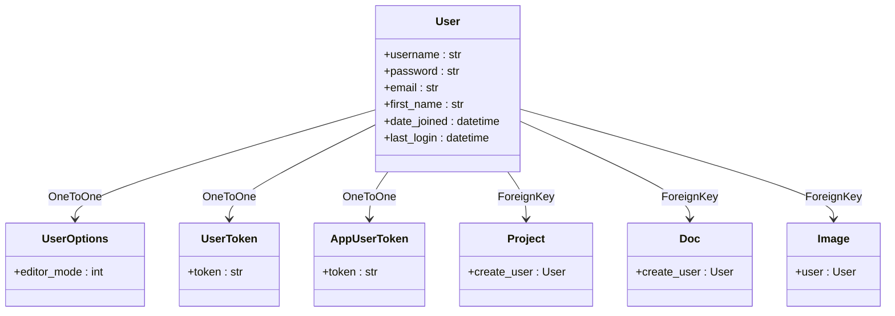
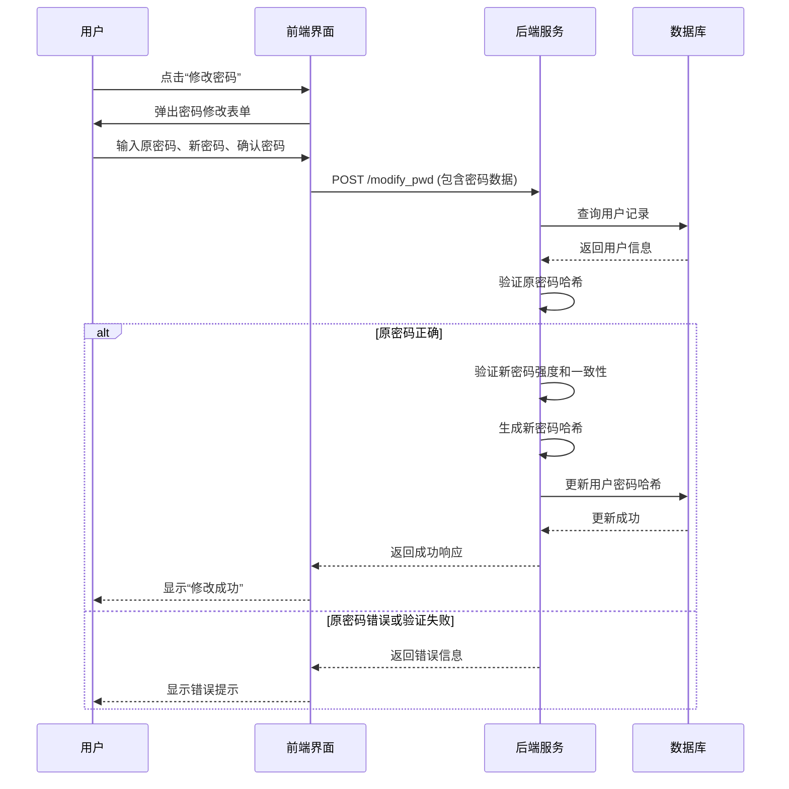
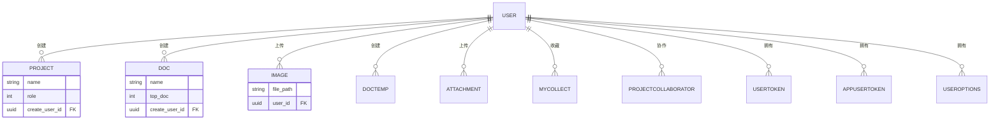

# 用户核心模型

<cite>
**本文档引用文件**   
- [app_admin/models.py](file://app_admin/models.py)
- [app_api/models.py](file://app_api/models.py)
- [app_doc/models.py](file://app_doc/models.py)
- [template/app_admin/admin_user_profile.html](file://template/app_admin/admin_user_profile.html)
- [template/app_doc/manage/manage_self.html](file://template/app_doc/manage/manage_self.html)
- [template/register.html](file://template/register.html)
- [README.md](file://README.md)
</cite>

## 目录
1. [用户核心模型概述](#用户核心模型概述)
2. [用户模型字段定义](#用户模型字段定义)
3. [用户状态与权限管理](#用户状态与权限管理)
4. [用户认证与密码管理](#用户认证与密码管理)
5. [用户选项与个性化设置](#用户选项与个性化设置)
6. [用户数据完整性与验证](#用户数据完整性与验证)
7. [用户与其他模型的关系](#用户与其他模型的关系)
8. [用户创建与管理流程](#用户创建与管理流程)

## 用户核心模型概述

MrDoc系统中的用户核心模型基于Django内置的`User`模型构建，通过外键关联的方式扩展了多种自定义功能。系统未直接继承或修改Django的`AbstractUser`，而是通过在`app_admin`、`app_api`和`app_doc`等应用中创建新的模型来实现功能扩展。这种设计模式遵循了关注点分离的原则，将用户核心信息与特定业务逻辑解耦。

用户的核心信息（如用户名、密码、邮箱、注册时间等）由Django的`auth.User`模型统一管理，确保了安全性和标准化。所有其他应用中的模型通过`models.ForeignKey(User, on_delete=models.CASCADE)`或`models.OneToOneField(User, on_delete=models.CASCADE)`的方式与之建立关联，从而实现对用户数据的引用和扩展。

**Section sources**
- [app_admin/models.py](file://app_admin/models.py#L1)
- [app_api/models.py](file://app_api/models.py#L1)
- [app_doc/models.py](file://app_doc/models.py#L1)

## 用户模型字段定义

本节详细描述与用户相关的所有核心字段及其数据类型、约束条件。

### Django内置用户模型字段

Django的`auth.User`模型提供了以下核心字段，这些字段构成了用户身份的基础：
- **username** (CharField): 用户名，用于唯一标识用户。在注册页面(`template/register.html`)中，要求为小写英文字母或数字，且不少于5位。
- **password** (CharField): 密码，以哈希值形式存储。系统使用Django默认的密码哈希机制（如PBKDF2）进行加密，确保密码安全。
- **email** (EmailField): 电子邮箱，用于用户联系和身份验证。在用户资料编辑页面(`template/app_admin/admin_user_profile.html`和`template/app_doc/manage/manage_self.html`)中可进行修改。
- **first_name** (CharField): 名字，在系统中通常用作“昵称”显示。用户可以在个人设置中修改此字段。
- **date_joined** (DateTimeField): 用户注册时间，由Django自动在用户创建时填充。
- **last_login** (DateTimeField): 用户最后一次登录时间，由Django自动更新。

### 扩展模型中的用户相关字段

系统通过以下模型对用户功能进行了扩展：

**Diagram sources**
- [app_admin/models.py](file://app_admin/models.py#L30)
- [app_api/models.py](file://app_api/models.py#L5)
- [app_doc/models.py](file://app_doc/models.py#L10)

**Section sources**
- [app_admin/models.py](file://app_admin/models.py#L30-L35)
- [app_api/models.py](file://app_api/models.py#L5-L15)
- [app_doc/models.py](file://app_doc/models.py#L10-L269)

## 用户状态与权限管理

用户状态和权限是系统安全控制的核心，决定了用户在平台中的行为能力。

### 用户状态字段

- **is_active** (BooleanField): 用户激活状态。在管理员用户资料编辑页面(`template/app_admin/admin_user_profile.html`)中，通过一个开关（Switch）控件进行管理。当值为`False`时，用户账户被停用，无法登录系统。
- **is_staff** (BooleanField): 员工状态。此字段在代码中未直接定义，但属于Django `User`模型的一部分。通常用于标识用户是否有权限访问Django管理后台。
- **is_superuser** (BooleanField): 超级用户状态。在管理员用户资料编辑页面中，通过一个下拉选择框进行管理，选项为“普通用户”和“超级管理员”。超级用户拥有系统最高权限，可以管理所有数据。

### 用户角色与权限

除了Django内置的权限系统，MrDoc还通过业务模型实现了更细粒度的权限控制：
- **文集权限 (Project.role)**: 定义了文集的可见性，如公开、私密、指定用户可见等。
- **文集协作 (ProjectCollaborator.role)**: 定义了协作用户在文集中的操作权限，如是否可以修改所有文档。

## 用户认证与密码管理

系统的用户认证流程严谨，确保了用户身份的安全。

### 用户认证流程

1.  **用户创建**: 用户通过注册页面(`template/register.html`)填写用户名、邮箱和密码进行注册。系统会验证输入信息的合法性。
2.  **密码加密**: 用户提交的密码不会以明文存储。Django会自动使用其内置的密码哈希算法（如PBKDF2）对密码进行加密，并将哈希值存入数据库。
3.  **用户登录**: 用户在登录时输入用户名和密码。系统会获取数据库中存储的密码哈希值，并使用相同的算法对用户输入的密码进行哈希，然后比较两个哈希值是否匹配。
4.  **会话管理**: 认证成功后，系统会创建一个会话（Session），并在用户的浏览器中设置一个会话Cookie，用于维持登录状态。

### 密码修改流程

用户可以在个人设置页面修改密码。流程如下：
1.  在`manage_self.html`或管理员的`admin_user_profile.html`页面，点击“修改密码”按钮。
2.  弹出一个模态框，要求用户输入原密码、新密码和确认新密码。
3.  前端通过AJAX将数据发送到`/modify_pwd`接口。
4.  后端接收到请求后，首先验证原密码是否正确，然后验证新密码的强度和一致性，最后更新用户的密码哈希值。

**Diagram sources**
- [template/app_doc/manage/manage_self.html](file://template/app_doc/manage/manage_self.html#L74-L108)
- [template/app_admin/admin_user_profile.html](file://template/app_admin/admin_user_profile.html#L98-L126)

**Section sources**
- [template/app_doc/manage/manage_self.html](file://template/app_doc/manage/manage_self.html#L74-L108)
- [template/app_admin/admin_user_profile.html](file://template/app_admin/admin_user_profile.html#L98-L126)

## 用户选项与个性化设置

系统允许用户进行个性化设置，提升使用体验。

### 用户选项模型 (UserOptions)

位于`app_admin/models.py`中，用于存储用户的个性化配置。
- **user** (ForeignKey): 外键，关联到Django的`User`模型，确保每个用户只有一条配置记录。
- **editor_mode** (IntegerField): 编辑器选项。值为`1`表示使用Editormd编辑器，值为`2`表示使用Vditor编辑器。用户可以在个人设置中更改此选项。

## 用户数据完整性与验证

系统通过多种机制确保用户数据的完整性和有效性。

### 数据完整性约束

- **唯一性约束**: `User.username`和`User.email`字段在Django模型中默认具有唯一性约束，防止重复注册。
- **外键约束**: 所有引用`User`模型的外键都设置了`on_delete=models.CASCADE`，这意味着当一个用户被删除时，该用户创建的所有文集、文档、图片等数据也会被级联删除，保证了数据的一致性。
- **非空约束**: 关键字段如`username`、`password`等在数据库层面被设置为非空。

### 数据验证规则

- **前端验证**: 在注册和用户资料编辑页面，使用HTML5和JavaScript对输入进行即时验证，例如邮箱格式、密码长度等。
- **后端验证**: Django的`UserCreationForm`和`UserChangeForm`等表单类提供了强大的后端验证逻辑，确保只有符合规则的数据才能被保存。

## 用户与其他模型的关系

用户是系统中几乎所有内容的创建者，与其他模型存在广泛的外键关系。

**Diagram sources**
- [app_doc/models.py](file://app_doc/models.py#L10-L269)
- [app_api/models.py](file://app_api/models.py#L5-L25)
- [app_admin/models.py](file://app_admin/models.py#L30-L35)

**Section sources**
- [app_doc/models.py](file://app_doc/models.py#L10-L269)

## 用户创建与管理流程

### 普通用户创建

普通用户通过访问`/register`页面，填写注册表单（用户名、邮箱、密码、验证码）来创建账户。系统会验证信息的唯一性和有效性后，创建新的`User`对象。

### 管理员用户创建

系统管理员可以通过两种方式创建用户：
1.  **通过管理后台**: 在`/admin`界面中，使用Django Admin提供的用户管理功能。
2.  **通过命令行**: 根据`README.md`中的说明，使用`python manage.py createsuperuser`命令创建超级用户。

### 用户管理

管理员可以在`/admin/user/`页面对用户进行管理，包括查看用户列表、编辑用户资料（修改邮箱、昵称、状态、角色）和重置密码。

**Section sources**
- [README.md](file://README.md#L107-L116)
- [template/register.html](file://template/register.html#L66-L87)
- [template/app_admin/admin_user.html](file://template/app_admin/admin_user.html#L111-L144)