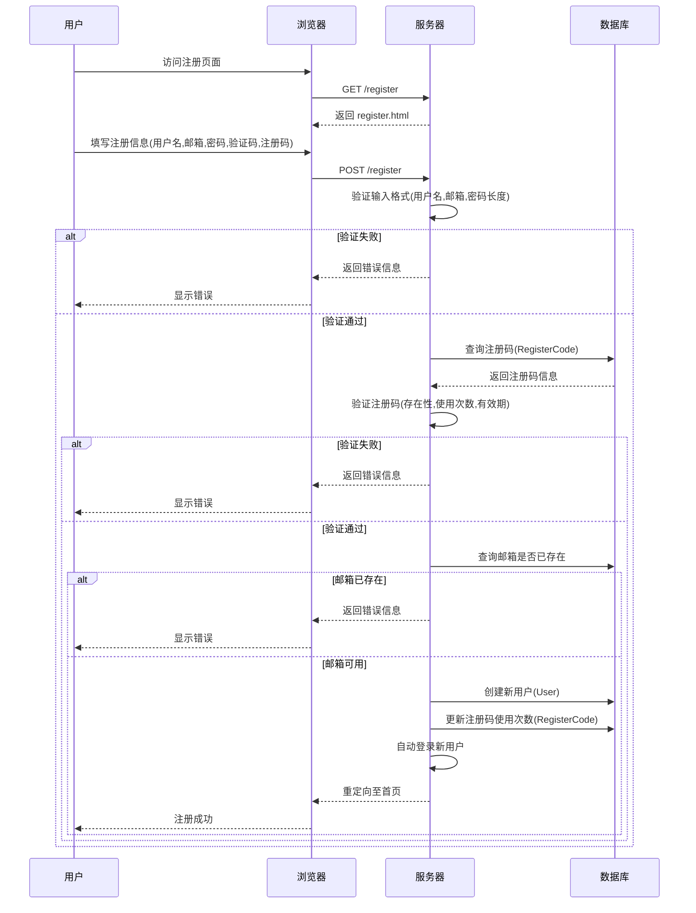
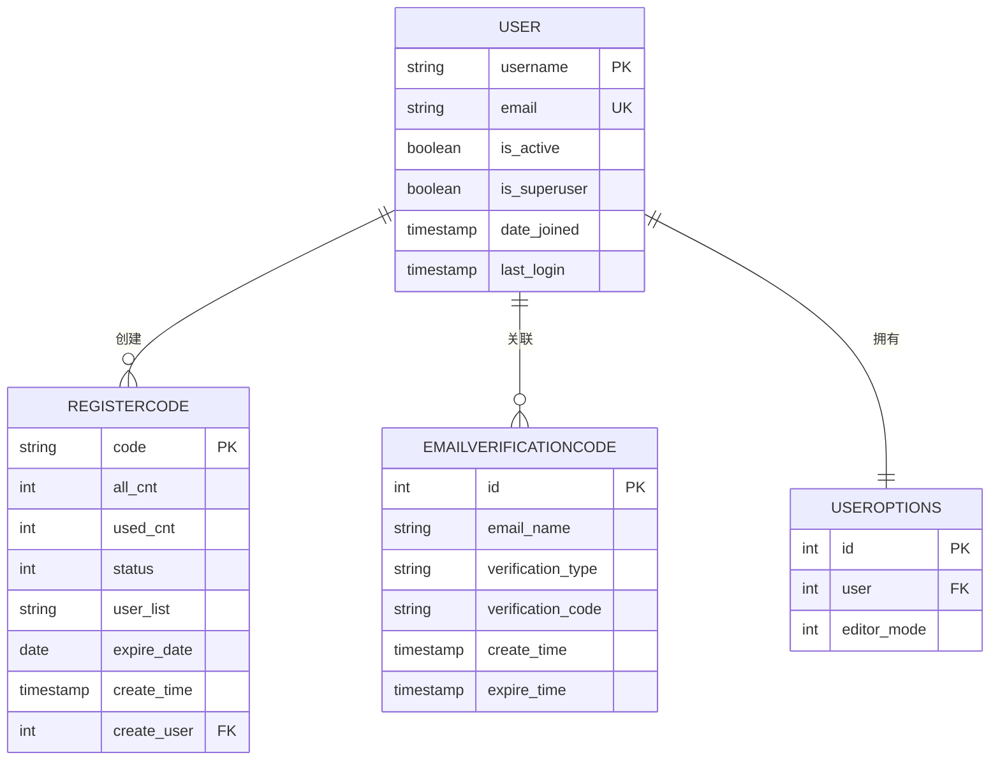

# 用户模型

<cite>
**本文档中引用的文件**
- [app_admin/models.py](file://app_admin/models.py)
- [app_admin/views.py](file://app_admin/views.py)
</cite>

## 目录
1. [用户模型](#用户模型)
2. [核心用户数据模型](#核心用户数据模型)
   - [User 模型](#user-模型)
   - [RegisterCode 模型](#registercode-模型)
   - [EmailVerificationCode 模型](#emailverificationcode-模型)
   - [UserOptions 模型](#useroptions-模型)
3. [用户注册与验证流程](#用户注册与验证流程)
4. [用户权限与管理机制](#用户权限与管理机制)
5. [用户数据安全与生命周期](#用户数据安全与生命周期)
6. [数据库关系图](#数据库关系图)

## 核心用户数据模型

### User 模型
`User` 模型是系统的基础用户模型，继承自 Django 内置的 `auth.models.User`，用于存储系统中所有用户的基本信息和认证数据。

**字段定义：**
- **username**: 用户名，字符串类型，用于唯一标识用户，必须为小写字母和数字组合，长度不少于5位。
- **email**: 电子邮箱，字符串类型，用于用户注册、登录和密码找回，必须唯一。
- **password**: 密码，经过加密存储，用于用户身份验证。
- **is_active**: 布尔类型，表示用户账户是否激活（未被禁用）。
- **is_superuser**: 布尔类型，标识用户是否为超级管理员，拥有所有权限。
- **date_joined**: 时间戳，记录用户注册时间。
- **last_login**: 时间戳，记录用户最后一次登录时间。

该模型由 Django 框架提供，是系统用户体系的核心。

**Section sources**
- [app_admin/views.py](file://app_admin/views.py#L54-L82)

### RegisterCode 模型
`RegisterCode` 模型用于管理用户注册邀请码，实现受控的用户注册机制。

**字段定义：**
- **code**: 注册邀请码，字符串类型，唯一标识一个注册码。
- **all_cnt**: 有效注册数量，整数类型，默认为1，表示该注册码最多可被使用多少次。
- **used_cnt**: 已使用数量，整数类型，默认为0，记录该注册码已被使用的次数。
- **status**: 注册码状态，整数类型，0表示已满（不可用），1表示有效。
- **user_list**: 使用此注册码的用户列表，字符串类型，以逗号分隔的邮箱列表。
- **expire_date**: 注册码有效期，日期类型，可为空，表示注册码的过期日期。
- **create_user**: 创建者，外键关联 `User` 模型，记录创建此注册码的用户。
- **create_time**: 创建时间，时间戳，自动记录注册码的创建时间。

**功能说明：**
当系统管理员在后台开启“注册码注册”功能后，新用户必须提供有效的注册码才能完成注册。系统会验证注册码的：
1. **存在性**：注册码是否存在于数据库中。
2. **使用次数**：`used_cnt` 是否小于 `all_cnt`。
3. **有效期**：`expire_date` 是否已过期。

验证通过后，`used_cnt` 会递增，并将用户邮箱添加到 `user_list` 中。当 `used_cnt` 达到 `all_cnt` 时，`status` 会自动更新为0，使注册码失效。

**Section sources**
- [app_admin/models.py](file://app_admin/models.py#L50-L66)
- [app_admin/views.py](file://app_admin/views.py#L130-L157)

### EmailVerificationCode 模型
`EmailVerificationCode` 模型用于管理电子邮件验证码，主要应用于“忘记密码”功能。

**字段定义：**
- **email_name**: 电子邮箱，邮箱类型，接收验证码的目标邮箱。
- **verification_type**: 验证码类型，字符串类型，例如“忘记密码”。
- **verification_code**: 验证码，字符串类型，通常为6位数字或字母组合。
- **create_time**: 创建时间，时间戳，自动记录验证码的生成时间。
- **expire_time**: 过期时间，时间戳，记录验证码的有效截止时间。

**功能说明：**
当用户在“忘记密码”页面输入邮箱并请求验证码时，系统会：
1. 生成一个随机的 `verification_code`。
2. 设置一个 `expire_time`（例如30分钟后过期）。
3. 将记录保存到 `EmailVerificationCode` 表中。
4. 通过邮件将验证码发送给用户。

用户提交新密码时，系统会查询数据库，验证邮箱、验证码和过期时间是否匹配，全部匹配则允许修改密码。

**Section sources**
- [app_admin/models.py](file://app_admin/models.py#L37-L49)
- [app_admin/views.py](file://app_admin/views.py#L242-L280)

### UserOptions 模型
`UserOptions` 模型用于存储用户的个性化设置。

**字段定义：**
- **user**: 用户，外键关联 `User` 模型，一对一关系，表示该设置属于哪个用户。
- **editor_mode**: 编辑器选项，整数类型，1表示使用 `Editormd` 编辑器，2表示使用 `Vditor` 编辑器，默认为1。

**功能说明：**
此模型允许用户根据个人偏好选择文档编辑器。用户的设置在登录后会被加载，并影响其在文档编辑页面的体验。

**Section sources**
- [app_admin/models.py](file://app_admin/models.py#L28-L35)

## 用户注册与验证流程

用户注册流程是一个多步骤的验证过程，确保了账户的安全性和有效性。

**Diagram sources**
- [app_admin/views.py](file://app_admin/views.py#L130-L212)

## 用户权限与管理机制

系统实现了基于角色的权限控制（RBAC），区分普通用户和超级管理员。

**权限等级：**
- **普通用户**：可以创建和管理自己的文集、文档，参与协作项目。
- **超级管理员 (Superuser)**：拥有所有权限，可以管理所有用户、文集和系统设置。

**管理机制：**
1. **创建用户**：超级管理员可以在后台管理界面创建新用户，并指定其为普通用户或管理员。
2. **修改用户**：可以修改用户的用户名、昵称、邮箱、状态（激活/禁用）和管理员权限。
3. **删除用户**：删除用户时，系统会自动处理其关联数据：
   - 删除该用户创建的所有文集及其下的所有文档。
   - 对于该用户作为协作者参与的文集，将其创建的文档的作者修改为文集所有者。

此机制确保了数据的完整性和一致性。

**Section sources**
- [app_admin/views.py](file://app_admin/views.py#L340-L450)

## 用户数据安全与生命周期

### 数据安全
- **密码安全**：用户密码使用 Django 的 `set_password()` 方法进行哈希加密存储，永远不会以明文形式保存。
- **会话安全**：用户登录后，会话信息存储在服务器端，通过安全的 Cookie 进行管理。
- **验证码安全**：登录和注册时的图形验证码（`check_code`）和邮箱验证码（`EmailVerificationCode`）均有时效性，防止暴力破解。

### 数据生命周期
- **创建**：用户通过注册流程或管理员创建。
- **活跃**：用户正常使用系统功能。
- **禁用**：管理员可以将 `is_active` 设置为 `False`，禁止用户登录。
- **删除**：管理员删除用户时，系统会执行级联删除和数据迁移操作，确保无残留数据。

## 数据库关系图

**Diagram sources**
- [app_admin/models.py](file://app_admin/models.py#L28-L66)