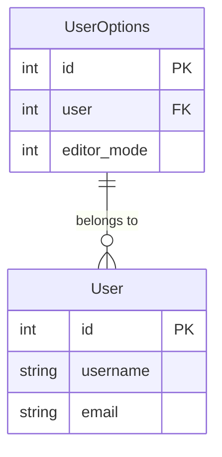

# 用户选项模型

<cite>
**本文档引用的文件**   
- [models.py](file://app_admin/models.py#L19-L38)
- [0008_useroptions.py](file://app_admin/migrations/0008_useroptions.py#L16-L27)
- [views.py](file://app_doc/views.py#L25-L3359)
</cite>

## 目录
1. [用户选项模型](#用户选项模型)
2. [字段定义](#字段定义)
3. [初始化与默认值](#初始化与默认值)
4. [读取与更新机制](#读取与更新机制)
5. [应用场景](#应用场景)
6. [代码示例](#代码示例)
7. [安全考虑](#安全考虑)

## 字段定义

用户选项模型（UserOptions）是一个Django模型，用于存储用户的个性化设置。该模型与Django内置的User模型建立了一对一的关系，通过外键`user`字段实现关联。模型主要包含以下字段：

- **user**: 外键字段，关联到Django的`User`模型，表示该选项属于哪个用户。当用户被删除时，其对应的用户选项也会被级联删除。
- **editor_mode**: 整数字段，用于存储用户选择的编辑器模式。默认值为1，表示默认使用Editormd编辑器。值为2时表示用户选择使用Vditor编辑器。



**图示来源**
- [models.py](file://app_admin/models.py#L19-L38)

**本节来源**
- [models.py](file://app_admin/models.py#L19-L38)

## 初始化与默认值

用户选项的初始化通常在用户首次访问需要个性化设置的功能时进行。系统会尝试获取当前用户的`UserOptions`实例。如果实例不存在，则会创建一个新实例，并使用预设的默认值进行初始化。

默认值策略如下：
- `editor_mode`字段的默认值设置为1，这在模型定义中通过`default=1`参数指定。这意味着，如果用户没有明确选择编辑器，系统将默认使用Editormd编辑器。

这种延迟初始化的策略避免了在用户注册时就创建不必要的选项记录，只有当用户实际需要使用这些设置时才进行创建，从而优化了数据库的存储和性能。

**本节来源**
- [models.py](file://app_admin/models.py#L27)

## 读取与更新机制

用户选项的读取和更新是通过Django ORM（对象关系映射）完成的。

**读取机制**：
在视图中，通过`UserOptions.objects.get(user=request.user)`来获取当前登录用户的选项。此操作会查询数据库，返回一个`UserOptions`对象。如果用户没有选项记录，会抛出`ObjectDoesNotExist`异常，此时代码会捕获该异常并使用默认值（如`editor_mode = 1`）。

**更新机制**：
更新用户选项通常使用`update_or_create`方法。该方法会根据`user`字段查找是否存在对应的记录。如果存在，则更新`editor_mode`等字段；如果不存在，则创建一条新记录。这种方式确保了每个用户只有一条选项记录，避免了数据重复。

```python
user_opt = UserOptions.objects.update_or_create(
    user=request.user,
    defaults={'editor_mode': editor_mode}
)
```

**本节来源**
- [views.py](file://app_doc/views.py#L3359)

## 应用场景

用户选项模型主要应用于需要根据用户偏好定制界面和功能的场景，最典型的应用是**编辑器选择**。

当用户进入文档创建或编辑页面时，系统会读取其`editor_mode`设置，并据此加载相应的编辑器（Editormd或Vditor）。这使得不同用户可以根据自己的习惯使用不同的编辑工具，提升了用户体验。

此外，该模型的设计为未来扩展其他用户个性化设置（如界面主题、通知偏好等）提供了基础架构。只需在`UserOptions`模型中添加新的字段，即可轻松实现更多个性化功能。

**本节来源**
- [views.py](file://app_doc/views.py#L1179)

## 代码示例

以下是在视图中获取和修改用户选项的实际代码示例：

**获取用户选项（在创建文档时）**:
```python
# 尝试获取用户的编辑器模式
try:
    user_opt = UserOptions.objects.get(user=request.user)
    editor_mode = user_opt.editor_mode
except ObjectDoesNotExist:
    # 如果用户没有设置，则使用默认值
    editor_mode = 1
```

**更新用户选项（在用户更改设置后）**:
```python
# 更新或创建用户的编辑器选项
user_opt = UserOptions.objects.update_or_create(
    user=request.user,
    defaults={'editor_mode': editor_mode}
)
```

**本节来源**
- [views.py](file://app_doc/views.py#L1179)
- [views.py](file://app_doc/views.py#L3359)

## 安全考虑

在用户选项模型的实现中，主要的安全考虑点是**访问控制**。

- **数据隔离**：每个`UserOptions`记录都通过`user`外键与特定用户绑定。在读取或更新选项时，始终使用`request.user`作为查询条件，确保用户只能访问和修改自己的选项，无法查看或篡改其他用户的数据。
- **数据隐私**：用户选项通常不包含敏感信息（如密码），而是存储功能偏好。即使数据泄露，风险也相对较低。但作为最佳实践，仍应遵循最小权限原则，仅在必要时访问这些数据。
- **输入验证**：在更新`editor_mode`等字段时，虽然代码中没有显式的验证逻辑，但前端通常会限制用户的选择范围（例如，只能在1和2之间选择），后端通过模型的字段类型（IntegerField）也提供了基本的类型安全。

**本节来源**
- [views.py](file://app_doc/views.py#L3359)