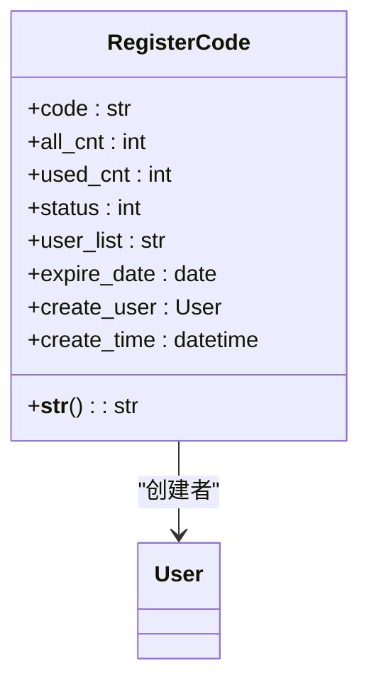
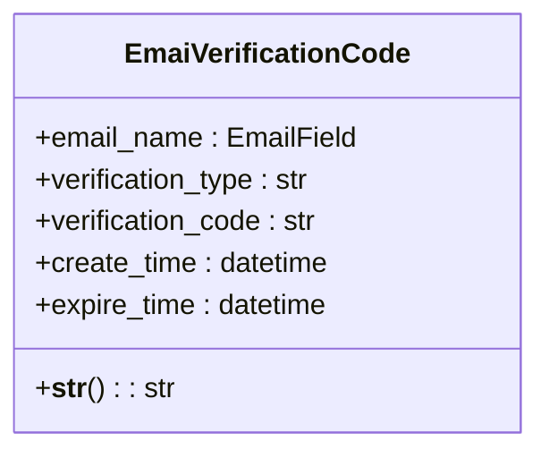
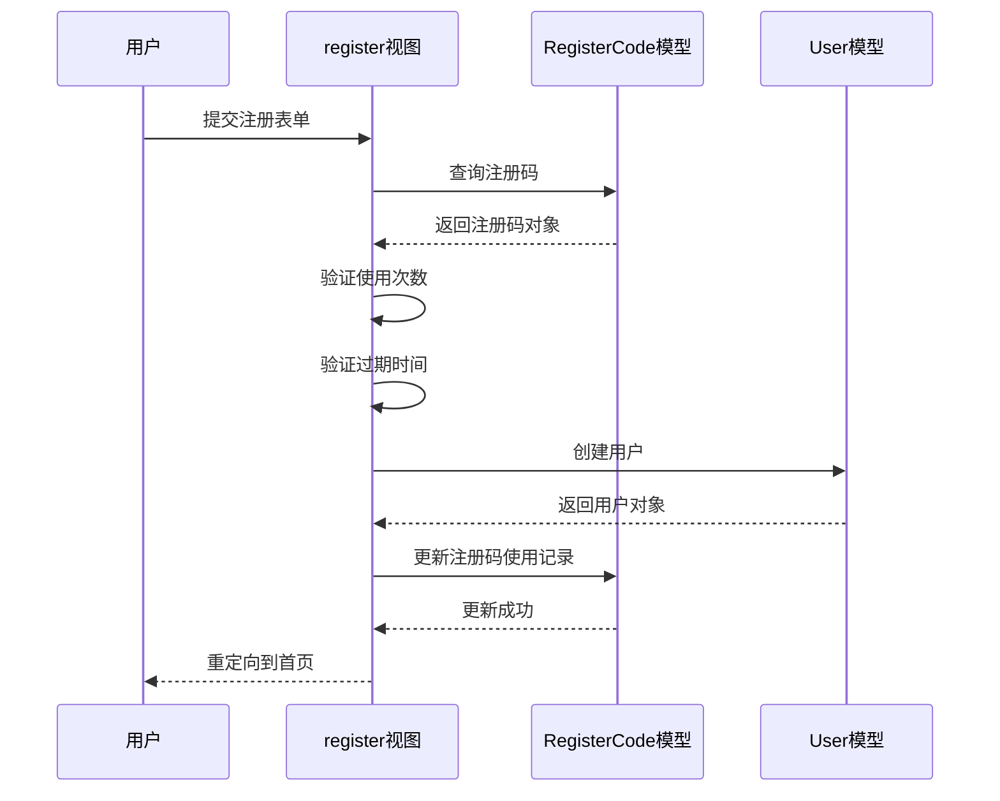
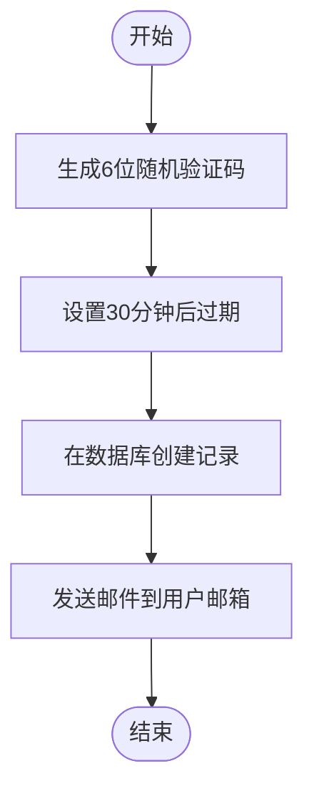
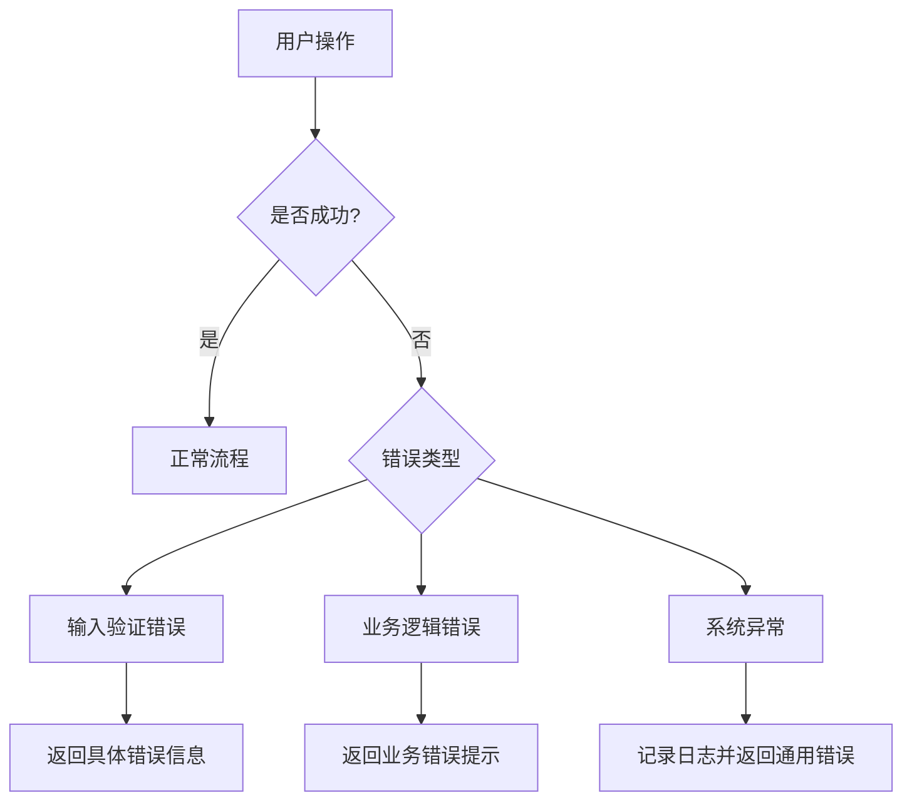

# 认证管理

<cite>
**本文档引用的文件**
- [models.py](file://app_admin/models.py#L33-L66)
- [views.py](file://app_admin/views.py#L130-L240)
- [check_code.py](file://app_admin/check_code.py#L1-L113)
</cite>

## 目录
1. [注册码模型](#注册码模型)
2. [邮箱验证代码模型](#邮箱验证代码模型)
3. [用户注册流程](#用户注册流程)
4. [验证码生成与验证机制](#验证码生成与验证机制)
5. [安全策略](#安全策略)
6. [错误处理机制](#错误处理机制)

## 注册码模型

注册码模型（RegisterCode）用于管理用户注册邀请码的生命周期和使用限制。该模型定义了注册码的核心属性和状态管理机制。



**模型字段说明：**
- **code**: 注册邀请码，字符串类型，最大长度10个字符，唯一标识
- **all_cnt**: 有效注册数量，整数类型，默认值为1，表示注册码最多可被使用的次数
- **used_cnt**: 已使用数量，整数类型，默认值为0，记录注册码已被使用的次数
- **status**: 注册码状态，整数类型，0表示已满（失效），1表示有效
- **user_list**: 使用此注册码的用户列表，字符串类型，最大长度500个字符
- **expire_date**: 注册码有效期，日期类型，可为空，用于设置注册码的过期时间
- **create_user**: 创建用户，外键关联Django默认用户模型
- **create_time**: 创建时间，日期时间类型，自动更新为当前时间

**Diagram sources**
- [models.py](file://app_admin/models.py#L48-L66)

**Section sources**
- [models.py](file://app_admin/models.py#L48-L66)

## 邮箱验证代码模型

邮箱验证代码模型（EmaiVerificationCode）用于管理电子邮件验证码的生成、存储和验证过程。该模型确保了邮箱相关操作的安全性。



**模型字段说明：**
- **email_name**: 电子邮箱，EmailField类型，存储接收验证码的邮箱地址
- **verification_type**: 验证码类型，字符串类型，最大长度50个字符，用于区分不同场景（如"忘记密码"）
- **verification_code**: 验证码，字符串类型，最大长度10个字符，存储实际的验证码值
- **create_time**: 创建时间，日期时间类型，自动添加为创建时的时间戳
- **expire_time**: 过期时间，日期时间类型，明确指定验证码的有效期限

**Diagram sources**
- [models.py](file://app_admin/models.py#L33-L45)

**Section sources**
- [models.py](file://app_admin/models.py#L33-L45)

## 用户注册流程

用户注册流程涉及注册码的验证、用户信息检查和账户创建等多个步骤。当系统启用注册码功能时，用户必须提供有效的注册码才能完成注册。



**流程步骤：**
1. 用户访问注册页面，如果已登录则跳转到首页
2. 用户提交用户名、邮箱、密码和注册码（如果启用）
3. 系统验证注册码的有效性：
   - 检查注册码是否存在
   - 验证使用次数是否达到上限
   - 检查是否已过期
4. 验证用户信息：
   - 检查邮箱是否已被注册
   - 验证用户名是否已被使用
   - 检查用户名格式（小写英文+数字组合）
   - 验证密码长度（至少6位）
   - 验证图形验证码
5. 创建用户账户并自动登录
6. 更新注册码的使用记录

**Diagram sources**
- [views.py](file://app_admin/views.py#L130-L240)

**Section sources**
- [views.py](file://app_admin/views.py#L130-L240)

## 验证码生成与验证机制

验证码机制包括图形验证码和邮箱验证码两种类型，分别用于防止自动化攻击和验证用户邮箱所有权。

### 图形验证码生成

图形验证码通过`check_code.py`模块生成，采用PIL库创建带有干扰线和点的扭曲文本图像。

```python
def create_validate_code(size=(120, 30),
                         chars=init_chars,
                         img_type="GIF",
                         mode="RGB",
                         bg_color=(255, 255, 255),
                         fg_color=(0, 0, 255),
                         font_size=18,
                         font_type=font_path,
                         length=4,
                         draw_lines=True,
                         n_line=(1, 2),
                         draw_points=True,
                         point_chance=2):
    # 创建图像、绘制干扰线、干扰点、验证码字符
    # 应用扭曲变换和边缘增强滤镜
    return img, strs
```

### 邮箱验证码生成

邮箱验证码在`send_email_vcode`视图中生成，包含以下步骤：
1. 生成随机验证码字符串
2. 设置30分钟过期时间
3. 创建数据库记录
4. 发送邮件



**Diagram sources**
- [check_code.py](file://app_admin/check_code.py#L1-L113)
- [views.py](file://app_admin/views.py#L300-L320)

**Section sources**
- [check_code.py](file://app_admin/check_code.py#L1-L113)
- [views.py](file://app_admin/views.py#L300-L320)

## 安全策略

系统实施了多层次的安全策略来保护认证过程的安全性。

### 注册码安全机制
- **一次性使用限制**：通过`all_cnt`和`used_cnt`字段控制注册码的使用次数
- **时间限制**：`expire_date`字段确保注册码在指定日期后失效
- **状态管理**：`status`字段明确标识注册码的有效性
- **使用记录**：`user_list`字段记录所有使用该注册码的用户邮箱

### 邮箱验证码安全机制
- **一次性使用**：验证码在验证成功后即失效
- **时间限制**：30分钟过期时间防止长期有效的验证码被滥用
- **类型区分**：`verification_type`字段防止不同场景的验证码被混淆使用
- **防重放攻击**：每次请求生成新的验证码，旧验证码立即失效

### 通用安全措施
- **图形验证码**：防止自动化脚本进行暴力注册
- **登录频率限制**：连续5次失败后锁定10分钟
- **密码长度验证**：确保密码强度
- **邮箱格式验证**：防止无效邮箱注册

**Section sources**
- [models.py](file://app_admin/models.py#L33-L66)
- [views.py](file://app_admin/views.py#L130-L320)

## 错误处理机制

系统实现了全面的错误处理机制，确保用户能够获得清晰的反馈信息。

### 注册错误处理
- **注册码相关错误**：
  - 无效注册码
  - 注册码使用次数已达限制
  - 注册码已过期
- **用户信息错误**：
  - 邮箱已被注册
  - 用户名已被使用
  - 用户名格式错误
  - 密码长度不足
  - 图形验证码错误

### 邮箱验证错误处理
- **验证码不存在**：邮箱或验证码错误
- **验证码过期**：提示用户重新发送
- **重试次数限制**：连续5次失败后锁定10分钟

### 异常处理
- **数据库异常**：使用try-catch捕获ObjectDoesNotExist等异常
- **邮件发送异常**：捕获SMTPException并返回友好错误信息
- **系统异常**：使用logger记录详细错误日志



**Diagram sources**
- [views.py](file://app_admin/views.py#L130-L320)

**Section sources**
- [views.py](file://app_admin/views.py#L130-L320)