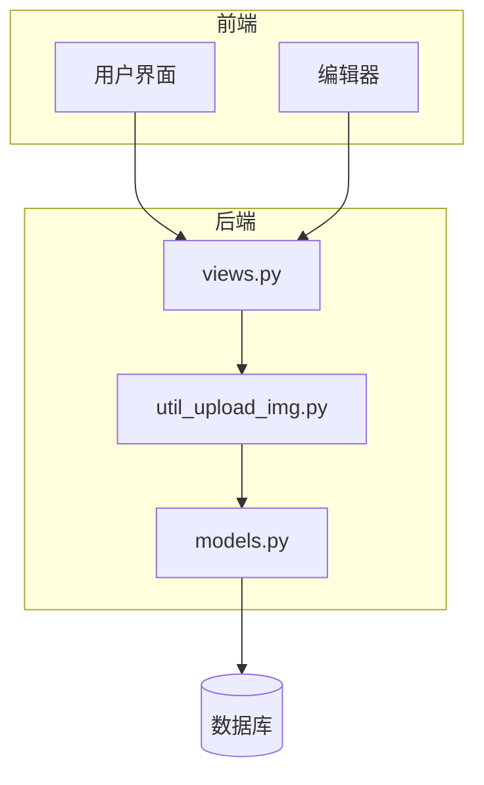
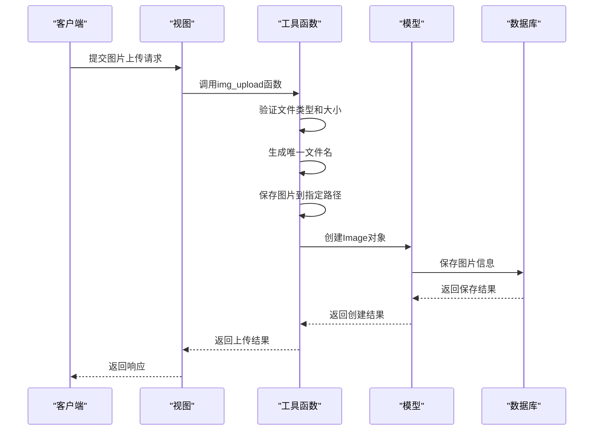
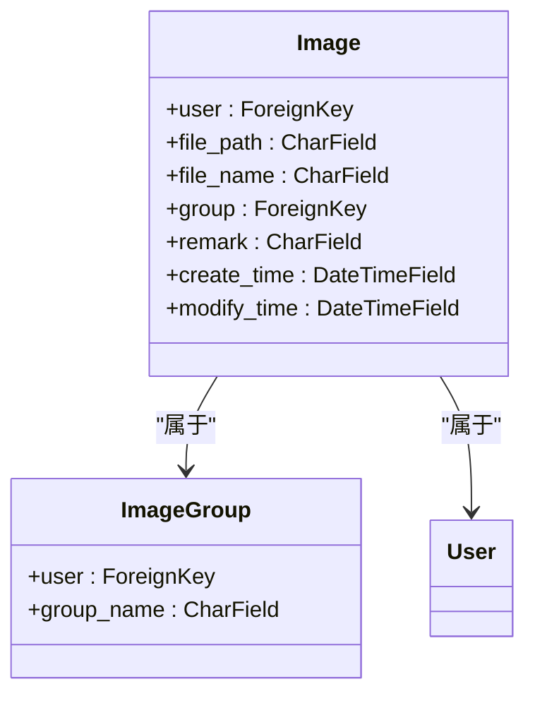
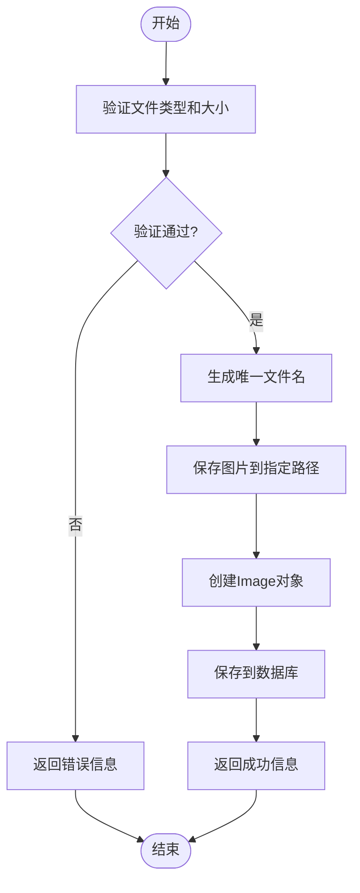
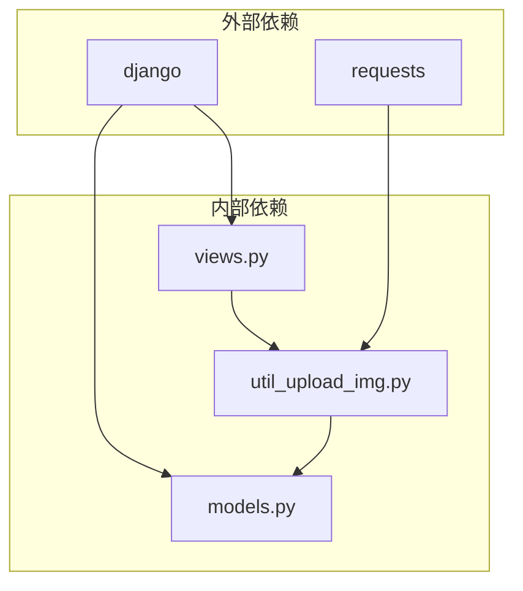

# 图片管理

<cite>
**本文档引用的文件**   
- [models.py](file://app_doc/models.py)
- [util_upload_img.py](file://app_doc/util_upload_img.py)
- [views.py](file://app_doc/views.py)
</cite>

## 目录
1. [引言](#引言)
2. [项目结构](#项目结构)
3. [核心组件](#核心组件)
4. [架构概述](#架构概述)
5. [详细组件分析](#详细组件分析)
6. [依赖分析](#依赖分析)
7. [性能考虑](#性能考虑)
8. [故障排除指南](#故障排除指南)
9. [结论](#结论)

## 引言
本文档旨在深入分析MrDocTest项目中的图片管理功能，重点介绍Image模型的设计与实现。文档将详细说明图片上传的完整流程，包括前端表单提交、后端视图处理、文件类型验证、文件大小限制以及唯一文件名生成策略。同时，将解释`util_upload_img.py`中文件处理函数的工作机制，包括如何处理中文文件名和特殊字符。此外，文档还将描述图片在系统中的存储路径管理方式和访问URL生成规则，并提供实际代码示例展示图片上传API的调用方法。最后，文档将解决常见问题如图片上传失败、格式不支持、存储路径错误等，确保内容既适合初学者理解基本操作，也为高级开发者提供性能优化建议。

## 项目结构
MrDocTest项目的图片管理功能主要集中在`app_doc`应用中，涉及`models.py`、`util_upload_img.py`和`views.py`三个核心文件。`models.py`定义了`Image`和`ImageGroup`模型，用于存储图片信息和分组信息。`util_upload_img.py`包含了图片上传和处理的核心逻辑，包括文件类型验证、大小限制、唯一文件名生成等。`views.py`则提供了图片管理的视图函数，处理前端请求并调用`util_upload_img.py`中的函数进行图片上传和管理。

**图源**
- [models.py](file://app_doc/models.py)
- [util_upload_img.py](file://app_doc/util_upload_img.py)
- [views.py](file://app_doc/views.py)

## 核心组件
图片管理功能的核心组件包括`Image`模型、`ImageGroup`模型、`upload_img`视图函数和`img_upload`工具函数。`Image`模型用于存储图片的元数据，如文件路径、文件名、创建时间等。`ImageGroup`模型用于对图片进行分组管理。`upload_img`视图函数处理前端上传请求，调用`img_upload`工具函数进行图片上传和处理。`img_upload`工具函数负责验证文件类型和大小，生成唯一文件名，并将图片保存到指定路径。

**组件源**
- [models.py](file://app_doc/models.py#L1-L270)
- [util_upload_img.py](file://app_doc/util_upload_img.py#L1-L332)
- [views.py](file://app_doc/views.py#L2589-L2614)

## 架构概述
图片管理功能的架构分为三层：前端、后端和数据库。前端通过表单或编辑器提交图片上传请求，后端接收请求并调用相应的视图函数进行处理。视图函数调用工具函数进行图片上传和处理，最后将图片信息存储到数据库中。整个流程遵循MVC（Model-View-Controller）设计模式，确保代码的可维护性和可扩展性。

**图源**
- [util_upload_img.py](file://app_doc/util_upload_img.py#L1-L332)
- [views.py](file://app_doc/views.py#L2589-L2614)

## 详细组件分析
### Image模型分析
`Image`模型是图片管理功能的核心，用于存储图片的元数据。模型包含以下字段：`user`（外键，关联用户）、`file_path`（字符串，存储图片路径）、`file_name`（字符串，存储图片名称）、`group`（外键，关联图片分组）、`remark`（字符串，存储图片备注）、`create_time`（日期时间，存储创建时间）和`modify_time`（日期时间，存储修改时间）。模型的`Meta`类定义了`verbose_name`和`verbose_name_plural`，用于在Django管理界面中显示友好的名称。

**图源**
- [models.py](file://app_doc/models.py#L1-L270)

#### 上传流程分析
图片上传流程从用户提交图片开始，前端通过表单或编辑器将图片文件发送到后端。后端的`upload_img`视图函数接收请求，调用`img_upload`工具函数进行图片上传和处理。`img_upload`函数首先验证文件类型和大小，然后生成唯一文件名，将图片保存到指定路径，并创建`Image`对象存储图片信息。最后，视图函数返回上传结果给前端。

**图源**
- [util_upload_img.py](file://app_doc/util_upload_img.py#L1-L332)
- [views.py](file://app_doc/views.py#L2589-L2614)

## 依赖分析
图片管理功能依赖于Django框架的`models`、`views`和`forms`模块，以及`requests`库用于处理URL图片上传。`Image`模型依赖于`User`模型和`ImageGroup`模型，`upload_img`视图函数依赖于`img_upload`工具函数。整个功能模块与`app_doc`应用的其他部分紧密集成，如文档管理、用户管理等。

**图源**
- [models.py](file://app_doc/models.py)
- [util_upload_img.py](file://app_doc/util_upload_img.py)
- [views.py](file://app_doc/views.py)

## 性能考虑
为了提高图片上传的性能，系统采用了以下优化措施：1) 使用`chunks()`方法分块读取文件，避免内存溢出；2) 生成唯一文件名时使用时间戳和随机字符串，减少文件名冲突；3) 在保存图片前验证文件类型和大小，避免无效文件占用存储空间。此外，系统还支持URL图片上传，通过`requests`库直接下载图片，减少前端上传的负担。

## 故障排除指南
### 常见问题及解决方案
1. **图片上传失败**：检查文件类型和大小是否符合要求，确保文件路径正确。
2. **格式不支持**：确认上传的图片格式是否在允许的列表中（jpg、png、gif、jpeg）。
3. **存储路径错误**：检查`MEDIA_ROOT`和`MEDIA_URL`配置是否正确，确保目录存在且有写权限。
4. **URL图片上传失败**：检查网络连接，确保URL可访问，且图片类型符合要求。

**组件源**
- [util_upload_img.py](file://app_doc/util_upload_img.py#L1-L332)
- [views.py](file://app_doc/views.py#L2589-L2614)

## 结论
本文档详细介绍了MrDocTest项目中图片管理功能的设计与实现。通过分析`Image`模型、`ImageGroup`模型、`upload_img`视图函数和`img_upload`工具函数，我们了解了图片上传的完整流程和内部工作机制。文档还提供了性能优化建议和故障排除指南，帮助开发者更好地理解和使用图片管理功能。未来，可以考虑增加图片压缩、缩略图生成等功能，进一步提升用户体验。