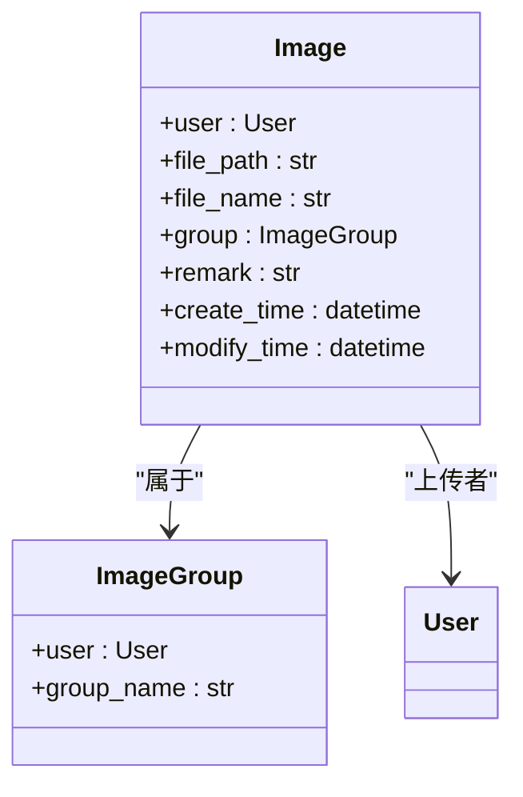
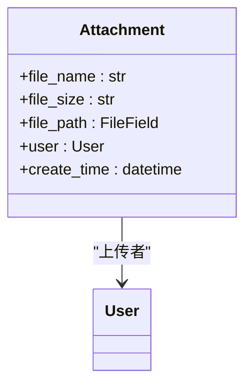
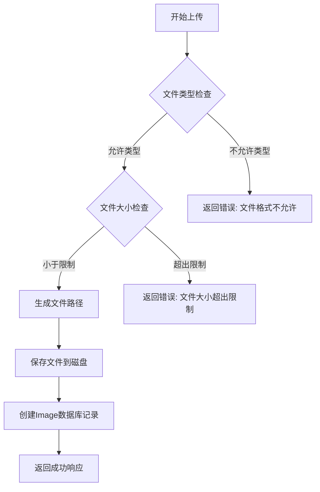
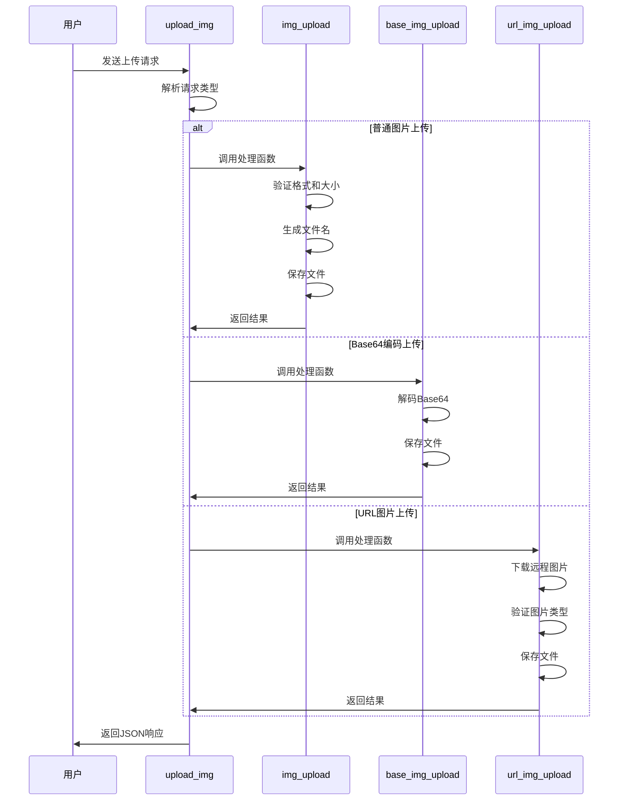
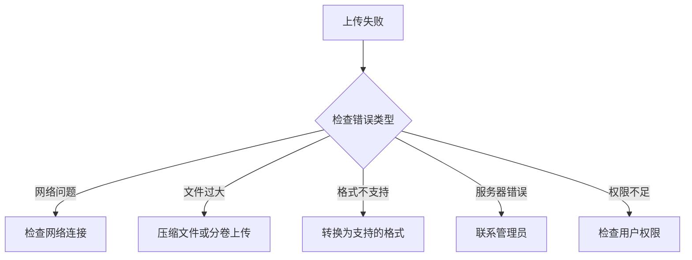

# 文件管理

<cite>
**本文档中引用的文件**   
- [models.py](file://app_doc/models.py#L1-L270)
- [util_upload_img.py](file://app_doc/util_upload_img.py#L1-L332)
- [util_upload_file.py](file://app_doc/util_upload_file.py#L1-L86)
- [views.py](file://app_doc/views.py#L1-L799)
</cite>

## 目录
1. [文件管理](#文件管理)
2. [模型实现](#模型实现)
   - [Image模型](#image模型)
   - [Attachment模型](#attachment模型)
3. [图片上传处理流程](#图片上传处理流程)
   - [上传验证](#上传验证)
   - [文件存储路径管理](#文件存储路径管理)
4. [附件管理功能](#附件管理功能)
   - [文件下载](#文件下载)
   - [文件删除](#文件删除)
5. [工具函数详解](#工具函数详解)
   - [util_upload_img.py](#util_upload_imgpy)
   - [util_upload_file.py](#util_upload_filepy)
6. [常见问题与解决方案](#常见问题与解决方案)
   - [文件上传失败](#文件上传失败)
   - [文件类型不支持](#文件类型不支持)

## 模型实现

### Image模型

Image模型用于管理用户上传的图片资源，包含图片的基本信息、存储路径和分组管理。



**图源**
- [models.py](file://app_doc/models.py#L200-L220)

**本节来源**
- [models.py](file://app_doc/models.py#L200-L220)

### Attachment模型

Attachment模型用于管理用户上传的附件文件，包含文件名、大小、存储路径等信息。



**图源**
- [models.py](file://app_doc/models.py#L222-L235)

**本节来源**
- [models.py](file://app_doc/models.py#L222-L235)

## 图片上传处理流程

### 上传验证

图片上传时会进行严格的格式和大小验证，确保系统安全和用户体验。



**图源**
- [util_upload_img.py](file://app_doc/util_upload_img.py#L150-L180)

**本节来源**
- [util_upload_img.py](file://app_doc/util_upload_img.py#L150-L180)

### 文件存储路径管理

系统采用日期分层的目录结构来管理上传的图片文件，便于组织和维护。

```python
def upload_generation_dir(dir_name=''):
    """
    生成上传目录，按年月分层
    例如: /media/images/2023/12/
    """
    today = datetime.datetime.today()
    dir_name = dir_name + '/%d%02d/' %(today.year,today.month)
    if not os.path.exists(settings.MEDIA_ROOT + dir_name):
        os.makedirs(settings.MEDIA_ROOT + dir_name)
    return dir_name
```

**本节来源**
- [util_upload_img.py](file://app_doc/util_upload_img.py#L140-L148)

## 附件管理功能

### 文件下载

附件下载功能通过Django的FileField自动处理，用户可以通过生成的URL直接下载文件。

```python
# Attachment模型中的file_path字段
file_path = models.FileField(upload_to='attachment/%Y/%m/',verbose_name='附件')
```

该字段配置了`upload_to`参数，指定附件按年月存储在`attachment`目录下。

**本节来源**
- [models.py](file://app_doc/models.py#L227)

### 文件删除

文件删除操作需要同时从数据库和文件系统中移除记录和文件。

```python
# 删除文集时的附件清理逻辑
def del_project(request):
    # ... 其他逻辑
    # 删除文集下的文档、文档历史、文档分享、文档标签
    pro_doc_list = Doc.objects.filter(top_doc=int(pro_id))
    for doc in pro_doc_list:
        DocHistory.objects.filter(doc=doc).delete()
        DocShare.objects.filter(doc=doc).delete()
        DocTag.objects.filter(doc=doc).delete()
    pro_doc_list.delete()
    # 删除文集
    pro.delete()
```

**本节来源**
- [views.py](file://app_doc/views.py#L450-L470)

## 工具函数详解

### util_upload_img.py

该模块包含处理图片上传的核心函数，支持多种上传方式。



**图源**
- [util_upload_img.py](file://app_doc/util_upload_img.py#L80-L332)

**本节来源**
- [util_upload_img.py](file://app_doc/util_upload_img.py#L80-L332)

### util_upload_file.py

该模块处理附件文件的上传，包含安全检查和格式验证。

```python
def handle_attachment_upload(attachment, user, request):
    """
    处理附件上传
    包含大小限制、格式限制和ZIP炸弹检测
    """
    if not attachment:
        return {'status': False, 'data': _('无效文件')}

    # 限制附件大小
    try:
        allow_attachment_size = SysSetting.objects.get(types='doc', name='attachment_size')
        allow_attach_size = int(allow_attachment_size.value) * 1048576
    except Exception:
        allow_attach_size = 52428800  # 默认50MB
    if attachment.size > allow_attach_size:
        return {'status': False, 'data': _('文件大小超出限制')}

    # 限制附件格式
    try:
        attachment_suffix_list = SysSetting.objects.get(types='doc', name='attachment_suffix')
        attachment_suffix_list = attachment_suffix_list.value.split(',')
        if attachment_suffix_list == ['']:
            attachment_suffix_list = ['zip']
    except Exception:
        attachment_suffix_list = ['zip']
    if attachment_name.split('.')[-1].lower() not in attachment_suffix_list:
        return {'status': False, 'data': _('不支持的格式')}

    # 检测ZIP炸弹
    if attachment_name.split('.')[-1].lower() == 'zip':
        with tempfile.NamedTemporaryFile(delete=False) as temp_file:
            for chunk in attachment.chunks():
                temp_file.write(chunk)
            temp_file_path = temp_file.name

        if is_zip_bomb(temp_file_path):
            os.remove(temp_file_path)
            return {'status': False, 'data': _('检测到可能的ZIP炸弹')}
```

**本节来源**
- [util_upload_file.py](file://app_doc/util_upload_file.py#L15-L85)

## 常见问题与解决方案

### 文件上传失败

文件上传失败可能由多种原因引起，系统提供了详细的错误处理机制。



**本节来源**
- [util_upload_img.py](file://app_doc/util_upload_img.py#L150-L180)
- [util_upload_file.py](file://app_doc/util_upload_file.py#L30-L50)

### 文件类型不支持

系统通过配置文件定义支持的文件类型，用户可以根据需要进行调整。

```python
# 在settings中定义允许的图片类型
ALLOWED_IMG = ["jpg", "jpeg", "gif", "png", "bmp", "webp"]

# 附件格式从数据库配置获取
attachment_suffix_list = SysSetting.objects.get(types='doc', name='attachment_suffix')
```

当用户上传不支持的文件类型时，系统会返回明确的错误信息，指导用户使用正确的格式。

**本节来源**
- [util_upload_img.py](file://app_doc/util_upload_img.py#L150-L155)
- [util_upload_file.py](file://app_doc/util_upload_file.py#L45-L55)