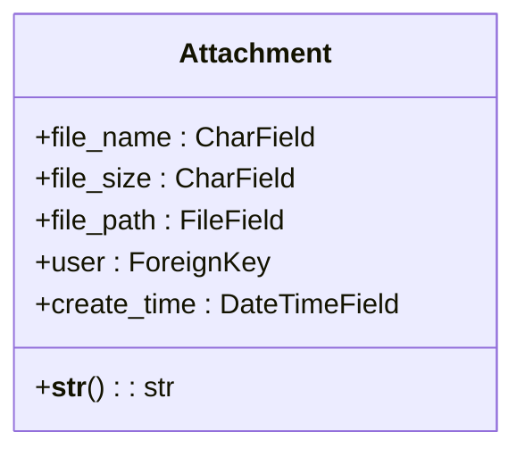
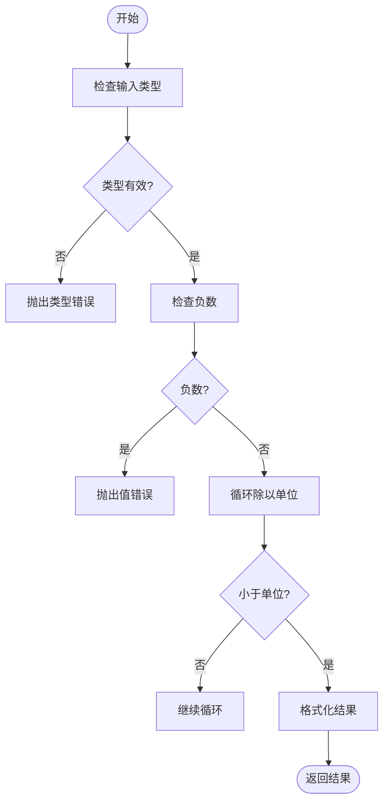

# 附件管理

<cite>
**本文档中引用的文件**  
- [models.py](file://app_doc/models.py#L240-L269)
- [util_upload_file.py](file://app_doc/util_upload_file.py#L0-L85)
- [views.py](file://app_doc/views.py#L3100-L3199)
</cite>

## 目录
1. [附件模型实现](#附件模型实现)
2. [附件上传处理流程](#附件上传处理流程)
3. [文件处理工具函数](#文件处理工具函数)
4. [附件下载功能](#附件下载功能)
5. [API调用示例](#api调用示例)
6. [常见问题与解决方案](#常见问题与解决方案)
7. [使用指南与最佳实践](#使用指南与最佳实践)

## 附件模型实现

附件管理功能的核心是`Attachment`模型，该模型定义了附件的基本属性和行为。模型位于`app_doc/models.py`文件中。



**Diagram sources**
- [models.py](file://app_doc/models.py#L240-L269)

**Section sources**
- [models.py](file://app_doc/models.py#L240-L269)

`Attachment`模型包含以下字段：
- **file_name**: 字符串字段，存储附件文件名，最大长度200字符
- **file_size**: 字符串字段，存储附件大小，最大长度100字符
- **file_path**: 文件字段，使用`upload_to='attachment/%Y/%m/'`指定存储路径，按年月组织文件
- **user**: 外键，关联到Django的User模型，标识附件的上传用户
- **create_time**: 日期时间字段，自动记录附件创建时间

该模型的元数据设置`verbose_name`为"附件管理"，便于在管理界面中显示。

## 附件上传处理流程

附件上传处理流程涉及文件验证、大小限制、格式检查和安全检测等多个环节，确保上传过程的安全性和可靠性。

### 文件类型验证

系统通过`SysSetting`模型中的配置来限制允许上传的附件格式。默认情况下，只允许上传`.zip`格式的文件。系统管理员可以在后台配置中修改允许的文件后缀列表。

```python
# 限制附件格式
try:
    attachment_suffix_list = SysSetting.objects.get(types='doc', name='attachment_suffix')
    attachment_suffix_list = attachment_suffix_list.value.split(',')
    if attachment_suffix_list == ['']:
        attachment_suffix_list = ['zip']
except Exception:
    attachment_suffix_list = ['zip']
if attachment_name.split('.')[-1].lower() not in attachment_suffix_list:
    return {'status': False, 'data': _('不支持的格式')}
```

### 存储路径管理

附件的存储路径由Django的`FileField`自动管理，使用`upload_to='attachment/%Y/%m/'`配置。这意味着所有上传的附件将按年月组织存储，例如：`attachment/2023/12/filename.zip`。这种组织方式有助于避免单个目录中文件过多，提高文件系统的性能。

### 文件名安全处理

系统在处理文件名时，直接使用上传文件的原始文件名。虽然这简化了处理逻辑，但可能存在安全风险，如路径遍历攻击。建议在生产环境中增加文件名安全处理，移除或替换特殊字符。

### 附件元数据记录

上传过程中，系统会自动记录以下元数据：
- **文件大小**: 使用`fileSizeFormat`函数将字节转换为人类可读的格式（如KB、MB）
- **上传时间**: 由`create_time`字段自动记录
- **上传用户**: 由`user`外键关联

**Section sources**
- [models.py](file://app_doc/models.py#L240-L269)
- [util_upload_file.py](file://app_doc/util_upload_file.py#L0-L85)

## 文件处理工具函数

`util_upload_file.py`文件包含了处理附件上传的核心工具函数，确保上传过程的安全性和可靠性。

### 文件大小格式化

`fileSizeFormat`函数将字节数转换为人类可读的格式，支持KB、MB、GB等单位。



**Diagram sources**
- [util_upload_file.py](file://app_doc/util_upload_file.py#L5-L25)

### 附件上传处理

`handle_attachment_upload`函数是处理附件上传的核心函数，执行以下步骤：
1. 验证附件是否存在
2. 获取附件文件名和大小
3. 检查文件大小是否超出限制
4. 验证文件格式是否允许
5. 检测ZIP炸弹（针对ZIP文件）
6. 创建附件记录

```python
def handle_attachment_upload(attachment, user, request):
    if not attachment:
        return {'status': False, 'data': _('无效文件')}

    attachment_name = attachment.name
    attachment_size = fileSizeFormat(attachment.size)

    # 限制附件大小
    try:
        allow_attachment_size = SysSetting.objects.get(types='doc', name='attachment_size')
        allow_attach_size = int(allow_attachment_size.value) * 1048576
    except Exception:
        allow_attach_size = 52428800  # 默认50MB
    if attachment.size > allow_attach_size:
        return {'status': False, 'data': _('文件大小超出限制')}

    # 限制附件格式
    try:
        attachment_suffix_list = SysSetting.objects.get(types='doc', name='attachment_suffix')
        attachment_suffix_list = attachment_suffix_list.value.split(',')
        if attachment_suffix_list == ['']:
            attachment_suffix_list = ['zip']
    except Exception:
        attachment_suffix_list = ['zip']
    if attachment_name.split('.')[-1].lower() not in attachment_suffix_list:
        return {'status': False, 'data': _('不支持的格式')}

    # 检测ZIP炸弹
    if attachment_name.split('.')[-1].lower() == 'zip':
        with tempfile.NamedTemporaryFile(delete=False) as temp_file:
            for chunk in attachment.chunks():
                temp_file.write(chunk)
            temp_file_path = temp_file.name

        if is_zip_bomb(temp_file_path):
            os.remove(temp_file_path)
            return {'status': False, 'data': _('检测到可能的ZIP炸弹')}

        os.remove(temp_file_path)
        attachment.seek(0)
    try:
        a = Attachment.objects.create(
            file_name=attachment_name,
            file_size=attachment_size,
            file_path=attachment,
            user=user
        )
        return {'status': True, 'data': {'name': attachment_name, 'url': a.file_path.name}}
    except:
        return {'status': False, 'data': _('上传附件失败')}
```

**Section sources**
- [util_upload_file.py](file://app_doc/util_upload_file.py#L27-L85)

## 附件下载功能

附件下载功能通过`manage_attachment`视图函数实现，支持权限验证和文件流传输。

### 权限验证

系统在下载附件前会验证用户权限，确保只有附件的上传者才能下载。这是通过查询`Attachment`模型时过滤`user=request.user`来实现的。

### 文件流传输

系统使用Django的`FileResponse`或`HttpResponse`来传输文件流，确保大文件也能高效传输。文件路径通过`file_path.name`获取，然后从文件系统中读取并返回。

```python
# 获取附件列表
elif types in [2,'2']:
    attachment_list = []
    attachments = Attachment.objects.filter(user=request.user).order_by('-create_time')
    for a in attachments:
        item = {
            'filename':a.file_name,
            'filesize':a.file_size,
            'filepath':a.file_path.name,
            'filetime':a.create_time
        }
        attachment_list.append(item)
    return JsonResponse({'status':True,'data':attachment_list})
```

**Section sources**
- [views.py](file://app_doc/views.py#L3100-L3199)

## API调用示例

以下是附件上传和下载的API调用示例。

### 上传附件API

```javascript
// 上传附件
function uploadAttachment(file) {
    const formData = new FormData();
    formData.append('attachment_upload', file);
    formData.append('types', '0');

    fetch('/manage_attachment/', {
        method: 'POST',
        body: formData,
        headers: {
            'X-CSRFToken': getCookie('csrftoken')
        }
    })
    .then(response => response.json())
    .then(data => {
        if (data.status) {
            console.log('上传成功:', data.data.name);
        } else {
            console.error('上传失败:', data.data);
        }
    });
}
```

### 下载附件API

```javascript
// 获取附件列表
function getAttachments() {
    fetch('/manage_attachment/', {
        method: 'POST',
        body: JSON.stringify({types: '2'}),
        headers: {
            'Content-Type': 'application/json',
            'X-CSRFToken': getCookie('csrftoken')
        }
    })
    .then(response => response.json())
    .then(data => {
        if (data.status) {
            data.data.forEach(attachment => {
                console.log(`文件名: ${attachment.filename}, 大小: ${attachment.filesize}`);
            });
        }
    });
}
```

**Section sources**
- [views.py](file://app_doc/views.py#L3100-L3199)

## 常见问题与解决方案

### 大文件上传超时

**问题**: 上传大文件时出现超时错误。

**解决方案**:
1. 增加服务器超时设置
2. 实现分块上传功能
3. 增加前端上传进度显示
4. 在`settings.py`中调整`DATA_UPLOAD_MAX_MEMORY_SIZE`和`FILE_UPLOAD_MAX_MEMORY_SIZE`

### 附件删除失败

**问题**: 删除附件时文件系统中的文件未被删除。

**解决方案**:
1. 确保在删除数据库记录前先删除文件系统中的文件
2. 使用Django信号（signals）在模型删除时自动删除文件
3. 检查文件权限，确保应用有删除文件的权限

```python
# 删除附件
elif types in ['1',1]:
    attach_id = request.POST.get('attach_id','')
    attachment = Attachment.objects.filter(id=attach_id,user=request.user)
    for a in attachment:
        a.file_path.delete() # 删除文件
    attachment.delete() # 删除数据库记录
    return JsonResponse({'status':True,'data':_('删除成功')})
```

### 文件名乱码

**问题**: 上传的文件名包含中文时出现乱码。

**解决方案**:
1. 确保前端和后端使用相同的字符编码（UTF-8）
2. 在服务器配置中设置正确的字符集
3. 对文件名进行URL编码处理
4. 使用`urllib.parse.quote`对文件名进行编码

**Section sources**
- [views.py](file://app_doc/views.py#L3100-L3199)

## 使用指南与最佳实践

### 开发者使用指南

1. **权限控制**: 确保所有附件操作都经过用户权限验证
2. **文件大小限制**: 根据服务器资源合理设置文件大小限制
3. **安全检测**: 对上传的文件进行安全检测，特别是ZIP文件
4. **错误处理**: 提供清晰的错误信息，帮助用户理解问题原因

### 最佳实践建议

1. **定期清理**: 实现附件清理机制，删除长时间未使用的附件
2. **备份策略**: 定期备份附件存储目录，防止数据丢失
3. **监控告警**: 监控附件存储空间使用情况，设置告警阈值
4. **性能优化**: 对于大文件，考虑使用CDN或对象存储服务

**Section sources**
- [views.py](file://app_doc/views.py#L3100-L3199)
- [util_upload_file.py](file://app_doc/util_upload_file.py#L0-L85)
- [models.py](file://app_doc/models.py#L240-L269)