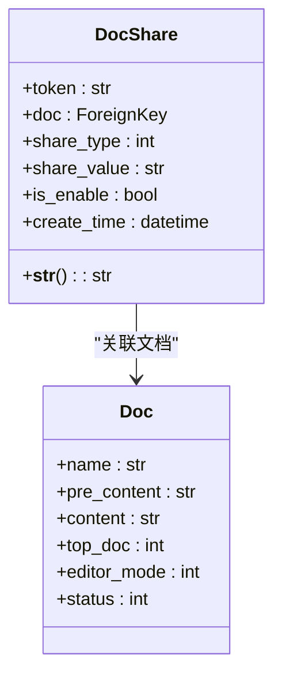
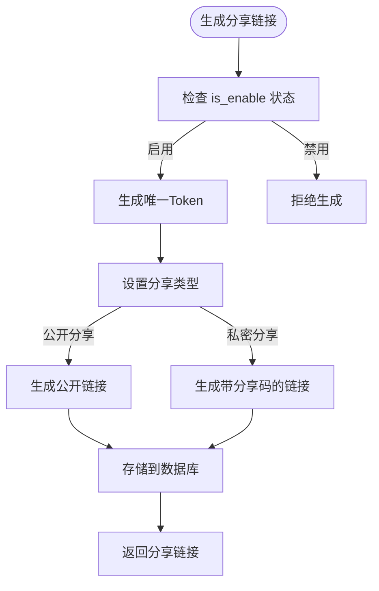
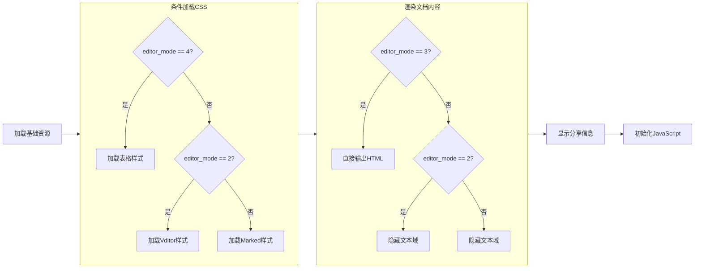
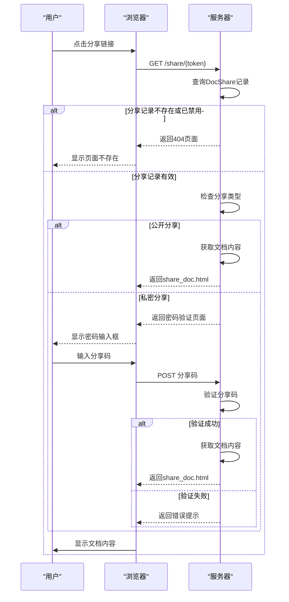
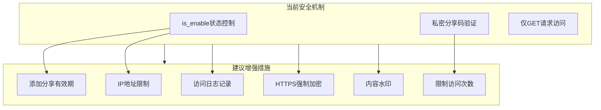

# 公开访问

<cite>
**本文档引用文件**  
- [share_doc.html](file://template/app_doc/share/share_doc.html)
- [models.py](file://app_doc/models.py)
- [views.py](file://app_doc/views.py)
</cite>

## 目录
1. [公开访问](#公开访问)
2. [文档分享模型分析](#文档分享模型分析)
3. [分享链接生成与安全性](#分享链接生成与安全性)
4. [分享视图函数与模板渲染](#分享视图函数与模板渲染)
5. [公开访问流程示例](#公开访问流程示例)
6. [安全风险与加固建议](#安全风险与加固建议)

## 文档分享模型分析

`DocShare` 模型是实现文档公开访问的核心数据结构，定义了文档分享的权限控制、访问方式和状态管理。



**模型字段说明：**
- **token**: 分享令牌，用于构建唯一访问链接
- **doc**: 外键关联文档对象，标识被分享的文档
- **share_type**: 分享类型，0表示公开分享，1表示私密分享
- **share_value**: 分享码，私密分享时需要输入的验证码
- **is_enable**: 启用状态，控制分享链接是否有效
- **create_time**: 创建时间，用于追踪分享记录

**模型元数据：**
- `verbose_name` 设置为 "文档分享"，在管理界面中显示
- 通过 `__str__` 方法返回文档名称，便于识别

**文档来源**
- [models.py](file://app_doc/models.py#L135-L152)

## 分享链接生成与安全性

文档分享链接的生成遵循安全设计原则，确保链接的唯一性和可控性。

### 分享令牌生成算法

分享令牌（token）是分享链接的核心标识，其生成过程如下：
1. 系统为每个分享记录生成唯一的随机字符串
2. 该字符串作为URL参数，指向特定的文档
3. 通过 `is_enable` 字段控制链接的启用状态

### 安全性设计



**安全特性：**
- **状态控制**: `is_enable` 字段允许随时禁用分享链接，实现即时撤销访问权限
- **类型区分**: 支持公开和私密两种分享模式，满足不同安全需求
- **访问码保护**: 私密分享需要输入 `share_value` 验证码，增加访问门槛
- **无有效期限制**: 当前设计中分享链接永久有效，可通过 `is_enable` 手动控制

**文档来源**
- [models.py](file://app_doc/models.py#L135-L152)

## 分享视图函数与模板渲染

### 分享视图函数分析

系统通过 `share_doc.html` 模板实现分享页面的渲染，该模板位于 `template/app_doc/share/` 目录下。

```python
# 伪代码表示分享视图逻辑
def share_document_view(request, token):
    # 1. 根据token查找分享记录
    try:
        doc_share = DocShare.objects.get(token=token, is_enable=True)
    except DocShare.DoesNotExist:
        return render_404()
    
    # 2. 检查分享类型
    if doc_share.share_type == 1:  # 私密分享
        if not validate_share_code(request.POST.get('code'), doc_share.share_value):
            return render_share_code_page()
    
    # 3. 获取文档内容
    doc = doc_share.doc
    if doc.editor_mode == 3:
        content = doc.content
    else:
        content = doc.pre_content
    
    # 4. 渲染分享页面
    return render('share_doc.html', {
        'doc': doc,
        'ad_code': get_ad_code(),
        'mrdoc_version': get_version()
    })
```

### 模板渲染逻辑

`share_doc.html` 模板实现了以下功能：



**关键渲染特性：**
- **响应式设计**: 支持移动端扫码访问
- **字体控制**: 提供字体大小调节功能
- **主题切换**: 支持夜间模式切换
- **目录显示**: 可切换显示文档目录
- **广告支持**: 预留广告位，支持动态插入

**文档来源**
- [share_doc.html](file://template/app_doc/share/share_doc.html)
- [views.py](file://app_doc/views.py)

## 公开访问流程示例

以下是用户通过分享链接访问文档的完整流程：



**实际访问示例：**
1. 用户A创建文档并生成分享链接：`https://example.com/share/abc123xyz`
2. 用户B点击链接，系统验证 `abc123xyz` 对应的 `DocShare` 记录
3. 如果是公开分享，直接显示文档内容
4. 如果是私密分享，提示输入分享码（如"1234"）
5. 验证通过后，渲染 `share_doc.html` 模板显示文档

## 安全风险与加固建议

### 潜在安全风险

1. **链接泄露风险**: 公开分享链接一旦泄露，任何人都可以访问
2. **暴力破解风险**: 私密分享码可能被暴力破解
3. **内容泄露风险**: 分享页面可能被搜索引擎收录
4. **广告注入风险**: 动态广告代码可能引入XSS攻击

### 安全加固建议



**具体建议：**
1. **添加有效期**: 在 `DocShare` 模型中增加 `expire_time` 字段，实现自动过期
2. **访问频率限制**: 对同一token的访问进行频率限制，防止暴力破解
3. **IP白名单**: 支持配置允许访问的IP地址范围
4. **访问审计**: 记录所有分享链接的访问日志，便于追踪
5. **内容保护**: 在分享页面添加水印，标识访问者信息
6. **搜索引擎屏蔽**: 在分享页面添加 `noindex` 元标签，防止被搜索引擎收录
7. **HTTPS强制**: 确保所有分享链接都通过HTTPS传输

**文档来源**
- [models.py](file://app_doc/models.py#L135-L152)
- [share_doc.html](file://template/app_doc/share/share_doc.html)