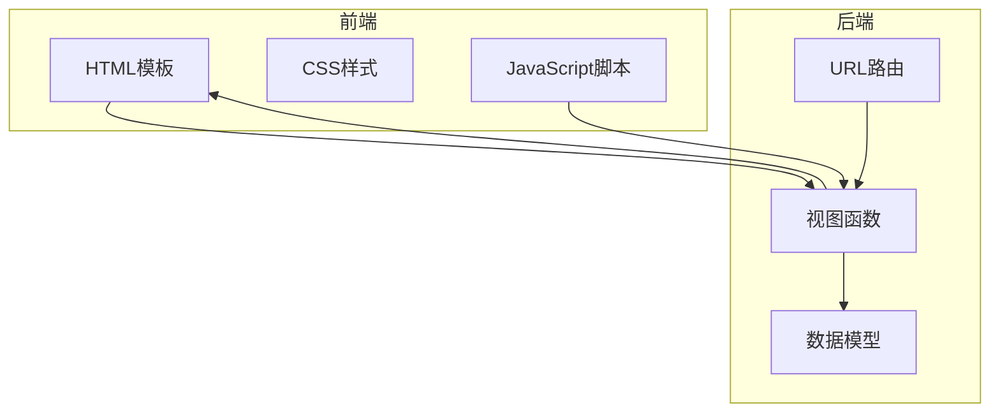
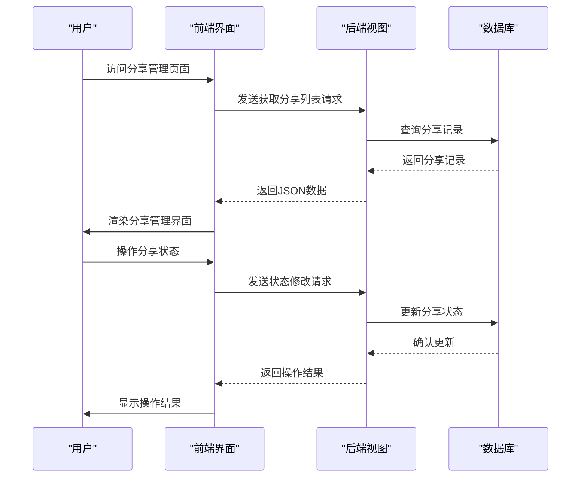
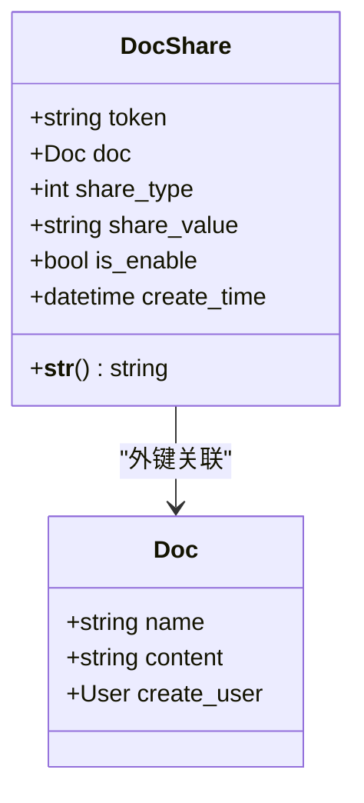
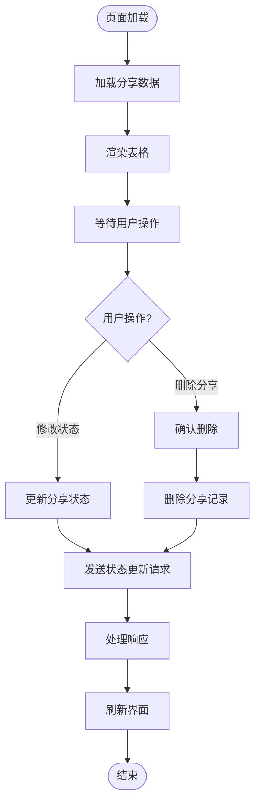
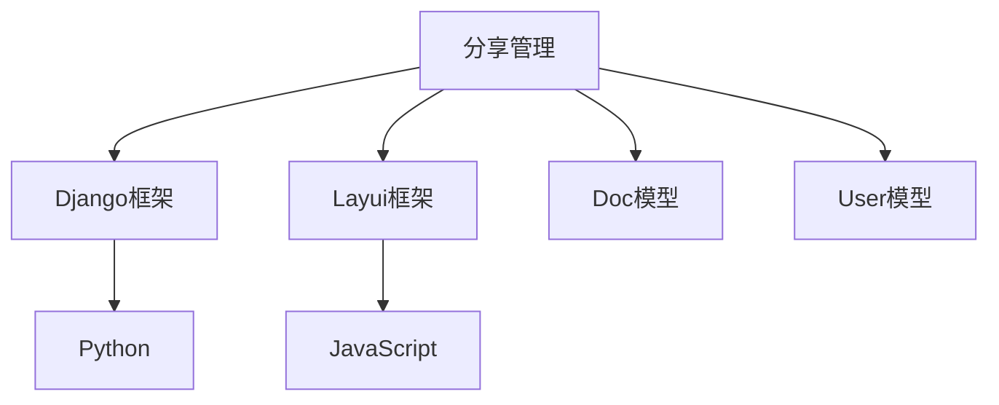

# 分享管理

<cite>
**本文档引用的文件**   
- [manage_doc_share.html](file://template/app_doc/manage/manage_doc_share.html)
- [views.py](file://app_doc/views.py)
- [models.py](file://app_doc/models.py)
</cite>

## 目录
1. [介绍](#介绍)
2. [项目结构](#项目结构)
3. [核心组件](#核心组件)
4. [架构概述](#架构概述)
5. [详细组件分析](#详细组件分析)
6. [依赖分析](#依赖分析)
7. [性能考虑](#性能考虑)
8. [故障排除指南](#故障排除指南)
9. [结论](#结论)

## 介绍
本文档详细解析了MrDoc系统中文档分享管理功能的实现。重点分析了`DocShare`模型的管理界面，包括分享链接的生成、启用/禁用控制和删除功能。同时，深入探讨了权限验证机制、数据库表设计以及CRUD操作流程，旨在为开发者和用户提供全面的技术参考。

## 项目结构
项目采用Django框架，遵循MVC设计模式。主要功能模块包括文档管理、文集管理、用户管理等。分享管理功能位于`app_doc`应用中，涉及模板、视图和模型三个层面。



**图源**
- [manage_doc_share.html](file://template/app_doc/manage/manage_doc_share.html)
- [views.py](file://app_doc/views.py)
- [models.py](file://app_doc/models.py)

## 核心组件
分享管理功能的核心组件包括：
- `DocShare`模型：定义分享记录的数据结构
- `manage_doc_share.html`模板：提供管理界面
- `manage_doc_share`视图函数：处理业务逻辑

**组件源**
- [models.py](file://app_doc/models.py#L135-L152)
- [manage_doc_share.html](file://template/app_doc/manage/manage_doc_share.html)
- [views.py](file://app_doc/views.py#L2000-L2100)

## 架构概述
分享管理功能采用前后端分离的架构。前端通过Layui框架渲染表格，后端通过Django视图处理请求。权限验证贯穿整个流程，确保只有文档创建者或项目管理员才能管理分享设置。



**图源**
- [views.py](file://app_doc/views.py#L2000-L2100)
- [manage_doc_share.html](file://template/app_doc/manage/manage_doc_share.html)

## 详细组件分析

### DocShare模型分析
`DocShare`模型定义了文档分享的核心数据结构，包括分享Token、文档关联、分享类型、分享码和启用状态等字段。



**图源**
- [models.py](file://app_doc/models.py#L135-L152)

#### 字段设计说明
- **token**: 分享Token，用于唯一标识分享记录
- **doc**: 外键关联到文档，建立分享与文档的关系
- **share_type**: 分享类型，0表示公开分享，1表示私密分享
- **share_value**: 分享码，私密分享时需要验证
- **is_enable**: 启用状态，实现分享的动态控制
- **create_time**: 创建时间，记录分享创建时间

### 管理界面分析
`manage_doc_share.html`模板使用Layui框架构建管理界面，包含表格、工具栏和操作按钮。

#### UI组件
- **表格**: 显示分享记录列表
- **工具栏**: 提供批量删除功能
- **操作栏**: 提供单个删除功能
- **开关控件**: 用于启用/禁用分享

#### 交互逻辑
1. 页面加载时，通过AJAX请求获取分享列表
2. 用户点击开关控件，发送状态修改请求
3. 用户点击删除按钮，弹出确认对话框
4. 确认后，发送删除请求并更新界面



**图源**
- [manage_doc_share.html](file://template/app_doc/manage/manage_doc_share.html#L0-L229)

### 视图函数分析
`manage_doc_share`视图函数处理分享管理的所有请求，包括获取列表、删除和修改操作。

#### 权限验证机制
视图函数通过以下方式确保权限安全：
1. 使用`@login_required`装饰器确保用户已登录
2. 在查询时添加`doc__create_user=request.user`条件，确保只能操作自己创建的文档的分享
3. 在删除和修改操作前再次验证权限

#### CRUD操作流程
- **创建**: 通过`share_doc`视图创建分享记录
- **读取**: 通过`manage_doc_share`视图获取分享列表
- **更新**: 通过`manage_doc_share`视图修改分享状态
- **删除**: 通过`manage_doc_share`视图删除分享记录

```python
# 示例：分享状态修改代码
elif types == '3':
    token = request.POST.get("token",'')
    name = request.POST.get('key','')
    value = request.POST.get('value','')
    if name == 'share_status':
        is_enable = True if value == 'true' else False
        DocShare.objects.filter(token=token).update(is_enable=is_enable)
```

**组件源**
- [views.py](file://app_doc/views.py#L2000-L2100)

## 依赖分析
分享管理功能依赖于以下组件：
- Django框架：提供基础的Web开发功能
- Layui框架：提供前端UI组件
- `Doc`模型：提供文档数据
- `User`模型：提供用户数据



**图源**
- [views.py](file://app_doc/views.py)
- [models.py](file://app_doc/models.py)

## 性能考虑
1. **数据库查询优化**: 使用`select_related`预加载关联数据，减少查询次数
2. **分页处理**: 对分享列表进行分页，避免一次性加载过多数据
3. **缓存机制**: 可考虑对频繁访问的分享数据进行缓存

## 故障排除指南
### 常见问题及解决方案
1. **分享记录同步延迟**
   - 检查数据库事务是否正确提交
   - 确认AJAX请求是否成功返回
   - 查看服务器日志是否有错误信息

2. **界面状态不一致**
   - 检查前端缓存是否过期
   - 确认后端返回的数据是否正确
   - 验证权限验证逻辑是否正常

3. **权限验证失败**
   - 检查用户登录状态
   - 确认文档创建者是否正确
   - 验证查询条件是否包含`doc__create_user=request.user`

**组件源**
- [views.py](file://app_doc/views.py#L2000-L2100)
- [manage_doc_share.html](file://template/app_doc/manage/manage_doc_share.html)

## 结论
本文档详细解析了MrDoc系统中分享管理功能的实现。通过分析`DocShare`模型、管理界面和视图函数，展示了分享功能的技术细节。该功能设计合理，权限控制严格，为用户提供了一个安全、便捷的文档分享管理方案。建议在实际使用中注意性能优化和错误处理，确保系统的稳定运行。