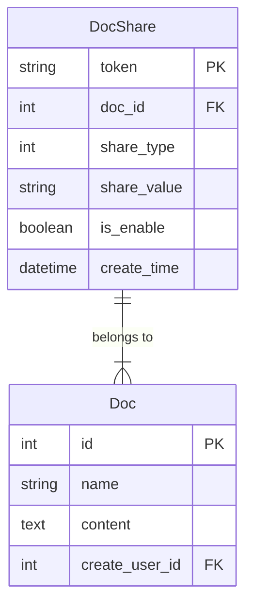
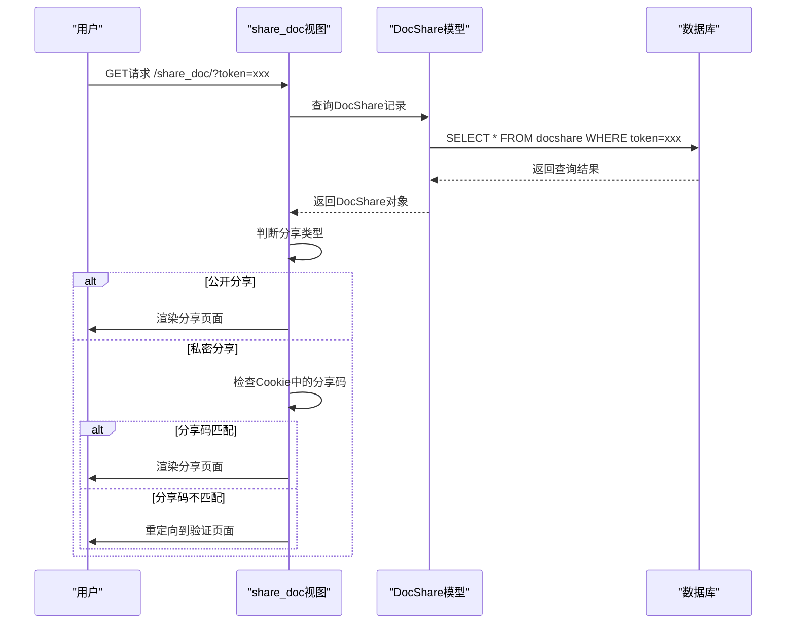
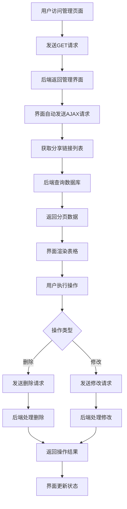

# 文档分享

<cite>
**本文档引用的文件**   
- [models.py](file://app_doc/models.py#L127-L164)
- [views.py](file://app_doc/views.py#L1826-L1982)
- [manage_doc_share.html](file://template/app_doc/manage/manage_doc_share.html)
- [share_doc.html](file://template/app_doc/share/share_doc.html)
- [0032_docshare_is_enable.py](file://app_doc/migrations/0032_docshare_is_enable.py)
- [0030_auto_20201102_2115.py](file://app_doc/migrations/0030_auto_20201102_2115.py)
- [urls.py](file://app_doc/urls.py#L29-L45)
</cite>

## 目录
1. [文档分享功能概述](#文档分享功能概述)
2. [DocShare模型架构分析](#docshare模型架构分析)
3. [分享链接生成与访问控制](#分享链接生成与访问控制)
4. [管理界面与交互逻辑](#管理界面与交互逻辑)
5. [视图函数实现详解](#视图函数实现详解)
6. [安全机制与最佳实践](#安全机制与最佳实践)

## 文档分享功能概述

文档分享功能是MrDoc系统的核心特性之一，允许用户将文档通过链接形式进行公开或私密分享。该功能支持两种分享模式：公开分享和私密分享，满足不同场景下的文档共享需求。系统通过生成唯一的分享Token来标识每个分享链接，并结合分享码和启用状态实现精细化的访问控制。

**文档分享功能的核心特点：**
- 支持公开分享和私密分享两种模式
- 通过Token机制确保链接唯一性
- 提供分享码验证增强安全性
- 可动态启用或禁用分享链接
- 完善的管理界面支持批量操作

## DocShare模型架构分析

文档分享功能的核心数据结构是`DocShare`模型，该模型定义了分享链接的所有属性和行为。



**模型字段说明：**
- **token**: 分享Token，作为分享链接的唯一标识符
- **doc**: 外键关联文档，指向被分享的文档对象
- **share_type**: 分享类型，0表示公开分享，1表示私密分享
- **share_value**: 分享码，仅在私密分享时使用
- **is_enable**: 启用状态，控制分享链接是否有效
- **create_time**: 创建时间，记录分享链接的创建时刻

**模型关系：**
- `DocShare`模型与`Doc`模型建立了一对一的外键关系
- 每个文档可以有多个分享链接（通过不同Token区分）
- 删除文档时会级联删除所有相关分享记录

**Section sources**
- [models.py](file://app_doc/models.py#L127-L164)

## 分享链接生成与访问控制

### 分享链接生成机制

系统通过`share_doc`视图函数处理分享请求，生成唯一的分享Token并创建分享记录。



### 访问控制策略

系统实现了多层次的访问控制策略，确保分享链接的安全性。

**公开分享流程：**
1. 用户访问分享链接
2. 系统验证Token的有效性和启用状态
3. 直接渲染分享页面，无需额外验证

**私密分享流程：**
1. 用户访问分享链接
2. 系统验证Token的有效性和启用状态
3. 检查Cookie中是否包含正确的分享码
4. 如果分享码匹配，渲染分享页面
5. 如果分享码不匹配，重定向到分享码验证页面

**有效期管理：**
- 当前版本通过`is_enable`字段实现逻辑上的有效期控制
- 管理员可以随时禁用分享链接
- 系统未实现自动过期功能，但为未来扩展预留了接口

**Diagram sources**
- [views.py](file://app_doc/views.py#L1826-L1854)
- [models.py](file://app_doc/models.py#L127-L164)

**Section sources**
- [views.py](file://app_doc/views.py#L1826-L1854)

## 管理界面与交互逻辑

### 管理界面功能

`manage_doc_share.html`模板提供了完整的分享链接管理界面，支持以下功能：
- 查看所有分享链接列表
- 批量删除分享链接
- 动态启用/禁用分享链接
- 分页显示和数据统计

### 交互逻辑分析

管理界面通过AJAX请求与后端进行数据交互，实现无刷新操作。



**安全验证流程：**
1. 所有管理操作都需要用户登录验证
2. 系统检查用户是否为文档创建者
3. 仅允许用户管理自己创建的文档分享链接
4. 支持单个和批量操作，提高管理效率

**Diagram sources**
- [manage_doc_share.html](file://template/app_doc/manage/manage_doc_share.html)
- [views.py](file://app_doc/views.py#L1920-L1982)

**Section sources**
- [manage_doc_share.html](file://template/app_doc/manage/manage_doc_share.html)

## 视图函数实现详解

### manage_doc_share视图函数

`manage_doc_share`视图函数是分享链接管理的核心，处理所有管理相关的请求。

```python
@login_required()
@require_http_methods(['GET','POST'])
def manage_doc_share(request):
    if request.method == 'GET':
        return render(request, 'app_doc/manage/manage_doc_share.html', locals())
    else:
        types = request.POST.get('type')
        # 请求类型 1：获取列表 2：删除 3：修改
        if types == '1':
            page = request.POST.get('page', 1)
            limit = request.POST.get('limit', 10)
            docshare_list = DocShare.objects.filter(doc__create_user=request.user).order_by('-create_time')
            paginator = Paginator(docshare_list, limit)
            page = request.GET.get('page', page)
            try:
                docshares = paginator.page(page)
            except PageNotAnInteger:
                docshares = paginator.page(1)
            except EmptyPage:
                docshares = paginator.page(paginator.num_pages)
            share_list = []
            for doc in docshares:
                item = {
                    'token':doc.token,
                    'doc_name':doc.doc.name,
                    'share_type':doc.share_type,
                    'share_value':doc.share_value,
                    'share_status':doc.is_enable,
                    'create_time':doc.create_time
                }
                share_list.append(item)
            resp_data = {
                "code":0,
                "msg":"ok",
                "count":docshare_list.count(),
                "data":share_list
            }
            return JsonResponse(resp_data)
        # 删除逻辑
        elif types == '2':
            # ... 删除实现
        # 修改逻辑
        elif types == '3':
            # ... 修改实现
```

**关键实现细节：**
- 使用`@login_required`装饰器确保用户登录
- 通过`doc__create_user=request.user`过滤条件确保用户只能管理自己的分享链接
- 实现分页功能，支持大数据量的高效展示
- 返回标准的JSON响应格式，便于前端处理

### share_doc视图函数

`share_doc`视图函数处理分享链接的访问请求，实现访问控制逻辑。

```python
@require_http_methods(['GET','POST'])
def share_doc(request):
    if request.method == 'GET':
        share_token = request.GET.get('token')
        try:
            share_doc = DocShare.objects.get(token=share_token,is_enable=True)
            doc = share_doc.doc
            if share_doc.share_type == 0:
                return render(request, 'app_doc/share/share_doc.html', locals())
            else:
                doc_id_base64 = base64.standard_b64encode(str(share_doc.doc.id).encode())
                share_cookie_name = 'sharedoc-{}'.format(share_token)
                share_value = request.COOKIES.get(share_cookie_name) if share_cookie_name in request.COOKIES.keys() else 0
                if share_doc.share_value == share_value:
                    return render(request, 'app_doc/share/share_doc.html', locals())
                else:
                    share_pwd = request.GET.get('pwd', '')
                    return redirect('/share_doc_check/?surl={}&pwd={}'.format(share_token, share_pwd))
        except ObjectDoesNotExist:
            return render(request,'404.html')
```

**安全特性：**
- 同时验证Token和启用状态
- 使用Cookie存储分享码，避免URL暴露
- 重定向到验证页面，保持URL的简洁性
- 异常处理完善，防止信息泄露

**Section sources**
- [views.py](file://app_doc/views.py#L1920-L1982)

## 安全机制与最佳实践

### 安全问题分析

#### 分享链接失效问题
- **原因**：`is_enable`字段被设置为False
- **解决方案**：提供明确的启用/禁用操作界面

#### 未授权访问问题
- **原因**：缺乏足够的权限验证
- **解决方案**：在所有管理操作中添加用户身份验证

### 安全最佳实践

1. **定期审查分享链接**
   - 建议管理员定期检查所有分享链接的状态
   - 及时禁用不再需要的分享链接

2. **使用私密分享模式**
   - 对于敏感文档，优先使用私密分享模式
   - 设置强分享码，避免简单密码

3. **监控分享活动**
   - 记录分享链接的访问日志
   - 监控异常访问模式

4. **及时更新系统**
   - 保持系统版本最新，修复已知安全漏洞
   - 关注安全公告，及时应用补丁

5. **教育用户安全意识**
   - 培训用户正确使用分享功能
   - 提高对钓鱼链接的识别能力

**Section sources**
- [models.py](file://app_doc/models.py#L127-L164)
- [views.py](file://app_doc/views.py#L1826-L1982)