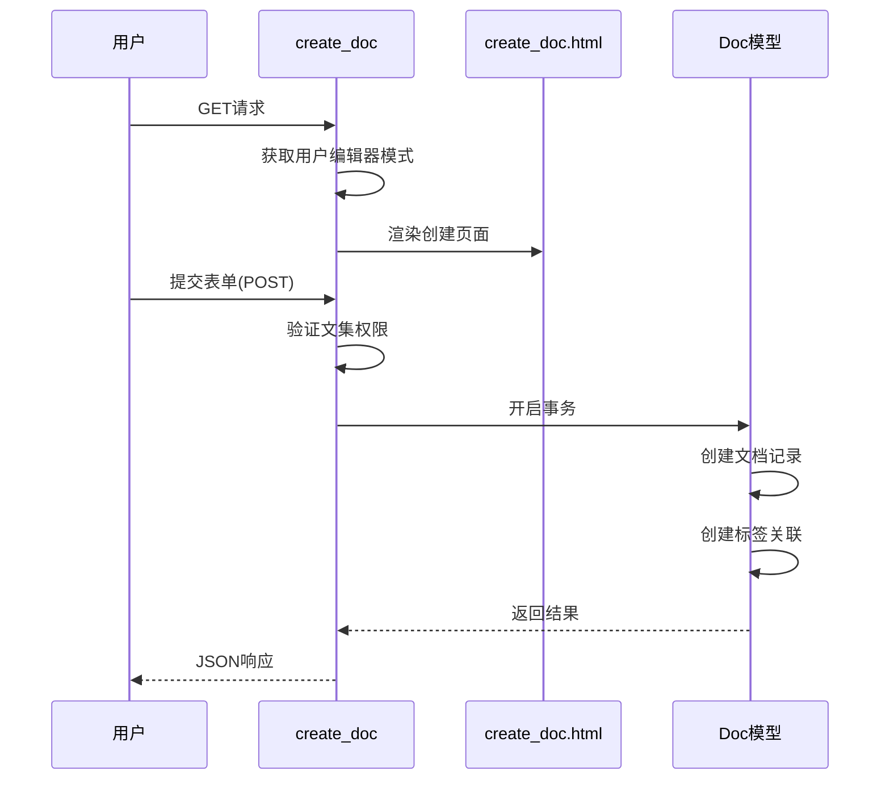
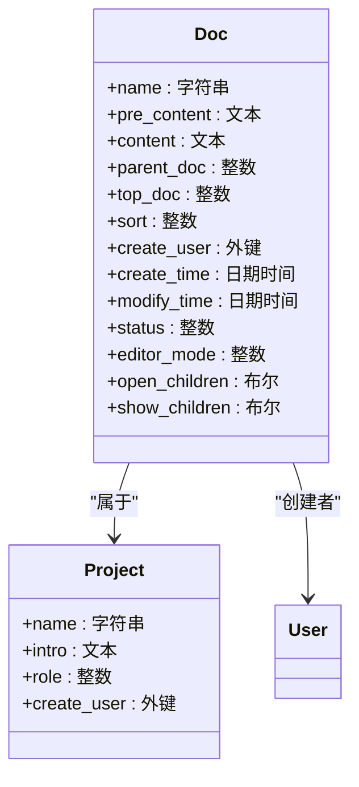
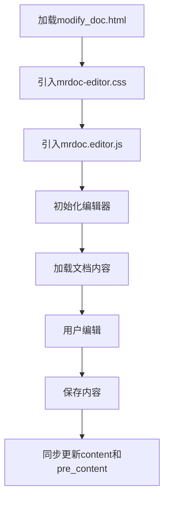

# 文档创建与编辑

<cite>
**本文档引用的文件**   
- [models.py](file://app_doc/models.py)
- [views.py](file://app_doc/views.py)
- [modify_doc.html](file://template/app_doc/editor/modify_doc.html)
- [mrdoc-editor.css](file://static/mrdoc/mrdoc-editor.css)
- [mrdoc.editor.js](file://static/mrdoc/mrdoc.editor.js)
</cite>

## 目录
1. [文档创建与编辑流程](#文档创建与编辑流程)
2. [Doc模型字段详解](#doc模型字段详解)
3. [编辑界面实现](#编辑界面实现)
4. [编辑模式切换机制](#编辑模式切换机制)
5. [常见问题与优化](#常见问题与优化)

## 文档创建与编辑流程

文档的创建与编辑是MrDoc系统的核心功能，通过`views.py`中的视图函数实现。创建文档的流程始于`create_doc`视图函数，该函数处理GET和POST请求。当用户访问创建页面时，系统会获取用户的编辑器偏好设置，并渲染`create_doc.html`模板。



**图示来源**
- [views.py](file://app_doc/views.py#L700-L799)

**本节来源**
- [views.py](file://app_doc/views.py#L700-L799)
- [create_doc.html](file://template/app_doc/editor/create_doc.html)

## Doc模型字段详解

文档模型(Doc)包含多个关键字段，其中`content`和`pre_content`字段具有特殊作用。`pre_content`字段存储编辑器中的原始内容，而`content`字段存储渲染后的HTML内容。



**图示来源**
- [models.py](file://app_doc/models.py#L100-L150)

**本节来源**
- [models.py](file://app_doc/models.py#L100-L150)

### content与pre_content字段机制

`pre_content`字段存储Markdown格式的原始文本内容，这是用户在编辑器中输入的原始内容。`content`字段则存储经过Markdown解析器转换后的HTML内容，用于在文档浏览页面直接渲染显示。

当用户创建或修改文档时，系统会同时保存这两个字段。`pre_content`确保了内容的可编辑性，而`content`则提高了文档浏览时的渲染效率，避免了每次访问都需要进行Markdown解析。

## 编辑界面实现

文档编辑界面通过`modify_doc.html`模板实现，集成了`mrdoc-editor.css`和`mrdoc.editor.js`前端组件。编辑器的加载和初始化由JavaScript控制，确保了良好的用户体验。



**图示来源**
- [modify_doc.html](file://template/app_doc/editor/modify_doc.html)
- [mrdoc.editor.js](file://static/mrdoc/mrdoc.editor.js)

**本节来源**
- [modify_doc.html](file://template/app_doc/editor/modify_doc.html)
- [mrdoc.editor.js](file://static/mrdoc/mrdoc.editor.js)
- [mrdoc-editor.css](file://static/mrdoc/mrdoc-editor.css)

### 前端组件集成

`mrdoc-editor.css`提供了编辑器的样式定义，包括编辑区域、工具栏和预览区域的布局与外观。`mrdoc.editor.js`负责编辑器的交互逻辑，包括内容加载、实时预览、保存功能和编辑模式切换。

编辑器初始化时，JavaScript会根据文档的`editor_mode`字段选择相应的编辑器类型（如Editormd、Vditor或iceEditor），并加载相应的内容到编辑区域。保存操作通过AJAX提交到`modify_doc`视图函数，实现无刷新的内容更新。

## 编辑模式切换机制

系统支持多种编辑模式，包括Markdown编辑器、富文本编辑器等。编辑模式的切换通过`editor_mode`字段实现，该字段存储在`Doc`模型中，值为1表示Editormd编辑器，2表示Vditor编辑器，3表示iceEditor编辑器。

```python
# views.py中的编辑模式处理
def modify_doc(request, doc_id):
    if request.method == 'GET':
        doc = Doc.objects.get(id=doc_id)
        editor_mode = doc.editor_mode  # 获取文档的编辑模式
        eid = request.GET.get('eid', editor_mode)
        if eid in [1,2,3,'1','2','3']:
            editor_mode = int(eid)  # 允许通过URL参数切换编辑器
        # 渲染模板时传递editor_mode
        return render(request, 'app_doc/editor/modify_doc.html', locals())
```

**本节来源**
- [views.py](file://app_doc/views.py#L800-L850)
- [models.py](file://app_doc/models.py#L130-L135)

### 配置方法

用户可以在创建或修改文档时通过URL参数`eid`指定编辑器类型，也可以在用户选项中设置默认编辑器模式。系统会优先使用文档本身的`editor_mode`值，其次使用用户偏好设置，最后使用默认值。

## 常见问题与优化

### 常见问题解决

**编辑器加载失败**：检查`mrdoc.editor.js`文件是否正确加载，确认网络连接正常。确保服务器正确配置了静态文件服务。

**内容保存异常**：检查数据库连接是否正常，确认事务处理逻辑正确。查看服务器日志以获取详细的错误信息。

### 性能优化建议

1. **缓存优化**：对文档目录结构进行缓存，减少数据库查询次数
2. **异步处理**：将Markdown解析等耗时操作移至后台任务处理
3. **资源压缩**：对CSS和JavaScript文件进行压缩和合并，减少HTTP请求数量
4. **分页加载**：对于大型文档，实现内容的分页加载，提高响应速度

**本节来源**
- [views.py](file://app_doc/views.py)
- [models.py](file://app_doc/models.py)
- [mrdoc.editor.js](file://static/mrdoc/mrdoc.editor.js)