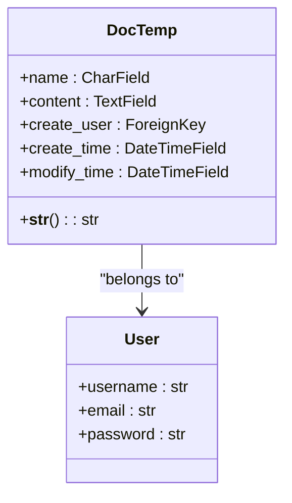
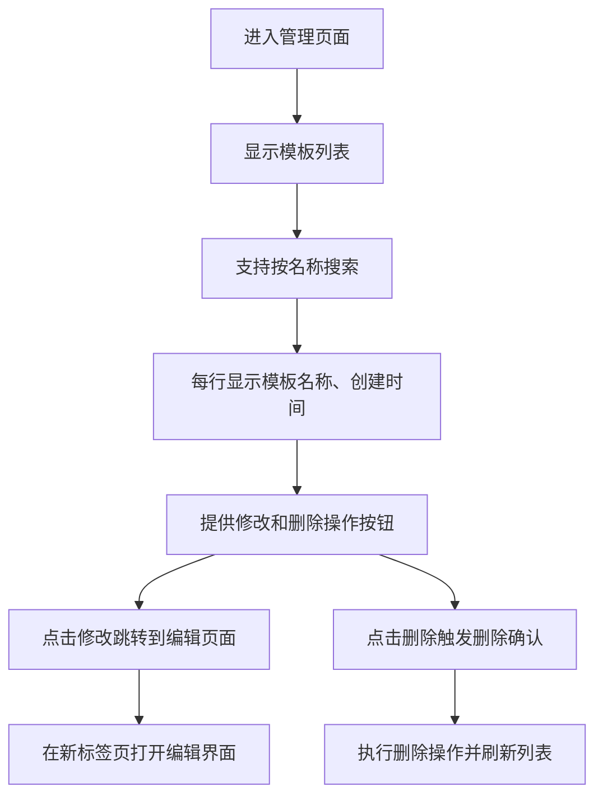
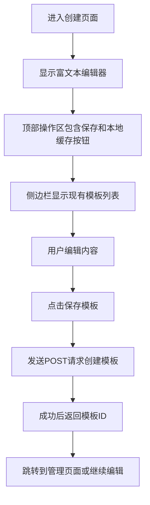

# 文档模板

<cite>
**本文档中引用的文件**   
- [manage_doctemp.html](file://template/app_doc/manage/manage_doctemp.html)
- [create_doctemp.html](file://template/app_doc/editor/create_doctemp.html)
- [views.py](file://app_doc/views.py)
- [models.py](file://app_doc/models.py)
</cite>

## 目录
1. [文档模板概述](#文档模板概述)
2. [模型与数据结构](#模型与数据结构)
3. [界面设计与用户交互](#界面设计与用户交互)
4. [视图函数与业务逻辑](#视图函数与业务逻辑)
5. [模板权限控制](#模板权限控制)
6. [常见问题与最佳实践](#常见问题与最佳实践)

## 文档模板概述

文档模板功能允许用户创建、管理和复用文档内容模板，以提高文档编写效率。该功能支持用户将常用文档结构或内容保存为模板，在创建新文档时快速应用。系统提供了完整的增删改查（CRUD）操作界面和后端逻辑，确保用户能够高效地管理个人模板库。

## 模型与数据结构

文档模板的数据结构定义在 `models.py` 文件中，核心模型为 `DocTemp`，用于存储用户创建的文档模板。



**图示来源**
- [models.py](file://app_doc/models.py#L120-L132)

**本节来源**
- [models.py](file://app_doc/models.py#L120-L132)

### 字段定义与约束

- **name**: 模板名称，最大长度为50个字符，必填字段。
- **content**: 模板内容，使用 `TextField` 存储，支持大文本内容。
- **create_user**: 外键关联到用户模型，表示模板的创建者，级联删除。
- **create_time**: 创建时间，自动设置为记录创建时的时间戳。
- **modify_time**: 修改时间，每次记录更新时自动更新。

### 数据存储结构

模板数据存储在数据库的 `app_doc_doctemp` 表中，每个模板记录包含上述字段。数据结构设计简洁，专注于核心功能，避免冗余字段。

## 界面设计与用户交互

文档模板的用户界面分为管理界面和创建/编辑界面，分别位于不同的HTML模板文件中。

### 管理界面 (manage_doctemp.html)

管理界面允许用户查看、搜索、修改和删除已创建的模板。



**图示来源**
- [manage_doctemp.html](file://template/app_doc/manage/manage_doctemp.html)

**本节来源**
- [manage_doctemp.html](file://template/app_doc/manage/manage_doctemp.html)

### 创建界面 (create_doctemp.html)

创建界面提供了一个富文本编辑器，用户可以在此编写模板内容并保存。



**图示来源**
- [create_doctemp.html](file://template/app_doc/editor/create_doctemp.html)

**本节来源**
- [create_doctemp.html](file://template/app_doc/editor/create_doctemp.html)

## 视图函数与业务逻辑

视图函数处理所有与文档模板相关的HTTP请求，实现业务逻辑。

### 创建模板视图

`create_doctemp` 视图函数处理模板的创建请求。

```python
# 创建文档模板
@login_required()
@require_http_methods(['GET',"POST"])
def create_doctemp(request):
    if request.method == 'GET':
        editor_type = _("新建文档模板")
        try:
            user_opt = UserOptions.objects.get(user=request.user)
            editor_mode = user_opt.editor_mode
        except ObjectDoesNotExist:
            editor_mode = 1
        doctemps = DocTemp.objects.filter(create_user=request.user)
        return render(request,'app_doc/editor/create_doctemp.html',locals())
    elif request.method == 'POST':
        try:
            name = request.POST.get('name','')
            content = request.POST.get('content','')
            if name != '':
                doctemp = DocTemp.objects.create(
                    name = name,
                    content = content,
                    create_user=request.user
                )
                doctemp.save()
                return JsonResponse({'status':True,'data':doctemp.id})
            else:
                return JsonResponse({'status':False,'data':_('模板标题不能为空')})
        except Exception as e:
            logger.exception(_("创建文档模板出错"))
            return JsonResponse({'status':False,'data':_('请求出错')})
```

**本节来源**
- [views.py](file://app_doc/views.py#L1999-L2029)

### 获取模板内容视图

`get_doctemp` 视图函数用于获取指定模板的内容，供在文档编辑器中插入使用。

```python
# 获取指定文档模板
@login_required()
@require_http_methods(["POST"])
def get_doctemp(request):
    try:
        doctemp_id = request.POST.get('doctemp_id','')
        if doctemp_id != '':
            content = DocTemp.objects.get(id=int(doctemp_id)).serializable_value('content')
            return JsonResponse({'status':True,'data':content})
        else:
            return JsonResponse({'status':False,'data':_('参数错误')})
    except Exception as e:
        logger.exception(_("获取指定文档模板出错"))
        return JsonResponse({'status':False,'data':_('请求出错')})
```

**本节来源**
- [views.py](file://app_doc/views.py#L2130-L2143)

## 模板权限控制

系统通过用户认证和授权机制确保模板的安全性。

### 用户认证

所有模板操作都要求用户登录，使用 `@login_required()` 装饰器确保只有认证用户才能访问相关视图。

### 权限隔离

- **创建权限**: 用户只能创建自己的模板。
- **访问权限**: 用户只能查看和管理自己创建的模板。
- **修改权限**: 只有模板创建者才能修改或删除模板。

系统通过在查询时添加 `create_user=request.user` 过滤条件来实现权限隔离，确保用户无法访问其他用户的模板数据。

## 常见问题与最佳实践

### 常见问题

#### 模板加载失败

**问题**: 点击插入模板无反应或内容未加载。
**解决方案**: 
1. 检查浏览器控制台是否有JavaScript错误。
2. 确认 `get_doctemp` 视图函数的POST请求是否成功。
3. 验证模板ID是否正确传递。

#### 模板内容异常

**问题**: 插入的模板内容显示不正确或格式丢失。
**解决方案**:
1. 检查模板内容是否包含特殊字符或恶意代码。
2. 确保富文本编辑器正确解析Markdown或HTML内容。
3. 验证内容在存储和读取过程中未被意外转义。

### 最佳实践

1. **命名规范**: 使用清晰、描述性的模板名称，便于后续查找和管理。
2. **内容结构**: 创建通用性强的模板，避免包含特定项目或日期等易变信息。
3. **定期维护**: 定期审查和清理不再使用的模板，保持模板库的整洁。
4. **安全考虑**: 避免在模板中存储敏感信息，如密码或密钥。
5. **版本控制**: 对于重要模板，建议手动记录修改历史，或考虑集成版本控制功能。

通过遵循这些最佳实践，用户可以更高效、安全地使用文档模板功能，提升文档编写效率和质量。