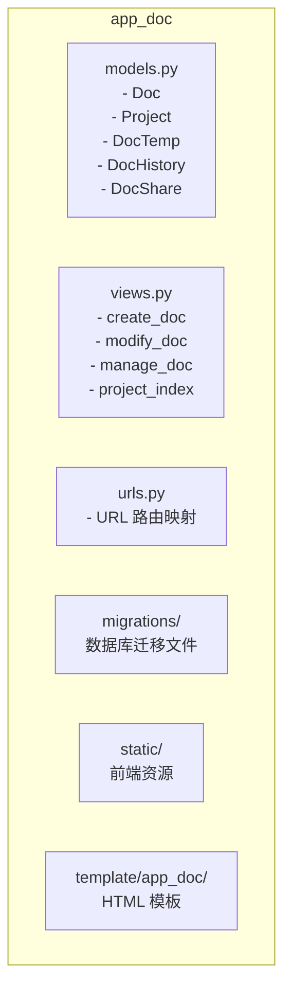
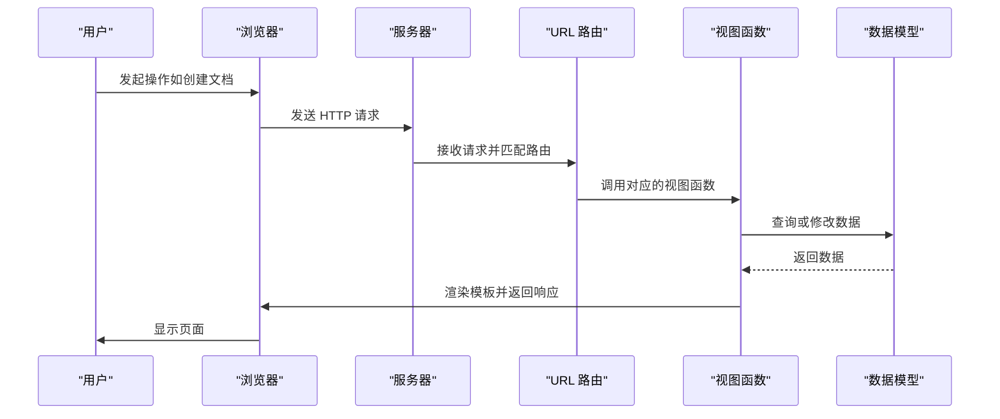
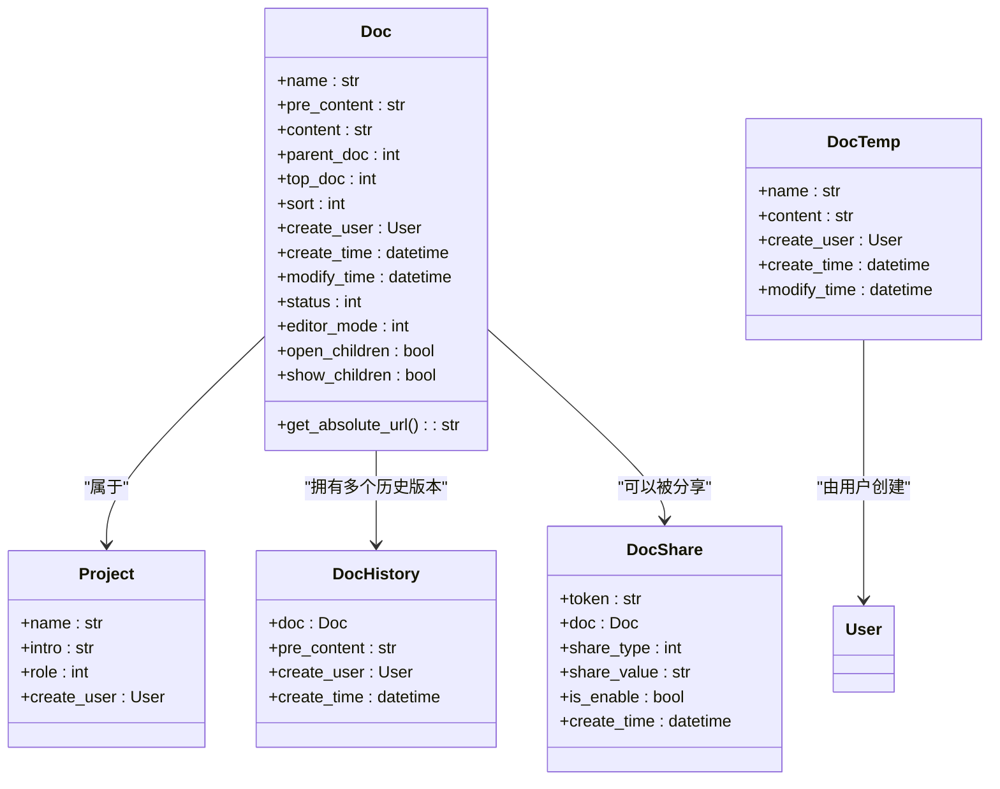
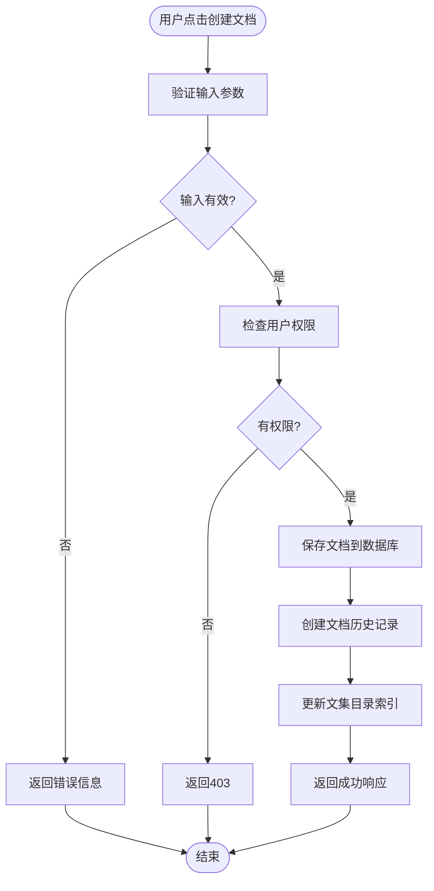
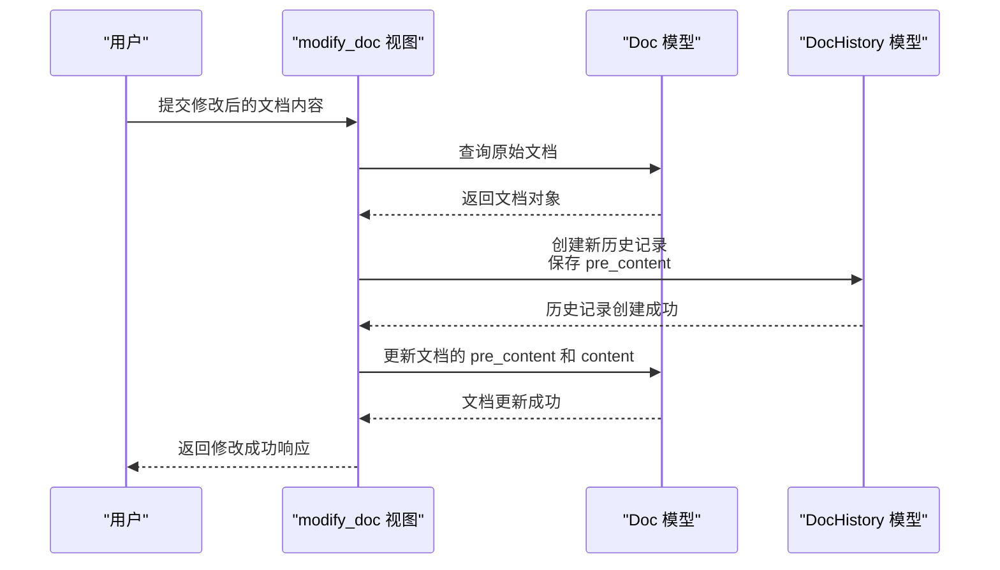
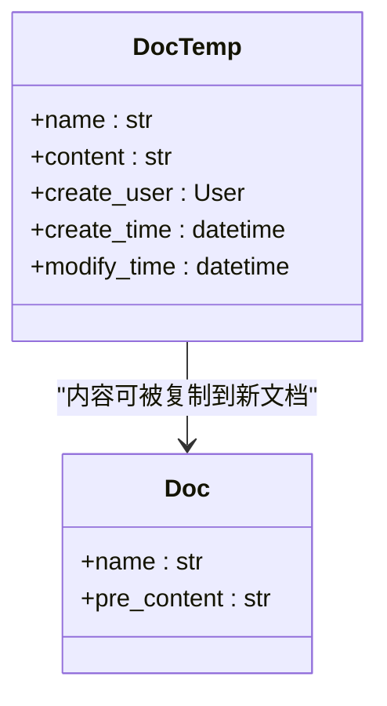
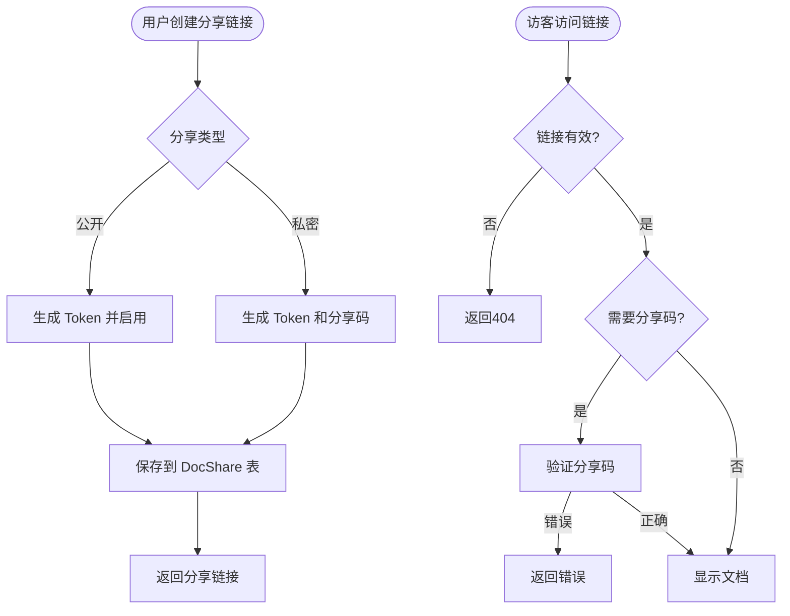
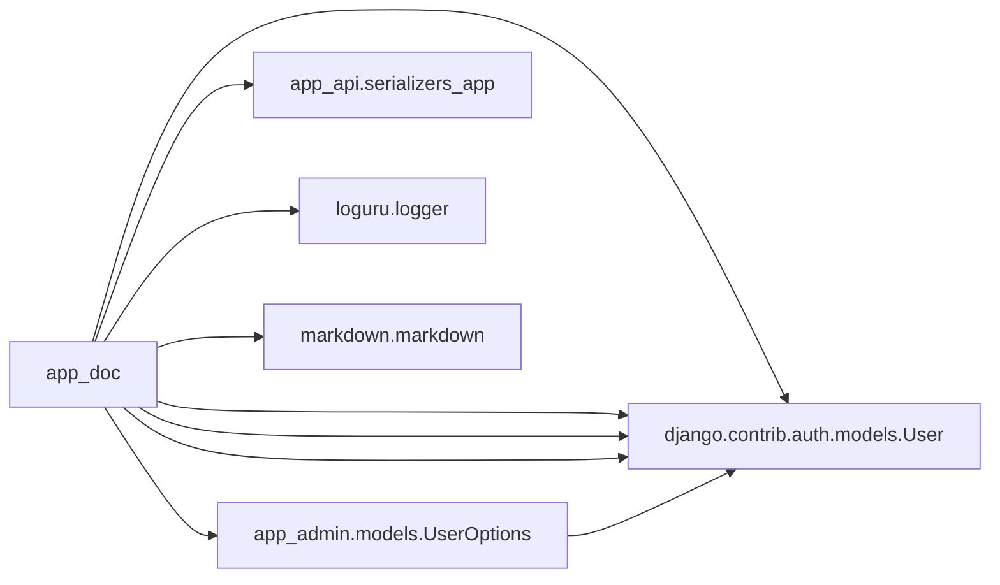

# 文档管理

<cite>
**本文档中引用的文件**  
- [models.py](file://app_doc/models.py)
- [views.py](file://app_doc/views.py)
- [urls.py](file://app_doc/urls.py)
</cite>

## 目录
1. [简介](#简介)  
2. [项目结构](#项目结构)  
3. [核心组件](#核心组件)  
4. [架构概览](#架构概览)  
5. [详细组件分析](#详细组件分析)  
6. [依赖分析](#依赖分析)  
7. [性能考虑](#性能考虑)  
8. [故障排除指南](#故障排除指南)  
9. [结论](#结论)

## 简介
本文档旨在全面解析 MrDoc 系统中的文档管理功能，涵盖文档的创建、编辑、删除、版本控制、模板管理、分享与公开访问机制。通过深入分析 `app_doc` 模块的核心代码，包括模型定义、视图逻辑和 URL 路由，为开发者和初学者提供清晰的技术实现路径。文档结合代码示例和可视化图表，确保技术深度与可读性并重。

## 项目结构
`app_doc` 模块是 MrDoc 系统中负责文档管理的核心组件，其结构遵循典型的 Django 应用模式，清晰地分离了模型、视图、URL 配置和静态资源。

**Diagram sources**
- [models.py](file://app_doc/models.py)
- [views.py](file://app_doc/views.py)
- [urls.py](file://app_doc/urls.py)

**Section sources**
- [models.py](file://app_doc/models.py)
- [views.py](file://app_doc/views.py)
- [urls.py](file://app_doc/urls.py)

## 核心组件
文档管理功能的核心由三个部分构成：数据模型（Models）、业务逻辑（Views）和接口路由（URLs）。`Doc` 模型定义了文档的数据结构，`views.py` 中的函数处理所有与文档相关的 HTTP 请求，而 `urls.py` 则将这些请求映射到相应的视图函数。

**Section sources**
- [models.py](file://app_doc/models.py#L100-L150)
- [views.py](file://app_doc/views.py#L1467-L1562)
- [urls.py](file://app_doc/urls.py#L25-L30)

## 架构概览
系统采用经典的 MVC（Model-View-Controller）架构，Django 框架作为控制器，协调模型和视图之间的交互。用户通过浏览器（前端）发起请求，请求经由 URL 路由分发到特定的视图函数。视图函数调用模型进行数据操作，并将结果渲染到 HTML 模板中返回给用户。

**Diagram sources**
- [urls.py](file://app_doc/urls.py)
- [views.py](file://app_doc/views.py)
- [models.py](file://app_doc/models.py)

## 详细组件分析

### 文档模型分析
`Doc` 模型是文档管理的基石，它定义了文档的所有属性和行为。

**Diagram sources**
- [models.py](file://app_doc/models.py#L100-L150)

**Section sources**
- [models.py](file://app_doc/models.py#L100-L150)

### 文档创建与编辑流程
文档的创建和编辑是核心功能，其流程通过视图函数和 URL 路由紧密配合实现。

**Diagram sources**
- [views.py](file://app_doc/views.py#L1467-L1562)
- [models.py](file://app_doc/models.py#L100-L150)

**Section sources**
- [views.py](file://app_doc/views.py#L1467-L1562)

### 文档版本控制
文档历史记录功能通过 `DocHistory` 模型实现，每次文档修改都会创建一个新的历史记录。

**Diagram sources**
- [models.py](file://app_doc/models.py#L152-L165)
- [views.py](file://app_doc/views.py#L1467-L1562)

**Section sources**
- [models.py](file://app_doc/models.py#L152-L165)

### 文档模板管理
文档模板功能允许用户创建和复用常用内容。

**Diagram sources**
- [models.py](file://app_doc/models.py#L177-L187)

**Section sources**
- [models.py](file://app_doc/models.py#L177-L187)

### 文档分享机制
文档分享通过 `DocShare` 模型实现，支持公开和私密两种模式。

**Diagram sources**
- [models.py](file://app_doc/models.py#L189-L205)
- [urls.py](file://app_doc/urls.py#L40-L42)

**Section sources**
- [models.py](file://app_doc/models.py#L189-L205)

## 依赖分析
`app_doc` 模块依赖于 Django 框架的核心组件（如 `models`, `views`, `http`）以及项目内的其他应用。

**Diagram sources**
- [models.py](file://app_doc/models.py#L1-L5)
- [views.py](file://app_doc/views.py#L1-L10)

**Section sources**
- [models.py](file://app_doc/models.py#L1-L5)
- [views.py](file://app_doc/views.py#L1-L10)

## 性能考虑
- **数据库查询优化**：`Doc` 模型在 `top_doc`, `parent_doc`, `status` 字段上建立了复合索引，加速了文档列表的查询。
- **分页处理**：在管理文档、文集等列表页面，均使用了 Django 的 `Paginator` 进行分页，避免一次性加载过多数据。
- **缓存机制**：`get_pro_toc` 函数设计了缓存逻辑（注释部分），旨在减少对数据库的频繁查询，但当前实现为每次请求都重新生成目录。

## 故障排除指南

### 文档保存失败
**问题**：用户提交文档后，系统返回“请求出错”。
**排查步骤**：
1. 检查 `views.py` 中 `create_doc` 或 `modify_doc` 视图的日志。
2. 确认 `pre_content` 或 `content` 字段是否包含非法字符或超长内容。
3. 检查数据库连接是否正常。
4. 查看 `validateTitle` 函数是否因标题包含非法字符而返回空字符串。

**Section sources**
- [views.py](file://app_doc/views.py#L1467-L1562)

### 版本冲突
**问题**：多个用户同时编辑同一文档，后保存的版本覆盖了前一个版本，且历史记录不完整。
**分析**：当前系统没有实现乐观锁或实时协同编辑。`DocHistory` 模型仅在文档被修改时创建记录，如果两个用户几乎同时提交，可能会导致一个用户的修改被覆盖，且只记录最后一次修改的历史。
**解决方案**：引入版本号或时间戳字段，在保存前进行比对，若发现版本不一致，则提示用户内容已变更，需手动合并。

**Section sources**
- [models.py](file://app_doc/models.py#L152-L165)
- [views.py](file://app_doc/views.py#L1467-L1562)

## 结论
MrDoc 的文档管理系统功能完整，结构清晰。它成功实现了文档的全生命周期管理，从创建、编辑、版本控制到分享和模板复用。其基于 Django 的 MVC 架构保证了代码的可维护性。未来可优化的方向包括：完善目录缓存机制、实现更智能的版本冲突解决策略、以及增强文档分享的安全性。该系统为开发者提供了一个稳定、可扩展的文档管理解决方案。