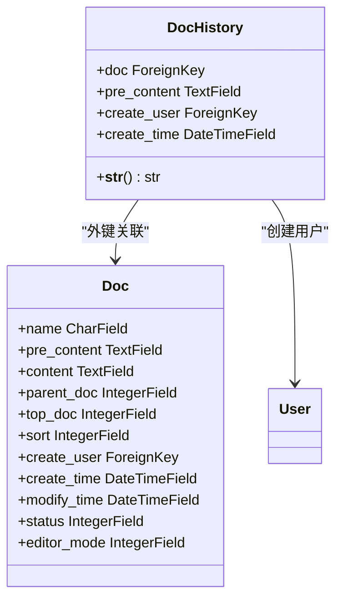
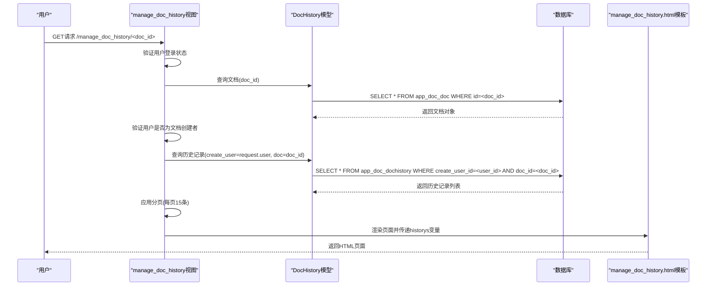
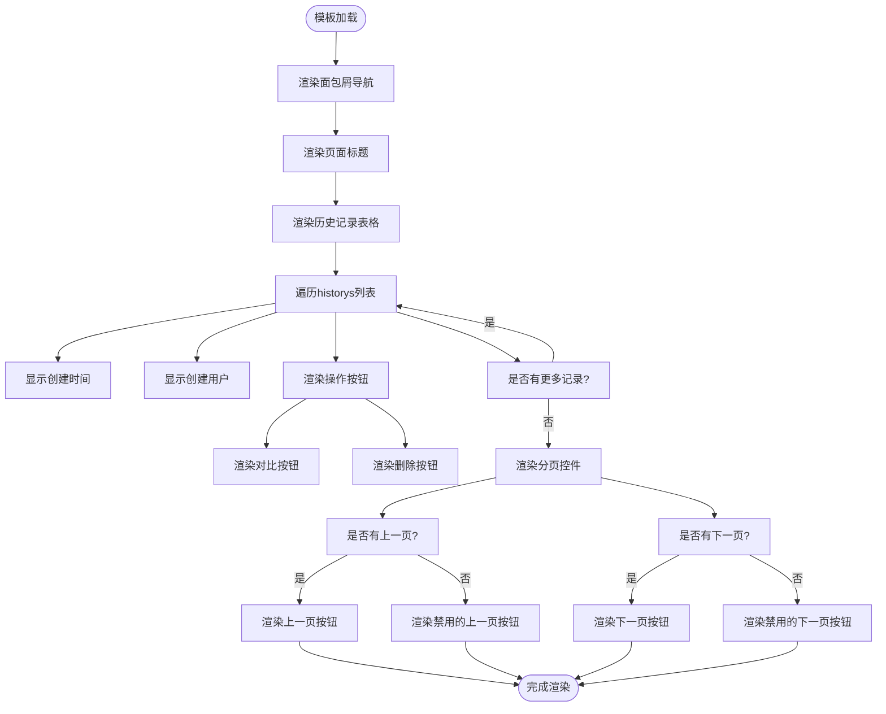

# 历史记录管理

<cite>
**本文档中引用的文件**
- [models.py](file://app_doc/models.py#L105-L116)
- [views.py](file://app_doc/views.py#L1687-L1714)
- [manage_doc_history.html](file://template/app_doc/manage/manage_doc_history.html)
</cite>

## 目录
1. [文档历史模型](#文档历史模型)
2. [历史记录视图函数](#历史记录视图函数)
3. [历史记录模板渲染](#历史记录模板渲染)
4. [代码示例与性能优化](#代码示例与性能优化)

## 文档历史模型

文档历史模型（DocHistory）是系统中用于记录文档修改历史的核心数据结构。该模型通过外键关联到文档模型（Doc），并存储每次修改的编辑内容、创建用户和创建时间。



**模型字段说明**
- **doc**: 外键字段，关联到文档模型，标识该历史记录所属的文档
- **pre_content**: 文本字段，存储文档的编辑内容，允许为空
- **create_user**: 外键字段，关联到用户模型，标识创建该历史记录的用户，当用户被删除时设为NULL
- **create_time**: 日期时间字段，自动设置为当前时间，记录历史记录的创建时间

**Diagram sources**
- [models.py](file://app_doc/models.py#L105-L116)

**Section sources**
- [models.py](file://app_doc/models.py#L105-L116)

## 历史记录视图函数

获取历史记录列表的视图函数`manage_doc_history`实现了分页处理和权限验证的核心逻辑。该函数只允许文档创建者访问其文档的历史记录。



```python
# 管理文档历史版本
@login_required()
@require_http_methods(['GET',"POST"])
def manage_doc_history(request,doc_id):
    if request.method == 'GET':
        try:
            doc = Doc.objects.get(id=doc_id,create_user=request.user)
            history_list = DocHistory.objects.filter(create_user=request.user,doc=doc_id).order_by('-create_time')
            paginator = Paginator(history_list, 15)
            page = request.GET.get('page', 1)
            try:
                historys = paginator.page(page)
            except PageNotAnInteger:
                historys = paginator.page(1)
            except EmptyPage:
                historys = paginator.page(paginator.num_pages)
            return render(request, 'app_doc/manage/manage_doc_history.html', locals())
        except Exception as e:
            logger.exception(_("管理文档历史版本页面访问出错"))
            return render(request, '404.html')
    elif request.method == 'POST':
        try:
            history_id = request.POST.get('history_id','')
            DocHistory.objects.filter(id=history_id,doc=doc_id,create_user=request.user).delete()
            return JsonResponse({'status':True,'data':_('删除成功')})
        except:
            logger.exception(_("操作文档历史版本出错"))
            return JsonResponse({'status':False,'data':_('出现异常')})
```

**权限验证逻辑**
视图函数通过`@login_required()`装饰器确保用户已登录，并在查询文档时添加`create_user=request.user`条件，确保只有文档创建者才能访问其历史记录。

**分页处理机制**
使用Django的Paginator类实现分页，每页显示15条记录。通过`request.GET.get('page', 1)`获取当前页码，并处理PageNotAnInteger和EmptyPage异常，确保分页的健壮性。

**Diagram sources**
- [views.py](file://app_doc/views.py#L1687-L1714)

**Section sources**
- [views.py](file://app_doc/views.py#L1687-L1714)

## 历史记录模板渲染

`manage_doc_history.html`模板负责渲染版本列表，展示版本时间、修改者信息和操作按钮。模板使用Layui框架构建响应式表格界面。



```html
<table class="layui-table" id="doctemp-list" lay-skin="" lay-even>
    <thead>
        <tr>
            <th>创建时间</th>
            <th>创建人</th>
            <th>操作</th>
        </tr>
    </thead>
    <tbody>
        
        <tr>
            <td>{{ his.create_time }}</td>
            <td>{{ his.create_user }}</td>
            <td>
                <a href="" target="_blank" class="layui-btn layui-btn-xs layui-btn-normal">
                    <i class="layui-icon layui-icon-edit"></i>对比
                </a>
                <a href="javascript:void(0);" onclick="delDocHis('{{his.id}}');" class="layui-btn layui-btn-xs layui-btn-warm">
                    <i class="layui-icon layui-icon-delete"></i>删除
                </a>
            </td>
        </tr>
        
    </tbody>
</table>
<!-- 分页 -->
<div class="layui-row">
    <div class="layui-box layui-laypage layui-laypage-default">
        <!-- 上一页 -->
        
            <a href="?page={{ historys.previous_page_number }}" class="layui-btn layui-btn-xs layui-btn-normal">上一页</a>
        
            <a href="javascript:;" class="layui-btn layui-btn-xs layui-btn-disabled">上一页</a>
        
        <!-- 当前页 -->
        <span class="layui-laypage-curr">
            <em class="layui-laypage-em"></em>
            <em>{{ historys.number }}/{{ historys.paginator.num_pages }}</em>
        </span>
        <!-- 下一页 -->
        
            <a href="?page={{ historys.next_page_number }}" class="layui-btn layui-btn-xs layui-btn-normal">下一页</a>
        
            <a class="layui-btn layui-btn-xs layui-btn-disabled">下一页</a>
        
    </div>
</div>
```

**前端交互逻辑**
模板包含JavaScript代码，实现删除历史记录的确认对话框。当用户点击删除按钮时，会弹出确认层，用户确认后通过AJAX POST请求删除指定的历史记录。

**Section sources**
- [manage_doc_history.html](file://template/app_doc/manage/manage_doc_history.html)

## 代码示例与性能优化

### 查询特定文档的所有历史版本

以下代码示例展示了如何查询特定文档的所有历史版本：

```python
# 查询文档ID为123的所有历史版本
from app_doc.models import DocHistory, Doc

def get_document_history(doc_id, user):
    """
    获取指定文档的历史版本
    :param doc_id: 文档ID
    :param user: 当前用户
    :return: 历史版本查询集
    """
    try:
        # 验证文档存在且当前用户有权限访问
        doc = Doc.objects.get(id=doc_id, create_user=user)
        # 查询所有历史版本，按创建时间倒序排列
        history_versions = DocHistory.objects.filter(
            doc=doc,
            create_user=user
        ).order_by('-create_time')
        
        return history_versions
    except Doc.DoesNotExist:
        return None

# 使用示例
history_list = get_document_history(123, request.user)
if history_list:
    for history in history_list:
        print(f"版本创建时间: {history.create_time}")
        print(f"修改者: {history.create_user}")
        print(f"内容长度: {len(history.pre_content or '')}")
```

### 大数据量下的性能优化方案

当历史记录数据量较大时，需要采取以下性能优化措施：

**1. 数据库索引优化**

```python
# 在DocHistory模型中添加复合索引
class DocHistory(models.Model):
    doc = models.ForeignKey(Doc, on_delete=models.CASCADE)
    pre_content = models.TextField(verbose_name='文档历史编辑内容', null=True, blank=True)
    create_user = models.ForeignKey(User, on_delete=models.SET_NULL, null=True)
    create_time = models.DateTimeField(auto_now=True)
    
    class Meta:
        indexes = [
            # 为常用查询条件创建复合索引
            models.Index(fields=['doc', 'create_user', '-create_time']),
            # 为删除操作创建索引
            models.Index(fields=['doc', 'id']),
        ]
        verbose_name = '文档历史'
        verbose_name_plural = verbose_name
```

**2. 缓存策略**

```python
from django.core.cache import cache
from django.conf import settings

def get_document_history_cached(doc_id, user, page=1, page_size=15):
    """
    使用缓存获取文档历史版本
    """
    # 生成缓存键
    cache_key = f"doc_history_{doc_id}_{user.id}_page_{page}"
    cache_timeout = 300  # 缓存5分钟
    
    # 尝试从缓存获取
    cached_data = cache.get(cache_key)
    if cached_data is not None:
        return cached_data
    
    # 缓存未命中，查询数据库
    try:
        doc = Doc.objects.get(id=doc_id, create_user=user)
        # 使用分页避免一次性加载过多数据
        history_list = DocHistory.objects.filter(
            doc=doc,
            create_user=user
        ).order_by('-create_time')[(page-1)*page_size:page*page_size]
        
        # 构建返回数据（只包含必要信息）
        result = []
        for history in history_list:
            result.append({
                'id': history.id,
                'create_time': history.create_time,
                'username': history.create_user.username,
                'content_length': len(history.pre_content or '')
            })
        
        # 缓存结果
        cache.set(cache_key, result, cache_timeout)
        return result
        
    except Doc.DoesNotExist:
        return None

# 在视图函数中使用缓存版本
def manage_doc_history(request, doc_id):
    if request.method == 'GET':
        page = request.GET.get('page', 1)
        historys = get_document_history_cached(doc_id, request.user, int(page))
        # ... 其他逻辑
```

**3. 数据库查询优化**

```python
# 使用select_related减少数据库查询次数
def get_document_history_optimized(doc_id, user):
    """
    优化的文档历史查询，使用select_related预加载关联对象
    """
    try:
        doc = Doc.objects.get(id=doc_id, create_user=user)
        # 使用select_related预加载create_user关联对象
        history_versions = DocHistory.objects.select_related('create_user').filter(
            doc=doc,
            create_user=user
        ).order_by('-create_time')[:100]  # 限制返回数量
        
        return history_versions
    except Doc.DoesNotExist:
        return None
```

**4. 分页优化**

```python
# 使用游标分页替代基于页码的分页，提高大数据集的分页性能
def get_document_history_cursor(doc_id, user, cursor=None, limit=15):
    """
    使用游标分页获取文档历史版本
    """
    try:
        doc = Doc.objects.get(id=doc_id, create_user=user)
        
        # 基础查询
        queryset = DocHistory.objects.filter(
            doc=doc,
            create_user=user
        ).order_by('-create_time')
        
        # 如果提供了游标，从游标位置开始查询
        if cursor:
            # 游标通常是上一页最后一条记录的create_time
            queryset = queryset.filter(create_time__lt=cursor)
            
        # 获取指定数量的记录
        history_list = queryset[:limit]
        
        # 返回结果和下一页的游标
        next_cursor = None
        if len(history_list) == limit:
            next_cursor = history_list[len(history_list)-1].create_time
            
        return {
            'data': history_list,
            'next_cursor': next_cursor
        }
        
    except Doc.DoesNotExist:
        return None
```

这些优化方案可以显著提高历史记录功能在大数据量场景下的性能表现，确保系统的响应速度和用户体验。

**Section sources**
- [models.py](file://app_doc/models.py#L105-L116)
- [views.py](file://app_doc/views.py#L1687-L1714)
- [manage_doc_history.html](file://template/app_doc/manage/manage_doc_history.html)