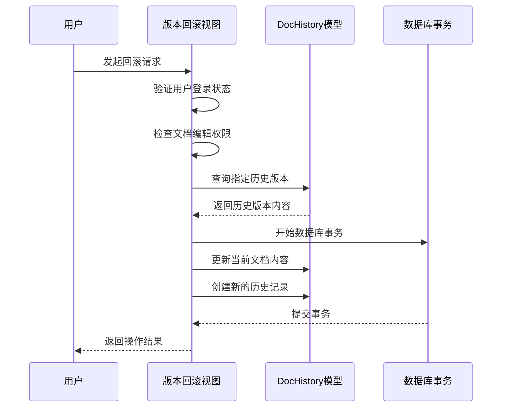
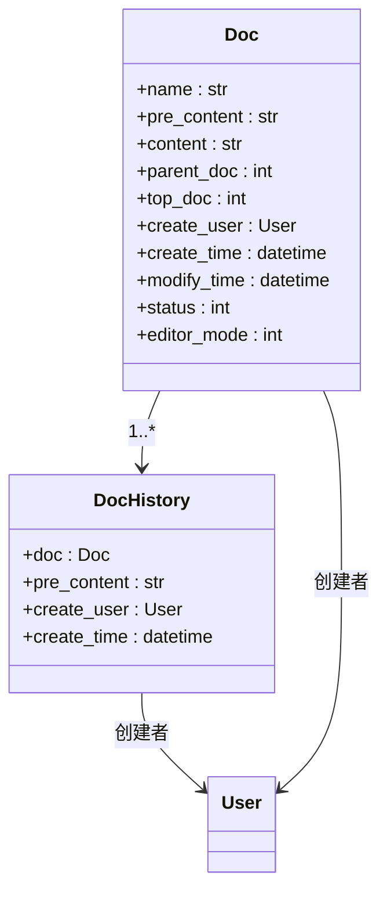
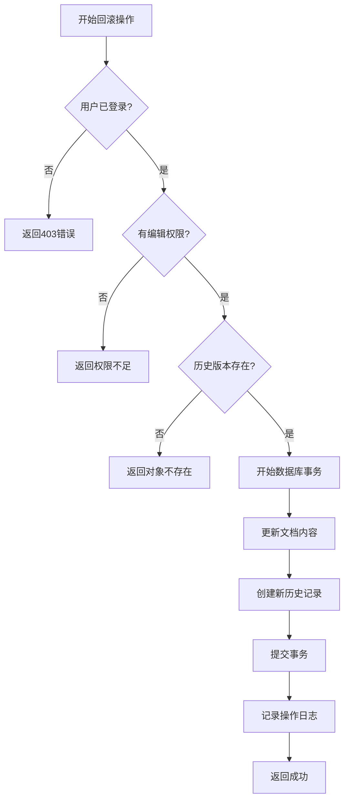

# 版本回滚

<cite>
**本文档中引用的文件**   
- [views.py](file://app_doc/views.py)
- [models.py](file://app_doc/models.py)
</cite>

## 目录
1. [版本回滚](#版本回滚)
2. [核心组件分析](#核心组件分析)
3. [版本回滚视图处理流程](#版本回滚视图处理流程)
4. [模型层事务处理机制](#模型层事务处理机制)
5. [异常处理与错误恢复策略](#异常处理与错误恢复策略)
6. [审计日志与安全控制](#审计日志与安全控制)

## 核心组件分析

版本回滚功能主要涉及两个核心文件：`app_doc/views.py`中的视图处理逻辑和`app_doc/models.py`中的数据模型定义。通过分析这两个文件，可以全面理解版本回滚的技术实现。

**Section sources**
- [views.py](file://app_doc/views.py)
- [models.py](file://app_doc/models.py)

## 版本回滚视图处理流程

版本回滚功能的处理流程主要在`views.py`文件中实现，通过一系列步骤确保用户权限验证、历史版本获取和安全恢复。



**Diagram sources**
- [views.py](file://app_doc/views.py)
- [models.py](file://app_doc/models.py)

**Section sources**
- [views.py](file://app_doc/views.py#L1669-L1684)

## 模型层事务处理机制

在`models.py`文件中，`DocHistory`模型负责存储文档的历史版本信息。版本回滚操作通过Django的事务机制确保数据一致性。



**Diagram sources**
- [models.py](file://app_doc/models.py)

**Section sources**
- [models.py](file://app_doc/models.py)

## 异常处理与错误恢复策略

版本回滚功能实现了完善的异常处理机制，确保在各种异常情况下系统能够正确响应和恢复。

```python
# 伪代码示例：版本回滚异常处理
def rollback_version(request):
    try:
        # 1. 验证用户权限
        if not has_edit_permission():
            return JsonResponse({'status': False, 'data': '无权操作'})
        
        # 2. 获取历史版本
        history = DocHistory.objects.get(id=his_id)
        if history.doc != current_doc:
            return JsonResponse({'status': False, 'data': '非法请求'})
        
        # 3. 开始事务
        with transaction.atomic():
            # 4. 恢复文档内容
            current_doc.content = history.pre_content
            current_doc.modify_time = timezone.now()
            current_doc.save()
            
            # 5. 创建新的历史记录
            DocHistory.objects.create(
                doc=current_doc,
                pre_content=history.pre_content,
                create_user=request.user
            )
            
        return JsonResponse({'status': True, 'data': '回滚成功'})
        
    except ObjectDoesNotExist:
        logger.exception("文档或历史版本不存在")
        return JsonResponse({'status': False, 'data': '对象不存在'})
    except PermissionDenied:
        logger.exception("权限验证失败")
        return JsonResponse({'status': False, 'data': '权限不足'})
    except Exception as e:
        logger.exception("版本回滚出错")
        return JsonResponse({'status': False, 'data': '操作失败'})
```

**Section sources**
- [views.py](file://app_doc/views.py)

## 审计日志与安全控制

系统通过多种安全控制措施确保版本回滚操作的安全性，包括权限验证、操作日志记录等。



**Diagram sources**
- [views.py](file://app_doc/views.py)
- [models.py](file://app_doc/models.py)

**Section sources**
- [views.py](file://app_doc/views.py)
- [models.py](file://app_doc/models.py)