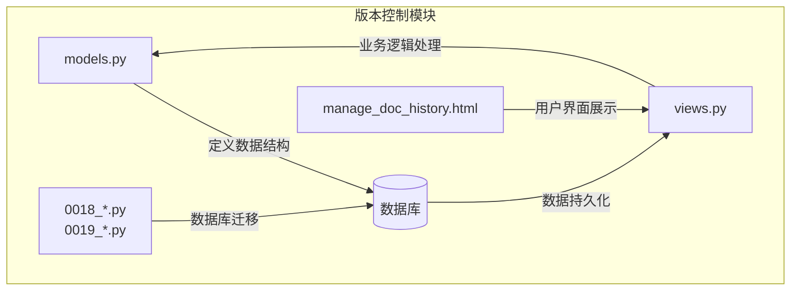
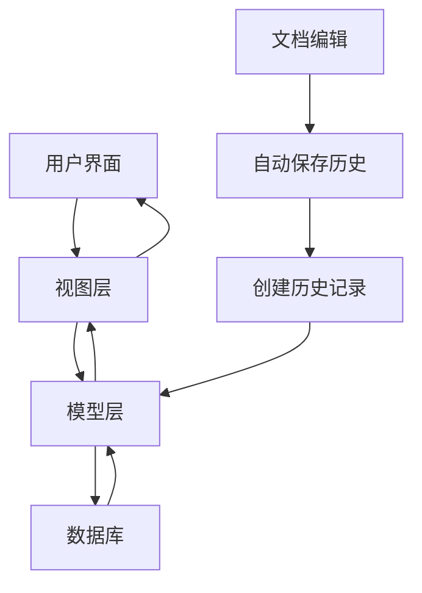
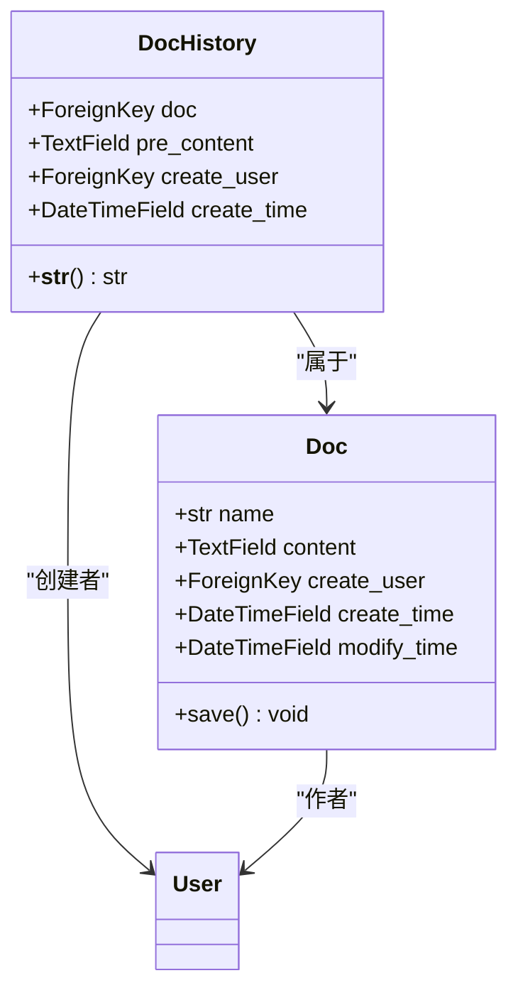
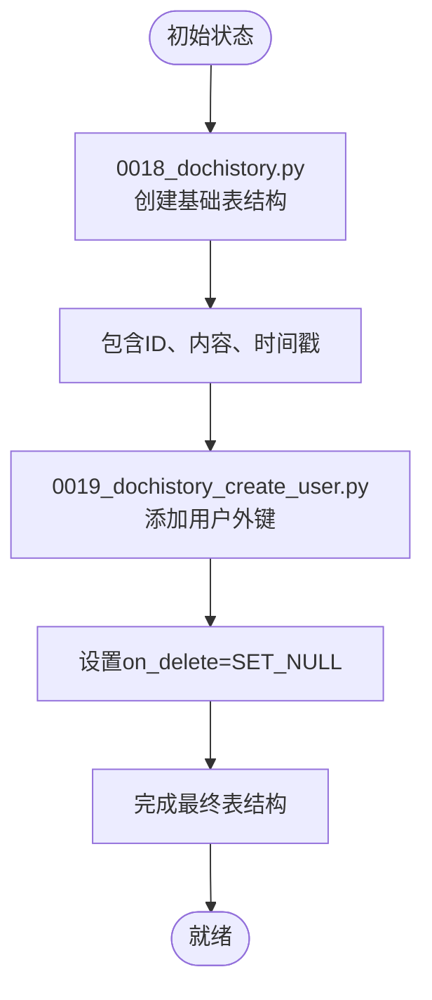
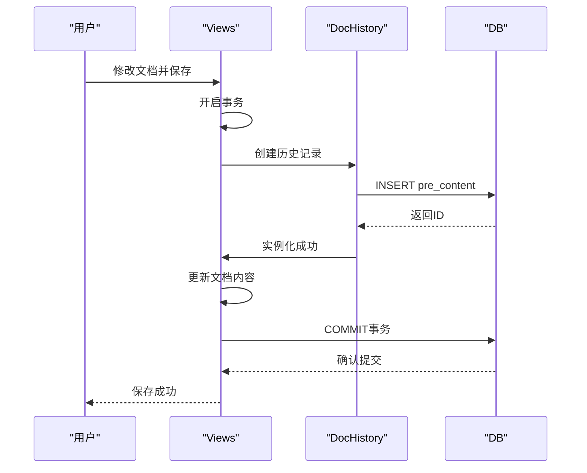
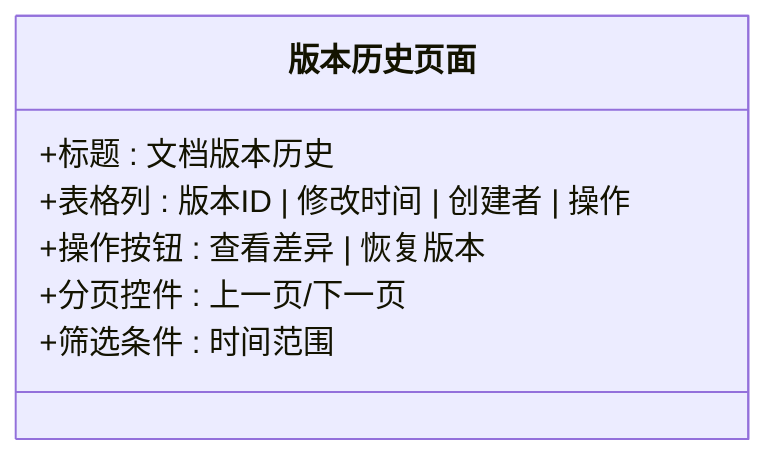
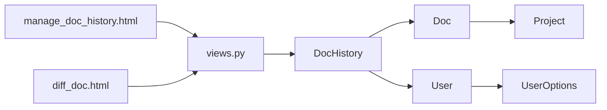

# 版本控制

<cite>
**本文档引用文件**   
- [0018_dochistory.py](file://app_doc/migrations/0018_dochistory.py)
- [0019_dochistory_create_user.py](file://app_doc/migrations/0019_dochistory_create_user.py)
- [models.py](file://app_doc/models.py)
- [views.py](file://app_doc/views.py)
- [manage_doc_history.html](file://template/app_doc/manage/manage_doc_history.html)
</cite>

## 目录
1. [引言](#引言)
2. [项目结构](#项目结构)
3. [核心组件](#核心组件)
4. [架构概述](#架构概述)
5. [详细组件分析](#详细组件分析)
6. [依赖分析](#依赖分析)
7. [性能考虑](#性能考虑)
8. [故障排除指南](#故障排除指南)
9. [结论](#结论)

## 引言
本文档深入解析MrDoc系统中的版本控制功能，重点分析文档历史记录（DocHistory）模型的设计与实现。文档将详细阐述版本记录的创建、存储、检索及回滚机制，涵盖数据模型演变、用户界面展示逻辑和后端处理流程。通过本指南，用户可全面理解系统如何自动追踪文档修改历史并支持版本管理。

## 项目结构
版本控制功能主要分布在`app_doc`应用中，涉及模型定义、数据库迁移、视图逻辑和前端模板四个核心部分。该功能通过模块化设计实现了高内聚低耦合的架构特点。

**图示来源**
- [models.py](file://app_doc/models.py)
- [0018_dochistory.py](file://app_doc/migrations/0018_dochistory.py)
- [0019_dochistory_create_user.py](file://app_doc/migrations/0019_dochistory_create_user.py)
- [views.py](file://app_doc/views.py)
- [manage_doc_history.html](file://template/app_doc/manage/manage_doc_history.html)

## 核心组件
版本控制系统由五个核心组件构成：文档历史模型（DocHistory）、数据库迁移脚本、视图函数、前端模板和用户追踪机制。这些组件协同工作，确保每次文档修改都能被准确记录和追溯。

**组件来源**
- [models.py](file://app_doc/models.py#L150-L160)
- [0018_dochistory.py](file://app_doc/migrations/0018_dochistory.py#L1-L27)
- [0019_dochistory_create_user.py](file://app_doc/migrations/0019_dochistory_create_user.py#L1-L21)

## 架构概述
系统采用MVC架构模式实现版本控制功能，各层职责分明。数据层负责持久化存储，逻辑层处理业务规则，表现层提供用户交互界面。

**图示来源**
- [models.py](file://app_doc/models.py)
- [views.py](file://app_doc/views.py)

## 详细组件分析

### 文档历史模型分析
`DocHistory`模型是版本控制的核心数据结构，采用外键关联方式与`Doc`模型建立联系，实现一对多的历史记录关系。

#### 类图分析

**图示来源**
- [models.py](file://app_doc/models.py#L150-L160)

### 数据库迁移分析
系统通过Django迁移系统分阶段构建版本历史表结构，体现了渐进式开发的设计理念。

#### 迁移流程图

**图示来源**
- [0018_dochistory.py](file://app_doc/migrations/0018_dochistory.py#L1-L27)
- [0019_dochistory_create_user.py](file://app_doc/migrations/0019_dochistory_create_user.py#L1-L21)

### 视图逻辑分析
版本控制的业务逻辑主要在视图层实现，通过事务处理确保数据一致性。

#### 版本创建序列图

**图示来源**
- [views.py](file://app_doc/views.py)
- [models.py](file://app_doc/models.py)

### 用户界面分析
前端模板采用表格形式展示版本历史，提供直观的时间线视图。

#### 界面元素结构

**图示来源**
- [manage_doc_history.html](file://template/app_doc/manage/manage_doc_history.html)

## 依赖分析
版本控制系统与其他模块存在明确的依赖关系，形成了完整的功能闭环。

**图示来源**
- [models.py](file://app_doc/models.py)
- [views.py](file://app_doc/views.py)

## 性能考虑
针对版本记录过多可能导致的性能问题，建议采取以下优化措施：
1. 定期归档旧版本记录
2. 为`create_time`字段建立索引
3. 实现分页查询机制
4. 设置版本保留策略（如仅保留最近10个版本）
5. 使用缓存机制减少数据库查询

## 故障排除指南
常见问题及解决方案：

**问题1：版本记录未生成**
- 检查`views.py`中是否调用了`DocHistory.objects.create()`
- 验证事务是否正确提交
- 确认信号处理器是否正常工作

**问题2：用户信息丢失**
- 检查外键约束设置
- 验证`on_delete=SET_NULL`行为
- 确保用户对象未被删除

**问题3：性能下降**
- 分析查询执行计划
- 添加适当索引
- 考虑分区表策略

**组件来源**
- [models.py](file://app_doc/models.py#L155)
- [views.py](file://app_doc/views.py)

## 结论
MrDoc的版本控制系统通过精心设计的数据模型和严谨的业务逻辑，实现了可靠的文档历史追踪功能。系统采用渐进式迁移策略，确保了数据库结构的平滑演进。未来可考虑增加版本比较可视化、自动合并冲突等功能，进一步提升用户体验。