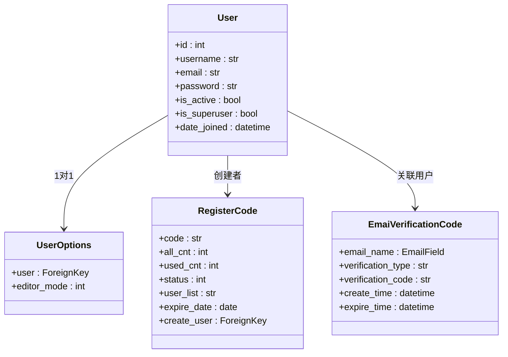
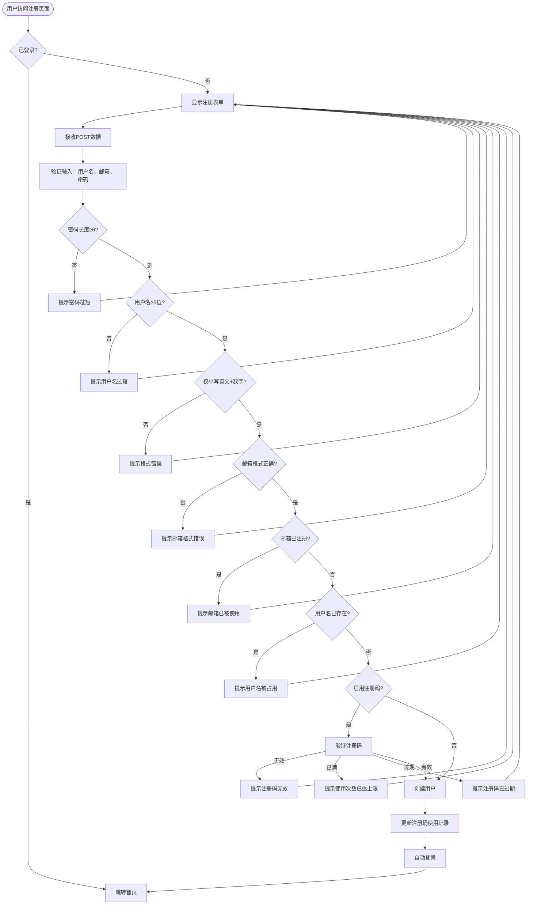
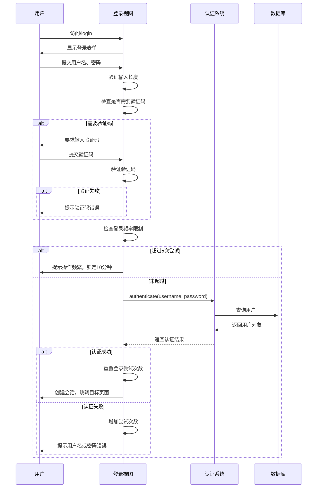
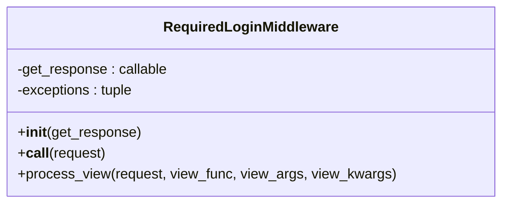
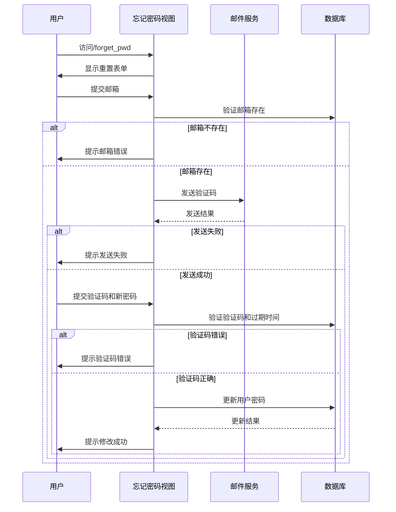

# 用户管理

<cite>
**本文档中引用的文件**  
- [models.py](file://app_admin/models.py)
- [views.py](file://app_admin/views.py)
- [require_login_middleware.py](file://app_admin/middleware/require_login_middleware.py)
- [user_center.html](file://template/app_doc/user/user_center.html) - *已移除外链*
- [views_user.py](file://app_doc/views_user.py) - *用户中心菜单逻辑*
</cite>

## 更新摘要
**变更内容**  
- 根据最新代码变更，更新用户中心页面的外部链接状态
- 新增关于用户中心菜单结构的说明
- 修正用户中心功能描述以反映最新实现
- 更新相关文件引用以包含新分析的源文件

## 目录
1. [用户管理](#用户管理)
2. [核心功能概述](#核心功能概述)
3. [用户模型与配置](#用户模型与配置)
4. [用户注册流程](#用户注册流程)
5. [用户登录与身份验证](#用户登录与身份验证)
6. [基于中间件的登录控制](#基于中间件的登录控制)
7. [密码重置机制](#密码重置机制)
8. [用户权限管理](#用户权限管理)
9. [常见问题与解决方案](#常见问题与解决方案)

## 核心功能概述

本系统实现了完整的用户生命周期管理，涵盖用户注册、登录、身份验证、资料管理、权限控制及密码重置等核心功能。系统基于Django框架构建，采用模块化设计，通过`app_admin`模块集中处理用户相关逻辑。

主要功能包括：
- **用户注册**：支持用户名、邮箱注册，可启用注册邀请码机制
- **用户登录**：支持用户名/邮箱登录，可配置验证码验证
- **身份验证**：通过中间件实现全局登录状态控制
- **用户资料管理**：支持用户信息修改、密码更新、账户删除
- **权限管理**：区分普通用户与超级管理员，支持后台精细化权限控制
- **安全机制**：包含验证码、登录频率限制、邮箱验证码过期控制

**Section sources**
- [models.py](file://app_admin/models.py)
- [views.py](file://app_admin/views.py)

## 用户模型与配置

### 用户模型结构

系统使用Django内置的`User`模型作为基础，并通过扩展模型实现自定义功能。



**Diagram sources**
- [models.py](file://app_admin/models.py#L1-L66)

### 用户选项配置

`UserOptions`模型用于存储用户的个性化设置：

- **user**：外键关联Django内置User模型
- **editor_mode**：整数字段，表示用户选择的编辑器类型
  - `1`：Editormd编辑器（默认）
  - `2`：Vditor编辑器

该配置允许用户在不同编辑器之间切换，提升使用体验。

### 注册邀请码模型

`RegisterCode`模型实现注册邀请机制：

| 字段 | 类型 | 描述 |
|------|------|------|
| code | CharField | 注册邀请码（唯一） |
| all_cnt | IntegerField | 最大使用次数（默认1） |
| used_cnt | IntegerField | 已使用次数（默认0） |
| status | IntegerField | 状态：0=已满，1=有效（默认1） |
| user_list | CharField | 使用该码的用户邮箱列表 |
| expire_date | DateField | 有效期（可为空） |
| create_user | ForeignKey | 创建该码的用户 |
| create_time | DateTimeField | 创建时间 |

此机制可用于控制用户增长，防止恶意注册。

### 邮箱验证码模型

`EmaiVerificationCode`模型用于密码重置等场景的邮箱验证：

- **email_name**：接收验证码的邮箱地址
- **verification_type**：验证码类型（如"忘记密码"）
- **verification_code**：生成的验证码
- **create_time**：创建时间（自动记录）
- **expire_time**：过期时间（30分钟后失效）

**Section sources**
- [models.py](file://app_admin/models.py#L1-L66)

## 用户注册流程

### 注册视图逻辑

注册功能由`register`视图函数实现，位于`views.py`中。



**Diagram sources**
- [views.py](file://app_admin/views.py#L176-L196)

### 关键代码实现

```python
@open_register
@logger.catch()
def register(request):
    if request.user.is_authenticated:
        return redirect('/')
    else:
        if request.method == 'GET':
            return render(request,'register.html',locals())
        elif request.method == 'POST':
            username = request.POST.get('username',None)
            email = request.POST.get('email',None)
            password = request.POST.get('password',None)
            checkcode = request.POST.get("check_code",None)
            
            # 密码长度检查
            if len(password) > 50:
                errormsg = _('密码长度不符！')
                return render(request, 'register.html', locals())
                
            # 检查是否启用注册码
            is_register_code = SysSetting.objects.filter(
                types='basic', 
                name='enable_register_code', 
                value='on'
            )
            
            if is_register_code.exists():
                register_code = request.POST.get("register_code", None)
                try:
                    current_date = timezone.now().date()
                    register_code_value = RegisterCode.objects.get(code=register_code)
                    if register_code_value.used_cnt >= register_code_value.all_cnt:
                        errormsg = _('注册码使用次数已达限制!')
                        return render(request, 'register.html', locals())
                    elif register_code_value.expire_date is not None and register_code_value.expire_date < current_date:
                        errormsg = _('注册码已过期!')
                        return render(request, 'register.html', locals())
                except ObjectDoesNotExist:
                    errormsg = _('注册码无效!')
                    return render(request, 'register.html', locals())
            
            # 输入验证
            if username and email and password:
                if '@' in email:
                    email_exit = User.objects.filter(email=email)
                    username_exit = User.objects.filter(username=username)
                    if email_exit.count() > 0:
                        errormsg = _('此电子邮箱已被注册！')
                        return render(request, 'register.html', locals())
                    elif username_exit.count() > 0:
                        errormsg = _('用户名已被使用！')
                        return render(request, 'register.html', locals())
                    elif re.match('^[0-9a-z]+$',username) is None:
                        errormsg = _('用户名只能为小写英文+数字组合')
                        return render(request, 'register.html', locals())
                    elif len(username) < 5:
                        errormsg = _('用户名必须大于等于5位！')
                        return render(request, 'register.html', locals())
                    elif len(password) < 6:
                        errormsg = _('密码必须大于等于6位！')
                        return render(request, 'register.html', locals())
                    elif checkcode.lower() != request.session['CheckCode'].lower():
                        errormsg = _("验证码错误")
                        return render(request, 'register.html', locals())
                    else:
                        # 创建用户
                        user = User.objects.create_user(
                            username=username, 
                            email=email, 
                            password=password
                        )
                        user.save()
                        # 自动登录
                        user = authenticate(username=username, password=password)
                        if user.is_active:
                            login(request, user)
                            return redirect('/')
```

**Section sources**
- [views.py](file://app_admin/views.py#L176-L196)

## 用户登录与身份验证

### 登录流程



**Diagram sources**
- [views.py](file://app_admin/views.py#L54-L82)

### 登录安全机制

#### 验证码控制

系统支持通过`SysSetting`模型配置登录验证码：

```python
require_login_check_code = SysSetting.objects.filter(
    types="basic",
    name="enable_login_check_code"
)
if (len(require_login_check_code) > 0) and (require_login_check_code[0].value == 'on'):
    checkcode = request.POST.get("check_code", None)
    if checkcode.lower() != request.session['CheckCode'].lower():
        errormsg = _('验证码错误！')
        return render(request, 'login.html', locals())
```

#### 登录频率限制

为防止暴力破解，系统实现登录频率限制：

```python
if 'LoginLock' not in request.session.keys():
    request.session['LoginNum'] = 1
    request.session['LoginLock'] = False
    request.session['LoginTime'] = datetime.datetime.now().timestamp()

verify_num = request.session['LoginNum']
if verify_num > 5:
    request.session['LoginLock'] = True
    request.session['LoginTime'] = (datetime.datetime.now() + datetime.timedelta(minutes=10)).timestamp()

verify_lock = request.session['LoginLock']
verify_time = request.session['LoginTime']

if verify_lock is True and datetime.datetime.now().timestamp() < verify_time:
    errormsg = _("操作过于频繁，请10分钟后再试！")
    request.session['LoginNum'] = 0
    return render(request, 'login.html', locals())
```

**Section sources**
- [views.py](file://app_admin/views.py#L54-L82)

## 基于中间件的登录控制

### 中间件实现

`RequiredLoginMiddleware`中间件实现全局登录要求控制。



**Diagram sources**
- [require_login_middleware.py](file://app_admin/middleware/require_login_middleware.py#L1-L60)

### 工作流程

```mermaid
flowchart TD
Start([请求到达]) --> CheckAuth{已登录?}
CheckAuth --> |是| Continue[继续处理]
CheckAuth --> |否| CheckSetting{require_login=on?}
CheckSetting --> |否| Continue
CheckSetting --> |是| CheckException{在排除列表?}
CheckException --> |是| Continue
CheckException --> |否| RequireLogin[要求登录]
subgraph 排除列表
A[/login(.*)$/]
B[/logout(.*)$/]
C[/register(.*)$/]
D[/check_code(.*)$/]
E[/admin/forget_pwd(.*)$/]
F[/admin/send_email_vcode/(.*)$/]
G[/static/(.*)$/]
H[/media/(.*)$/]
I[/share_doc(.*)$/]
J[/api/(.*)$/]
end
A --> CheckException
B --> CheckException
C --> CheckException
D --> CheckException
E --> CheckException
F --> CheckException
G --> CheckException
H --> CheckException
I --> CheckException
J --> CheckException
```

**Diagram sources**
- [require_login_middleware.py](file://app_admin/middleware/require_login_middleware.py#L1-L60)

### 关键代码分析

```python
class RequiredLoginMiddleware():
    def __init__(self, get_response):
        self.get_response = get_response
        compile_tuple = (
            r'/login(.*)$', 
            r'/logout(.*)$', 
            r'/register(.*)$', 
            r'/check_code(.*)$', 
            r'/admin/forget_pwd(.*)$',  
            r'/admin/send_email_vcode/(.*)$',  
            r'/static/(.*)$', 
            r'/media/(.*)$',  
            r'/share_doc(.*)$',  
            r'/api/(.*)$',  
        )
        self.exceptions = tuple(re.compile(url) for url in compile_tuple)

    def process_view(self, request, view_func, view_args, view_kwargs):
        if request.user.is_authenticated:
            return None

        try:
            data = SysSetting.objects.get(name='require_login').value
            if data == 'on':
                is_exceptions = False
                for url in self.exceptions:
                    if url.match(request.path):
                        is_exceptions = True
                if is_exceptions:
                    return None
                else:
                    return login_required(view_func)(request, *view_args, **view_kwargs)
            else:
                return None
        except:
            return None
```

该中间件通过`SysSetting`模型的`require_login`设置项控制是否强制登录，同时定义了多个排除路径，确保登录、注册、静态资源等页面无需登录即可访问。

**Section sources**
- [require_login_middleware.py](file://app_admin/middleware/require_login_middleware.py#L1-L60)

## 密码重置机制

### 流程设计



**Diagram sources**
- [views.py](file://app_admin/views.py#L240-L300)

### 关键实现

#### 发送邮箱验证码

```python
@logger.catch()
def send_email_vcode(request):
    if request.method == 'POST':
        email = request.POST.get('email',None)
        is_email = User.objects.filter(email=email)
        if is_email.count() != 0:
            vcode_str = generate_vcode()
            send_status = send_email(to_email=email, vcode_str=vcode_str)
            if send_status:
                now_time = datetime.datetime.now()
                expire_time = now_time + datetime.timedelta(minutes=30)
                EmaiVerificationCode.objects.create(
                    email_name = email,
                    verification_type = '忘记密码',
                    verification_code = vcode_str,
                    expire_time = expire_time
                )
                return JsonResponse({'status':True,'data':_('发送成功')})
            else:
                return JsonResponse({'status':False,'data':_('发送验证码出错，请重试！')})
        else:
            return JsonResponse({'status':False,'data':_('电子邮箱不存在！')})
```

#### 重置密码

```python
def forget_pwd(request):
    if request.method == 'POST':
        email = request.POST.get("email",None)
        vcode = request.POST.get("vcode",None)
        new_pwd= request.POST.get('password',None)
        new_pwd_confirm = request.POST.get('confirm_password')
        
        try:
            # 验证重试次数
            if 'ForgetPwdEmailCodeVerifyLock' not in request.session.keys():
                request.session['ForgetPwdEmailCodeVerifyNum'] = 1
                request.session['ForgetPwdEmailCodeVerifyLock'] = False
                request.session['ForgetPwdEmailCodeVerifyTime'] = datetime.datetime.now().timestamp()
            
            verify_num = request.session['ForgetPwdEmailCodeVerifyNum']
            if verify_num > 5:
                request.session['ForgetPwdEmailCodeVerifyLock'] = True
                request.session['ForgetPwdEmailCodeVerifyTime'] = (datetime.datetime.now() + datetime.timedelta(minutes=10)).timestamp()
            
            verify_lock = request.session['ForgetPwdEmailCodeVerifyLock']
            verify_time = request.session['ForgetPwdEmailCodeVerifyTime']
            
            if verify_lock is True and datetime.datetime.now().timestamp() < verify_time:
                errormsg = _("操作过于频繁，请10分钟后再试！")
                request.session['ForgetPwdEmailCodeVerifyNum'] = 0
                return render(request, 'forget_pwd.html', locals())
            
            data = EmaiVerificationCode.objects.get(
                email_name=email,
                verification_code=vcode,
                verification_type='忘记密码'
            )
            expire_time = data.expire_time
            if expire_time > datetime.datetime.now():
                user = User.objects.get(email=email)
                user.set_password(new_pwd)
                user.save()
                errormsg = _("修改密码成功，请返回登录！")
                request.session['ForgetPwdEmailCodeVerifyNum'] = 0
                request.session['ForgetPwdEmailCodeVerifyLock'] = False
                request.session['ForgetPwdEmailCodeVerifyTime'] = datetime.datetime.now().timestamp()
                return render(request, 'forget_pwd.html', locals())
            else:
                errormsg = _("验证码已过期！")
                return render(request, 'forget_pwd.html', locals())
        except ObjectDoesNotExist:
            logger.error(_("验证码或邮箱不存在：{}".format(email)))
            errormsg = _("验证码或邮箱错误！")
            request.session['ForgetPwdEmailCodeVerifyNum'] += 1
            return render(request, 'forget_pwd.html', locals())
```

**Section sources**
- [views.py](file://app_admin/views.py#L240-L300)

## 用户权限管理

### 后台用户管理

系统提供完整的后台用户管理功能，支持：

- 用户列表展示与搜索
- 新增普通用户和管理员
- 修改用户信息和密码
- 删除用户
- 批量操作

#### 用户列表接口

```python
class AdminUserList(APIView):
    authentication_classes = [SessionAuthentication,AppMustAuth]
    permission_classes = [SuperUserPermission]

    def get(self, request):
        username = request.query_params.get('username', '')
        page_num = request.query_params.get('page', 1)
        limit = request.query_params.get('limit', 10)
        if username == '':
            user_data = User.objects.all().values(
                'id', 'last_login', 'is_superuser', 'username', 'email', 'date_joined', 'is_active', 'first_name'
            )
        else:
            user_data = User.objects.filter(username__icontains=username).values(
                'id', 'last_login', 'is_superuser', 'username', 'email', 'date_joined', 'is_active', 'first_name'
            )

        page = PageNumberPagination()
        page.page_size = limit
        page_users = page.paginate_queryset(user_data, request, view=self)
        serializer = UserSerializer(page_users, many=True)
        resp = {
            'code': 0,
            'data': serializer.data,
            'count': user_data.count()
        }
        return Response(resp)
```

#### 新增用户

```python
def post(self, request):
    username = request.data.get('username', '')
    email = request.data.get('email', '')
    password = request.data.get('password', '')
    user_type = request.data.get('user_type', 0)
    
    if len(username) >= 5 and len(password) >= 6 and '@' in email and re.match(r'^[0-9a-z]', username):
        if User.objects.filter(email=email).count() > 0:
            return JsonResponse({'status': False, 'data': _('电子邮箱不可重复')})
        if User.objects.filter(username=username).count() > 0:
            return JsonResponse({'status': False, 'data': _('用户名不可重复')})
        try:
            if user_type == 0:
                user = User.objects.create_user(
                    username=username,
                    password=password,
                    email=email
                )
            elif int(user_type) == 1:
                user = User.objects.create_superuser(
                    username=username,
                    password=password,
                    email=email
                )
            user.save()
            return Response({'code': 0})
        except Exception as e:
            return Response({'code': 4, 'data': _('系统异常')})
    else:
        return JsonResponse({'code': 5, 'data': _('请检查参数')})
```

### 权限控制

系统通过`SuperUserPermission`自定义权限类确保只有超级管理员可以访问管理接口：

```python
from rest_framework.permissions import BasePermission

class SuperUserPermission(BasePermission):
    def has_permission(self, request, view):
        return request.user.is_superuser
```

前端界面通过`@superuser_only`装饰器控制访问：

```python
@superuser_only
def admin_user(request):
    return render(request, 'app_admin/admin_user.html', locals())
```

**Section sources**
- [views.py](file://app_admin/views.py#L461-L496)

## 常见问题与解决方案

### 登录失败问题

#### 问题1：验证码错误
**现象**：输入正确用户名密码，但提示"验证码错误"
**原因**：验证码大小写不匹配或已过期
**解决方案**：
- 检查验证码输入是否与图片一致（区分大小写）
- 刷新验证码重新输入
- 确认系统已启用验证码功能

#### 问题2：操作过于频繁
**现象**：连续登录失败5次后，提示"操作过于频繁，请10分钟后再试"
**原因**：系统安全机制触发，防止暴力破解
**解决方案**：
- 等待10分钟后重试
- 检查是否有人在尝试破解账户
- 如需立即恢复，可联系管理员重置登录状态

#### 问题3：用户被禁用
**现象**：用户名密码正确，但提示"用户被禁用"
**原因**：账户已被管理员禁用
**解决方案**：
- 联系系统管理员恢复账户
- 检查账户是否违反使用规则

### 注册问题

#### 问题1：注册码无效
**现象**：输入注册码后提示"注册码无效"
**原因**：
- 注册码拼写错误
- 注册码已被使用完
- 注册码已过期
**解决方案**：
- 仔细核对注册码
- 联系管理员获取新注册码
- 检查注册码有效期

#### 问题2：邮箱已被注册
**现象**：提示"此电子邮箱已被注册"
**原因**：该邮箱已关联其他账户
**解决方案**：
- 使用其他邮箱注册
- 尝试找回密码
- 联系管理员确认账户状态

### 密码重置问题

#### 问题1：验证码未收到
**现象**：点击发送验证码后，邮箱未收到
**原因**：
- 邮箱地址输入错误
- 邮件被误判为垃圾邮件
- 邮件服务器配置问题
**解决方案**：
- 确认邮箱地址正确
- 检查垃圾邮件文件夹
- 联系管理员检查邮件服务配置

#### 问题2：验证码已过期
**现象**：输入验证码后提示"验证码已过期"
**原因**：验证码有效期为30分钟，超时失效
**解决方案**：
- 重新发送验证码
- 在30分钟内完成重置流程

**Section sources**
- [views.py](file://app_admin/views.py#L54-L300)
- [require_login_middleware.py](file://app_admin/middleware/require_login_middleware.py#L1-L60)