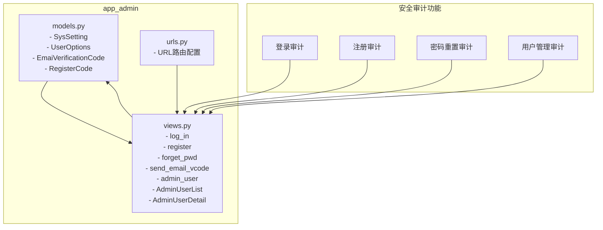
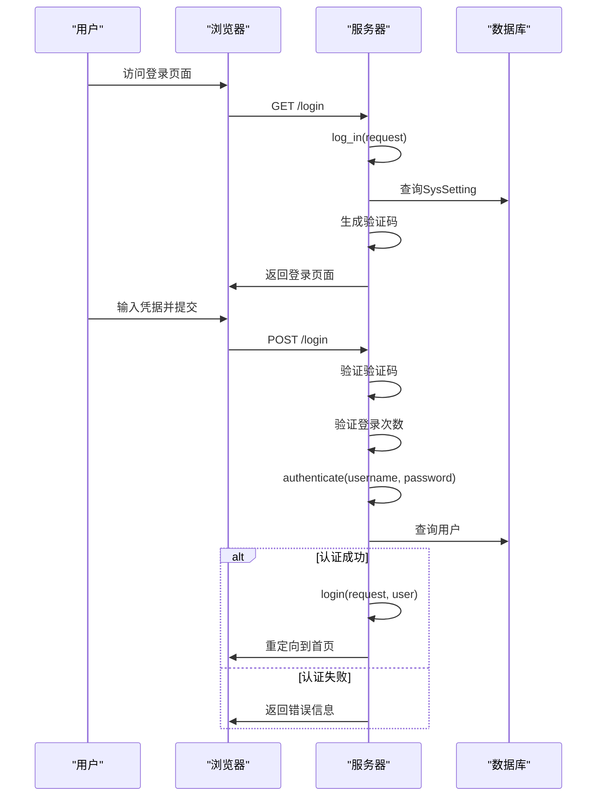
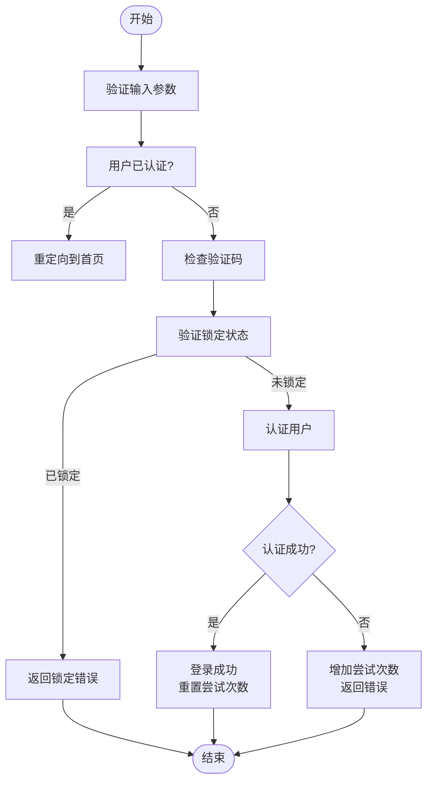
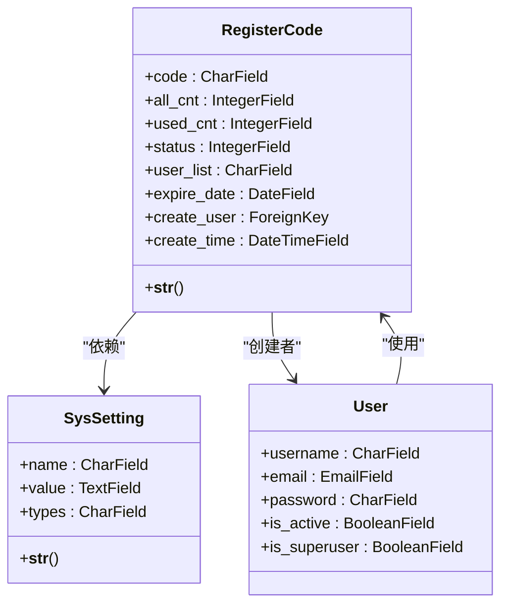
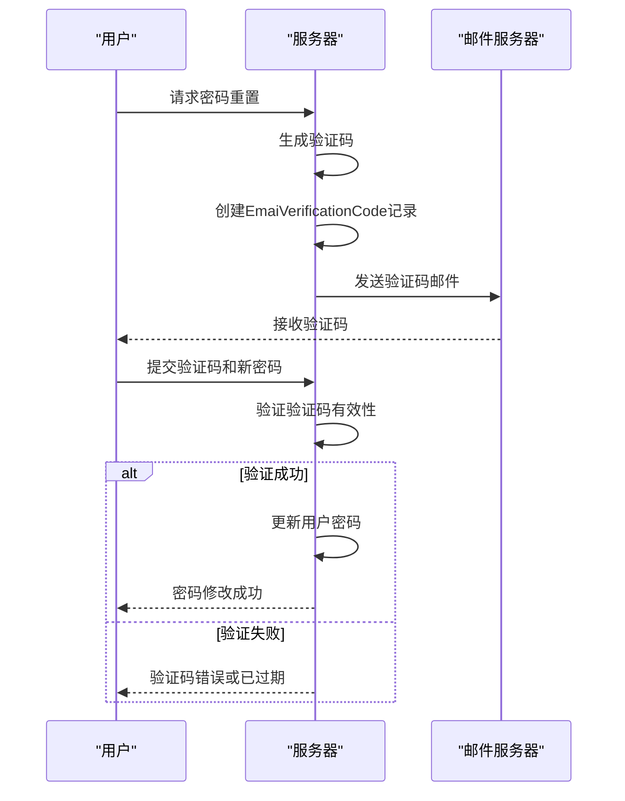
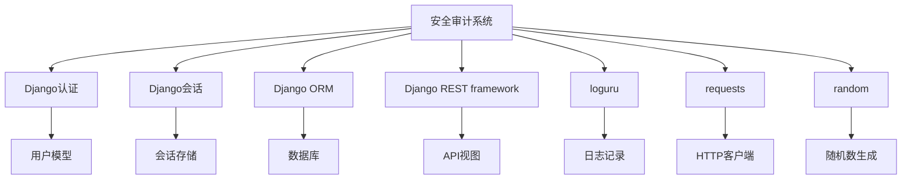

# 安全审计与监控

<cite>
**本文档引用的文件**   
- [models.py](file://app_admin/models.py)
- [views.py](file://app_admin/views.py)
- [urls.py](file://app_admin/urls.py)
</cite>

## 目录
1. [简介](#简介)
2. [项目结构](#项目结构)
3. [核心组件](#核心组件)
4. [架构概述](#架构概述)
5. [详细组件分析](#详细组件分析)
6. [依赖分析](#依赖分析)
7. [性能考虑](#性能考虑)
8. [故障排除指南](#故障排除指南)
9. [结论](#结论)

## 简介
本文档详细描述了MrDoc系统中的安全审计与监控功能。该系统实现了全面的安全事件记录、异常行为检测和操作日志功能，为系统管理员提供了强大的安全态势感知能力。文档将深入分析安全审计系统的实现机制，包括登录尝试记录、异常行为检测、操作日志收集与存储，以及在管理界面展示审计数据的方法。同时，将提供审计日志的查询、过滤和导出功能的使用指南，解释安全事件的阈值设置和告警机制，介绍防止日志注入攻击的安全措施，以及审计数据的存储优化和归档策略。最后，为管理员提供合规性检查清单和安全态势评估方法。

## 项目结构
MrDoc系统的安全审计功能主要分布在`app_admin`应用中，该应用负责系统的后台管理、用户认证和系统配置。安全审计相关的代码主要集中在`models.py`、`views.py`和`urls.py`文件中。



**图源**
- [models.py](file://app_admin/models.py)
- [views.py](file://app_admin/views.py)
- [urls.py](file://app_admin/urls.py)

**本节来源**
- [models.py](file://app_admin/models.py)
- [views.py](file://app_admin/views.py)
- [urls.py](file://app_admin/urls.py)

## 核心组件
安全审计系统的核心组件包括登录审计、注册审计、密码重置审计和用户管理审计。这些功能通过`app_admin`应用中的视图函数和模型类实现，利用Django框架的认证系统和数据库模型来记录和管理安全相关事件。

**本节来源**
- [models.py](file://app_admin/models.py)
- [views.py](file://app_admin/views.py)

## 架构概述
安全审计系统的架构基于MVC（模型-视图-控制器）模式，其中模型（Model）负责定义数据结构，视图（View）处理业务逻辑和用户交互，控制器通过URL路由将请求分发到相应的视图函数。系统使用Django的认证框架进行用户身份验证，并通过自定义的视图函数实现安全事件的记录和处理。



**图源**
- [views.py](file://app_admin/views.py#L100-L200)
- [models.py](file://app_admin/models.py#L1-L30)

## 详细组件分析

### 登录审计分析
登录审计功能通过`log_in`视图函数实现，该函数记录了所有登录尝试，包括成功和失败的尝试。系统通过会话（session）机制跟踪用户的登录尝试次数，并在达到阈值时实施锁定策略。



**图源**
- [views.py](file://app_admin/views.py#L100-L200)

**本节来源**
- [views.py](file://app_admin/views.py#L100-L200)

### 注册审计分析
注册审计功能通过`register`视图函数实现，该函数记录了所有注册尝试，并支持注册码验证。系统通过`SysSetting`模型中的配置项来控制是否启用注册码，从而实现对用户注册的精细控制。



**图源**
- [models.py](file://app_admin/models.py#L50-L80)
- [views.py](file://app_admin/views.py#L201-L300)

**本节来源**
- [models.py](file://app_admin/models.py#L50-L80)
- [views.py](file://app_admin/views.py#L201-L300)

### 密码重置审计分析
密码重置审计功能通过`forget_pwd`和`send_email_vcode`视图函数实现，该功能记录了所有密码重置请求，并通过电子邮件验证码进行身份验证。系统使用`EmaiVerificationCode`模型来存储验证码及其过期时间，确保密码重置过程的安全性。



**图源**
- [models.py](file://app_admin/models.py#L30-L50)
- [views.py](file://app_admin/views.py#L301-L400)

**本节来源**
- [models.py](file://app_admin/models.py#L30-L50)
- [views.py](file://app_admin/views.py#L301-L400)

### 用户管理审计分析
用户管理审计功能通过`AdminUserList`和`AdminUserDetail`API视图类实现，这些类提供了对用户数据的增删改查操作。系统使用Django REST framework的认证和权限机制来保护这些API端点，确保只有超级用户才能访问。

```mermaid
flowchart LR
A[客户端] --> B[AdminUserList]
A --> C[AdminUserDetail]
B --> D[SessionAuthentication]
B --> E[AppMustAuth]
B --> F[SuperUserPermission]
C --> D
C --> E
C --> F
B --> G[User.objects.all()]
C --> H[User.objects.get(id)]
G --> I[数据库]
H --> I
```

**图源**
- [views.py](file://app_admin/views.py#L401-L600)
- [models.py](file://app_admin/models.py#L1-L30)

**本节来源**
- [views.py](file://app_admin/views.py#L401-L600)

## 依赖分析
安全审计系统依赖于多个Django内置组件和第三方库。主要依赖包括Django的认证系统、会话框架、ORM（对象关系映射）和REST framework。此外，系统还依赖于`loguru`库进行日志记录，`requests`库用于HTTP请求，以及`random`库用于生成随机验证码。



**图源**
- [views.py](file://app_admin/views.py#L1-L50)
- [models.py](file://app_admin/models.py)

**本节来源**
- [views.py](file://app_admin/views.py#L1-L50)
- [models.py](file://app_admin/models.py)

## 性能考虑
安全审计系统的性能主要受数据库查询和会话操作的影响。为了优化性能，系统采用了分页查询来处理大量用户数据，并使用会话缓存来减少数据库访问。此外，系统在处理密码重置请求时使用了异步邮件发送，以避免阻塞主线程。

## 故障排除指南
当安全审计功能出现问题时，可以按照以下步骤进行排查：
1. 检查日志文件，查看是否有异常记录
2. 验证数据库连接是否正常
3. 检查会话配置是否正确
4. 确认邮件服务器配置是否正确
5. 验证API端点的认证和权限设置

**本节来源**
- [views.py](file://app_admin/views.py)
- [models.py](file://app_admin/models.py)

## 结论
MrDoc系统的安全审计与监控功能提供了全面的安全事件记录和管理能力。通过登录审计、注册审计、密码重置审计和用户管理审计，系统能够有效监控和响应各种安全事件。系统的架构设计合理，依赖关系清晰，性能优化得当，为系统管理员提供了强大的安全态势感知工具。未来可以考虑增加实时告警功能和更高级的异常行为检测算法，以进一步提升系统的安全防护能力。