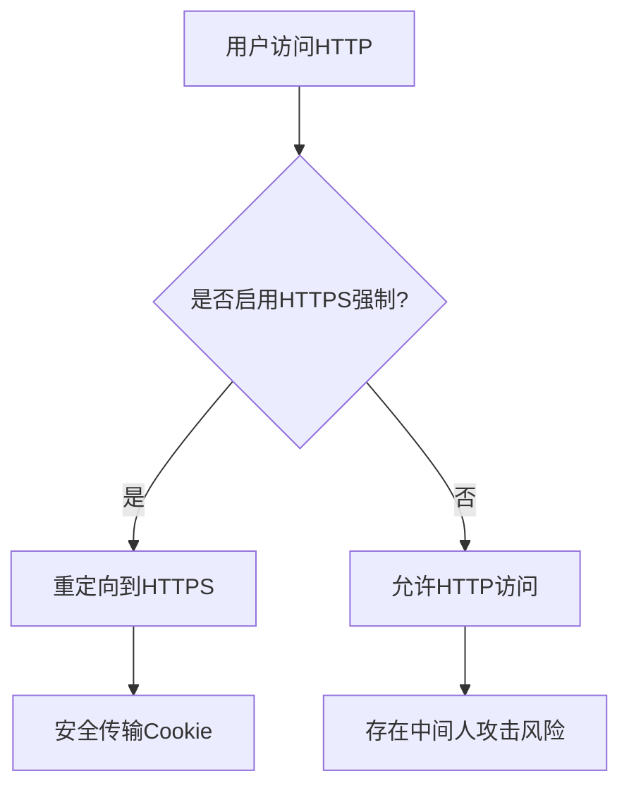
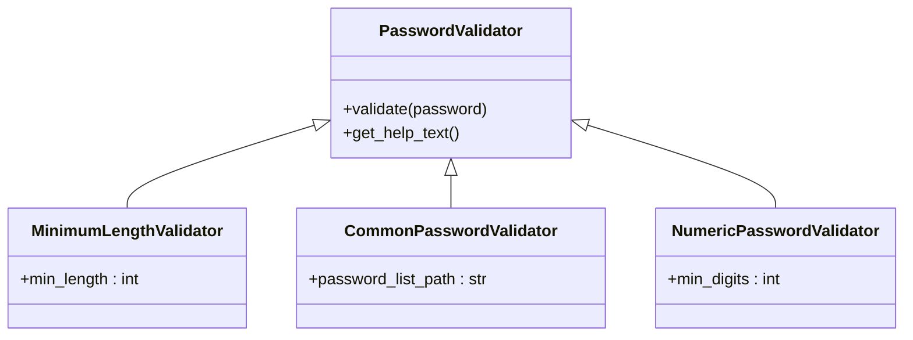

# 安全最佳实践

<cite>
**本文档引用的文件**   
- [MrDoc/settings.py](file://MrDoc/settings.py)
- [config/config.ini](file://config/config.ini)
- [app_admin/middleware/require_login_middleware.py](file://app_admin/middleware/require_login_middleware.py)
- [template/app_admin/admin_setting.html](file://template/app_admin/admin_setting.html)
</cite>

## 目录
1. [引言](#引言)
2. [Django安全配置](#djangos安全配置)
3. [中间件链安全机制](#中间件链安全机制)
4. [常见Web攻击防护](#常见web攻击防护)
5. [敏感数据与密码策略](#敏感数据与密码策略)
6. [安全头与跨域配置](#安全头与跨域配置)
7. [定期安全检查清单](#定期安全检查清单)
8. [安全加固操作指南](#安全加固操作指南)

## 引言
本文档基于MrDoc项目代码库，提供全面的安全最佳实践指南。通过分析项目的配置文件、中间件和模板，详细说明如何配置Django安全设置、防止常见Web攻击、保护敏感数据，并为开发人员和管理员提供可操作的安全加固步骤。

## Django安全配置

### SECRET_KEY管理
`SECRET_KEY`是Django应用的核心安全凭证，用于会话、密码重置、CSRF保护等。在`MrDoc/settings.py`中，`SECRET_KEY`被硬编码为一个固定值：
```python
SECRET_KEY = '5&71mt9@^58zdg*_!t(x6g14q*@84d%ptr%%s6e0l50zs0we3d'
```
**最佳实践**：
- **禁止在代码中硬编码**：将`SECRET_KEY`移至环境变量或外部配置文件（如`config.ini`）。
- **使用强随机密钥**：通过`python -c "import secrets; print(secrets.token_urlsafe(50))"`生成。
- **生产环境隔离**：确保`SECRET_KEY`不随代码版本控制系统（如Git）提交。

**Section sources**
- [MrDoc/settings.py](file://MrDoc/settings.py#L24)

### DEBUG模式安全
`DEBUG`模式在开发时提供详细错误信息，但在生产环境中会暴露敏感信息（如路径、配置、数据库结构）。项目通过`config.ini`控制该设置：
```ini
[site]
debug = False
```
在`settings.py`中读取：
```python
DEBUG = CONFIG.getboolean('site','debug',fallback=False)
```
**最佳实践**：
- **生产环境必须关闭**：确保`DEBUG = False`。
- **自定义错误页面**：提供`404.html`和`500.html`，避免Django默认错误页。
- **日志监控**：当`DEBUG=False`时，错误将被记录到日志文件，需定期检查。

**Section sources**
- [MrDoc/settings.py](file://MrDoc/settings.py#L22)
- [config/config.ini](file://config/config.ini#L2-L4)

### HTTPS强制与安全Cookie
项目通过`SESSION_COOKIE_SECURE`配置确保会话Cookie仅通过HTTPS传输：
```python
SESSION_COOKIE_SECURE = CONFIG.getboolean('session','cookie_secure',fallback=False)
```
**最佳实践**：
- **启用HTTPS**：在生产环境中部署SSL/TLS证书。
- **强制HTTPS**：在Django中添加`SECURE_SSL_REDIRECT = True`。
- **HSTS头**：添加`SECURE_HSTS_SECONDS`以强制浏览器使用HTTPS。



**Diagram sources**
- [MrDoc/settings.py](file://MrDoc/settings.py#L128)

## 中间件链安全机制

### 中间件链协同工作
Django中间件按顺序处理请求和响应。MrDoc的中间件链如下：
```python
MIDDLEWARE = [
    'django.middleware.security.SecurityMiddleware',
    'django.contrib.sessions.middleware.SessionMiddleware',
    'django.middleware.locale.LocaleMiddleware',
    'corsheaders.middleware.CorsMiddleware',
    'django.middleware.common.CommonMiddleware',
    'django.middleware.csrf.CsrfViewMiddleware',
    'django.contrib.auth.middleware.AuthenticationMiddleware',
    'django.contrib.messages.middleware.MessageMiddleware',
    'django.middleware.clickjacking.XFrameOptionsMiddleware',
    'app_admin.middleware.require_login_middleware.RequiredLoginMiddleware',
]
```
**各中间件作用**：
- `SecurityMiddleware`：提供基础安全头（如`X-Content-Type-Options`）。
- `SessionMiddleware`：管理用户会话。
- `CsrfViewMiddleware`：防止跨站请求伪造（CSRF）。
- `AuthenticationMiddleware`：处理用户认证。
- `RequiredLoginMiddleware`：自定义中间件，强制全站登录。

### 自定义登录中间件分析
`require_login_middleware.py`实现了全站强制登录功能：
```python
class RequiredLoginMiddleware():
    def __init__(self, get_response):
        self.get_response = get_response
        # 定义排除URL
        compile_tuple = (
            r'/login(.*)$', 
            r'/register(.*)$', 
            r'/static/(.*)$', 
            r'/api/(.*)$',
        )
        self.exceptions = tuple(re.compile(url) for url in compile_tuple)

    def process_view(self, request, view_func, view_args, view_kwargs):
        if request.user.is_authenticated:
            return None
        try:
            data = SysSetting.objects.get(name='require_login').value
            if data == 'on':
                for url in self.exceptions:
                    if url.match(request.path):
                        return None
                return login_required(view_func)(request, *view_args, **view_kwargs)
        except:
            return None
```
**安全机制**：
1. 检查用户是否已认证。
2. 查询数据库设置`require_login`是否开启。
3. 若开启，则检查当前URL是否在排除列表中（如登录、注册、静态文件）。
4. 若不在排除列表，则强制要求登录。

**Section sources**
- [app_admin/middleware/require_login_middleware.py](file://app_admin/middleware/require_login_middleware.py#L1-L60)
- [MrDoc/settings.py](file://MrDoc/settings.py#L45-L65)

## 常见Web攻击防护

### 跨站脚本（XSS）防护
Django模板默认启用自动转义，防止XSS。项目在模板中正确使用`{{ }}`：
```html
<input type="text" name="viewcode" value="{{pro.role_value}}">
```
**最佳实践**：
- **避免`safe`过滤器滥用**：仅在信任内容时使用`|safe`。
- **内容安全策略（CSP）**：通过`Content-Security-Policy`头限制脚本来源。
- **输入验证**：对用户输入进行白名单过滤。

### SQL注入防护
Django ORM自动使用参数化查询，防止SQL注入。例如在`require_login_middleware.py`中：
```python
data = SysSetting.objects.get(name='require_login').value
```
**最佳实践**：
- **使用ORM**：避免原始SQL查询。
- **若必须使用原始SQL**：使用`cursor.execute("SELECT * FROM app WHERE name = %s", [name])`。

### 跨站请求伪造（CSRF）防护
Django通过`CsrfViewMiddleware`和模板中的``提供CSRF保护。项目在JS中配置：
```javascript
$.ajaxSetup({
    data: {csrfmiddlewaretoken: '{{ csrf_token }}' },
});
```
**最佳实践**：
- **确保中间件启用**：`'django.middleware.csrf.CsrfViewMiddleware'`必须在`MIDDLEWARE`中。
- **API端点**：对于DRF API，使用`SessionAuthentication`或`TokenAuthentication`。
- **可信来源**：配置`CSRF_TRUSTED_ORIGINS`以允许特定域名：
```python
CSRF_TRUSTED_ORIGINS = ['https://yourdomain.com']
```

**Section sources**
- [MrDoc/settings.py](file://MrDoc/settings.py#L315)
- [static/mrdoc/mrdoc-docs.js](file://static/mrdoc/mrdoc-docs.js#L4)

## 敏感数据与密码策略

### 敏感数据保护
项目将数据库密码存储在`config.ini`中：
```ini
[database]
password = lzl660928
```
**风险**：明文存储密码。
**最佳实践**：
- **加密存储**：使用`django-encrypted-settings`或环境变量。
- **最小权限原则**：数据库用户仅授予必要权限。
- **定期轮换**：定期更改数据库密码。

### 密码策略
Django内置密码验证器在`settings.py`中配置：
```python
AUTH_PASSWORD_VALIDATORS = [
    {'NAME': 'django.contrib.auth.password_validation.UserAttributeSimilarityValidator'},
    {'NAME': 'django.contrib.auth.password_validation.MinimumLengthValidator'},
    {'NAME': 'django.contrib.auth.password_validation.CommonPasswordValidator'},
    {'NAME': 'django.contrib.auth.password_validation.NumericPasswordValidator'},
]
```
**最佳实践**：
- **增强复杂度**：添加自定义验证器，要求包含大小写字母、数字、特殊字符。
- **密码历史**：防止重复使用旧密码。
- **多因素认证（MFA）**：集成Google Authenticator或短信验证码。



**Diagram sources**
- [MrDoc/settings.py](file://MrDoc/settings.py#L107-L117)

## 安全头与跨域配置

### 安全头设置
项目通过`X_FRAME_OPTIONS`防止点击劫持：
```python
X_FRAME_OPTIONS = CONFIG.get("x_frame","option",fallback='SAMEORIGIN')
```
**推荐安全头**：
- `X-Content-Type-Options: nosniff`：防止MIME类型嗅探。
- `X-XSS-Protection: 1; mode=block`：启用浏览器XSS过滤。
- `Strict-Transport-Security`：强制HTTPS。
- `Content-Security-Policy`：限制资源加载。

### 跨域请求（CORS）配置
项目使用`django-cors-headers`库：
```python
CORS_ALLOWED_ORIGINS = ['http://localhost'] + config_list
CORS_ALLOW_HEADERS = list(default_headers) + ["token"]
```
**最佳实践**：
- **最小化来源**：仅允许必要的域名。
- **避免通配符**：不要使用`*`。
- **凭证安全**：若需携带Cookie，设置`CORS_ALLOW_CREDENTIALS = True`并精确指定来源。

**Section sources**
- [MrDoc/settings.py](file://MrDoc/settings.py#L317-L339)

## 定期安全检查清单

| 检查项 | 配置位置 | 状态 | 建议 |
|-------|--------|------|------|
| DEBUG模式关闭 | `config.ini` | 已关闭 | 确保生产环境为`False` |
| SECRET_KEY管理 | `settings.py` | 硬编码 | 移至环境变量 |
| HTTPS强制 | `settings.py` | 未配置 | 添加`SECURE_SSL_REDIRECT` |
| 会话Cookie安全 | `settings.py` | 可配置 | 启用`SESSION_COOKIE_SECURE` |
| CSRF可信来源 | `settings.py` | 可配置 | 限制为生产域名 |
| 数据库密码加密 | `config.ini` | 明文 | 使用加密或环境变量 |
| 密码策略 | `settings.py` | 基础 | 增加复杂度要求 |
| 全站登录 | 数据库设置 | 可配置 | 根据需求启用 |

## 安全加固操作指南

### 步骤1：配置文件加固
1. **移除`SECRET_KEY`**：
   ```bash
   # 在config.ini中添加
   [security]
   secret_key = your-generated-secret-key
   ```
   ```python
   # 在settings.py中读取
   SECRET_KEY = CONFIG.get('security','secret_key')
   ```
2. **加密敏感信息**：使用`python-decouple`或`django-environ`。

### 步骤2：启用HTTPS
1. 获取SSL证书（如Let's Encrypt）。
2. 在`settings.py`中添加：
   ```python
   SECURE_SSL_REDIRECT = True
   SECURE_HSTS_SECONDS = 31536000
   SECURE_HSTS_INCLUDE_SUBDOMAINS = True
   SECURE_HSTS_PRELOAD = True
   ```

### 步骤3：强化中间件
1. **添加安全中间件**：
   ```python
   MIDDLEWARE = [
       'django.middleware.security.SecurityMiddleware',
       # ... 其他中间件
   ]
   ```
2. **验证`RequiredLoginMiddleware`**：确保`require_login`设置在数据库中正确配置。

### 步骤4：实施密码策略
1. **自定义密码验证器**：
   ```python
   from django.contrib.auth.password_validation import BaseValidator
   
   class ComplexityValidator(BaseValidator):
       def validate(self, password, user=None):
           if not (re.search(r'[A-Z]', password) and 
                   re.search(r'[a-z]', password) and 
                   re.search(r'\d', password) and 
                   re.search(r'[!@#$%^&*]', password)):
               raise ValidationError('密码必须包含大小写字母、数字和特殊字符。')
   ```
2. 在`AUTH_PASSWORD_VALIDATORS`中添加。

### 步骤5：定期扫描
1. **使用`bandit`扫描代码**：
   ```bash
   pip install bandit
   bandit -r .
   ```
2. **使用`nuclei`扫描Web漏洞**：
   ```bash
   nuclei -u http://your-site.com
   ```