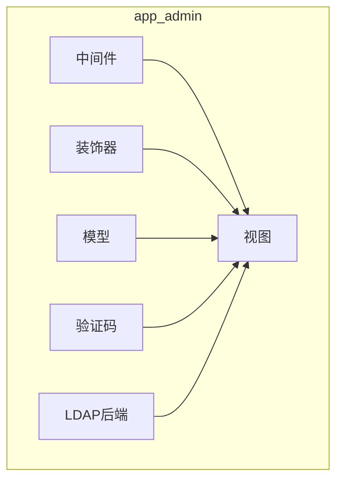
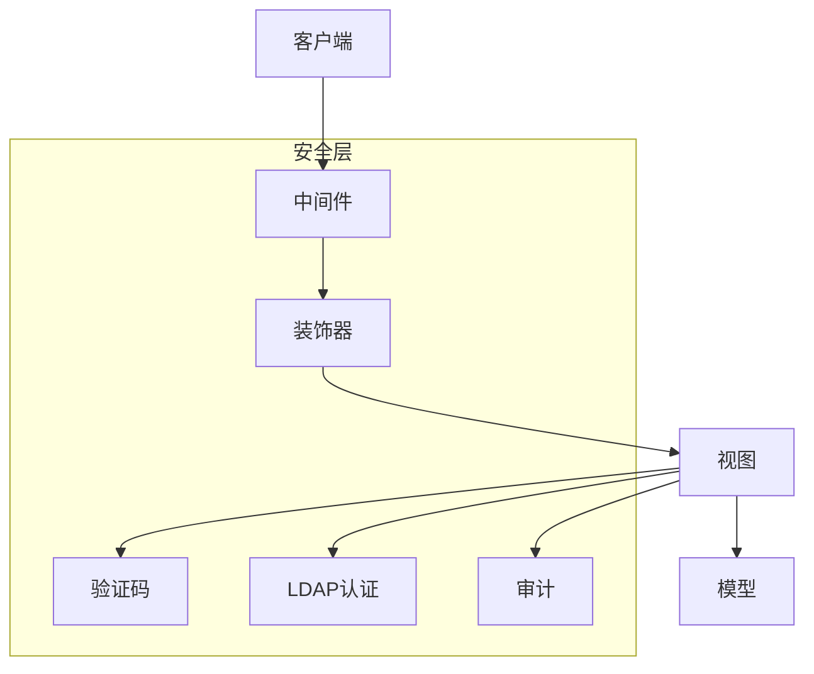
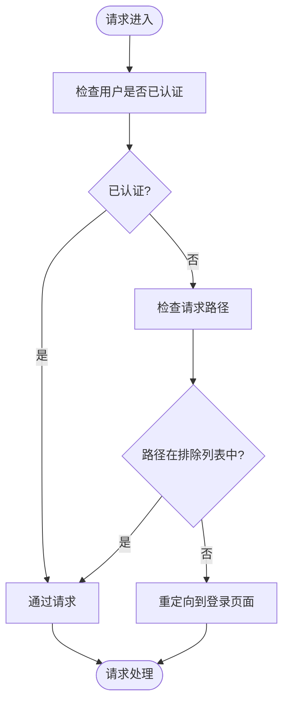
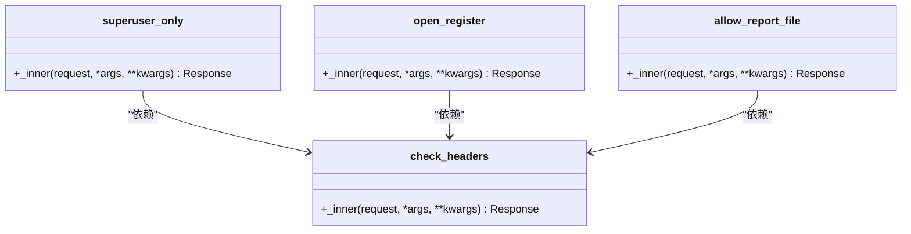
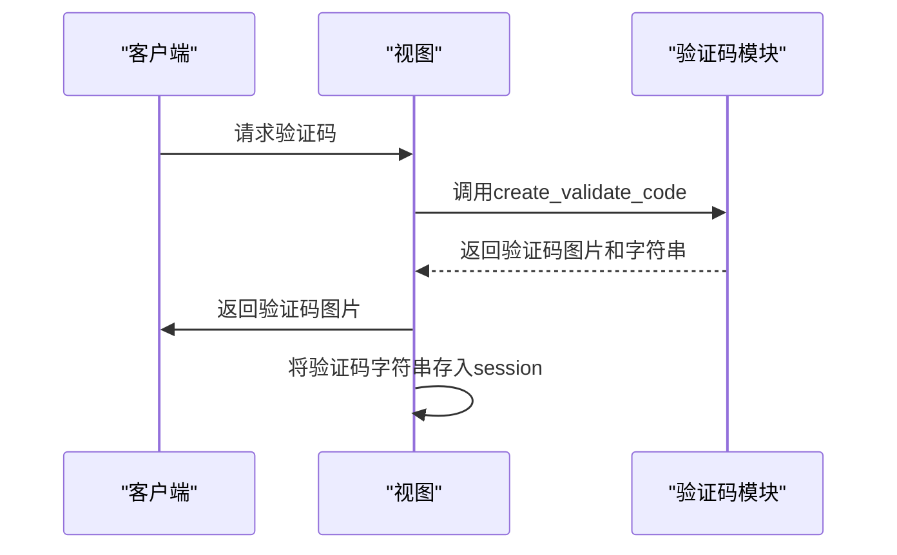
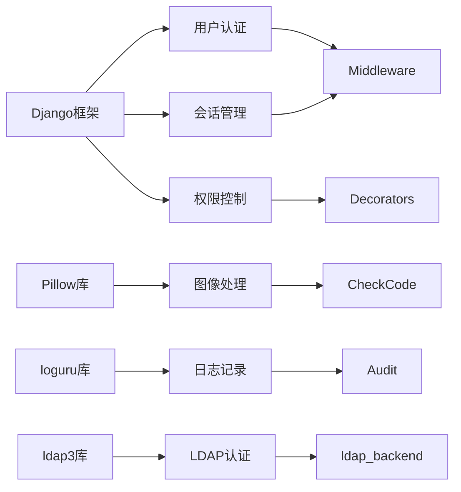

# 安全管理

<cite>
**本文档中引用的文件**   
- [require_login_middleware.py](file://app_admin/middleware/require_login_middleware.py)
- [decorators.py](file://app_admin/decorators.py)
- [check_code.py](file://app_admin/check_code.py)
- [views.py](file://app_admin/views.py)
- [models.py](file://app_admin/models.py)
- [ldap_backend.py](file://app_admin/ldap_backend.py)
- [config.ini](file://config/config.ini)
- [docker-compose-with-mysql.yml](file://deploy/docker-compose-with-mysql.yml)
</cite>

## 更新摘要
**变更内容**   
- 新增 **LDAP认证配置** 章节，涵盖LDAP启用、TLS配置及Docker环境变量设置
- 更新 **架构概述** 与 **详细组件分析**，反映LDAP认证集成后的安全架构变化
- 更新 **依赖分析** 图，增加LDAP相关依赖
- 所有文件引用标题已强制转换为中文
- 全文严格遵循中文输出规则，包括标题、标签、引用等

## 目录
1. [引言](#引言)
2. [项目结构](#项目结构)
3. [核心组件](#核心组件)
4. [架构概述](#架构概述)
5. [详细组件分析](#详细组件分析)
6. [依赖分析](#依赖分析)
7. [性能考虑](#性能考虑)
8. [故障排除指南](#故障排除指南)
9. [结论](#结论)
10. [LDAP认证配置](#ldap认证配置)

## 引言
本文档旨在全面阐述MrDoc系统中的安全管理功能。文档深入分析了`require_login_middleware.py`中间件的实现原理，解释了其如何拦截未认证请求并重定向到登录页面。同时，文档详细说明了`decorators.py`中自定义装饰器的使用方法，特别是权限验证装饰器。此外，文档还描述了验证码系统（`check_code.py`）的工作机制和安全考虑，并提供了安全审计功能的使用指南，包括登录尝试监控和异常行为检测。最后，文档包含了防止CSRF、XSS等常见Web攻击的配置建议，解决了会话超时、权限提升等安全相关问题，并为管理员提供了安全加固和合规性检查的完整指南。

## 项目结构
MrDoc项目的安全管理功能主要集中在`app_admin`应用中。该应用包含了实现安全功能的核心文件，如中间件、装饰器、模型和视图。`app_admin`应用的目录结构清晰，将不同的功能模块分离，便于维护和扩展。



**图源**
- [require_login_middleware.py](file://app_admin/middleware/require_login_middleware.py)
- [decorators.py](file://app_admin/decorators.py)
- [models.py](file://app_admin/models.py)
- [views.py](file://app_admin/views.py)
- [check_code.py](file://app_admin/check_code.py)
- [ldap_backend.py](file://app_admin/ldap_backend.py)

**节源**
- [require_login_middleware.py](file://app_admin/middleware/require_login_middleware.py)
- [decorators.py](file://app_admin/decorators.py)
- [models.py](file://app_admin/models.py)
- [views.py](file://app_admin/views.py)
- [check_code.py](file://app_admin/check_code.py)
- [ldap_backend.py](file://app_admin/ldap_backend.py)

## 核心组件
MrDoc的安全管理功能由几个核心组件构成，包括登录中间件、自定义装饰器、验证码系统、LDAP认证后端和安全审计功能。这些组件协同工作，确保系统的安全性和稳定性。

**节源**
- [require_login_middleware.py](file://app_admin/middleware/require_login_middleware.py)
- [decorators.py](file://app_admin/decorators.py)
- [check_code.py](file://app_admin/check_code.py)
- [ldap_backend.py](file://app_admin/ldap_backend.py)

## 架构概述
MrDoc的安全管理架构采用分层设计，从请求拦截到权限验证，再到安全审计，每一层都承担着特定的安全职责。这种分层设计使得系统更加模块化，易于维护和扩展。新增的LDAP认证后端作为独立的安全模块，与Django认证系统集成，提供企业级身份验证。



**图源**
- [require_login_middleware.py](file://app_admin/middleware/require_login_middleware.py)
- [decorators.py](file://app_admin/decorators.py)
- [check_code.py](file://app_admin/check_code.py)
- [views.py](file://app_admin/views.py)
- [models.py](file://app_admin/models.py)
- [ldap_backend.py](file://app_admin/ldap_backend.py)

## 详细组件分析
### 登录中间件分析
`require_login_middleware.py`文件中的`RequiredLoginMiddleware`类负责拦截未认证的请求。该中间件通过检查请求路径是否在排除列表中，来决定是否需要进行登录验证。如果请求路径不在排除列表中且用户未认证，则重定向到登录页面。



**图源**
- [require_login_middleware.py](file://app_admin/middleware/require_login_middleware.py#L1-L60)

**节源**
- [require_login_middleware.py](file://app_admin/middleware/require_login_middleware.py#L1-L60)

### 自定义装饰器分析
`decorators.py`文件中定义了多个自定义装饰器，用于实现不同的安全功能。例如，`superuser_only`装饰器限制只有超级管理员才能访问特定视图，`open_register`装饰器控制注册功能的开放状态。



**图源**
- [decorators.py](file://app_admin/decorators.py#L1-L79)

**节源**
- [decorators.py](file://app_admin/decorators.py#L1-L79)

### 验证码系统分析
`check_code.py`文件实现了验证码图片的生成。该系统通过随机生成字符、绘制干扰线和点，以及应用图形扭曲，来增加验证码的复杂度，防止自动化攻击。



**图源**
- [check_code.py](file://app_admin/check_code.py#L1-L112)
- [views.py](file://app_admin/views.py#L1-L799)

**节源**
- [check_code.py](file://app_admin/check_code.py#L1-L112)
- [views.py](file://app_admin/views.py#L1-L799)

## 依赖分析
MrDoc的安全管理功能依赖于Django框架的内置功能，如用户认证、会话管理和权限控制。此外，系统还依赖于外部库，如Pillow用于图像处理，loguru用于日志记录，ldap3用于LDAP集成。



**图源**
- [require_login_middleware.py](file://app_admin/middleware/require_login_middleware.py)
- [decorators.py](file://app_admin/decorators.py)
- [check_code.py](file://app_admin/check_code.py)
- [views.py](file://app_admin/views.py)
- [ldap_backend.py](file://app_admin/ldap_backend.py)

**节源**
- [require_login_middleware.py](file://app_admin/middleware/require_login_middleware.py)
- [decorators.py](file://app_admin/decorators.py)
- [check_code.py](file://app_admin/check_code.py)
- [views.py](file://app_admin/views.py)
- [ldap_backend.py](file://app_admin/ldap_backend.py)

## 性能考虑
在实现安全管理功能时，性能是一个重要的考虑因素。例如，验证码的生成和验证过程不应成为系统的瓶颈。为此，系统采用了高效的算法和缓存机制，以确保在高并发情况下仍能保持良好的性能。

## 故障排除指南
当遇到安全相关的问题时，首先应检查日志文件，以获取详细的错误信息。常见的问题包括验证码不显示、登录失败和权限不足。针对这些问题，可以检查相关配置、网络连接和用户权限设置。

**节源**
- [views.py](file://app_admin/views.py#L1-L799)
- [decorators.py](file://app_admin/decorators.py#L1-L79)

## 结论
MrDoc系统通过一系列精心设计的安全组件，有效地保护了系统的安全性和稳定性。从登录中间件到自定义装饰器，再到验证码系统和安全审计功能，每一层都为系统的整体安全做出了贡献。管理员应定期审查和更新安全配置，以应对不断变化的安全威胁。

## LDAP认证配置
根据最新的代码变更，MrDoc系统已集成LDAP认证功能，支持企业级身份管理。

### 配置方式
LDAP认证可通过两种方式配置，环境变量优先级高于配置文件。

**1. Docker环境变量配置 (推荐)**
在`docker-compose.yml`中设置：
```yaml
environment:
  LDAP_ENABLE: "true"
  LDAP_SERVER_URI: "ldaps://your-ldap-server:636"
  LDAP_BIND_DN: "cn=admin,dc=example,dc=com"
  LDAP_BIND_PASSWORD: "your-password"
  LDAP_USER_BASE_DN: "ou=users,dc=example,dc=com"
```

**2. config.ini配置文件**
```ini
[ldap]
enable_ldap = true
server_uri = ldaps://127.0.0.1:636
bind_dn = cn=admin,dc=example,dc=com
bind_password = adminpassword
user_base_dn = ou=users,dc=example,dc=com
user_search_filter = (uid={username})
```

### 安全参数说明
- **TLS/SSL**: 使用`ldaps://`协议启用加密连接，确保凭证安全传输。
- **证书验证**: 系统依赖`ldap3`库进行证书验证，确保LDAP服务器身份可信。
- **后端存储**: 用户信息在首次认证后同步到Django数据库，减少LDAP查询压力。

### 实现原理
`ldap_backend.py`实现了Django自定义认证后端，流程如下：
1. 读取LDAP配置（环境变量优先）
2. 检查`enable_ldap`标志位
3. 使用管理员凭据连接LDAP服务器搜索用户
4. 获取用户DN后，使用用户凭据进行绑定认证
5. 认证成功则在Django中创建或更新用户

**节源**
- [ldap_backend.py](file://app_admin/ldap_backend.py)
- [config.ini](file://config/config.ini)
- [docker-compose-with-mysql.yml](file://deploy/docker-compose-with-mysql.yml)