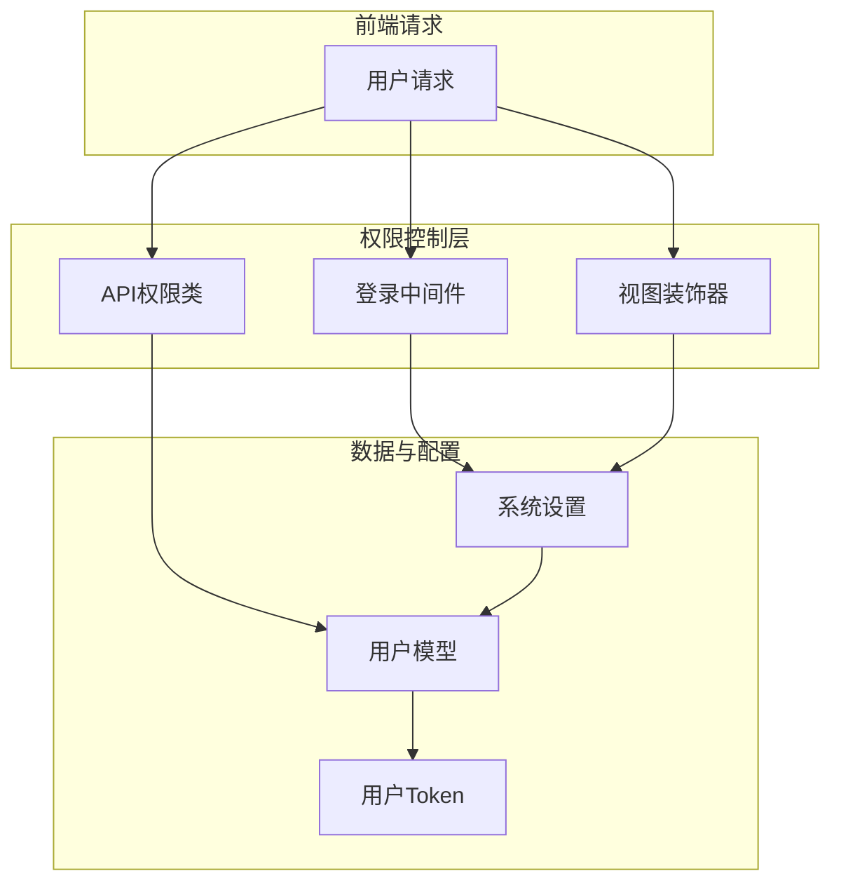
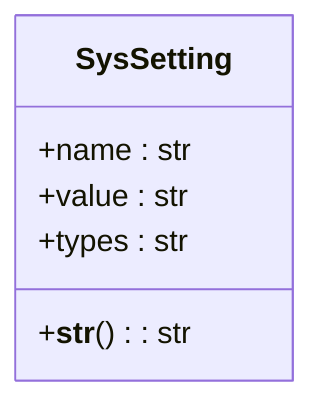
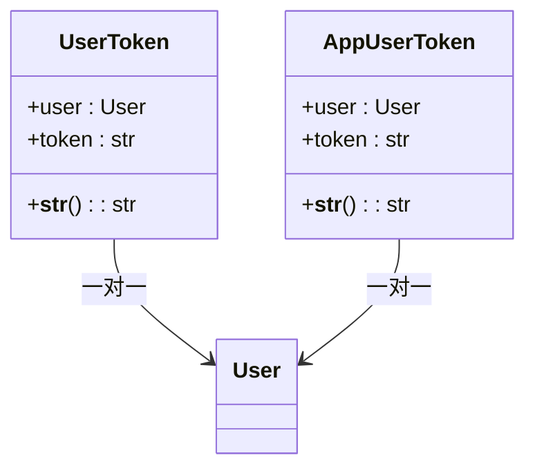

# 授权与权限控制

<cite>
**本文档引用的文件**  
- [decorators.py](file://app_admin/decorators.py)
- [models.py](file://app_admin/models.py)
- [permissions_app.py](file://app_api/permissions_app.py)
- [require_login_middleware.py](file://app_admin/middleware/require_login_middleware.py)
</cite>

## 目录
1. [引言](#引言)  
2. [权限系统架构概述](#权限系统架构概述)  
3. [核心权限组件分析](#核心权限组件分析)  
4. [装饰器实现机制详解](#装饰器实现机制详解)  
5. [基于角色的访问控制（RBAC）实现](#基于角色的访问控制rbac实现)  
6. [权限中间件分析](#权限中间件分析)  
7. [API权限控制](#api权限控制)  
8. [最佳实践与安全建议](#最佳实践与安全建议)  
9. [调试与问题排查](#调试与问题排查)  
10. [总结](#总结)

## 引言

本文档旨在全面解析 MrDoc 项目中的授权与权限控制系统。通过深入分析 `app_admin` 和 `app_api` 模块中的权限实现机制，详细阐述基于装饰器、中间件和 REST API 的权限验证逻辑。文档将涵盖用户角色管理、权限分配、访问控制策略以及防止权限提升攻击的最佳实践，为开发者提供清晰的权限系统设计蓝图和使用指南。

## 权限系统架构概述

MrDoc 的权限控制系统采用分层设计，结合了 Django 内置认证机制与自定义权限逻辑，形成多层次的安全防护体系：



**图示来源**  
- [require_login_middleware.py](file://app_admin/middleware/require_login_middleware.py#L1-L60)
- [decorators.py](file://app_admin/decorators.py#L1-L80)
- [permissions_app.py](file://app_api/permissions_app.py#L1-L40)

该架构通过中间件实现全局登录要求控制，通过装饰器实现特定视图的精细化权限控制，通过 REST Framework 的权限类实现 API 接口的细粒度访问控制，三者协同工作，确保系统安全。

## 核心权限组件分析

### 系统设置模型（SysSetting）

系统设置模型用于存储影响权限行为的全局配置项，是动态权限控制的基础。



**字段说明**  
- **name**: 配置项名称，作为主键，如 `require_login`、`close_register`、`enable_project_report`  
- **value**: 配置项值，通常为 `on` 或 `off`，用于布尔开关控制  
- **types**: 配置项类型，用于分类，如 `basic`  

**图示来源**  
- [models.py](file://app_admin/models.py#L4-L66)

### 用户Token模型

用于支持无状态认证，主要应用于浏览器扩展和移动应用。



**字段说明**  
- **user**: 关联的用户对象  
- **token**: 唯一的认证令牌  

**图示来源**  
- [models.py](file://app_api/models.py#L1-L25)

## 装饰器实现机制详解

`app_admin/decorators.py` 文件定义了多个自定义装饰器，利用 Python 装饰器模式实现权限验证。

### superuser_only 装饰器

限制视图仅超级管理员可访问。

```python
def superuser_only(function):
    """限制视图只有超级管理员能够访问"""
    def _inner(request, *args, **kwargs):
        if request.user.is_authenticated:
            if not request.user.is_superuser:
                raise PermissionDenied
        else:
            raise PermissionDenied
        return function(request, *args, **kwargs)
    return _inner
```

**执行流程**  
1. 检查用户是否已认证  
2. 若已认证，检查是否为超级用户  
3. 若非超级用户或未认证，抛出 `PermissionDenied` 异常  
4. 否则，执行原视图函数  

**应用场景**：后台管理、系统配置等敏感操作。

**来源**  
- [decorators.py](file://app_admin/decorators.py#L10-L21)

### open_register 装饰器

控制注册功能的开放状态。

```python
def open_register(function):
    '''只有开放注册才能访问'''
    def _inner(request,*args,**kwargs):
        try:
            status = SysSetting.objects.get(name='close_register')
        except:
            # 如果不存在close_register这个属性，那么表示是开放注册的
            return function(request, *args, **kwargs)
        if status.value == 'on':
            raise Http404
        return function(request, *args, **kwargs)
    return _inner
```

**逻辑说明**  
- 若数据库中不存在 `close_register` 配置项，则默认开放注册  
- 若存在且值为 `on`，则关闭注册，返回 404  
- 否则，允许注册流程  

**来源**  
- [decorators.py](file://app_admin/decorators.py#L23-L36)

### allow_report_file 装饰器

控制文集导出功能的启用状态。

```python
def allow_report_file(function):
    def _inner(request,*args,**kwargs):
        try:
            status = SysSetting.objects.get(name='enable_project_report')
        except:
            # 如果不存在enable_project_report这个属性，那么表示是禁止导出的
            raise Http404
        # 启用导出
        if status.value == 'on':
            return function(request, *args, **kwargs)
        else:
            raise Http404
    return _inner
```

**逻辑说明**  
- 若数据库中不存在 `enable_project_report` 配置项，则默认禁止导出  
- 若存在且值为 `on`，则允许导出  
- 否则，返回 404  

**来源**  
- [decorators.py](file://app_admin/decorators.py#L53-L65)

## 基于角色的访问控制（RBAC）实现

虽然项目未显式定义角色模型，但通过 `is_superuser` 字段和 VIP 字段实现了简单的 RBAC。

### SuperUserPermission 类

为 REST API 提供超级管理员权限检查。

```python
class SuperUserPermission(BasePermission):
    message = _('无权访问')

    def has_permission(self, request, view):
        return bool(request.user and request.user.is_superuser)
```

**说明**  
- 继承自 `rest_framework.permissions.BasePermission`  
- `has_permission` 方法检查用户是否为超级管理员  
- 若权限不足，返回预设的错误消息  

**来源**  
- [permissions_app.py](file://app_api/permissions_app.py#L12-L17)

### AppPermission 类

为移动/桌面应用 API 提供 VIP 用户权限检查。

```python
class AppPermission(BasePermission):
    message = _('只有VIP才能访问')

    def has_permission(self, request, view):
        if not request.auth:
            return False
        if request.user.vip:
            return True
        else:
            return False

    def has_object_permission(self, request, view, obj):
        if request.method in SAFE_METHODS:
            return True
        return obj.owner == request.user
```

**说明**  
- `has_permission` 检查认证状态和 VIP 身份  
- `has_object_permission` 实现对象级权限控制：  
  - 对安全方法（GET, HEAD, OPTIONS）放行  
  - 对修改操作，要求请求用户是对象的拥有者  

**来源**  
- [permissions_app.py](file://app_api/permissions_app.py#L19-L39)

## 权限中间件分析

`RequiredLoginMiddleware` 实现了全局登录要求控制。

```python
class RequiredLoginMiddleware():
    def __init__(self, get_response):
        self.get_response = get_response
        # 设置排除URL
        compile_tuple = (
            r'/login(.*)$', 
            r'/logout(.*)$', 
            r'/register(.*)$', 
            # ... 其他排除路径
            r'/api/(.*)$',  
        )
        self.exceptions = tuple(re.compile(url) for url in compile_tuple)

    def process_view(self, request, view_func, view_args, view_kwargs):
        if request.user.is_authenticated:
            return None

        try:
            data = SysSetting.objects.get(name='require_login').value
            if data == 'on':
                is_exceptions = False
                for url in self.exceptions:
                    if url.match(request.path):
                        is_exceptions = True
                if is_exceptions:
                    return None
                else:
                    return login_required(view_func)(request, *view_args, **view_kwargs)
            else:
                return None
        except:
            return None
```

**工作流程**  
1. 初始化时定义无需登录即可访问的 URL 正则表达式列表  
2. 在 `process_view` 钩子中：  
   - 若用户已登录，放行  
   - 查询 `require_login` 系统设置  
   - 若设置为 `on`，检查当前请求路径是否在排除列表中  
   - 若不在排除列表，则应用 `@login_required` 装饰器强制登录  

**来源**  
- [require_login_middleware.py](file://app_admin/middleware/require_login_middleware.py#L1-L60)

## API权限控制

API 权限控制主要通过 `rest_framework` 的权限类实现，与 Django 视图的装饰器机制形成互补。

### 使用方式示例

```python
from rest_framework.views import APIView
from app_api.permissions_app import SuperUserPermission

class AdminAPIView(APIView):
    permission_classes = [SuperUserPermission]

    def get(self, request):
        # 只有超级管理员能访问
        return Response({'data': 'admin data'})
```

**说明**  
- `permission_classes` 列表定义了该视图所需的权限  
- 框架会在执行视图逻辑前自动调用权限类的 `has_permission` 方法  

## 最佳实践与安全建议

1. **避免硬编码权限逻辑**：使用系统设置模型实现动态开关，便于运维管理。  
2. **最小权限原则**：为不同功能分配最小必要权限，避免过度授权。  
3. **对象级权限**：对于用户生成的内容，务必实现 `has_object_permission`，防止越权访问。  
4. **异常处理**：对数据库查询使用 `try-except`，避免因配置缺失导致系统崩溃。  
5. **中间件与装饰器结合**：使用中间件处理通用需求（如全局登录），使用装饰器处理特定需求（如超级管理员专属）。  
6. **安全的默认值**：如 `allow_report_file` 装饰器，当配置项不存在时，默认禁止操作，符合安全原则。  

## 调试与问题排查

### 常见问题

1. **404 错误但页面存在**  
   - 检查 `open_register` 或 `allow_report_file` 装饰器相关的系统设置项。  
   - 确认 `SysSetting` 表中对应 `name` 的记录是否存在且 `value` 正确。  

2. **权限被拒绝（403）**  
   - 检查用户是否已登录。  
   - 检查用户是否为超级管理员（对于 `superuser_only`）。  
   - 检查 `RequiredLoginMiddleware` 是否因 `require_login` 设置为 `on` 而强制登录。  

3. **API 访问被拒**  
   - 检查 `request.auth` 是否存在（Token 是否正确）。  
   - 检查用户 `vip` 字段是否为 `True`（对于 `AppPermission`）。  

### 调试方法

1. **日志输出**：在装饰器和中间件中添加 `print` 语句，观察执行流程。  
2. **数据库检查**：直接查询 `syssetting` 表，确认配置项值。  
3. **单元测试**：为每个装饰器和权限类编写测试用例，验证其行为。  

## 总结

MrDoc 的权限控制系统通过 **装饰器**、**中间件** 和 **REST Framework 权限类** 三个层次，构建了一个灵活且安全的访问控制体系。系统利用 `SysSetting` 模型实现了动态权限开关，增强了系统的可配置性。开发者在使用时应遵循最小权限原则，并善用对象级权限控制来防止越权操作。该设计模式清晰，易于扩展，为类似 Django 项目的权限管理提供了良好的参考范例。