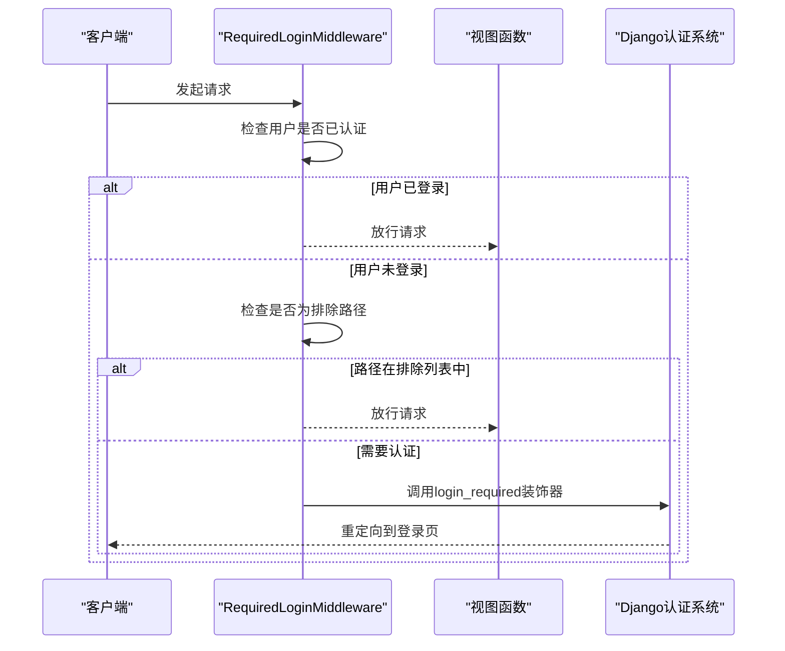
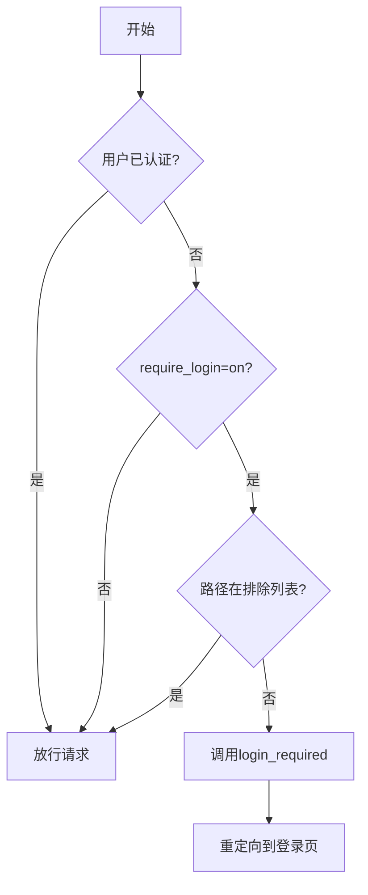
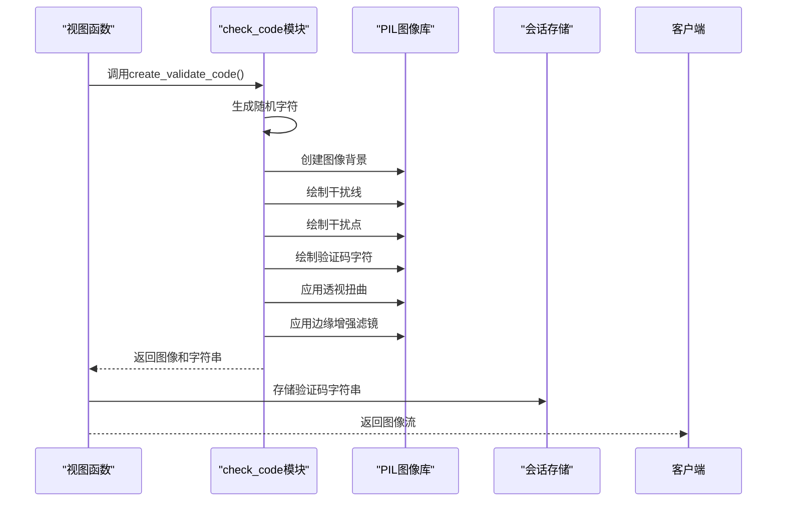
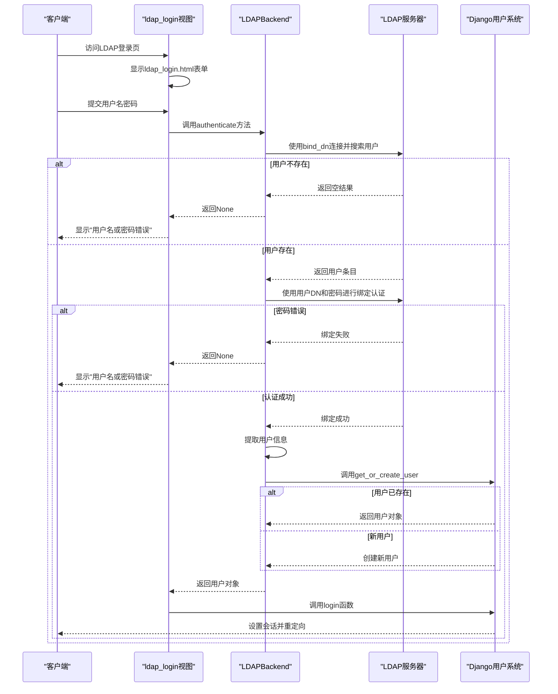

# 认证机制

<cite>
**本文档中引用的文件**  
- [require_login_middleware.py](file://app_admin/middleware/require_login_middleware.py)
- [check_code.py](file://app_admin/check_code.py)
- [views.py](file://app_admin/views.py#L54-L82)
- [views.py](file://app_admin/views.py#L1227-L1398)
- [admin_register_code.html](file://template/app_admin/admin_register_code.html)
- [0010_registercode_expire_date.py](file://app_admin/migrations/0010_registercode_expire_date.py)
- [ldap_backend.py](file://app_admin/ldap_backend.py) - *LDAP认证后端实现*
- [config.ini](file://config/config.ini) - *LDAP配置参数*
- [ldap_login.html](file://template/ldap_login.html) - *LDAP登录界面模板*
- [docker-compose-with-mysql.yml](file://deploy/docker-compose-with-mysql.yml) - *Docker环境LDAP配置*
</cite>

## 更新摘要
**变更内容**  
- 新增 **LDAP认证机制** 章节，详细说明LDAP集成配置与工作流程
- 更新 **认证机制概述**，补充LDAP认证作为核心组件
- 新增 **LDAP登录流程** 时序图与流程图
- 更新 **安全问题与优化建议**，增加LDAP相关安全加固建议
- 更新文件引用列表，包含所有LDAP相关文件

## 目录
1. [认证机制概述](#认证机制概述)  
2. [登录中间件分析](#登录中间件分析)  
3. [验证码系统详解](#验证码系统详解)  
4. [登录频率限制与账户锁定](#登录频率限制与账户锁定)  
5. [注册码与邀请机制](#注册码与邀请机制)  
6. [会话与CSRF安全](#会话与csrf安全)  
7. [配置与自定义逻辑](#配置与自定义逻辑)  
8. [安全问题与优化建议](#安全问题与优化建议)
9. [LDAP认证机制](#ldap认证机制)

## 认证机制概述

本系统采用基于Django框架的认证体系，结合中间件、会话管理、验证码、频率限制等多重机制，确保用户身份的安全验证。核心组件包括：
- **登录中间件**：拦截未认证请求并重定向至登录页
- **验证码系统**：防止自动化攻击
- **频率控制**：防止暴力破解
- **注册码机制**：控制用户注册权限
- **LDAP认证**：集成企业级目录服务进行统一身份认证

认证流程贯穿用户登录、注册、密码找回等关键路径，通过数据库配置实现灵活的策略管理。

## 登录中间件分析

`require_login_middleware.py` 实现了全局登录拦截逻辑，通过Django中间件机制在请求处理前进行身份验证。

### 中间件工作流程



**Diagram sources**  
- [require_login_middleware.py](file://app_admin/middleware/require_login_middleware.py#L15-L60)

### 核心方法解析

#### `__init__` 方法
初始化中间件，定义无需认证的URL路径正则表达式列表：

```python
compile_tuple = (
    r'/login(.*)$', 
    r'/logout(.*)$', 
    r'/register(.*)$', 
    r'/check_code(.*)$', 
    r'/admin/forget_pwd(.*)$',
    r'/static/(.*)$', 
    r'/media/(.*)$',
    r'/share_doc(.*)$',
    r'/api/(.*)$',
)
```

这些路径包括登录、注销、注册、验证码、静态资源等公共接口。

#### `process_view` 方法
核心拦截逻辑，执行以下步骤：
1. 检查用户是否已认证
2. 查询数据库配置 `require_login` 是否开启
3. 匹配请求路径是否在排除列表中
4. 若需认证，调用 `login_required` 装饰器进行重定向



**Diagram sources**  
- [require_login_middleware.py](file://app_admin/middleware/require_login_middleware.py#L30-L60)

**Section sources**  
- [require_login_middleware.py](file://app_admin/middleware/require_login_middleware.py#L15-L60)

## 验证码系统详解

`check_code.py` 模块负责生成和验证图形验证码，增强系统安全性。

### 验证码生成流程



**Diagram sources**  
- [check_code.py](file://app_admin/check_code.py#L30-L112)

### 安全特性分析

#### 字符集设计
```python
_letter_cases = "abcdefghjkmnpqrstuvwxy"  # 去除易混淆的i,l,o,z
_upper_cases = _letter_cases.upper()
_numbers = ''.join(map(str, range(3, 10)))  # 数字3-9
```
- 避免视觉混淆字符
- 数字范围限制增加猜测难度

#### 图像混淆技术
- **干扰线**：1-2条随机位置的黑线
- **干扰点**：按概率随机分布
- **透视扭曲**：应用随机参数的透视变换
- **边缘增强**：使用EDGE_ENHANCE_MORE滤镜

### 验证码验证流程

在 `views.py` 的 `log_in` 视图中实现验证逻辑：

```python
# 判断是否需要验证码
require_login_check_code = SysSetting.objects.filter(
    types="basic", name="enable_login_check_code"
)
if (len(require_login_check_code) > 0) and (require_login_check_code[0].value == 'on'):
    checkcode = request.POST.get("check_code", None)
    if checkcode.lower() != request.session['CheckCode'].lower():
        errormsg = _('验证码错误！')
        return render(request, 'login.html', locals())
```

**Section sources**  
- [views.py](file://app_admin/views.py#L54-L82)
- [check_code.py](file://app_admin/check_code.py#L1-L112)

## 登录频率限制与账户锁定

系统实现了基于会话的登录频率控制机制，防止暴力破解攻击。

### 频率控制逻辑

```python
# 验证登录次数
if 'LoginLock' not in request.session.keys():
    request.session['LoginNum'] = 1  # 重试次数
    request.session['LoginLock'] = False  # 是否锁定
    request.session['LoginTime'] = datetime.datetime.now().timestamp()  # 解除锁定时间

verify_num = request.session['LoginNum']
if verify_num > 5:
    request.session['LoginLock'] = True
    request.session['LoginTime'] = (datetime.datetime.now() + datetime.timedelta(minutes=10)).timestamp()

# 验证是否锁定
if verify_lock is True and datetime.datetime.now().timestamp() < verify_time:
    errormsg = _("操作过于频繁，请10分钟后再试！")
    request.session['LoginNum'] = 0  # 重试次数清零
    return render(request, 'login.html', locals())
```

### 关键参数
- **最大尝试次数**：5次
- **锁定时长**：10分钟
- **状态存储**：使用Django会话系统

### 忘记密码流程的频率控制

```python
# 验证重试次数
if 'ForgetPwdEmailCodeVerifyLock' not in request.session.keys():
    request.session['ForgetPwdEmailCodeVerifyNum'] = 1
    request.session['ForgetPwdEmailCodeVerifyLock'] = False
    request.session['ForgetPwdEmailCodeVerifyTime'] = datetime.datetime.now().timestamp()
```

与登录流程类似，但独立计数，避免相互影响。

**Section sources**  
- [views.py](file://app_admin/views.py#L54-L82)
- [views.py](file://app_admin/views.py#L1000-L1050)

## 注册码与邀请机制

系统支持注册码邀请机制，通过 `RegisterCode` 模型实现。

### 数据库结构演进

```python
# migrations/0010_registercode_expire_date.py
migrations.AddField(
    model_name='registercode',
    name='expire_date',
    field=models.DateField(blank=True, null=True, verbose_name='注册码有效期'),
)
```

注册码模型包含以下关键字段：
- `code`：注册码字符串
- `all_cnt`：最大使用次数
- `used_cnt`：已使用次数
- `user_list`：使用用户列表
- `expire_date`：有效期
- `status`：状态（0失效，1有效）

### 注册流程验证

```python
# 判断是否开启注册码
is_register_code = SysSetting.objects.filter(
    types='basic', name='enable_register_code', value='on'
)
if is_register_code.exists():
    try:
        current_date = timezone.now().date()
        register_code_value = RegisterCode.objects.get(code=register_code)
        
        # 检查使用次数
        if register_code_value.used_cnt >= register_code_value.all_cnt:
            errormsg = _('注册码使用次数已达限制!')
            
        # 检查有效期
        elif register_code_value.expire_date is not None and register_code_value.expire_date < current_date:
            errormsg = _('注册码已过期!')
            
    except ObjectDoesNotExist:
        errormsg = _('注册码无效!')
```

### 注册码管理界面

通过 `admin_register_code.html` 模板提供管理界面，支持：
- 设置最大使用次数
- 设置有效期（日期选择器）
- 查看使用情况

**Section sources**  
- [views.py](file://app_admin/views.py#L1155-L1183)
- [0010_registercode_expire_date.py](file://app_admin/migrations/0010_registercode_expire_date.py)
- [admin_register_code.html](file://template/app_admin/admin_register_code.html)

## 会话与CSRF安全

系统采用Django默认的会话和CSRF保护机制。

### 会话管理
- **存储方式**：数据库后端（默认）
- **过期策略**：浏览器会话结束时过期
- **关键数据**：验证码、登录尝试次数、锁定时间

### CSRF保护
- **自动启用**：Django中间件 `CsrfViewMiddleware`
- **模板集成**：所有表单包含 ``
- **AJAX请求**：通过 `X-CSRFToken` 头传递

### 注销处理
```python
@require_POST
def log_out(request):
    try:
        logout(request)
        # 清理项目查看码Cookie
        project_viewcode_list = []
        for c in list(request.COOKIES.keys()):
            if c.startswith('viewcode-'):
                project_viewcode_list.append(c)
        resp = request.META['HTTP_REFERER']
        for c in project_viewcode_list:
            resp.delete_cookie(c)
        return JsonResponse({'status': True, 'data': resp})
    except Exception as e:
        logger.exception(_("注销异常"))
        return JsonResponse({'status':False})
```

**Section sources**  
- [views.py](file://app_admin/views.py#L212-L240)

## 配置与自定义逻辑

系统通过 `SysSetting` 模型实现动态配置。

### 关键配置项
| 配置名称 | 说明 | 默认值 |
|---------|------|-------|
| `require_login` | 全站登录是否开启 | off |
| `enable_login_check_code` | 登录验证码是否开启 | off |
| `enable_register_code` | 注册码是否开启 | off |
| `close_register` | 是否关闭注册 | off |

### 配置管理界面
在 `admin_setting` 视图中实现配置更新：

```python
# 更新登录验证码状态
SysSetting.objects.update_or_create(
    name='enable_login_check_code',
    defaults={'value':enable_login_check_code,'types':'basic'}
)
```

### 自定义认证逻辑扩展
可通过以下方式扩展：
1. 修改 `require_login_middleware.py` 的排除路径
2. 在 `process_view` 中添加自定义验证逻辑
3. 创建新的中间件类继承 `RequiredLoginMiddleware`
4. 重写 `check_code.py` 的生成算法

**Section sources**  
- [views.py](file://app_admin/views.py#L1227-L1398)

## 安全问题与优化建议

### 已识别的安全问题
1. **会话固定风险**：未在登录时更换会话ID
2. **验证码存储**：验证码明文存储在会话中
3. **错误信息泄露**：部分错误信息可能暴露系统细节
4. **LDAP配置安全**：bind_password明文存储在配置文件中

### 性能优化建议
1. **验证码缓存**：对频繁请求的验证码使用内存缓存
2. **异步验证**：将验证码验证逻辑异步化
3. **会话优化**：考虑使用Redis作为会话后端

### 安全加固建议
1. **会话保护**：登录成功后调用 `rotate_test_cookie()` 防止会话固定
2. **验证码加密**：对会话中的验证码进行哈希存储
3. **日志审计**：记录失败登录尝试的IP和时间
4. **双因素认证**：集成邮箱验证码作为第二因素
5. **LDAP安全**：使用环境变量替代配置文件存储敏感信息，启用TLS加密

### 代码示例：增强的验证码验证
```python
# 建议的改进实现
import hashlib

# 存储时哈希
request.session['CheckCode'] = hashlib.sha256(code.encode()).hexdigest()

# 验证时比较哈希
input_hash = hashlib.sha256(checkcode.lower().encode()).hexdigest()
if input_hash != request.session['CheckCode']:
    errormsg = _('验证码错误！')
```

**Section sources**  
- [views.py](file://app_admin/views.py#L54-L82)
- [check_code.py](file://app_admin/check_code.py#L1-L112)

## LDAP认证机制

系统已集成LDAP认证功能，支持企业级统一身份管理。

### LDAP配置

#### 配置文件设置
在 `config.ini` 中配置LDAP参数：

```ini
[ldap]
# 是否启用LDAP认证
enable_ldap = true
# LDAP服务器地址
server_uri = ldap://127.0.0.1:389
# 绑定DN（管理员账户）
bind_dn = cn=admin,dc=example,dc=com
# 绑定密码
bind_password = adminpassword
# 用户搜索基础DN
user_base_dn = ou=users,dc=example,dc=com
# 用户搜索过滤器
user_search_filter = (uid={username})
# 用户属性映射
user_attr_username = uid
user_attr_email = mail
user_attr_first_name = givenName
user_attr_last_name = sn
```

#### Docker环境变量配置
在 `docker-compose-with-mysql.yml` 中通过环境变量配置：

```yaml
environment:
  LDAP_ENABLE: "true"
  LDAP_SERVER_URI: "ldap://ldap-server:389"
  LDAP_BIND_DN: "cn=admin,dc=example,dc=com"
  LDAP_BIND_PASSWORD: "your-password"
  LDAP_USER_BASE_DN: "ou=users,dc=example,dc=com"
```

**Section sources**  
- [config.ini](file://config/config.ini)
- [docker-compose-with-mysql.yml](file://deploy/docker-compose-with-mysql.yml)

### LDAP认证流程



**Diagram sources**  
- [ldap_backend.py](file://app_admin/ldap_backend.py#L35-L154)
- [views.py](file://app_admin/views.py#L243-L331)

### LDAP认证后端实现

`app_admin/ldap_backend.py` 实现了Django自定义认证后端。

#### 核心方法

##### `__init__` 方法
初始化LDAP配置，优先使用环境变量，其次使用配置文件：

```python
def __init__(self):
    self.config = ConfigParser()
    config_path = os.path.join(settings.BASE_DIR, 'config', 'config.ini')
    self.config.read(config_path, encoding='utf-8')
    
    # 优先使用环境变量
    self.server_uri = os.getenv('LDAP_SERVER_URI') or self.config.get('ldap', 'server_uri', fallback='ldap://localhost:389')
    self.bind_dn = os.getenv('LDAP_BIND_DN') or self.config.get('ldap', 'bind_dn', fallback='')
    self.bind_password = os.getenv('LDAP_BIND_PASSWORD') or self.config.get('ldap', 'bind_password', fallback='')
    # ... 其他配置
```

##### `authenticate` 方法
执行LDAP认证的核心逻辑：

1. 检查LDAP是否启用
2. 连接LDAP服务器并搜索用户
3. 使用用户凭据进行绑定认证
4. 获取用户信息并同步到Django用户系统

##### `get_or_create_user` 方法
处理用户同步逻辑：
- 如果用户已存在，更新用户信息
- 如果用户不存在，创建新用户（不设置本地密码）

```python
def get_or_create_user(self, user_info):
    try:
        # 更新现有用户
        user = User.objects.get(username=user_info['username'])
        user.email = user_info['email']
        user.first_name = user_info['first_name']
        user.last_name = user_info['last_name']
        user.is_active = True
        user.save()
    except User.DoesNotExist:
        # 创建新用户，密码为None表示使用LDAP认证
        user = User.objects.create_user(
            username=user_info['username'],
            email=user_info['email'],
            first_name=user_info['first_name'],
            last_name=user_info['last_name'],
            is_staff=False,
            is_superuser=False,
            is_active=True,
            password=None
        )
    return user
```

**Section sources**  
- [ldap_backend.py](file://app_admin/ldap_backend.py#L0-L169)

### LDAP登录视图

`ldap_login` 视图处理LDAP登录请求，包含频率限制和错误处理。

#### 频率控制
独立的会话计数器防止暴力破解：

```python
# 验证登录次数
if 'LDAPLoginLock' not in request.session.keys():
    request.session['LDAPLoginNum'] = 1
    request.session['LDAPLoginLock'] = False
    request.session['LDAPLoginTime'] = datetime.datetime.now().timestamp()

if verify_num > 5:
    request.session['LDAPLoginLock'] = True
    request.session['LDAPLoginTime'] = (datetime.datetime.now() + datetime.timedelta(minutes=10)).timestamp()
```

#### 认证流程
```python
# 使用LDAP后端进行认证
ldap_backend = LDAPBackend()
user = ldap_backend.authenticate(request, username=username, password=password)

if user is None:
    errormsg = _('LDAP用户名或密码错误！')
    request.session['LDAPLoginNum'] += 1
else:
    # 登录成功
    login(request, user, backend='app_admin.ldap_backend.LDAPBackend')
    # 重置计数器
    request.session['LDAPLoginNum'] = 0
```

**Section sources**  
- [views.py](file://app_admin/views.py#L243-L331)

### LDAP登录界面

`ldap_login.html` 模板提供专门的LDAP登录界面。

#### 界面特点
- 专门的LDAP用户名和密码输入框
- 错误信息显示区域
- 返回普通登录的链接
- 响应式设计适配移动端

```html
<input type="text" name="username" placeholder="请输入LDAP用户名" class="layui-input">
<input type="password" name="password" placeholder="请输入LDAP密码" class="layui-input">
<button class="layui-btn-warm" type="submit">LDAP登录</button>
<a href="" class="layui-btn-normal">返回普通登录</a>
```

**Section sources**  
- [ldap_login.html](file://template/ldap_login.html#L69-L88)