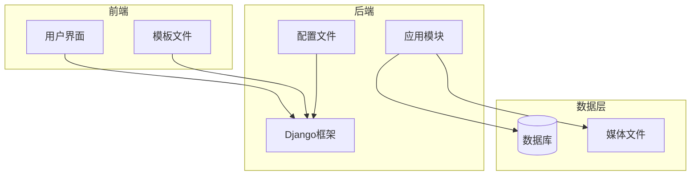
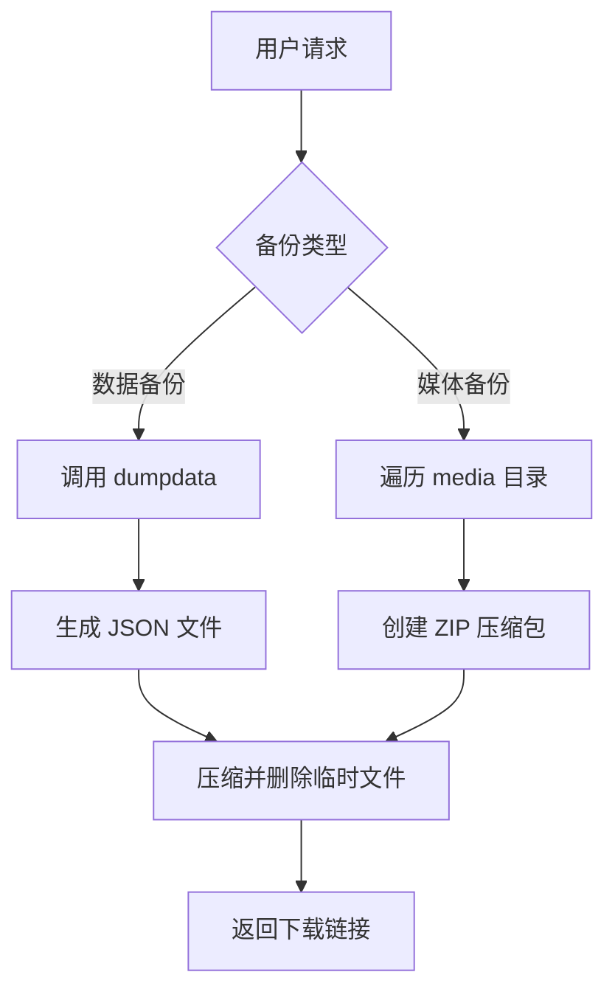
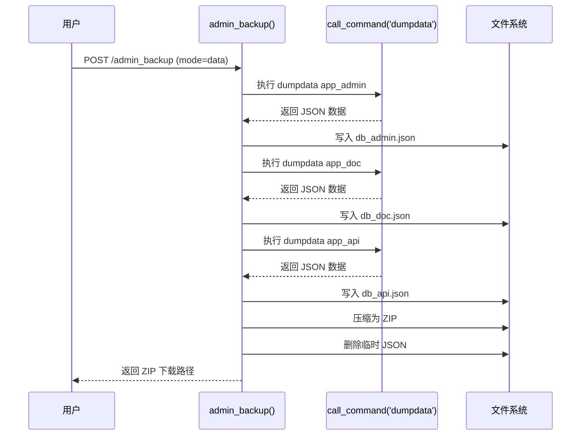
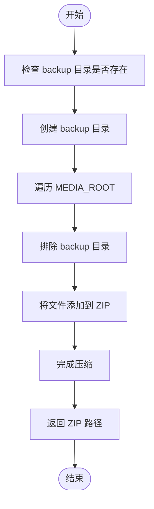
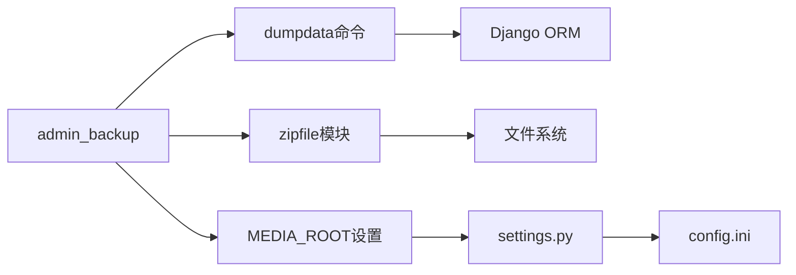

# 数据备份与恢复

<cite>
**本文档引用的文件**
- [config.ini](file://config/config.ini)
- [manage.py](file://manage.py)
- [views.py](file://app_admin/views.py#L1494-L1566)
- [admin_setting.html](file://template/app_admin/admin_setting.html) - *在最近提交中更新*
</cite>

## 目录
1. [简介](#简介)
2. [项目结构](#项目结构)
3. [核心组件](#核心组件)
4. [架构概述](#架构概述)
5. [详细组件分析](#详细组件分析)
6. [依赖分析](#依赖分析)
7. [性能考虑](#性能考虑)
8. [故障排除指南](#故障排除指南)
9. [结论](#结论)

## 简介
本文档详细说明了 MrDoc 系统中数据备份与恢复功能的实现机制。涵盖数据库导出、文件存储备份、手动与自动备份流程、加密压缩处理以及常见问题解决方案。目标是为系统管理员和技术人员提供全面的操作指导和故障排查支持。

## 项目结构
MrDoc 是一个基于 Django 框架的文档管理系统，其目录结构清晰地划分了不同功能模块。主要组件包括：
- **MrDoc/**：Django 项目核心配置（settings.py, urls.py）
- **app_admin/**：后台管理应用，包含用户、权限、站点设置等功能
- **app_doc/**：文档核心功能，如文集、文档、附件等
- **app_api/**：API 接口服务
- **config/**：系统配置文件（config.ini）
- **static/**：静态资源文件
- **template/**：前端模板文件
- **manage.py**：Django 管理脚本入口

该结构体现了典型的 Django MVC 架构，各应用职责分明，便于维护和扩展。

**图表来源**
- [app_admin/views.py](file://app_admin/views.py#L1494-L1566)
- [config/config.ini](file://config/config.ini)

**本节来源**
- [app_admin/views.py](file://app_admin/views.py#L1494-L1566)
- [config/config.ini](file://config/config.ini)

## 核心组件
数据备份与恢复功能的核心组件包括：
- **admin_backup 视图函数**：位于 `app_admin/views.py`，负责处理数据和媒体文件的备份请求。
- **config.ini 配置文件**：定义系统运行参数，如调试模式、数据库类型等。
- **manage.py 脚本**：Django 命令行工具，用于执行 dumpdata 和 loaddata 等数据操作命令。
- **Django dumpdata 命令**：内置命令，用于将数据库中的数据导出为 JSON 格式。
- **admin_setting.html 模板**：位于 `template/app_admin/`，提供用户界面用于触发备份操作。

这些组件协同工作，实现了完整的数据保护机制。

**本节来源**
- [manage.py](file://manage.py)
- [app_admin/views.py](file://app_admin/views.py#L1494-L1566)
- [config/config.ini](file://config/config.ini)
- [admin_setting.html](file://template/app_admin/admin_setting.html)

## 架构概述
MrDoc 的数据备份架构采用分层设计，分为数据层、逻辑层和接口层。数据层包含数据库和媒体文件；逻辑层通过 Django ORM 和 Python 脚本实现数据导出与压缩；接口层提供 Web 界面和 API 支持。

**图表来源**
- [app_admin/views.py](file://app_admin/views.py#L1494-L1566)

**本节来源**
- [app_admin/views.py](file://app_admin/views.py#L1494-L1566)

## 详细组件分析

### 数据库备份机制分析
数据库备份通过 Django 的 `dumpdata` 命令实现，将指定应用的数据序列化为 JSON 格式。

#### 实现流程

**图表来源**
- [app_admin/views.py](file://app_admin/views.py#L1494-L1523)

**本节来源**
- [app_admin/views.py](file://app_admin/views.py#L1494-L1523)

### 文件存储备份方案分析
媒体文件备份通过遍历 `MEDIA_ROOT` 目录实现，排除 `backup` 子目录以防止递归包含。

#### 备份逻辑

**图表来源**
- [app_admin/views.py](file://app_admin/views.py#L1525-L1549)

**本节来源**
- [app_admin/views.py](file://app_admin/views.py#L1525-L1549)

## 依赖分析
系统各组件之间的依赖关系如下图所示：

**图表来源**
- [app_admin/views.py](file://app_admin/views.py#L1494-L1566)
- [config/config.ini](file://config/config.ini)

**本节来源**
- [app_admin/views.py](file://app_admin/views.py#L1494-L1566)
- [config/config.ini](file://config/config.ini)

## 性能考虑
- **I/O 性能**：大量文件读写可能影响性能，建议在低峰期执行备份。
- **内存使用**：`dumpdata` 将整个数据集加载到内存，大数据量时需注意内存消耗。
- **压缩效率**：ZIP_DEFLATED 提供良好压缩比，但 CPU 开销较高。
- **网络传输**：大体积备份文件上传下载需考虑带宽限制。

## 故障排除指南
### 常见问题及解决方案

| 问题现象 | 可能原因 | 解决方案 |
|--------|--------|--------|
| 备份失败，提示权限错误 | 目标目录无写入权限 | 检查 `MEDIA_ROOT/backup` 目录权限 |
| 磁盘空间不足 | 备份文件过大 | 清理旧备份或扩容磁盘 |
| 数据完整性校验失败 | 导出过程中数据变更 | 在低峰期执行备份或使用数据库快照 |
| JSON 编码错误 | 数据包含非 UTF-8 字符 | 检查数据库字符集设置 |
| 媒体文件缺失 | 文件路径变更或删除 | 确保文件系统一致性 |

**本节来源**
- [app_admin/views.py](file://app_admin/views.py#L1494-L1566)

## 结论
MrDoc 的数据备份与恢复机制设计合理，覆盖了数据库和文件存储两大核心数据源。通过 `admin_backup` 接口可方便地执行数据导出，并自动进行压缩归档。建议定期执行备份，并将备份文件异地存储以提高安全性。未来可考虑增加加密功能和自动化调度策略以进一步提升数据安全性。