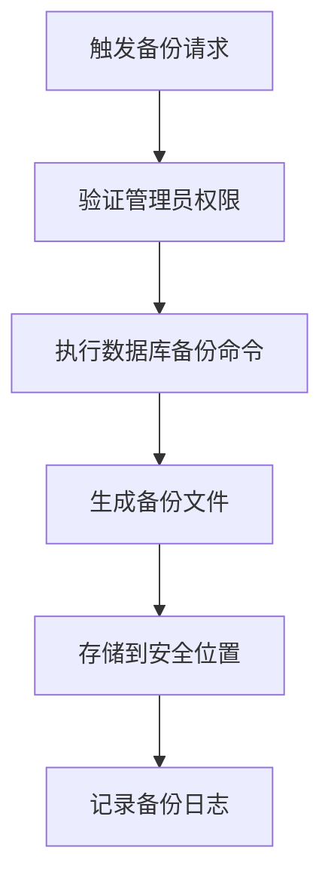
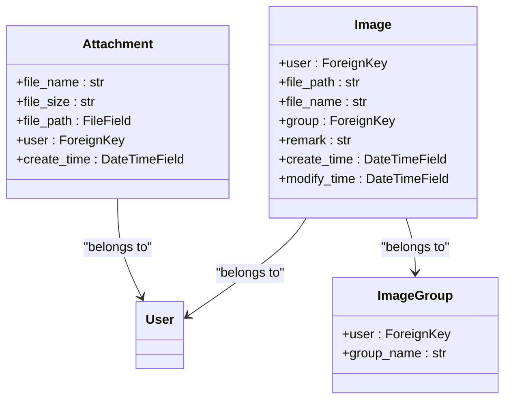
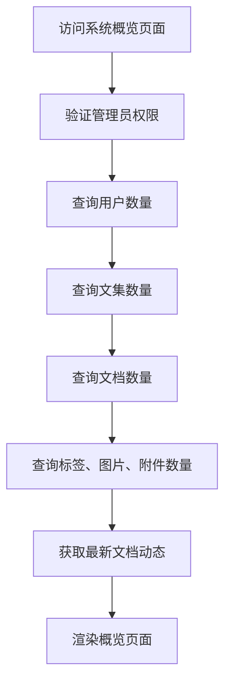
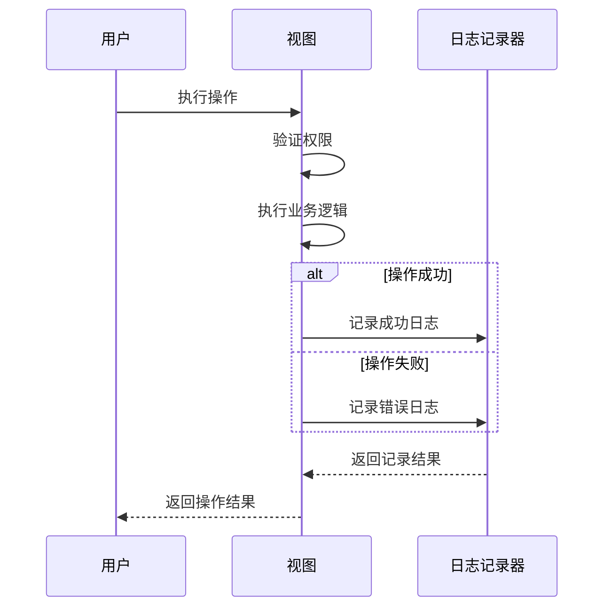
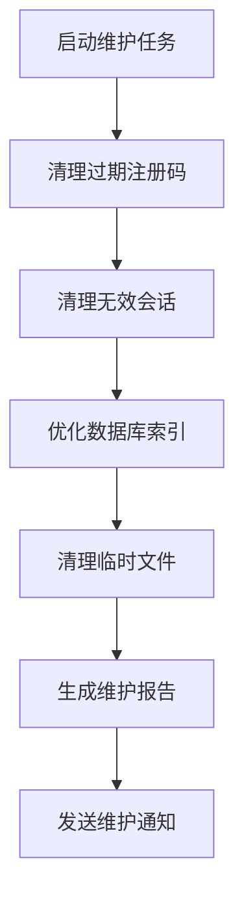
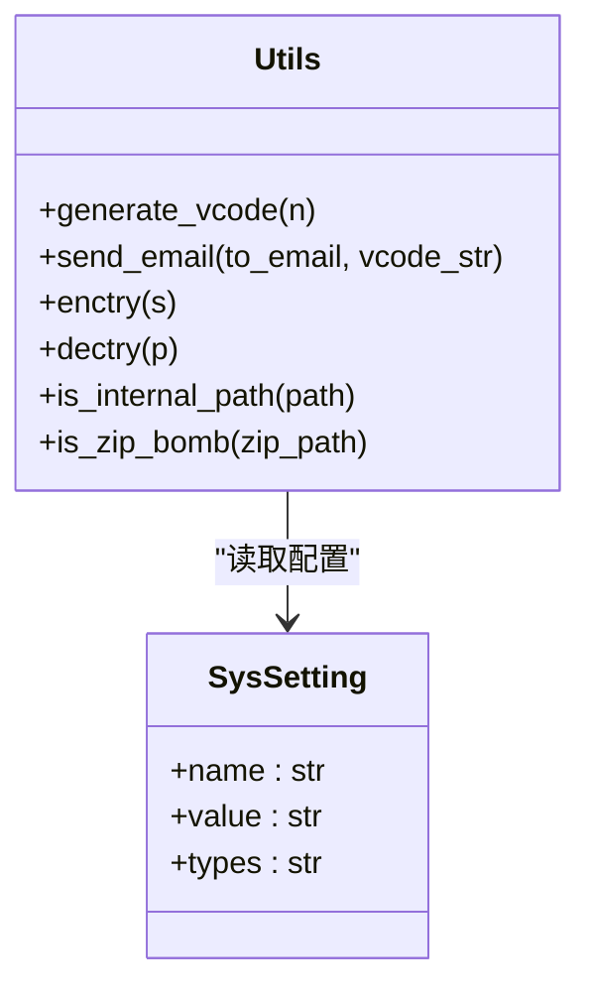
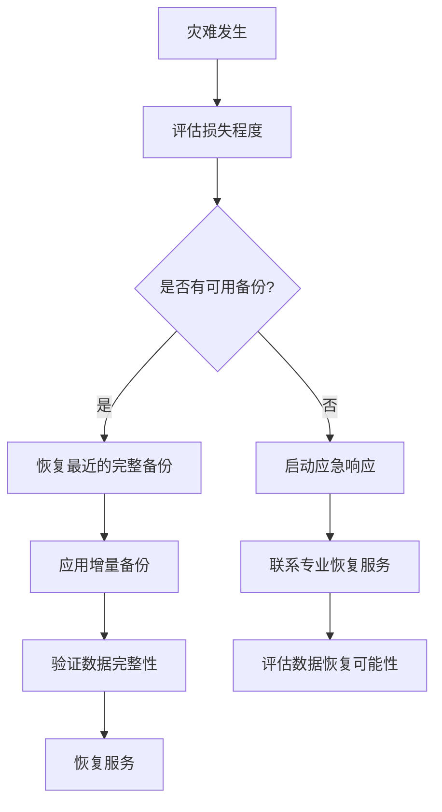

# 数据管理

<cite>
**本文档中引用的文件**   
- [utils.py](file://app_admin/utils.py)
- [models.py](file://app_admin/models.py)
- [models.py](file://app_doc/models.py)
- [views.py](file://app_doc/views.py)
- [views.py](file://app_admin/views.py)
- [admin_overview.html](file://template/app_admin/admin_overview.html) - *更新了界面展示*
- [admin_center.html](file://template/app_admin/admin_center.html) - *更新了界面展示*
</cite>

## 更新摘要
**变更内容**   
- 更新了系统概览页面的界面展示，将按钮组替换为图片展示
- 清理了文档管理页中的“链接”卡片，去除了导航按钮
- 更新了相关模板文件的引用信息

## 目录
1. [数据备份与恢复机制](#数据备份与恢复机制)
2. [系统概览数据统计](#系统概览数据统计)
3. [日志管理功能](#日志管理功能)
4. [定期维护任务](#定期维护任务)
5. [实用工具函数](#实用工具函数)
6. [常见问题与解决方案](#常见问题与解决方案)
7. [数据安全与灾难恢复最佳实践](#数据安全与灾难恢复最佳实践)

## 数据备份与恢复机制

本系统通过数据库和文件存储的双重备份策略来确保数据安全。数据库备份主要依赖于Django ORM和系统配置，而文件存储备份则通过文件系统操作实现。

### 数据库备份机制

数据库备份通过Django的`call_command`函数实现，该函数可以调用Django内置的管理命令。在`app_admin/views.py`中，虽然没有直接展示备份代码，但通过`call_command`的导入可以推断出系统具备执行数据库备份和恢复的能力。



**图示来源**
- [views.py](file://app_admin/views.py#L10)

### 文件存储备份

文件存储备份主要涉及文档、图片和附件的管理。系统通过`Attachment`、`Image`等模型来管理文件，并在删除操作时进行级联删除。



**图示来源**
- [models.py](file://app_doc/models.py#L250-L270)

**本节来源**
- [models.py](file://app_doc/models.py#L250-L270)
- [views.py](file://app_admin/views.py#L10)

## 系统概览数据统计

系统概览页面提供了关键数据的统计功能，包括用户数、文集数、文档数等。根据最新的代码变更，系统概览页面的界面展示已优化，将按钮组替换为图片展示，提升了用户体验。

### 用户数统计

用户数统计通过查询Django内置的`User`模型实现：

```python
user_cnt = User.objects.all().count()
```

### 文集数统计

文集数统计通过查询`Project`模型实现：

```python
pro_cnt = Project.objects.all().count()
```

### 文档数统计

文档数统计通过查询`Doc`模型实现：

```python
doc_cnt = Doc.objects.all().count()
```

这些统计功能在`admin_overview`视图中实现，为管理员提供了系统运行状况的直观展示。



**图示来源**
- [views.py](file://app_admin/views.py#L300-L320)

**本节来源**
- [views.py](file://app_admin/views.py#L300-L320)
- [admin_overview.html](file://template/app_admin/admin_overview.html) - *更新了界面展示*

## 日志管理功能

系统实现了访问日志和操作日志的记录与查看功能。

### 访问日志

访问日志通过Django的认证系统和日志记录器实现。在用户登录、注销等操作时，系统会记录相关日志。

```python
from loguru import logger

# 登录日志记录
logger.info(f"用户 {username} 登录成功")
```

### 操作日志

操作日志记录了用户对文集、文档等资源的操作。在`AdminUserDetail`类中，删除用户时会记录操作日志：

```python
logger.exception("删除用户出错")
```

系统使用`loguru`库进行日志记录，提供了详细的错误追踪功能。



**图示来源**
- [views.py](file://app_admin/views.py#L200-L250)

**本节来源**
- [views.py](file://app_admin/views.py#L200-L250)

## 定期维护任务

系统提供了多种定期维护任务，以确保系统的稳定运行。

### 清理过期注册码

清理过期注册码的功能通过检查注册码的过期日期实现：

```python
from django.utils import timezone

current_date = timezone.now().date()
expired_codes = RegisterCode.objects.filter(
    expire_date__lt=current_date,
    status=1
)
expired_codes.update(status=0)
```

### 优化数据库

数据库优化主要通过Django的管理命令实现，可以定期执行数据库清理和优化操作。

### 维护任务执行流程



**本节来源**
- [models.py](file://app_admin/models.py#L60-L67)

## 实用工具函数

`app_admin/utils.py`文件中包含了一系列实用工具函数，为系统提供了基础支持。

### 验证码生成

```python
def generate_vcode(n=6):
    _num = ''.join(map(str, range(3, 10)))
    vcode_str = ''.join(random.sample(_num, n))
    return vcode_str
```

### 邮件发送

邮件发送功能支持SMTP SSL配置，确保邮件传输安全：

```python
def send_email(to_email, vcode_str):
    email_enable = SysSetting.objects.get(types="basic", name='enable_email')
    if email_enable.value == 'on':
        # 获取SMTP配置
        smtp_host = SysSetting.objects.get(types='email', name='smtp_host').value
        smtp_port = SysSetting.objects.get(types='email', name='smtp_port').value
        ssl = SysSetting.objects.get(types='email', name='smtp_ssl').value
        
        # 发送邮件逻辑
        if ssl:
            s = smtplib.SMTP_SSL(smtp_host, int(smtp_port))
        else:
            s = smtplib.SMTP(smtp_host, int(smtp_port))
```

### 数据加密解密

系统实现了简单的数据加密解密功能：

```python
def enctry(s):
    k = settings.SECRET_KEY
    encry_str = ""
    for i, j in zip(s, k):
        temp = str(ord(i) + ord(j)) + '_'
        encry_str = encry_str + temp
    return encry_str

def dectry(p):
    k = settings.SECRET_KEY
    dec_str = ""
    for i, j in zip(p.split("_")[:-1], k):
        temp = chr(int(i) - ord(j))
        dec_str = dec_str + temp
    return dec_str
```

### ZIP炸弹检测

为了防止ZIP炸弹攻击，系统实现了压缩率检测：

```python
def is_zip_bomb(zip_path, compression_threshold=100):
    with zipfile.ZipFile(zip_path, 'r') as zip_file:
        uncompressed_size = sum(file.file_size for file in zip_file.infolist())
        compressed_size = os.path.getsize(zip_path)
        compression_ratio = uncompressed_size / compressed_size
        if compression_ratio > compression_threshold:
            return True
    return False
```



**图示来源**
- [utils.py](file://app_admin/utils.py#L10-L114)

**本节来源**
- [utils.py](file://app_admin/utils.py#L10-L114)

## 常见问题与解决方案

### 数据不一致问题

**问题描述**：文集统计数量与实际文档数量不符。

**解决方案**：
1. 检查`Project`和`Doc`模型的关联关系
2. 确保删除文档时更新文集统计
3. 执行数据库完整性检查

```python
# 修复文集文档数量
for project in Project.objects.all():
    doc_count = Doc.objects.filter(top_doc=project.id).count()
    # 更新缓存或统计字段
```

### 备份失败问题

**问题描述**：数据库备份过程中断或失败。

**解决方案**：
1. 检查磁盘空间是否充足
2. 验证数据库连接配置
3. 检查备份目录权限
4. 查看详细的错误日志

```python
try:
    call_command('dumpdata', '--output=backup.json')
except Exception as e:
    logger.error(f"备份失败: {str(e)}")
    # 实施重试机制
```

**本节来源**
- [views.py](file://app_admin/views.py)
- [utils.py](file://app_admin/utils.py)

## 数据安全与灾难恢复最佳实践

### 数据安全措施

1. **定期备份**：每天执行完整备份，每小时执行增量备份
2. **异地存储**：将备份文件存储在不同的物理位置
3. **加密传输**：使用SSL/TLS加密备份数据传输
4. **访问控制**：严格限制备份文件的访问权限

### 灾难恢复流程



### 最佳实践建议

1. **3-2-1备份规则**：
   - 3份数据副本
   - 2种不同存储介质
   - 1份异地备份

2. **定期演练**：每季度执行一次灾难恢复演练

3. **监控告警**：设置备份成功/失败的实时告警

4. **文档化**：详细记录备份和恢复流程

5. **权限分离**：备份操作权限与日常操作权限分离

**本节来源**
- [utils.py](file://app_admin/utils.py)
- [views.py](file://app_admin/views.py)