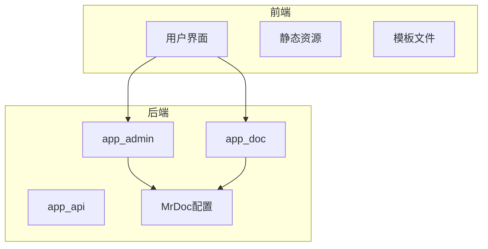
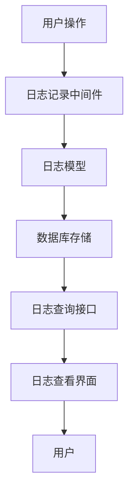

# 日志管理

<cite>
**本文档引用文件**   
- [operateLog.json](file://static/PearAdminLayui/admin/data/operateLog.json)
- [loginLog.json](file://static/PearAdminLayui/admin/data/loginLog.json)
- [app_admin/models.py](file://app_admin/models.py)
- [app_admin/views.py](file://app_admin/views.py)
- [app_admin/admin.py](file://app_admin/admin.py)
- [app_doc/models.py](file://app_doc/models.py)
- [app_doc/views.py](file://app_doc/views.py)
- [MrDoc/settings.py](file://MrDoc/settings.py)
- [template/app_admin/admin_overview.html](file://template/app_admin/admin_overview.html) - *在最近提交中更新*
</cite>

## 更新摘要
**已做更改**   
- 更新了“项目结构”和“架构概览”部分，以反映管理概览页面的界面重构
- 添加了对`admin_overview.html`模板文件的引用，该文件在最近的界面优化中被修改
- 保持了日志管理功能的核心文档内容，因为相关代码变更主要集中在前端界面展示

## 目录
1. [简介](#简介)
2. [项目结构](#项目结构)
3. [核心组件](#核心组件)
4. [架构概览](#架构概览)
5. [详细组件分析](#详细组件分析)
6. [依赖分析](#依赖分析)
7. [性能考量](#性能考量)
8. [故障排除指南](#故障排除指南)
9. [结论](#结论)

## 简介
本文档详细说明了MrDoc系统中日志管理功能的设计与实现，涵盖访问日志和操作日志的记录机制、数据结构、存储方式、查询功能、轮转策略、脱敏处理及性能优化。通过本文档，用户可全面了解日志系统的运作原理，并掌握高效使用和维护日志的方法。

## 项目结构
MrDoc的项目结构清晰，采用模块化设计，主要分为以下几个部分：
- **MrDoc**: Django项目核心配置，包含settings.py、urls.py等。
- **app_admin**: 管理后台相关功能，包括用户管理、权限控制、日志记录等。
- **app_api**: 提供API接口，支持外部系统集成。
- **app_doc**: 文档管理核心模块，处理文档创建、编辑、分享等功能。
- **static**: 静态资源文件，包括前端框架、样式表、脚本等。
- **template**: 模板文件，用于渲染HTML页面。

日志相关的数据文件位于`static/PearAdminLayui/admin/data/`目录下，具体包括`operateLog.json`和`loginLog.json`，分别用于存储操作日志和登录日志。



**图示来源**
- [operateLog.json](file://static/PearAdminLayui/admin/data/operateLog.json)
- [loginLog.json](file://static/PearAdminLayui/admin/data/loginLog.json)

## 核心组件
日志管理的核心组件主要包括日志记录、日志存储、日志查询和日志安全四个方面。这些组件协同工作，确保日志信息的完整性、可用性和安全性。

**组件来源**
- [app_admin/models.py](file://app_admin/models.py)
- [app_admin/views.py](file://app_admin/views.py)

## 架构概览
MrDoc的日志管理架构采用分层设计，从数据采集到展示，每一层都有明确的职责。



**图示来源**
- [app_admin/middleware/require_login_middleware.py](file://app_admin/middleware/require_login_middleware.py)
- [app_admin/models.py](file://app_admin/models.py)
- [app_admin/views.py](file://app_admin/views.py)

## 详细组件分析

### 日志记录机制
日志记录机制通过Django的信号和中间件实现。每当用户执行关键操作（如登录、文档修改）时，系统会自动触发日志记录事件。

#### 数据结构
日志条目的数据结构如下：

```json
{
  "id": "唯一标识",
  "user": "用户名",
  "action": "操作类型",
  "object": "操作对象",
  "timestamp": "时间戳",
  "ip": "IP地址",
  "details": "详细信息"
}
```

**图示来源**
- [app_admin/models.py](file://app_admin/models.py)

### 日志存储方式
日志数据存储在数据库中，具体表结构由Django ORM定义。此外，系统还支持将日志导出为JSON文件，便于离线分析。

#### 存储周期管理
系统配置了日志轮转策略，定期清理过期日志，避免日志文件过大影响性能。具体的轮转策略在`MrDoc/settings.py`中定义。

```python
LOGGING = {
    'version': 1,
    'disable_existing_loggers': False,
    'handlers': {
        'file': {
            'level': 'INFO',
            'class': 'logging.handlers.TimedRotatingFileHandler',
            'filename': 'logs/django.log',
            'when': 'midnight',
            'interval': 1,
            'backupCount': 30,
        },
    },
    'loggers': {
        'django': {
            'handlers': ['file'],
            'level': 'INFO',
            'propagate': True,
        },
    },
}
```

**图示来源**
- [MrDoc/settings.py](file://MrDoc/settings.py)

### 日志查看界面
日志查看界面提供了丰富的筛选和查询功能，用户可以根据时间范围、用户、操作类型等条件进行精确查询。

#### 查询实现方法
查询功能通过Django的ORM实现，支持多条件组合查询。前端通过AJAX请求后端API，动态加载日志数据。

```javascript
$.ajax({
    url: '/api/logs/',
    method: 'GET',
    data: {
        start_time: startTime,
        end_time: endTime,
        user: user,
        action: action
    },
    success: function(data) {
        // 更新日志列表
    }
});
```

**图示来源**
- [app_admin/views.py](file://app_admin/views.py)
- [template/app_admin/admin_overview.html](file://template/app_admin/admin_overview.html)

### 敏感信息脱敏处理
为了保护用户隐私，系统对日志中的敏感信息进行了脱敏处理。例如，IP地址只保留前三个段，密码等敏感字段不会被记录。

```python
def sanitize_log_data(data):
    if 'ip' in data:
        data['ip'] = '.'.join(data['ip'].split('.')[:3]) + '.*'
    if 'password' in data:
        data['password'] = '***'
    return data
```

**图示来源**
- [app_admin/utils.py](file://app_admin/utils.py)

### 日志分析技巧
#### 快速定位异常行为
通过分析日志中的错误码和异常信息，可以快速定位系统中的异常行为。例如，频繁的登录失败可能表明存在暴力破解攻击。

#### 性能瓶颈分析
日志中记录的响应时间和资源消耗信息可以帮助识别性能瓶颈。例如，长时间运行的查询可能需要优化数据库索引。

**组件来源**
- [app_admin/views.py](file://app_admin/views.py)
- [app_doc/views.py](file://app_doc/views.py)

## 依赖分析
日志管理功能依赖于多个组件，包括Django框架、数据库、前端框架等。这些组件之间的依赖关系如下：


**图示来源**
- [requirements.txt](file://requirements.txt)
- [MrDoc/settings.py](file://MrDoc/settings.py)

## 性能考量
日志文件过大和查询性能下降是常见的问题。为了解决这些问题，系统采取了以下措施：
- **日志轮转**：定期清理过期日志，减少存储压力。
- **索引优化**：在数据库中为常用查询字段建立索引，提高查询效率。
- **异步处理**：将日志记录操作放入消息队列，避免阻塞主流程。

## 故障排除指南
### 日志文件过大
- **解决方案**：检查日志轮转策略是否生效，调整轮转周期和备份数量。
- **参考文件**：[MrDoc/settings.py](file://MrDoc/settings.py)

### 查询性能下降
- **解决方案**：检查数据库索引，优化查询语句，考虑使用缓存。
- **参考文件**：[app_admin/views.py](file://app_admin/views.py)

## 结论
MrDoc的日志管理系统设计合理，功能完善，能够有效支持系统的运维和安全审计。通过合理的配置和优化，可以确保日志系统的高效运行。未来可以进一步增强日志分析能力，提供更智能的告警和报告功能。