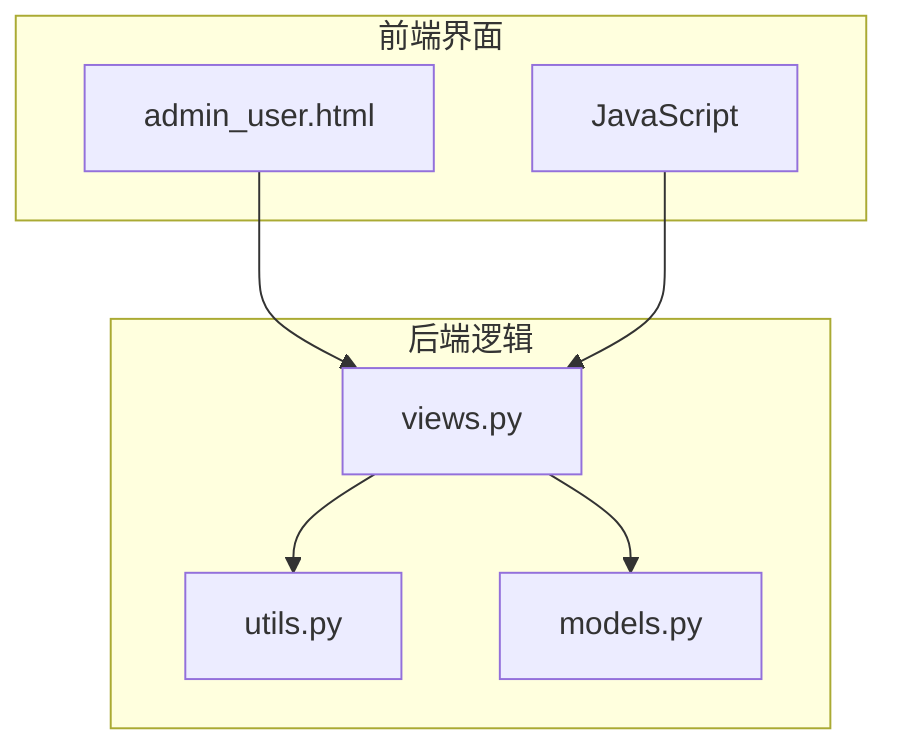
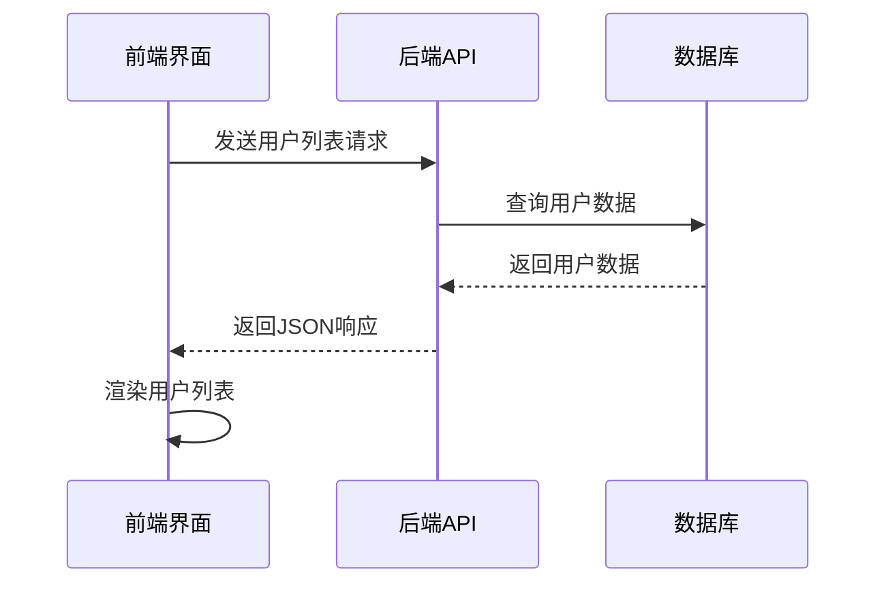
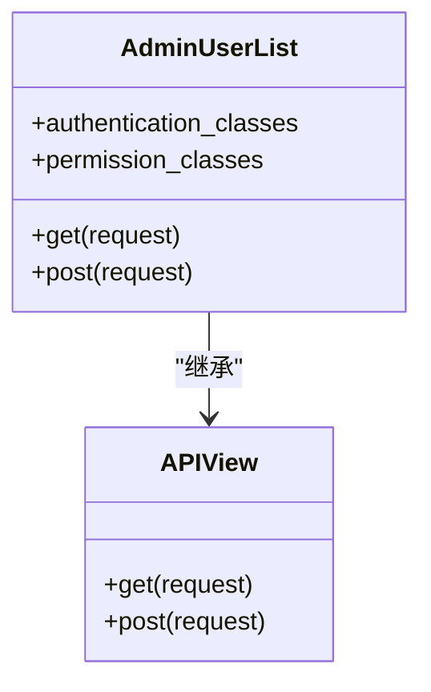
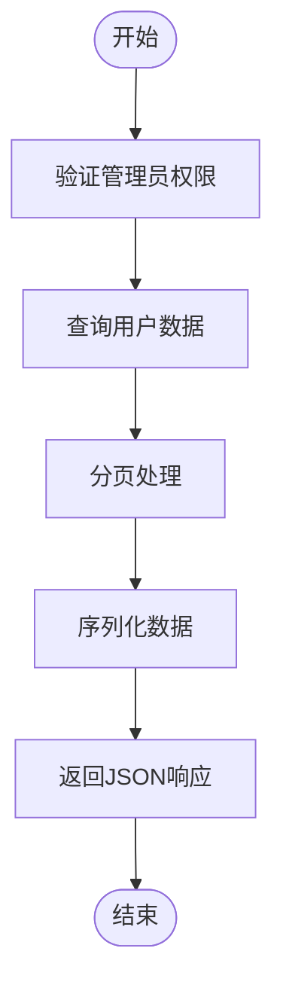
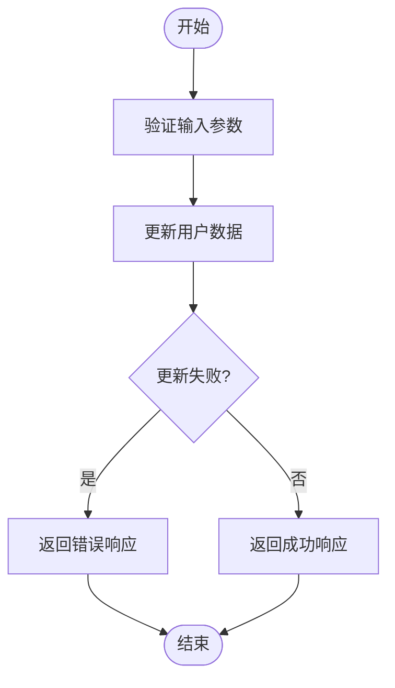
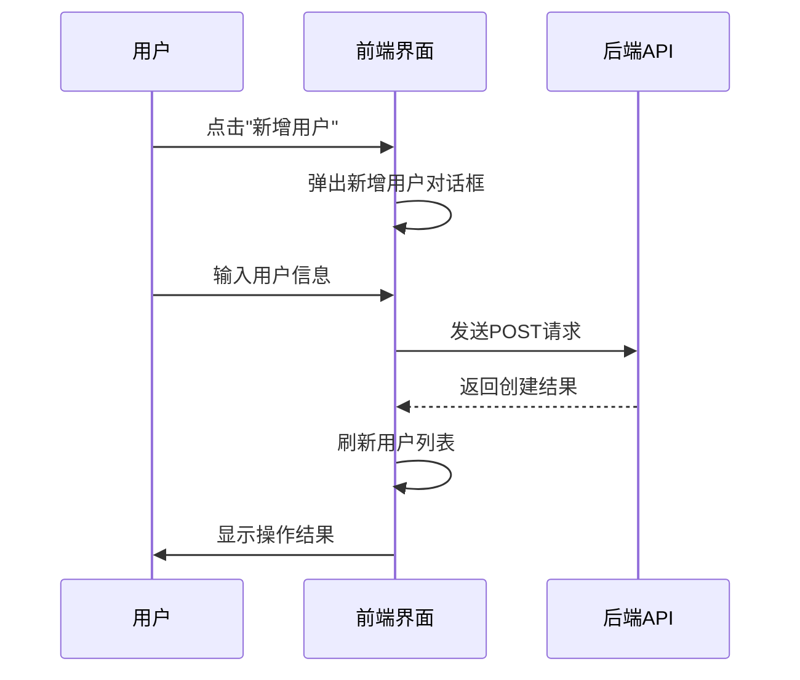
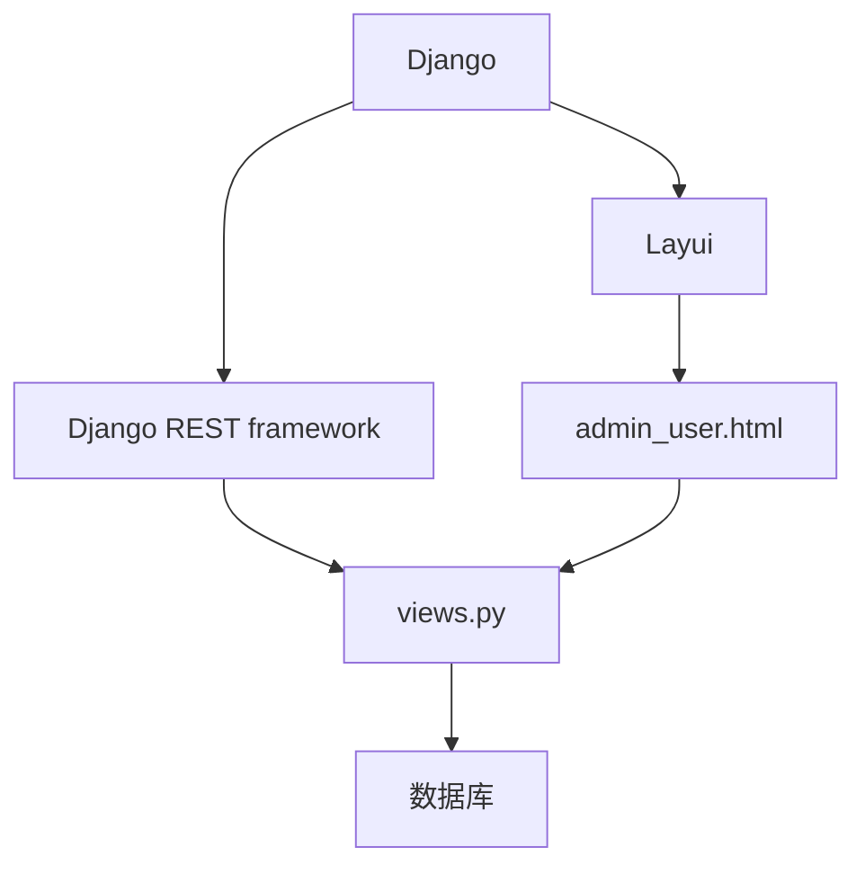

# 批量操作

<cite>
**本文档引用的文件**   
- [views.py](file://app_admin/views.py)
- [utils.py](file://app_admin/utils.py)
- [admin_user.html](file://template/app_admin/admin_user.html)
</cite>

## 目录
1. [简介](#简介)
2. [项目结构](#项目结构)
3. [核心组件](#核心组件)
4. [架构概述](#架构概述)
5. [详细组件分析](#详细组件分析)
6. [依赖分析](#依赖分析)
7. [性能考虑](#性能考虑)
8. [故障排除指南](#故障排除指南)
9. [结论](#结论)

## 简介
本文档详细描述了系统中用户批量操作功能的实现，重点分析了用户数据的批量导入、导出和状态修改功能。文档涵盖了 `views.py` 中的视图逻辑、`utils.py` 中的辅助函数以及 `admin_user.html` 前端模板的实现细节。通过本指南，系统管理员可以全面了解批量操作的实现机制、数据验证流程和错误处理策略，并掌握性能优化和数据完整性保障的最佳实践。

## 项目结构
系统采用模块化设计，批量操作功能主要分布在 `app_admin` 应用中。核心文件包括：
- `app_admin/views.py`：包含用户管理的视图逻辑，实现用户数据的增删改查和批量操作。
- `app_admin/utils.py`：提供辅助函数，如验证码生成和邮件发送。
- `template/app_admin/admin_user.html`：提供用户管理的前端界面，包含批量操作的UI元素。

**图示来源**
- [admin_user.html](file://template/app_admin/admin_user.html)
- [views.py](file://app_admin/views.py)
- [utils.py](file://app_admin/utils.py)

**本节来源**
- [views.py](file://app_admin/views.py)
- [utils.py](file://app_admin/utils.py)
- [admin_user.html](file://template/app_admin/admin_user.html)

## 核心组件
批量操作功能的核心组件包括：
- **用户列表视图**：`AdminUserList` 类视图，处理用户数据的获取和新增。
- **用户详情视图**：`AdminUserDetail` 类视图，处理用户资料的修改和删除。
- **前端模板**：`admin_user.html`，提供用户管理的界面和交互逻辑。

**本节来源**
- [views.py](file://app_admin/views.py#L461-L496)
- [admin_user.html](file://template/app_admin/admin_user.html#L0-L28)

## 架构概述
系统采用前后端分离的架构，前端通过AJAX请求与后端API进行交互。后端使用Django REST framework实现API接口，前端使用Layui框架构建用户界面。批量操作的流程如下：
1. 用户在前端界面触发操作。
2. 前端通过AJAX发送请求到后端API。
3. 后端视图处理请求，执行相应的数据库操作。
4. 后端返回JSON响应，前端根据响应结果更新界面。

**图示来源**
- [views.py](file://app_admin/views.py#L461-L496)
- [admin_user.html](file://template/app_admin/admin_user.html#L111-L144)

## 详细组件分析

### 用户列表分析
`AdminUserList` 类视图实现了用户数据的分页查询和新增功能。视图使用 `SessionAuthentication` 和 `SuperUserPermission` 进行认证和权限控制。

#### 类图

**图示来源**
- [views.py](file://app_admin/views.py#L461-L496)

#### 获取用户列表流程

**图示来源**
- [views.py](file://app_admin/views.py#L461-L496)

**本节来源**
- [views.py](file://app_admin/views.py#L461-L496)

### 用户详情分析
`AdminUserDetail` 类视图处理单个用户的获取、修改和删除操作。视图根据 `obj` 参数区分不同的操作类型。

#### 修改用户资料流程

**图示来源**
- [views.py](file://app_admin/views.py#L543-L576)

**本节来源**
- [views.py](file://app_admin/views.py#L543-L576)

### 前端界面分析
`admin_user.html` 模板使用Layui框架构建用户管理界面，包含搜索框、新增按钮和用户列表表格。

#### 用户操作流程

**图示来源**
- [admin_user.html](file://template/app_admin/admin_user.html#L111-L144)

**本节来源**
- [admin_user.html](file://template/app_admin/admin_user.html#L111-L144)

## 依赖分析
批量操作功能依赖于以下组件：
- Django框架：提供基础的Web开发功能。
- Django REST framework：实现API接口。
- Layui框架：构建前端用户界面。
- 数据库：存储用户数据。

**图示来源**
- [views.py](file://app_admin/views.py)
- [admin_user.html](file://template/app_admin/admin_user.html)

**本节来源**
- [views.py](file://app_admin/views.py)
- [admin_user.html](file://template/app_admin/admin_user.html)

## 性能考虑
为确保批量操作的性能，建议：
- 使用分页查询避免一次性加载过多数据。
- 在数据库层面添加适当的索引。
- 避免在循环中执行数据库查询。
- 使用批量操作API减少网络请求次数。

## 故障排除指南
常见问题及解决方案：
- **文件格式错误**：确保上传的文件符合指定格式要求。
- **数据冲突**：检查数据是否违反唯一性约束。
- **权限不足**：确认当前用户具有执行操作的权限。
- **网络超时**：对于大数据量操作，适当增加超时时间。

**本节来源**
- [views.py](file://app_admin/views.py)
- [utils.py](file://app_admin/utils.py)

## 结论
本文档详细介绍了系统中用户批量操作功能的实现。通过前后端分离的架构和RESTful API设计，系统提供了高效、安全的批量操作能力。管理员可以利用这些功能快速管理用户数据，提高工作效率。未来可以考虑增加更多批量操作类型，如批量导入导出，以进一步提升系统的实用性。