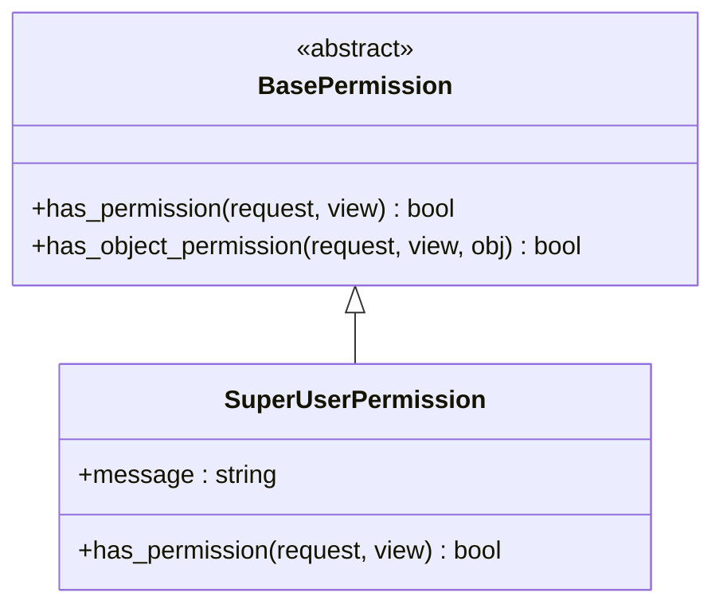
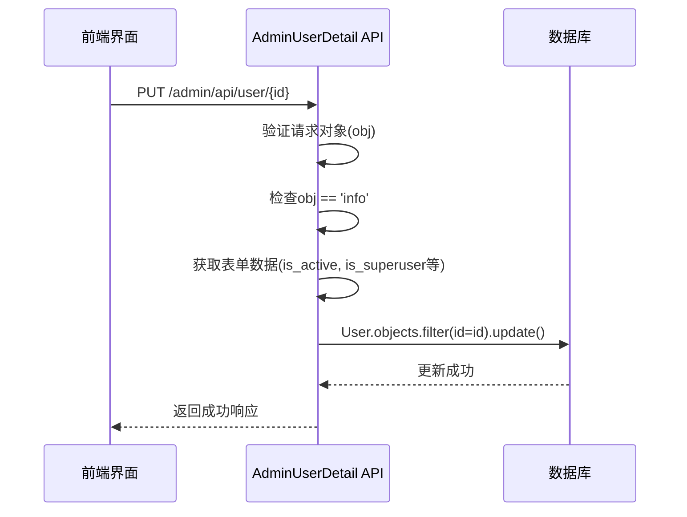

# 权限分配

<cite>
**本文档引用的文件**   
- [models.py](file://app_admin/models.py)
- [views.py](file://app_admin/views.py)
- [admin.py](file://app_admin/admin.py)
- [permissions_app.py](file://app_api/permissions_app.py)
- [admin_user_profile.html](file://template/app_admin/admin_user_profile.html)
- [admin_user.html](file://template/app_admin/admin_user.html)
- [admin_project_role.html](file://template/app_admin/admin_project_role.html)
</cite>

## 目录
1. [简介](#简介)
2. [核心权限模型](#核心权限模型)
3. [权限分配视图逻辑](#权限分配视图逻辑)
4. [Django Admin权限管理](#django-admin权限管理)
5. [权限验证机制](#权限验证机制)
6. [常见问题与解决方案](#常见问题与解决方案)
7. [最佳实践](#最佳实践)

## 简介
本文档详细阐述了MrDoc系统中用户权限管理功能的实现机制。系统基于Django框架的认证系统，通过`User`模型的内置字段和自定义权限类，实现了细粒度的权限控制。文档将深入分析权限相关的数据模型、视图逻辑、管理界面配置以及安全验证流程，为系统管理员提供全面的权限管理指南。

## 核心权限模型

### User模型权限字段
系统使用Django内置的`auth.User`模型，其核心权限字段在权限管理中扮演关键角色：

- **`is_staff`**: 布尔值，标识用户是否可以访问Django管理后台。在本系统中，该字段与`is_superuser`共同决定后台访问权限。
- **`is_superuser`**: 布尔值，超级用户标志。拥有此权限的用户自动拥有所有权限，不受其他权限规则限制。
- **`is_active`**: 布尔值，用户激活状态。非激活用户无法登录系统。

这些字段是系统权限体系的基础，通过`views.py`中的视图逻辑进行读取和修改。

### 自定义权限类
系统在`app_api/permissions_app.py`中定义了自定义权限类，用于API接口的访问控制：



**Diagram sources**
- [permissions_app.py](file://app_api/permissions_app.py#L0-L39)

`SuperUserPermission`类继承自`rest_framework.permissions.BasePermission`，其`has_permission`方法检查`request.user.is_superuser`，确保只有超级管理员才能访问受保护的API端点。

**Section sources**
- [permissions_app.py](file://app_api/permissions_app.py#L0-L39)

## 权限分配视图逻辑

### 用户管理API视图
`app_admin/views.py`中的`AdminUserDetail` API视图类负责处理用户权限的修改。

#### 权限变更处理流程


**Diagram sources**
- [views.py](file://app_admin/views.py#L496-L524)

#### 安全验证机制
1.  **身份认证**: 通过`authentication_classes`指定`SessionAuthentication`和`AppMustAuth`，确保请求来自已登录的会话。
2.  **权限检查**: `permission_classes`设置为`[SuperUserPermission]`，强制要求调用者必须是超级管理员。
3.  **输入验证**: 在`put`方法中，首先检查`obj`参数的有效性，然后对`is_active`和`is_superuser`等关键字段进行布尔值转换（`True if status == 'on' else False`）。
4.  **数据库更新**: 使用`User.objects.filter(id=id).update()`进行原子性更新，避免直接操作用户对象可能带来的安全风险。

相关代码示例：
```python
# 修改用户资料
def put(self, request, id):
    obj = request.data.get('obj','')
    if obj == 'info': # 修改资料
        status = request.POST.get('is_active', '')  # 状态
        is_superuser = request.POST.get('is_superuser', '')  # 是否超级管理员
        try:
            User.objects.filter(id=id).update(
                is_active = True if status == 'on' else False,
                is_superuser = True if is_superuser == 'true' else False
            )
            return Response({'code': 0, 'data': _('修改成功')})
        except:
            logger.exception("修改用户资料异常")
            return Response({'code': 4, 'data': _('修改异常')})
```

**Section sources**
- [views.py](file://app_admin/views.py#L496-L524)

### 用户创建视图
`AdminUserList`视图的`post`方法支持创建新用户，并可直接指定其权限等级。

```python
# 新增用户
def post(self, request):
    user_type = request.data.get('user_type', 0)  # 0为普通用户，1为管理员
    if int(user_type) == 1:
        user = User.objects.create_superuser(
            username=username,
            password=password,
            email=email
        )
    else:
        user = User.objects.create_user(
            username=username,
            password=password,
            email=email
        )
```

**Section sources**
- [views.py](file://app_admin/views.py#L461-L496)

## Django Admin权限管理

### 管理界面配置
`app_admin/admin.py`文件是Django Admin的入口，但当前内容为空，表明模型的注册可能通过其他方式完成或尚未实现。实际的管理功能由自定义的视图和模板驱动。

### 用户权限可视化操作
系统通过自定义的HTML模板提供用户友好的权限管理界面。

#### 用户资料编辑界面
`admin_user_profile.html`模板提供了修改用户权限的表单：

```html
<div class="layui-form-item">
    <label class="layui-form-label">用户状态</label>
    <div class="layui-input-inline">
        <input type="checkbox" name="is_active" lay-skin="switch" lay-text="启用|停用">
    </div>
</div>
<div class="layui-form-item">
    <label class="layui-form-label">用户角色</label>
    <div class="layui-input-inline">
        <select name="is_superuser" lay-verify="">
            <option value="false">普通用户</option>
            <option value="true">超级管理员</option>
        </select>
    </div>
</div>
```

该界面通过JavaScript调用`/admin/api/user/{id}`接口，将`is_active`和`is_superuser`的值发送到后端进行更新。

**Section sources**
- [admin_user_profile.html](file://template/app_admin/admin_user_profile.html#L25-L52)

#### 用户管理列表界面
`admin_user.html`模板中的JavaScript代码展示了如何通过前端逻辑与后端API交互来管理用户。

```javascript
// 新增管理员
createSuperUser = function(){
    data = {
        'username':$("#user2").val(),
        'password':$("#password2").val(),
        'email':$("#email2").val(),
        'user_type':1, // 关键：设置user_type为1
    }
    $.ajax({
        url:"",
        method:'post',
        data:data,
        success:function(r){
            // 处理响应
        }
    });
}
```

**Section sources**
- [admin_user.html](file://template/app_admin/admin_user.html#L139-L165)

## 权限验证机制

### 装饰器使用
系统广泛使用Django和自定义装饰器来保护视图函数。

- **`@superuser_only`**: 自定义装饰器，确保只有超级管理员才能访问被装饰的视图，如`admin_user`和`admin_project`。
- **`@login_required`**: Django内置装饰器，确保用户已登录。
- **`@require_POST`**: 限制视图仅接受POST请求。

### API权限验证
对于API视图，系统采用DRF（Django REST Framework）的权限系统。`AdminUserDetail`类的`permission_classes = [SuperUserPermission]`确保了只有超级管理员才能执行用户信息的读取、修改和删除操作。

## 常见问题与解决方案

### 权限不生效
**问题**: 修改`is_superuser`后，用户仍无法访问管理功能。
**解决方案**:
1.  确认前端发送的`is_superuser`值为字符串`"true"`或`"false"`，后端会将其转换为布尔值。
2.  检查浏览器缓存，尝试清除缓存或使用无痕模式重新登录。
3.  查看服务器日志，确认`User.objects.filter(id=id).update()`操作是否成功执行。

### 权限继承错误
**问题**: 普通用户被错误地赋予了管理员权限。
**解决方案**:
1.  严格审查`createSuperUser`等前端函数，确保`user_type`参数的传递逻辑正确。
2.  在`views.py`的`post`方法中，增加对`user_type`值的严格校验，防止恶意参数注入。
3.  实施权限审计，定期检查`User`表中`is_superuser=True`的用户列表。

## 最佳实践

### 最小权限原则
-  **谨慎分配超级管理员权限**: 仅将`is_superuser`权限授予必须进行系统级管理的用户。
-  **使用`is_staff`进行后台访问控制**: 对于需要访问后台但无需全部权限的用户，可设置`is_staff=True`但`is_superuser=False`，并配合更细粒度的权限控制（本系统目前主要依赖超级管理员）。

### 权限审计
-  **定期审查用户列表**: 通过`admin_user`界面定期检查所有用户的状态和角色。
-  **日志监控**: 系统日志（如`logger.exception`）记录了权限修改的异常，应定期审查这些日志以发现潜在的安全问题。