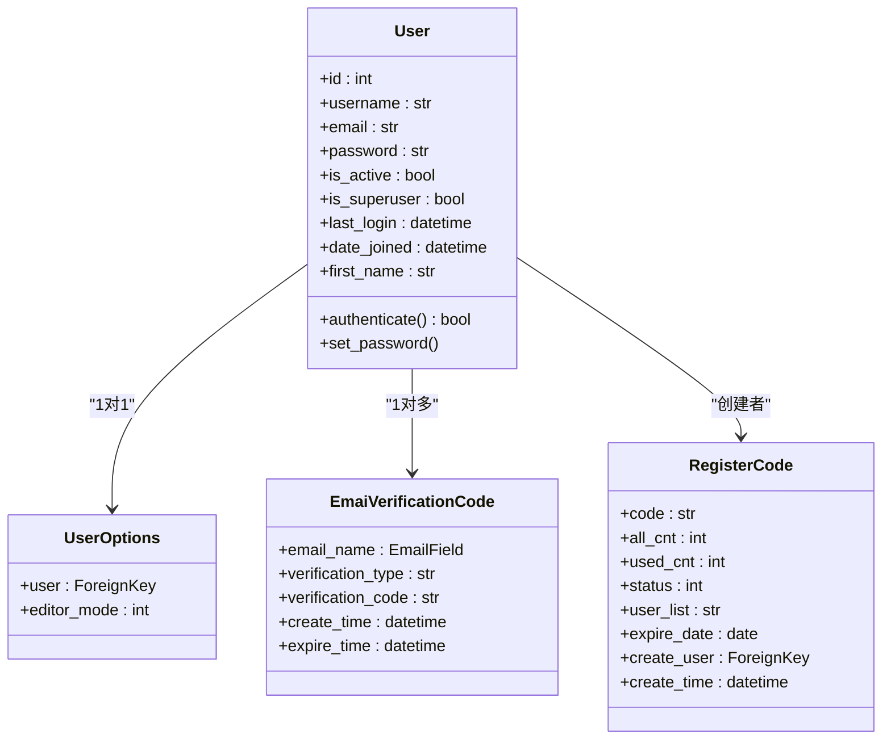
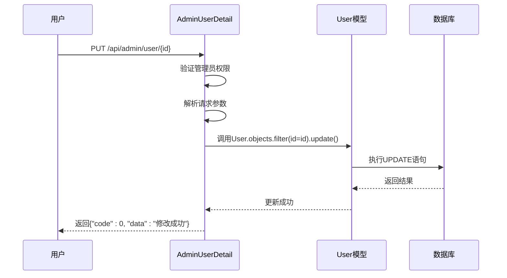

# 状态管理

<cite>
**本文档引用的文件**  
- [models.py](file://app_admin/models.py#L1-L66)
- [views.py](file://app_admin/views.py#L0-L799)
- [utils.py](file://app_admin/utils.py#L0-L114)
</cite>

## 目录
1. [简介](#简介)
2. [用户状态模型字段解析](#用户状态模型字段解析)
3. [用户状态变更视图逻辑](#用户状态变更视图逻辑)
4. [辅助函数与工具方法](#辅助函数与工具方法)
5. [用户状态操作示例](#用户状态操作示例)
6. [常见问题与解决方案](#常见问题与解决方案)
7. [管理员最佳实践](#管理员最佳实践)

## 简介
本文档详细阐述了MrDoc系统中用户状态管理功能的设计与实现。重点分析了用户模型中的状态字段、状态变更的视图逻辑、相关辅助函数以及实际应用场景。文档旨在为系统管理员提供全面的用户状态管理指导，包括启用/禁用、锁定/解锁等操作，并提供故障排查和最佳实践建议。

**Section sources**
- [models.py](file://app_admin/models.py#L1-L66)
- [views.py](file://app_admin/views.py#L0-L799)

## 用户状态模型字段解析
在Django的`User`模型中，用户状态主要通过以下字段进行管理：

### is_active 字段
- **描述**：表示用户账户是否处于激活状态。
- **类型**：布尔值（BooleanField）
- **默认值**：True
- **意义**：当`is_active=False`时，用户将无法登录系统，即使密码正确。该字段用于实现用户账户的禁用/启用功能。

### last_login 字段
- **描述**：记录用户最后一次成功登录的时间。
- **类型**：日期时间字段（DateTimeField）
- **自动更新**：是（`auto_now=True`）
- **意义**：用于监控用户活跃度，判断用户是否长期未登录，为安全审计和用户行为分析提供数据支持。

### 其他相关字段
- **date_joined**：用户注册时间，用于计算账户生命周期。
- **is_superuser**：标识用户是否为超级管理员，影响权限控制。



**Diagram sources**
- [models.py](file://app_admin/models.py#L1-L66)

**Section sources**
- [models.py](file://app_admin/models.py#L1-L66)

## 用户状态变更视图逻辑
系统通过`views.py`中的API视图实现用户状态的变更操作，主要涉及用户启用/禁用、密码修改和删除。

### 用户启用/禁用逻辑
在`AdminUserDetail`类的`put`方法中，通过修改`is_active`字段实现用户状态切换：

```python
elif obj == 'info': # 修改资料
    status = request.POST.get('is_active', '')  # 状态
    # ...
    User.objects.filter(id=id).update(
        is_active = True if status == 'on' else False,
        # ...
    )
```

- **业务规则**：
  1. 只有超级管理员（`SuperUserPermission`）可以执行此操作。
  2. 前端传入`is_active`参数，值为"on"表示启用，否则为禁用。
  3. 状态变更后，用户下次登录将受到新状态的约束。

### 安全检查机制
系统在多个环节实施了安全检查：

#### 登录频率限制
```python
if 'LoginLock' not in request.session.keys():
    request.session['LoginNum'] = 1
    request.session['LoginLock'] = False
    request.session['LoginTime'] = datetime.datetime.now().timestamp()

verify_num = request.session['LoginNum']
if verify_num > 5:
    request.session['LoginLock'] = True
    request.session['LoginTime'] = (datetime.datetime.now() + datetime.timedelta(minutes=10)).timestamp()
```

- **规则**：连续5次登录失败后，账户将被锁定10分钟。
- **目的**：防止暴力破解密码。

#### 验证码验证
```python
checkcode = request.POST.get("check_code", None)
if checkcode.lower() != request.session['CheckCode'].lower():
    errormsg = _('验证码错误！')
    return render(request, 'login.html', locals())
```

- **触发条件**：当系统设置`enable_login_check_code`开启时。
- **流程**：用户必须正确输入动态生成的验证码才能完成登录。



**Diagram sources**
- [views.py](file://app_admin/views.py#L500-L550)

**Section sources**
- [views.py](file://app_admin/views.py#L500-L550)

## 辅助函数与工具方法
`utils.py`文件中包含了一些与状态管理相关的辅助函数。

### generate_vcode 函数
- **功能**：生成指定长度的数字验证码。
- **使用场景**：用于忘记密码时的邮箱验证码生成。
- **实现**：
```python
def generate_vcode(n=6):
    _num = ''.join(map(str, range(3, 10)))
    vcode_str = ''.join(random.sample(_num, n))
    return vcode_str
```

### send_email 函数
- **功能**：发送电子邮件，用于密码重置验证码。
- **安全特性**：
  - 通过`dectry(pwd)`解密SMTP密码。
  - 支持SSL/TLS加密连接。
  - 验证邮件配置的正确性。

### is_internal_path 函数
- **功能**：判断URL路径是否为系统内部路径。
- **用途**：防止开放重定向攻击，在登录跳转时验证目标地址。

**Section sources**
- [utils.py](file://app_admin/utils.py#L0-L114)

## 用户状态操作示例
### 用户禁用操作实现
1. **前端请求**：
```json
PUT /api/admin/user/123
Content-Type: application/json

{
  "obj": "info",
  "is_active": ""
}
```

2. **后端处理流程**：
   - 验证请求者为超级管理员
   - 获取用户ID为123的用户对象
   - 将`is_active`字段更新为`False`
   - 返回成功响应

3. **数据库变更**：
```sql
UPDATE auth_user SET is_active = 0 WHERE id = 123;
```

### 状态变更日志记录
系统使用`loguru`库记录关键操作日志：
```python
logger.exception("修改用户资料异常")
```
- **日志内容**：包含操作类型、用户ID、时间戳和异常信息。
- **存储位置**：默认记录到日志文件，便于审计和故障排查。

**Section sources**
- [views.py](file://app_admin/views.py#L530-L540)
- [utils.py](file://app_admin/utils.py#L0-L114)

## 常见问题与解决方案
### 问题1：用户无法登录
**可能原因**：
- `is_active=False`（账户被禁用）
- 连续登录失败导致账户被锁定
- 验证码输入错误
- 密码错误

**排查步骤**：
1. 检查用户`is_active`状态
2. 查看会话中的`LoginLock`和`LoginNum`值
3. 确认验证码是否匹配
4. 验证用户名和密码是否正确

### 问题2：状态同步错误
**场景**：用户在多个设备上登录，状态变更未及时同步。
**解决方案**：
- 实现基于JWT的会话管理，服务端可主动使令牌失效。
- 增加登录状态检查中间件，每次请求时验证用户`is_active`状态。

### 问题3：忘记密码流程失败
**原因分析**：
- 邮箱未注册
- 验证码已过期（有效期30分钟）
- SMTP配置错误

**解决方法**：
- 确认邮箱地址正确性
- 重新发送验证码
- 使用`send_email_test`接口测试邮件配置

**Section sources**
- [views.py](file://app_admin/views.py#L0-L799)
- [utils.py](file://app_admin/utils.py#L0-L114)

## 管理员最佳实践
### 用户状态监控
1. **定期审计**：检查`last_login`字段，识别长期未活跃用户。
2. **批量操作**：开发脚本批量禁用过期账户。
3. **日志分析**：监控`is_active`变更日志，追踪管理员操作。

### 异常状态处理
- **锁定策略**：对于频繁失败的登录尝试，实施渐进式锁定（如5分钟、15分钟、1小时）。
- **通知机制**：用户被禁用时，通过邮件通知用户和管理员。
- **恢复流程**：建立明确的账户恢复审批流程。

### 安全建议
1. **最小权限原则**：仅授予必要用户管理员权限。
2. **操作审计**：记录所有状态变更操作，包括操作者、时间、目标用户。
3. **备份策略**：定期备份用户数据，防止误操作导致数据丢失。

**Section sources**
- [views.py](file://app_admin/views.py#L0-L799)
- [utils.py](file://app_admin/utils.py#L0-L114)