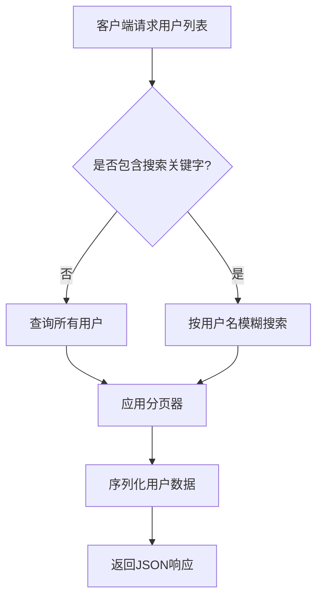
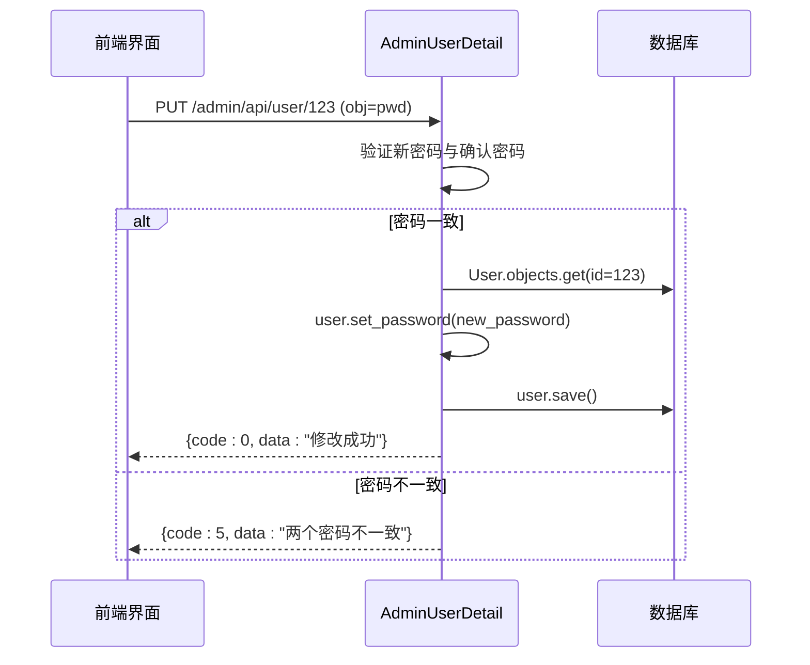

# 用户增删改查

<cite>
**本文档引用的文件**   
- [models.py](file://app_admin/models.py)
- [views.py](file://app_admin/views.py)
- [admin_user.html](file://template/app_admin/admin_user.html)
</cite>

## 目录
1. [用户模型字段定义](#用户模型字段定义)
2. [用户管理视图逻辑](#用户管理视图逻辑)
3. [前端用户管理界面](#前端用户管理界面)
4. [用户操作代码示例](#用户操作代码示例)
5. [常见问题与解决方案](#常见问题与解决方案)
6. [安全与最佳实践](#安全与最佳实践)

## 用户模型字段定义

系统中的用户数据主要依赖于Django内置的`User`模型，并通过`app_admin`应用中的`UserOptions`模型进行扩展配置。核心字段及其验证规则如下：

### 核心用户字段 (Django User Model)
- **用户名 (username)**: 字符串类型，最大长度50。验证规则：必须为小写英文字母和数字的组合，且长度不少于5位。
- **邮箱 (email)**: 字符串类型，必须符合邮箱格式。验证规则：全局唯一，不允许重复。
- **密码 (password)**: 加密存储。验证规则：长度不少于6位。
- **创建时间 (date_joined)**: `DateTimeField`，自动记录用户账户创建时间。
- **最后登录时间 (last_login)**: `DateTimeField`，记录用户最后一次成功登录的时间。
- **是否激活 (is_active)**: 布尔值，用于控制用户账户是否被禁用。
- **是否为超级管理员 (is_superuser)**: 布尔值，用于区分普通用户和拥有所有权限的超级管理员。

### 扩展用户选项字段 (UserOptions Model)
- **用户 (user)**: 外键，关联到Django的`User`模型，实现一对一关系。
- **编辑器选项 (editor_mode)**: 整数类型，用于存储用户偏好的文档编辑器（1表示Editormd，2表示Vditor）。

**Section sources**
- [models.py](file://app_admin/models.py#L20-L27)

## 用户管理视图逻辑

用户管理功能的后端逻辑主要在`app_admin/views.py`文件中的`AdminUserList`和`AdminUserDetail`两个API视图类中实现，涵盖了用户列表展示、创建、编辑和删除等核心功能。

### 用户列表展示与搜索过滤
`AdminUserList`类的`get`方法负责处理用户列表的获取请求。它支持分页和按用户名搜索。

1.  **接收参数**: 从查询参数中获取`username`（用于搜索）、`page`（页码）和`limit`（每页数量）。
2.  **数据查询**: 如果`username`为空，则查询所有用户；否则，使用`icontains`进行模糊搜索。
3.  **分页处理**: 使用`PageNumberPagination`对查询结果进行分页。
4.  **序列化与响应**: 使用`UserSerializer`将分页后的用户数据序列化，并返回包含用户列表、总数和状态码的JSON响应。



**Diagram sources**
- [views.py](file://app_admin/views.py#L407-L438)

### 用户创建
`AdminUserList`类的`post`方法处理用户创建请求。

1.  **接收数据**: 从请求体中获取`username`、`email`、`password`和`user_type`（0为普通用户，1为管理员）。
2.  **参数验证**: 检查用户名长度（>=5）、密码长度（>=6）、邮箱格式（包含@）以及用户名格式（小写英文和数字）。
3.  **唯一性检查**: 查询数据库，确保邮箱和用户名未被占用。
4.  **创建用户**: 根据`user_type`的值，调用`create_user`或`create_superuser`方法创建用户。
5.  **返回结果**: 创建成功返回状态码0，失败则返回相应的错误信息。

**Section sources**
- [views.py](file://app_admin/views.py#L439-L473)

### 用户信息编辑与删除
`AdminUserDetail`类处理单个用户的详细操作。

- **获取用户信息 (`get`)**: 通过用户ID查询用户，并返回其序列化数据。
- **修改用户信息 (`put`)**: 当`obj`参数为`info`时，更新用户的用户名、昵称、邮箱、状态和管理员权限。
- **修改用户密码 (`put`)**: 当`obj`参数为`pwd`时，验证新密码和确认密码是否一致，然后调用`set_password`方法更新密码。
- **删除用户 (`delete`)**: 这是一个复杂的操作，涉及数据清理：
    1.  删除该用户创建的所有文集（Project）及其下的所有文档（Doc）。
    2.  对于该用户作为协作者参与的文集，将其创建的文档的作者修改为文集的创建者。
    3.  最后，删除用户本身。



**Diagram sources**
- [views.py](file://app_admin/views.py#L477-L576)

## 前端用户管理界面

前端用户管理界面由`template/app_admin/admin_user.html`模板文件渲染，它构建了一个基于Layui框架的管理表格。

### 界面元素
- **搜索框**: 允许管理员输入用户名进行搜索。
- **操作按钮**: 包含“新增用户”和“添加管理员”两个按钮，分别用于创建普通用户和超级管理员。
- **用户数据表格**: 展示用户的核心信息，包括：
    - **用户名**: 直接显示。
    - **昵称**: 显示在`first_name`字段中。
    - **电子邮箱**: 直接显示。
    - **用户角色**: 通过`userRole`模板判断`is_superuser`字段，显示“超级管理员”或“普通用户”。
    - **注册时间**: 通过`registerTime`模板使用`layui.util.toDateString`将`date_joined`时间戳格式化为可读的日期时间。
    - **最后登录时间**: 通过`lastLoginTime`模板格式化`last_login`字段。
    - **状态**: 通过`userStatus`模板，根据`is_active`字段的值显示绿色对勾（激活）或红色叉号（禁用）。
    - **操作**: 通过`userOpera`模板提供“编辑”和“删除”链接。

### 交互逻辑
界面通过Layui的JavaScript库与后端API进行交互：
- **表格渲染**: 调用`table.render`方法，指定`url`为``，并配置分页和列定义。
- **搜索功能**: 绑定“搜索”按钮的点击事件，调用`table.reload`方法并传入搜索关键字。
- **新增用户**: 点击“新增用户”按钮会弹出一个表单层，用户填写信息后，通过`$.ajax`发送POST请求到`/admin/api/user`。
- **删除用户**: 点击“删除”按钮会弹出确认框，确认后通过`$.ajax`发送DELETE请求到`/admin/api/user/<id>`。

**Section sources**
- [admin_user.html](file://template/app_admin/admin_user.html#L0-L273)

## 用户操作代码示例

以下是从源码中提取的关键代码片段，展示了用户创建和信息更新的具体实现。

### 用户创建表单处理逻辑
```python
# views.py - AdminUserList.post 方法片段
def post(self, request):
    username = request.data.get('username', '')
    email = request.data.get('email', '')
    password = request.data.get('password', '')
    user_type = request.data.get('user_type', 0) # 0: 普通用户, 1: 管理员
    
    # 基本验证
    if len(username) >= 5 and len(password) >= 6 and '@' in email:
        # 检查唯一性
        if User.objects.filter(email=email).exists():
            return JsonResponse({'status': False, 'data': '电子邮箱不可重复'})
        if User.objects.filter(username=username).exists():
            return JsonResponse({'status': False, 'data': '用户名不可重复'})
        
        # 创建用户
        try:
            if user_type == 0:
                user = User.objects.create_user(username=username, password=password, email=email)
            else:
                user = User.objects.create_superuser(username=username, password=password, email=email)
            user.save()
            return Response({'code': 0}) # 成功
        except Exception as e:
            return Response({'code': 4, 'data': '系统异常'})
    else:
        return JsonResponse({'code': 5, 'data': '请检查参数'})
```

### 用户信息更新的数据库操作
```python
# views.py - AdminUserDetail.put 方法片段 (修改资料)
def put(self, request, id):
    obj = request.data.get('obj','')
    if obj == 'info':
        username = request.POST.get('username', '')
        nickname = request.POST.get('nickname', '')
        email = request.POST.get('email', '')
        status = request.POST.get('is_active', '') # 'on' 或 ''
        is_superuser = request.POST.get('is_superuser', '') # 'true' 或 ''
        
        try:
            User.objects.filter(id=id).update(
                username = username,
                first_name = nickname,
                email = email,
                is_active = True if status == 'on' else False,
                is_superuser = True if is_superuser == 'true' else False
            )
            return Response({'code': 0, 'data': '修改成功'})
        except:
            return Response({'code': 4, 'data': '修改异常'})
```

**Section sources**
- [views.py](file://app_admin/views.py#L439-L473)
- [views.py](file://app_admin/views.py#L488-L502)

## 常见问题与解决方案

### 数据重复问题
- **问题**: 在创建用户时，可能会遇到邮箱或用户名已存在的错误。
- **解决方案**: 后端代码中已经包含了`User.objects.filter(email=email).count() > 0`和`User.objects.filter(username=username).count() > 0`的检查，确保了数据的唯一性。前端也应提供清晰的错误提示。

### 字段验证失败
- **问题**: 用户提交的表单数据不符合验证规则，如密码过短、用户名格式错误等。
- **解决方案**: 后端在`post`方法中对`username`、`password`、`email`等字段进行了严格的格式和长度检查。前端应通过JavaScript在提交前进行初步校验，提升用户体验。

## 安全与最佳实践

1.  **权限控制**: 所有用户管理相关的API视图都使用了`SuperUserPermission`权限类，确保只有超级管理员才能访问，防止了越权操作。
2.  **CSRF保护**: 前端模板中通过``和`$.ajaxSetup`配置了CSRF Token，有效防止了跨站请求伪造攻击。
3.  **密码安全**: 使用Django内置的`set_password`方法来设置密码，该方法会自动对密码进行加盐哈希处理，绝不以明文存储。
4.  **数据清理**: 在删除用户时，系统会自动清理其创建的文集和文档，并将协作文档的归属权转移，保证了数据的一致性和完整性。
5.  **输入验证**: 对所有用户输入进行严格的验证，包括长度、格式和唯一性，防止无效数据进入数据库。