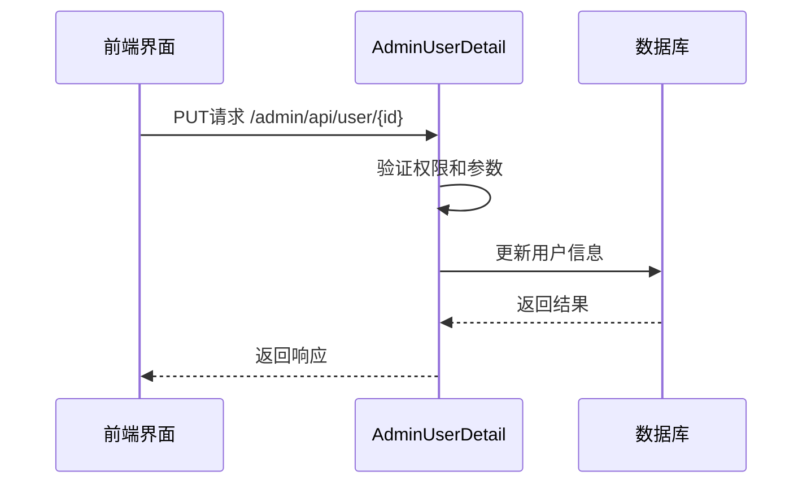
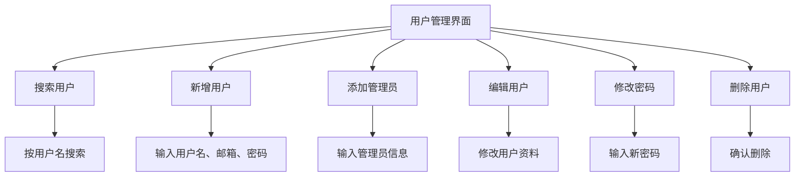

# 用户管理

<cite>
**本文档引用的文件**   
- [models.py](file://app_admin/models.py#L1-L66)
- [views.py](file://app_admin/views.py#L0-L799)
- [admin.py](file://app_admin/admin.py#L0-L3)
- [admin_user.html](file://template/app_admin/admin_user.html#L0-L273)
</cite>

## 目录
1. [用户管理](#用户管理)
2. [用户模型与业务规则](#用户模型与业务规则)
3. [用户管理视图实现](#用户管理视图实现)
4. [Django Admin集成](#django-admin集成)
5. [批量导入/导出用户](#批量导入导出用户)
6. [常见问题与解决方案](#常见问题与解决方案)
7. [数据安全与隐私保护](#数据安全与隐私保护)

## 用户模型与业务规则

本系统用户管理子系统基于Django内置的User模型进行扩展，通过`app_admin/models.py`文件中的自定义模型实现更丰富的功能和业务规则。

### 用户状态管理

系统通过Django User模型的内置字段管理用户状态：
- **is_active**: 布尔字段，表示用户是否激活。`True`表示用户正常，`False`表示用户被禁用。
- **is_superuser**: 布尔字段，表示用户是否为超级管理员，拥有系统最高权限。

```python
class UserOptions(models.Model):
    user = models.ForeignKey(User,on_delete=models.CASCADE)
    # 用户配置的编辑器选项，1表示Editormd编辑器，2表示Vditor编辑器，默认为1
    editor_mode = models.IntegerField(default=1,verbose_name="编辑器选项")
```

### 权限级别配置

系统实现了多层级的权限管理体系：
1. **超级管理员**: 拥有系统所有权限，可管理所有用户和资源
2. **普通用户**: 拥有基本的文档创建和管理权限

权限通过`is_superuser`字段进行区分，超级管理员可以访问所有后台管理功能，而普通用户仅能访问其创建或协作的资源。

### 用户选项配置

`UserOptions`模型为每个用户提供了个性化配置选项：
- **editor_mode**: 整数字段，用于存储用户选择的编辑器类型
  - `1`: Editormd编辑器
  - `2`: Vditor编辑器
  - 默认值为`1`

该配置允许用户根据个人偏好选择文档编辑器，提升用户体验。

### 注册邀请码机制

系统通过`RegisterCode`模型实现了注册邀请码机制，用于控制用户注册流程：

```python
class RegisterCode(models.Model):
    code = models.CharField(verbose_name="注册邀请码",max_length=10,unique=True)
    # 注册码的有效注册数量，表示注册码最多能够被使用多少次，默认为1
    all_cnt = models.IntegerField(verbose_name="有效注册数量",default=1)
    # 注册码的已使用数量，其值小于等于有效注册数量，默认为0
    used_cnt = models.IntegerField(verbose_name='已使用数量',default=0)
    # 注册码状态：0表示数据已满，1表示有效，默认为1
    status = models.IntegerField(verbose_name="注册码状态",default=1)
    user_list = models.CharField(verbose_name="使用此注册码的用户",default='',max_length=500,blank=True,null=True)
    expire_date = models.DateField(verbose_name="注册码有效期", null=True, blank=True)
    create_user = models.ForeignKey(User,on_delete=models.CASCADE)
    create_time = models.DateTimeField(auto_now=True,verbose_name='创建时间')
```

注册码包含以下关键属性：
- **code**: 邀请码字符串，唯一标识
- **all_cnt**: 最大使用次数
- **used_cnt**: 已使用次数
- **status**: 状态标识（0: 已满，1: 有效）
- **expire_date**: 有效期，可为空
- **user_list**: 使用该邀请码的用户邮箱列表

**Section sources**
- [models.py](file://app_admin/models.py#L1-L66)

## 用户管理视图实现

用户管理视图实现在`app_admin/views.py`文件中，提供了完整的用户生命周期管理功能。

### 用户列表视图

`AdminUserList` API视图类提供了用户列表的获取和新增功能：

```python
class AdminUserList(APIView):
    authentication_classes = [SessionAuthentication,AppMustAuth]
    permission_classes = [SuperUserPermission]

    # 获取用户列表
    def get(self, request):
        username = request.query_params.get('username', '')
        page_num = request.query_params.get('page', 1)
        limit = request.query_params.get('limit', 10)
        if username == '':
            user_data = User.objects.all().values(
                'id', 'last_login', 'is_superuser', 'username', 'email', 'date_joined', 'is_active', 'first_name'
            )
        else:
            user_data = User.objects.filter(username__icontains=username).values(
                'id', 'last_login', 'is_superuser', 'username', 'email', 'date_joined', 'is_active', 'first_name'
            )

        page = PageNumberPagination()  # 实例化一个分页器
        page.page_size = limit
        page_users = page.paginate_queryset(user_data, request, view=self)  # 进行分页查询
        serializer = UserSerializer(page_users, many=True)  # 对分页后的结果进行序列化处理
        resp = {
            'code': 0,
            'data': serializer.data,
            'count': user_data.count()
        }

        return Response(resp)
```

该视图支持：
- 分页查询（默认每页10条）
- 按用户名模糊搜索
- 返回用户基本信息（ID、最后登录时间、是否为超级用户、用户名、邮箱、注册时间、状态、昵称）

### 用户详情与修改视图

`AdminUserDetail` API视图类提供了用户详情获取、资料修改和删除功能：



**Diagram sources**
- [views.py](file://app_admin/views.py#L300-L350)

#### 用户资料修改

```python
# 修改资料
status = request.POST.get('is_active', '')  # 状态
username = request.POST.get('username', '')  # 用户名
nickname = request.POST.get('nickname', '')  # 昵称
email = request.POST.get('email', '')  # 电子邮箱
is_superuser = request.POST.get('is_superuser', '')  # 是否超级管理员
try:
    User.objects.filter(id=id).update(
        username = username,
        first_name = nickname,
        email = email,
        is_active = True if status == 'on' else False,
        is_superuser = True if is_superuser == 'true' else False
    )
    return Response({'code': 0, 'data': _('修改成功')})
except:
    logger.exception("修改用户资料异常")
    return Response({'code': 4, 'data': _('修改异常')})
```

#### 用户密码修改

```python
# 修改密码
try:
    password = request.data.get('password', None)
    password2 = request.data.get('password2', None)
    if id and password:
        if password == password2:
            user = User.objects.get(id=int(id))
            user.set_password(password)
            user.save()
            return Response({'code': 0, 'data': _('修改成功')})
        else:
            return Response({'code': 5, 'data': _('两个密码不一致')})
    else:
        return JsonResponse({'code': 5, 'data': _('参数错误')})
except Exception as e:
    return JsonResponse({'code': 4, 'data': _('请求错误')})
```

密码修改功能包含以下安全验证：
- 密码长度验证（大于等于6位）
- 两次密码一致性验证
- 使用Django内置的`set_password`方法进行密码哈希存储

#### 用户删除

```python
# 删除用户
def delete(self, request, id):
    try:
        user = self.get_object(id)  # 获取用户
        projects = Project.objects.filter(create_user=user) # 获取用户自己的文集
        for p in projects:
            Doc.objects.filter(top_doc=p.id).delete()
        colloas = ProjectCollaborator.objects.filter(user=user)  # 获取参与协作的文集
        # 遍历用户参与协作的文集
        for colloa in colloas:
            # 查询出用户协作创建的文档，修改作者为文集所有者
            Doc.objects.filter(
                top_doc=colloa.project.id, create_user=user
            ).update(create_user=colloa.project.create_user)
        user.delete()
        resp = {
            'code':0,
            'data':_('删除成功')
        }
        return Response(resp)
    except Exception as e:
        logger.exception("删除用户出错")
        resp = {
            'code': 4,
            'data': _('删除出错')
        }
        return Response(resp)
```

用户删除操作包含完整的数据清理逻辑：
1. 删除用户创建的所有文集及其文档
2. 将用户在协作文集中创建的文档所有权转移给文集创建者
3. 删除用户记录

**Section sources**
- [views.py](file://app_admin/views.py#L300-L450)

## Django Admin集成

系统通过Django Admin框架提供了用户管理的图形化界面。

### Admin配置

```python
from django.contrib import admin

# Register your models here.
```

尽管`admin.py`文件目前为空，但系统通过自定义视图和模板实现了类似Django Admin的功能。

### 用户管理界面

`admin_user.html`模板文件实现了用户管理的前端界面：



**Diagram sources**
- [admin_user.html](file://template/app_admin/admin_user.html#L0-L273)

界面功能包括：
- 用户列表展示（用户名、昵称、邮箱、角色、注册时间、最后登录时间、状态）
- 搜索功能（按用户名搜索）
- 新增普通用户
- 新增管理员用户
- 编辑用户资料
- 修改用户密码
- 删除用户

### 界面交互逻辑

前端使用Layui框架实现交互功能，通过AJAX与后端API进行通信：

```javascript
//获取用户列表，执行表格渲染
table.render({
    elem: '#user-list',
    url: "",
    method:'get',
    where:{
        'username':$("#username").val(),
    },
    page:true,
    cols: [[
        {field:'username',title:'用户名',width:160},
        {field:'first_name',title:'昵称',width:160},
        {field:'email',title:'电子邮箱',width:160},
        {field:'is_superuser',title:'用户角色',width:100,templet:'#userRole'},
        {field:'date_joined',title:'注册时间',width:160,templet:'#registerTime'},
        {field:'last_login',title:'最后登录时间',width:160,templet:'#lastLoginTime'},
        {field:'is_active',title:'状态',width:60,templet:'#userStatus'},
        {field:'oprate',title:'操作',width:180,templet:'#userOpera'},
    ]],
    skin: 'line',
});
```

**Section sources**
- [admin_user.html](file://template/app_admin/admin_user.html#L0-L273)

## 批量导入/导出用户

虽然当前代码中未直接实现批量导入/导出功能，但可以通过以下方式实现：

### 批量导入实现方案

1. **CSV文件导入**:
```python
import csv
from django.contrib.auth.models import User

def import_users_from_csv(file_path):
    with open(file_path, 'r', encoding='utf-8') as file:
        csv_reader = csv.DictReader(file)
        for row in csv_reader:
            username = row['username']
            email = row['email']
            password = row['password']
            
            # 验证用户是否存在
            if not User.objects.filter(username=username).exists():
                User.objects.create_user(
                    username=username,
                    email=email,
                    password=password
                )
```

2. **API批量创建**:
```python
def bulk_create_users(user_data_list):
    created_users = []
    for user_data in user_data_list:
        try:
            user = User.objects.create_user(
                username=user_data['username'],
                email=user_data['email'],
                password=user_data['password']
            )
            created_users.append(user)
        except Exception as e:
            print(f"创建用户 {user_data['username']} 失败: {e}")
    return created_users
```

### 批量导出实现方案

```python
import csv
from django.http import HttpResponse
from django.contrib.auth.models import User

def export_users_to_csv(request):
    response = HttpResponse(content_type='text/csv')
    response['Content-Disposition'] = 'attachment; filename="users.csv"'
    
    writer = csv.writer(response)
    writer.writerow(['用户名', '邮箱', '昵称', '注册时间', '最后登录时间', '状态', '角色'])
    
    users = User.objects.all()
    for user in users:
        writer.writerow([
            user.username,
            user.email,
            user.first_name,
            user.date_joined,
            user.last_login,
            '激活' if user.is_active else '禁用',
            '超级管理员' if user.is_superuser else '普通用户'
        ])
    
    return response
```

### 操作指南

1. **准备CSV文件**:
   - 创建包含`username`, `email`, `password`字段的CSV文件
   - 确保用户名和邮箱不重复

2. **执行导入**:
   - 通过管理界面上传CSV文件
   - 或通过命令行执行导入脚本

3. **验证导入结果**:
   - 检查用户列表是否包含新导入的用户
   - 验证用户信息是否正确

4. **导出用户数据**:
   - 在管理界面选择"导出用户"功能
   - 系统生成CSV文件并提供下载链接

**Section sources**
- [models.py](file://app_admin/models.py#L1-L66)
- [views.py](file://app_admin/views.py#L0-L799)

## 常见问题与解决方案

### 用户锁定问题

**问题描述**: 用户因多次登录失败被锁定

**根本原因**: 系统安全机制防止暴力破解攻击

**解决方案**:

```python
# 登录视图中的锁定逻辑
if 'LoginLock' not in request.session.keys():
    request.session['LoginNum'] = 1 # 重试次数
    request.session['LoginLock'] = False # 是否锁定
    request.session['LoginTime'] = datetime.datetime.now().timestamp() # 解除锁定时间

verify_num = request.session['LoginNum']
if verify_num > 5:
    request.session['LoginLock'] = True
    request.session['LoginTime'] = (datetime.datetime.now() + datetime.timedelta(minutes=10)).timestamp()
```

**解决方法**:
1. 等待10分钟后自动解锁
2. 管理员通过数据库直接重置用户会话
3. 清除用户浏览器的会话Cookie

### 密码重置失败

**问题描述**: 用户无法通过邮箱重置密码

**可能原因**:
1. 邮箱配置不正确
2. 验证码已过期
3. 邮箱地址不存在

**解决方案**:

```python
# 忘记密码视图
def forget_pwd(request):
    # 验证重试次数
    if 'ForgetPwdEmailCodeVerifyLock' not in request.session.keys():
        request.session['ForgetPwdEmailCodeVerifyNum'] = 1 # 重试次数
        request.session['ForgetPwdEmailCodeVerifyLock'] = False # 是否锁定
        request.session['ForgetPwdEmailCodeVerifyTime'] = datetime.datetime.now().timestamp() # 解除锁定时间
```

**解决步骤**:
1. 检查SMTP邮件配置是否正确
2. 确认用户邮箱地址存在
3. 验证验证码在30分钟有效期内
4. 检查用户是否被禁用

### 注册码相关问题

**问题描述**: 注册码无法使用

**可能原因**:
1. 注册码已达到使用次数上限
2. 注册码已过期
3. 注册码无效

**解决方案**:

```python
# 注册视图中的注册码验证
try:
    current_date = timezone.now().date()
    register_code_value = RegisterCode.objects.get(code=register_code)
    if register_code_value.used_cnt >= register_code_value.all_cnt:
        errormsg = _('注册码使用次数已达限制!')
        return render(request, 'register.html', locals())
    elif register_code_value.expire_date is not None and register_code_value.expire_date < current_date:
        errormsg = _('注册码已过期!')
        return render(request, 'register.html', locals())
except ObjectDoesNotExist:
    errormsg = _('注册码无效!')
    return render(request, 'register.html', locals())
```

**解决方法**:
1. 检查注册码状态和有效期
2. 确认使用次数未超限
3. 联系管理员获取新的注册码

**Section sources**
- [views.py](file://app_admin/views.py#L150-L250)

## 数据安全与隐私保护

### 用户数据安全最佳实践

1. **密码安全**:
   - 使用Django内置的密码哈希机制
   - 强制密码长度不少于6位
   - 支持通过邮箱登录，但用户名仅限小写英文和数字组合

```python
# 密码验证逻辑
if len(username) < 5:
    errormsg = _('用户名必须大于等于5位！')
    return render(request, 'register.html', locals())
elif len(password) < 6: # 验证密码长度
    errormsg = _('密码必须大于等于6位！')
    return render(request, 'register.html', locals())
```

2. **会话安全**:
   - 实现登录失败锁定机制
   - 限制验证码使用次数
   - 使用CSRF保护

3. **数据加密**:
   - 敏感数据在传输过程中使用HTTPS
   - 数据库存储使用标准加密机制

### 隐私保护措施

1. **最小权限原则**:
   - 普通用户只能访问自己的数据
   - 超级管理员拥有完整权限，但操作需记录日志

2. **数据访问控制**:
   - 通过`SuperUserPermission`类限制API访问
   - 所有管理操作都需要超级管理员权限

```python
class AdminUserList(APIView):
    authentication_classes = [SessionAuthentication,AppMustAuth]
    permission_classes = [SuperUserPermission]
```

3. **审计日志**:
   - 使用`loguru`库记录关键操作
   - 记录用户登录、注销、密码修改等敏感操作

```python
logger.exception(_("生成验证码图片异常"))
logger.exception("登录异常")
logger.exception(_("注销异常"))
```

4. **数据清理**:
   - 删除用户时，将其协作创建的文档所有权转移给文集创建者
   - 彻底删除用户创建的文集和文档

### 安全配置建议

1. **启用登录验证码**:
   ```python
   require_login_check_code = SysSetting.objects.filter(types="basic",name="enable_login_check_code")
   if (len(require_login_check_code) > 0) and (require_login_check_code[0].value == 'on'):
       checkcode = request.POST.get("check_code", None)
       if checkcode.lower() != request.session['CheckCode'].lower():
           errormsg = _('验证码错误！')
           return render(request, 'login.html', locals())
   ```

2. **启用注册码**:
   ```python
   is_register_code = SysSetting.objects.filter(types='basic', name='enable_register_code', value='on')
   ```

3. **定期审查用户权限**:
   - 定期检查超级管理员列表
   - 审查注册码使用情况
   - 监控异常登录行为

**Section sources**
- [views.py](file://app_admin/views.py#L0-L799)
- [models.py](file://app_admin/models.py#L1-L66)