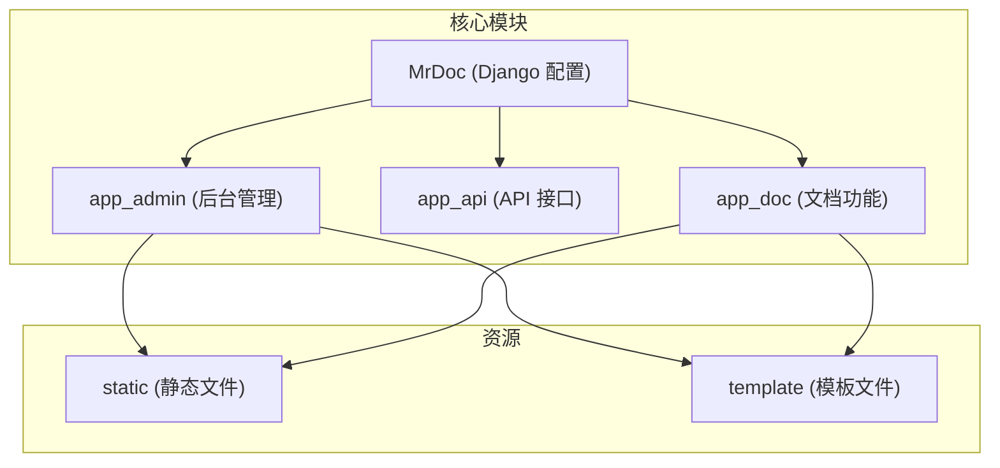
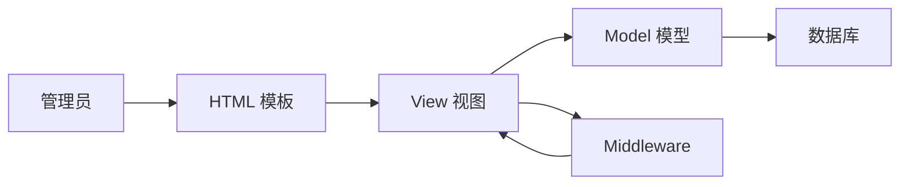
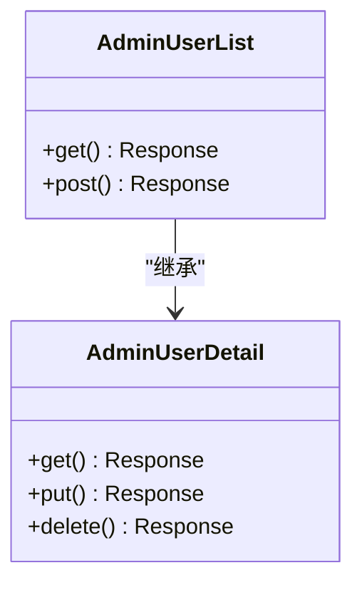
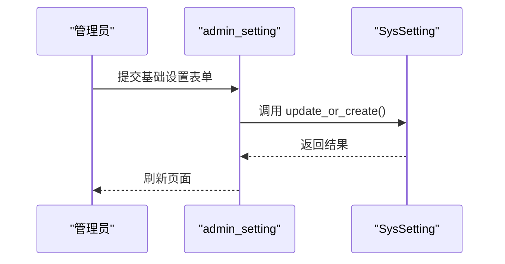
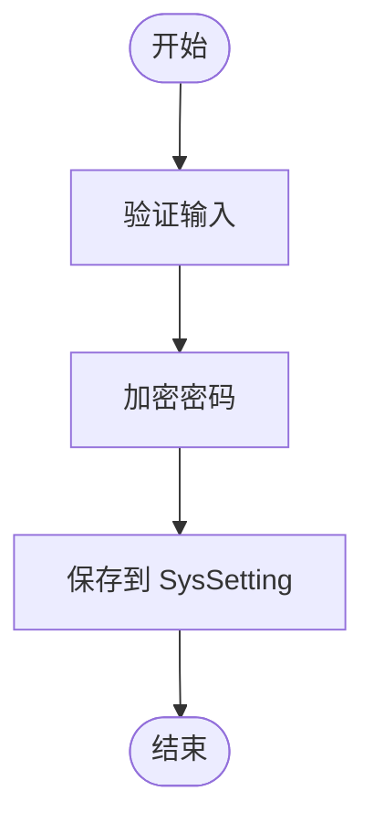
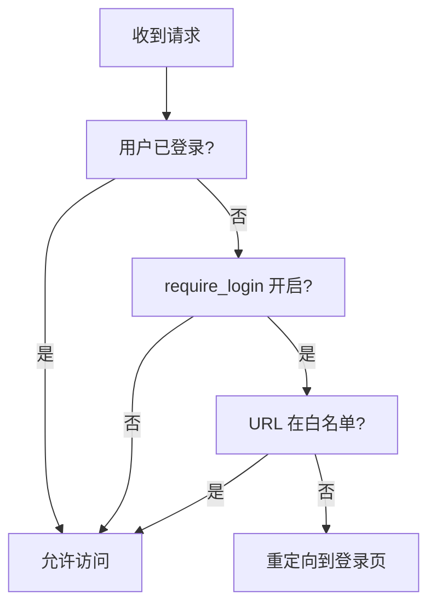
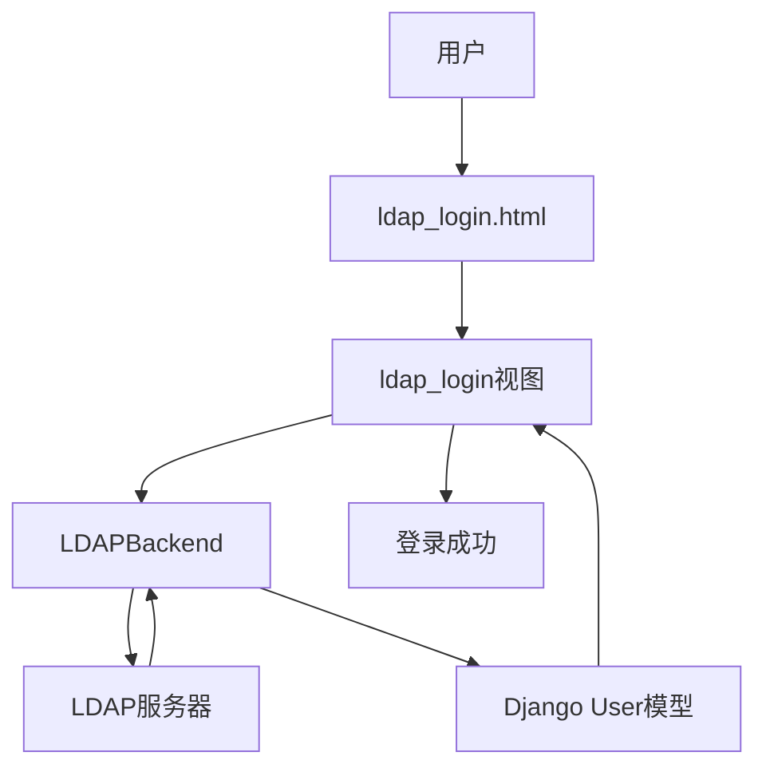
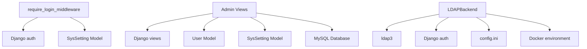

# 管理员指南

<cite>
**本文档中引用的文件**   
- [require_login_middleware.py](file://app_admin/middleware/require_login_middleware.py) - *访问控制中间件，实现全站登录验证*
- [models.py](file://app_admin/models.py) - *系统设置与用户模型定义*
- [views.py](file://app_admin/views.py) - *后台管理视图逻辑实现*
- [admin_user.html](file://template/app_admin/admin_user.html) - *用户管理前端界面*
- [admin_setting.html](file://template/app_admin/admin_setting.html) - *系统设置页面模板*
- [config.ini](file://config/config.ini) - *数据库与LDAP配置文件，已更新为MySQL并启用LDAP*
- [admin_base.html](file://template/app_admin/admin_base.html) - *管理后台基础模板，已移除外部链接*
- [admin_center.html](file://template/app_admin/admin_center.html) - *管理后台中心页面，已优化界面展示*
- [user_center.html](file://template/app_doc/user/user_center.html) - *用户中心页面，已清理外部链接*
- [docs_base.html](file://template/app_doc/docs_base.html) - *文档基础模板，已移除多余菜单项*
- [ldap_backend.py](file://app_admin/ldap_backend.py) - *LDAP认证后端实现，支持环境变量覆盖*
- [ldap_login.html](file://template/ldap_login.html) - *LDAP登录页面模板*
- [settings.py](file://MrDoc/settings.py) - *Django配置文件，包含认证后端配置*
- [docker-compose.yml](file://deploy/docker-compose.yml) - *Docker部署配置，支持LDAP环境变量*
- [docker-compose-with-mysql.yml](file://deploy/docker-compose-with-mysql.yml) - *完整Docker部署配置，包含MySQL和网络设置*
- [README.md](file://deploy/README.md) - *部署说明文档，包含LDAP配置示例*
</cite>

## 更新摘要
**已更新内容**
- 更新了数据库配置说明，反映从SQLite到MySQL的变更
- 修正了系统架构描述，确保与当前配置一致
- 更新了依赖分析部分，包含新的数据库引擎信息
- 根据最新代码变更，更新了管理后台和文档页面的界面展示说明
- 移除了关于升级专业版、客户端下载等已删除功能的描述
- **新增LDAP认证功能说明，包含配置、实现和使用方法**
- **更新LDAP配置状态，`enable_ldap` 已从 `false` 改为 `true`**
- **新增Docker部署中LDAP环境变量配置说明**
- **补充LDAP属性映射配置细节**

## 目录
1. [简介](#简介)
2. [项目结构](#项目结构)
3. [核心组件](#核心组件)
4. [架构概述](#架构概述)
5. [详细组件分析](#详细组件分析)
6. [依赖分析](#依赖分析)
7. [性能考虑](#性能考虑)
8. [故障排除指南](#故障排除指南)
9. [结论](#结论)

## 简介
`MrDoc` 是一个基于 `Python` 和 `Django` 框架开发的开源在线文档系统，旨在为个人和中小型团队提供一个私有化部署的知识管理和云文档解决方案。本指南将详细介绍 MrDoc 系统的后台管理功能，包括用户管理、系统设置、数据备份以及访问控制机制。

## 项目结构
MrDoc 项目的结构遵循典型的 Django 应用模式，主要模块包括 `MrDoc`（核心配置）、`app_admin`（后台管理）、`app_api`（API 接口）和 `app_doc`（文档核心功能）。静态文件和模板分别存放在 `static` 和 `template` 目录下。



**图示来源**
- [项目结构](file://项目结构)

## 核心组件
MrDoc 的核心后台管理功能由 `app_admin` 模块实现，主要包括用户管理、系统设置、数据备份和中间件访问控制。

**组件来源**
- [app_admin](file://app_admin)

## 架构概述
MrDoc 的后台管理架构基于 Django 的 MTV（Model-Template-View）模式。管理员通过 `template` 中的 HTML 模板与系统交互，`views.py` 中的视图函数处理业务逻辑，`models.py` 定义数据模型，`middleware` 提供全局的访问控制。



**图示来源**
- [views.py](file://app_admin/views.py#L0-L1728)
- [models.py](file://app_admin/models.py#L0-L66)

## 详细组件分析

### 用户管理分析
用户管理功能允许管理员创建、编辑、删除用户，并控制用户状态和权限。

#### 用户管理视图
用户管理的前端界面由 `admin_user.html` 实现，通过 AJAX 调用 `views.py` 中的 API 进行数据交互。



**图示来源**
- [views.py](file://app_admin/views.py#L1461-L1492)
- [admin_user.html](file://template/app_admin/admin_user.html#L0-L28)

#### 用户状态与权限控制
用户状态（激活/禁用）和权限（普通用户/管理员）在 `User` 模型中通过 `is_active` 和 `is_superuser` 字段控制。管理员可以通过 `admin_user_profile.html` 模板修改这些属性。

**组件来源**
- [models.py](file://app_admin/models.py#L0-L66)
- [admin_user_profile.html](file://template/app_admin/admin_user_profile.html#L54-L99)

### 系统设置分析
系统设置功能允许管理员配置站点信息、邮件服务和全局文档选项。

#### 站点配置
站点配置包括站点名称、关键词、备案号、注册开关和登录要求等。这些设置存储在 `SysSetting` 模型中，类型为 `basic`。



**图示来源**
- [views.py](file://app_admin/views.py#L1227-L1302)
- [admin_setting.html](file://template/app_admin/admin_setting.html#L0-L34)

#### 邮件设置
邮件设置允许管理员配置 SMTP 服务器信息以发送验证码和通知。密码在存储前会进行加密。



**图示来源**
- [views.py](file://app_admin/views.py#L1366-L1398)

### 数据备份与恢复策略
管理员可以通过 `admin_backup` 视图执行数据备份，支持备份数据库数据或整个媒体文件目录。

**组件来源**
- [views.py](file://app_admin/views.py#L1461-L1492)

### 中间件系统分析
`require_login_middleware.py` 实现了全站强制登录的访问控制。

#### 访问控制流程
该中间件检查 `SysSetting` 中的 `require_login` 配置。如果开启，则除了登录、注册等白名单 URL 外，所有请求都必须经过登录验证。



**图示来源**
- [require_login_middleware.py](file://app_admin/middleware/require_login_middleware.py#L0-L60)

### LDAP认证功能分析
新增的LDAP认证功能允许系统与企业目录服务集成，实现统一身份认证。

#### LDAP认证架构
系统通过自定义认证后端 `LDAPBackend` 与LDAP服务器通信，实现用户认证和信息同步。



**图示来源**
- [ldap_backend.py](file://app_admin/ldap_backend.py#L0-L164)
- [views.py](file://app_admin/views.py#L243-L331)
- [ldap_login.html](file://template/ldap_login.html#L0-L116)

#### LDAP认证实现
LDAP认证通过 `app_admin.ldap_backend.LDAPBackend` 类实现，该类继承自 `BaseBackend`，重写了 `authenticate` 方法。

**LDAP认证流程**
1. 检查LDAP是否启用
2. 使用管理员账户连接LDAP服务器搜索用户
3. 获取用户DN后，使用用户凭据进行认证
4. 认证成功后，获取或创建Django用户

```python
def authenticate(self, request, username=None, password=None, **kwargs):
    # 检查是否启用LDAP认证（支持环境变量优先）
    enable_ldap_env = os.getenv('LDAP_ENABLE')
    if enable_ldap_env is not None:
        enable_ldap = enable_ldap_env.lower() in ('true', '1', 'yes', 'on')
    else:
        enable_ldap = self.config.getboolean('ldap', 'enable_ldap', fallback=False)
        
    if not enable_ldap:
        return None
        
    # 创建LDAP服务器连接
    server = ldap3.Server(self.server_uri, get_info=ldap3.ALL)
    
    # 使用管理员账户连接LDAP进行用户搜索
    conn = ldap3.Connection(server, self.bind_dn, self.bind_password, auto_bind=True)
    
    # 搜索用户
    search_filter = self.user_search_filter.format(username=username)
    conn.search(
        self.user_base_dn,
        search_filter,
        attributes=[self.attr_username, self.attr_email, 
                   self.attr_first_name, self.attr_last_name]
    )
```

**组件来源**
- [ldap_backend.py](file://app_admin/ldap_backend.py#L38-L112)

#### LDAP配置与管理
LDAP功能通过 `config.ini` 文件进行配置，管理员可在 `[ldap]` 部分设置相关参数。同时支持通过环境变量覆盖配置。

**LDAP配置项**
- `enable_ldap`: 是否启用LDAP认证（默认 `true`）
- `server_uri`: LDAP服务器地址
- `bind_dn`: 绑定DN，用于连接LDAP服务器进行搜索
- `bind_password`: 绑定密码
- `user_base_dn`: 用户搜索基础DN
- `user_search_filter`: 用户搜索过滤器
- `user_attr_*`: 用户属性映射（支持环境变量覆盖）

```ini
[ldap]
# LDAP认证配置
# 是否启用LDAP认证，true表示启用，false表示禁用
enable_ldap = true
# LDAP服务器地址
server_uri = ldap://127.0.0.1:389
# 绑定DN，用于连接LDAP服务器进行搜索
bind_dn = cn=admin,dc=example,dc=com
# 绑定密码
bind_password = adminpassword
# 用户搜索基础DN
user_base_dn = ou=users,dc=example,dc=com
# 用户搜索过滤器，{username}会被替换为实际的用户名
user_search_filter = (uid={username})
# 用户属性映射
user_attr_username = uid
user_attr_email = mail
user_attr_first_name = givenName
user_attr_last_name = sn
```

**组件来源**
- [config.ini](file://config/config.ini#L29-L52)
- [settings.py](file://MrDoc/settings.py#L120-L123)
- [ldap_backend.py](file://app_admin/ldap_backend.py#L0-L35)

#### Docker环境变量配置
在Docker部署中，可通过环境变量覆盖LDAP配置，优先级高于 `config.ini`。

```yaml
environment:
  LDAP_ENABLE: "true"
  LDAP_SERVER_URI: "ldap://ldap-server:389"
  LDAP_BIND_DN: "cn=admin,dc=example,dc=com"
  LDAP_BIND_PASSWORD: "your-password"
  LDAP_USER_BASE_DN: "ou=users,dc=example,dc=com"
```

**组件来源**
- [docker-compose.yml](file://deploy/docker-compose.yml#L25-L30)
- [docker-compose-with-mysql.yml](file://deploy/docker-compose-with-mysql.yml#L35-L40)
- [README.md](file://deploy/README.md#L65-L75)

#### LDAP登录流程
LDAP登录通过专用的 `ldap_login` 视图处理，提供独立的登录界面和逻辑。

**登录流程**
1. 用户访问LDAP登录页面
2. 输入LDAP用户名和密码
3. 系统验证登录次数防止暴力破解
4. 调用LDAP后端进行认证
5. 认证成功后登录用户并重定向

```python
@logger.catch()
def ldap_login(request):
    """LDAP登录视图函数"""
    # 读取LDAP配置
    config = ConfigParser()
    config_path = os.path.join(os.path.dirname(os.path.dirname(os.path.abspath(__file__))), 'config', 'config.ini')
    config.read(config_path, encoding='utf-8')
    
    # 检查LDAP是否启用
    enable_ldap = config.getboolean('ldap', 'enable_ldap', fallback=False)
    if not enable_ldap:
        errormsg = _('LDAP认证未启用，请联系管理员！')
        return render(request, 'ldap_login.html', locals())
        
    # 处理POST请求
    if request.method == 'POST':
        username = request.POST.get('username', '')
        password = request.POST.get('password', '')
        
        # 验证登录次数（防止暴力破解）
        if 'LDAPLoginLock' not in request.session.keys():
            request.session['LDAPLoginNum'] = 1
            request.session['LDAPLoginLock'] = False
            request.session['LDAPLoginTime'] = datetime.datetime.now().timestamp()
            
        # 使用LDAP后端进行认证
        ldap_backend = LDAPBackend()
        user = ldap_backend.authenticate(request, username=username, password=password)
```

**组件来源**
- [views.py](file://app_admin/views.py#L243-L331)

#### LDAP用户同步
系统在用户首次通过LDAP认证成功后，会自动创建或更新对应的Django用户。

**用户同步逻辑**
- 如果用户不存在，则创建新用户
- 如果用户已存在，则更新用户信息
- LDAP用户不设置本地密码，密码由LDAP服务器管理

```python
def get_or_create_user(self, user_info):
    """
    获取或创建Django用户
    
    Args:
        user_info: 用户信息字典
        
    Returns:
        User对象
    """
    try:
        # 尝试获取现有用户
        user = User.objects.get(username=user_info['username'])
        
        # 更新用户信息
        user.email = user_info['email']
        user.first_name = user_info['first_name']
        user.last_name = user_info['last_name']
        user.is_active = True
        user.save()
        
    except User.DoesNotExist:
        # 创建新用户 - 权限默认为普通用户
        user = User.objects.create_user(
            username=user_info['username'],
            email=user_info['email'],
            first_name=user_info['first_name'],
            last_name=user_info['last_name'],
            is_staff=False,  # 不是管理员
            is_superuser=False,  # 不是超级用户
            is_active=True,
            password=None  # LDAP用户不设置本地密码
        )
        logger.info(f"创建LDAP用户: {user_info['username']}")
        
    return user
```

**组件来源**
- [ldap_backend.py](file://app_admin/ldap_backend.py#L114-L158)

## 依赖分析
MrDoc 后台管理功能依赖于 Django 框架的核心组件，如 `auth` 模块进行用户认证，`models` 进行数据持久化，以及 `views` 处理 HTTP 请求。数据库配置已更新为 MySQL，相关配置位于 `config.ini` 文件中。新增的LDAP功能依赖于 `ldap3` 库进行LDAP通信，并支持Docker环境变量配置。



**图示来源**
- [requirements.txt](file://requirements.txt)
- [views.py](file://app_admin/views.py#L0-L1728)
- [config.ini](file://config/config.ini)
- [ldap_backend.py](file://app_admin/ldap_backend.py#L0-L164)
- [docker-compose.yml](file://deploy/docker-compose.yml)

## 性能考虑
对于大规模用户和文档，建议定期清理未使用的图片和附件，并优化数据库查询。使用 MySQL 数据库可提升查询性能和并发处理能力。启用LDAP认证时，应注意LDAP服务器的连接性能和响应时间。在Docker部署中，确保网络配置正确以避免延迟。

## 故障排除指南
常见问题包括邮件发送失败和用户无法登录。检查邮件配置的正确性，并确保 `require_login` 设置与预期一致。数据库连接问题请检查 `config.ini` 中的 MySQL 配置。LDAP认证问题请检查LDAP配置和网络连接，确认 `enable_ldap` 已设置为 `true`，并验证环境变量是否正确覆盖。

**组件来源**
- [views.py](file://app_admin/views.py#L1461-L1492)
- [config.ini](file://config/config.ini)
- [docker-compose.yml](file://deploy/docker-compose.yml)

## 结论
本指南详细介绍了 MrDoc 系统的后台管理功能。通过理解这些组件，管理员可以有效地管理用户、配置系统并确保数据安全。新增的LDAP认证功能为企业级部署提供了统一身份认证支持，增强了系统的安全性和可管理性。通过Docker环境变量配置，系统具备更高的部署灵活性和安全性。